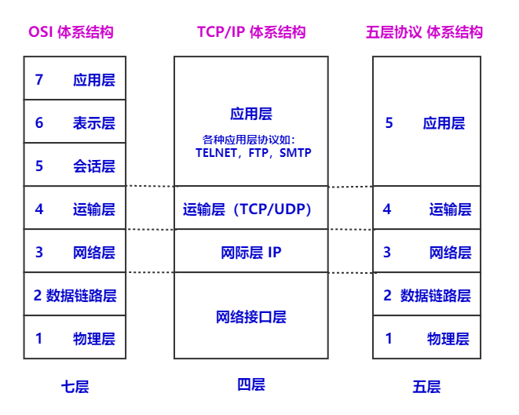
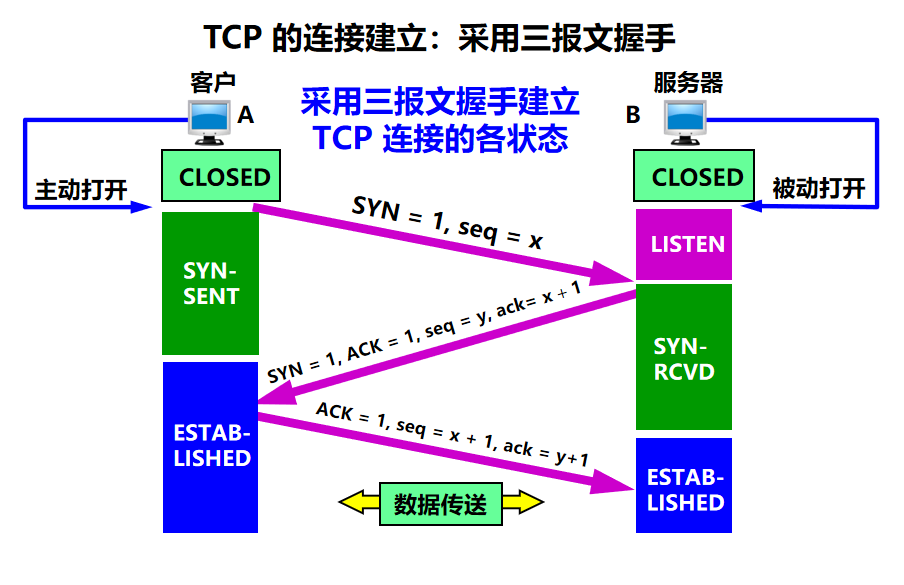
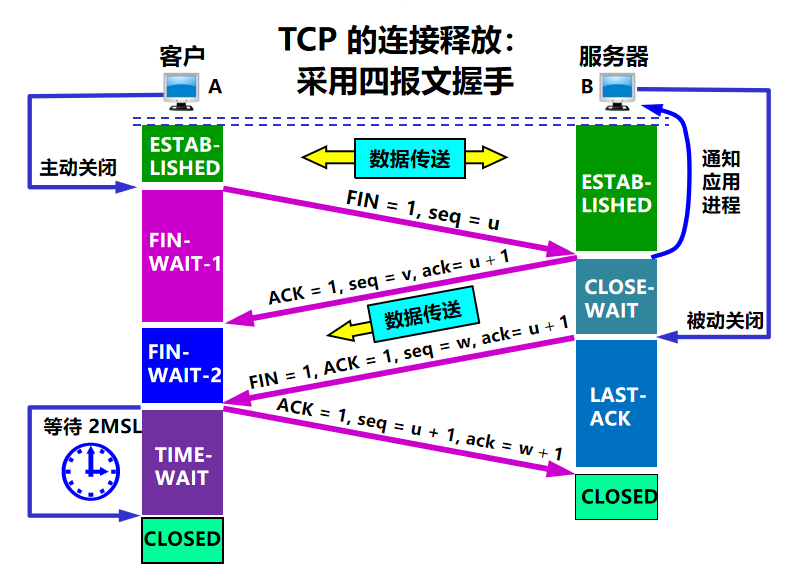
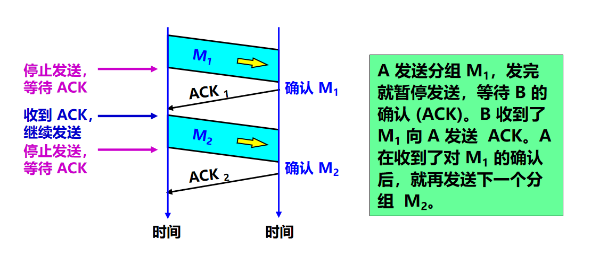
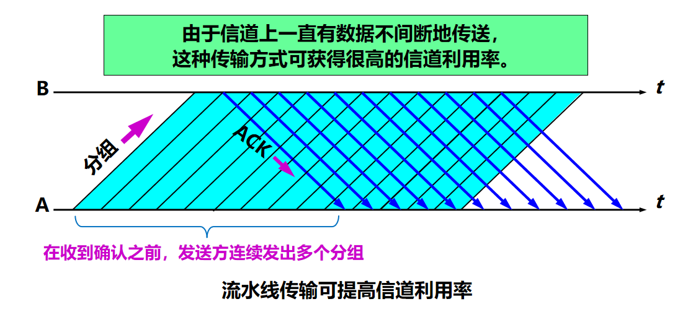
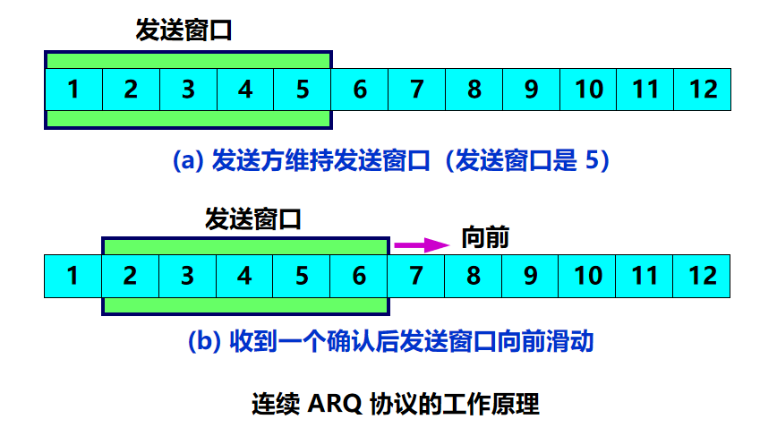

# 1. 概述几种网络协议体系结构

首先要提的是 OSI 七层协议体系结构，其概念是比较完整的，但是它即复杂又不使用

接着就是 TCP/IP 体系结构，它现在却得到了非常广泛的应用但是从实质上将， TCP/IP 只有最上面的一层，是因为下面的网络接口层并没与什么具体内容所以在下面我们采用一种折中的方式，那就是综合 OSI 和 TCP/IP 的优点采用一种只有五层协议的体系结构

## 1.1 应用层

应用层是体系结构中的最高层。应用层的任务是**通过应用进程间的交互来完成特定网络应用**。应用层协议定义的是**应用进程间通信和交互的规则**。这里的**进程**就是主机中**正在运行的程序**。对于不同的网络应用需要不有不同的应用层协议。在互联网的应用层协议很多，如域名 DNS，支持万维网应用的HTTP 协议，支持电子邮件的 SMTP 协议，等等。我们把应用层的数据单元称为**报文(messgae)**。

## 1.2 运输层

运输层的任务就是负责向**两台主机中进程之间的通信提供通用的数据传输服务**。应用进程利用该服务传送应用层报文。所谓通用的，是指并不针对某个特定网路应用，而是多种应用可以使用同一个运输层服务。由于一台主机可以同时运行多个进程，因此运输层有复用和分用的功能。复用就是多个应用层进程可同时使用下面运输层的服务，分用和复用相反，是运输层把收到的信息分别交付给上面应用层的相关进程。

运输层主要有下面两种协议：

- **传输控制协议TCP**（Transmission Control Protocol）——提供**面向连接的、可靠的**数据传输服务，其数据传输的单位是**报文段**(segment)。
- **用户数据报协议 UDP**（User Datagram Protocol）——提供**无连接的尽最大努力**（best-effort）的数据传输服务（不保证数据传输的可靠性），其数据传输的单位是**用户数据报**

## 1.3 网络层

**在 计算机网络中进行通信的两个计算机之间可能会经过很多个数据链路，也可能还要经过很多通信子网。网络层的任务就是选择合适的网间路由和交换结点， 确保数据及时传送。**

- 在发送数据时，网络层把运输层产生的报文段或者用户数据报封装成分组或者包进行传送。在TCP/IP体系中，由于网络层使用IP协议，因此分组也叫作IP数据报，或简称数据报。

> 请注意：不要将运输层的 "用户数据报 UDP" 和网络层的 "IP数据报" 弄混，此外，无论哪一层传输的数据单元，都可以笼统的用"分组"来表示。

- 互联网是有大量的异构（heterogeneous）网络来通过路由器（Router）相互连接起来的。互联网使用的网络层协议是无连接的网际协议IP（Internet Protocol）和许多路由选择协议, 因此互联网的网络层也叫作网际层或IP层。

## 1.4 数据链路层

**数据链路层通常简称为链路层。我们知道，两台主机之间的数据传输，总是在一段一段的链路上传送的, 这就需要使用专门的链路层的协议。在两个相邻结点之间传送数据时，数据链路层量网络层交下来的IP数据报封装成帧(frameing)，在两个相邻节点间的链路上传送帧，每一帧包括数据和必要的控制信息（如同步信息、地址信息、差错信息等）**

- 在接收数据时，控制信息使接收端能够知道一个帧从哪个比特开始到哪个比特结束，这样数据链路层在收到一个帧后，就可从中提取数据部分，上交到网络层。

- 控制信息还能使接收端能够检测到所收到的帧中有无差错。如发现有差错，数据链路层就简单的丢弃了这个出了差错的帧，以免继续在网络传输下去白白的浪费资源。如果需要改正数据在数据链路层传输时出现的差错(这就是说,数据链路层不仅要检错,还要纠错)， 那么就可以采用可靠数据传输协议来纠正出现的差错。这种方法会使数据链路层的协议复杂些。

## 1.5 物理层

**物理层的作用是实现相邻计算机节点之间比特流的透明传送，尽可能屏蔽掉具体传输介质和物理设备的差异对比特传输带来的影响。**

> 在物理层上所传数据的单位是**比特(bit)**。发送方发送1或者0时，接收方应该接收相同的1或者0，因此物理层要考虑用多大的电压代表"1"或者"0"， 以及接收方如何识别发送方所发出的比特。物理层还要确定连接电缆的插头应当有多少根引脚以及各引脚如何连接。当然解释比特代表的意思，就不是物理层的任务。请注意，传递信息所利用的一些物理媒体，如双绞线、同轴电缆、光缆、无线信道等，并不是物理层协议之内而是在物理层协议的下面。因此也有人把物理层当做第0层。

# 2. TCP 相关

## 2.1 TCP 和 UDP 的区别？

- **TCP 面向连接（传输数据前后需要建立和释放连接），而 UDP 不需要建立连接。**
- **TCP 提供可靠的服务，而 UDP 提供不可靠交付。**
  - TCP 的可靠建立在，三次握手以及四次挥手的连接建立和释放方式，还有数据传递中，确认、窗口、重传、拥塞控制机制等。所以一般用在文件传输，接发邮件，远程登录等场景。
  - UDP 虽然不可靠，但是在即时通信方向，也是一种有效的工作方式
- **TCP 传输数据慢，UDP 传输数据快**
  - TCP 因为上述保证可靠的手段，而增加了许多开销，使得协议数据单元首部也变大很多。
- **TCP面向字节流，UDP面向报文**
  - “面向字节流”的含义是：虽然应用程序和 TCP 的交互是一次一个数据块，但 TCP 把应用程序交下来的数据看成仅仅是一连串无结构的字节流。
  - 发送方 UDP 对应用程序交下来的报文，在添加首部后就向下交付 IP 层。

## 2.2 TCP 三次握手和四次挥手

### 2.2.1 TCP 三次握手

TCP 建立连接的过程叫做握手。

握手需要在客户和服务器之间**交换三个 TCP 报文段。也称之为三报文握手。**

采用三报文握手主要是**为了防止已失效的连接请求报文段突然又传送到了，因而产生错误。**

- **B的 TCP 服务器进程先创建传输控制块TCB，准备接受客户进程的连接请求。**
- **A 的 TCP 向 B 发出连接请求报文段**
  - 其首部中的同步位 SYN = 1，并选择序号 seq = x，表明传送数据时的第一个数据字节的序号是 x。
- **B 的 TCP 收到连接请求报文段后，如同意，则发回确认。**
  - B 在确认报文段中应使 SYN = 1，使 ACK = 1，其确认号 ack = x + 1，自己选择的序号 seq = y。
- **A 收到此报文段后向 B 给出确认**
  - 其 ACK = 1，确认号 ack = y + 1。
  - A 的 TCP 通知上层应用进程，连接已经建立。 
- **B 的 TCP 收到主机 A 的确认后，也通知其上层应用进程：TCP 连接已经建立。**

**简化总结一下：**

- **一次握手**：【客户端】发送带有 SYN 标志的数据包到 【服务端】
- **二次握手**：【服务端】发送带有 SYN/ACK 标志的数据包到 【客户端】
- **三次握手**：【客户端】发送带有带有 ACK 标志的数据包到【服务端】

#### 2.2.1.1 第二次握手为什么要把 SYN 再传回去？

> TCP是可靠连接，双方都要确保发送的信息是可靠的、准确无误的。
> 回传了SYN只是证明服务器收到的确实是客户端发送的信号，但是服务器到客户端之间的通道还需要ACK信号来保证信息的准确无误。

#### 2.2.1.2 三次握手的意义？

总之就是为了保证通信可靠，保证发送和接受者之间的接发是正常的。

例如：第一次握手时：客户端什么都不能确认，但是服务端确认了对方发送正常，自己接收正常。第二次握手时：客户确认了：自己发送、接收正常，对方发送、接收正常，服务端确认了：对方发送正常，自己接收正常。第三次握手时：端确认了：自己发送、接收正常，对方发送、接收正常；服务端确认了：自己发送、接收正常，对方发送、接收正常。

### 2.2.2 TCP 四次挥手

	

数据传输结束后，通信的双方都可释放连接。

- **现在 A 的应用进程先向其 TCP 发出连接释放报文段，并停止再发送数据，主动关闭 TCP 连接。**
  - A 把连接释放报文段首部的FIN = 1，其序号 seq = u，等待 B 的确认。
- **B 发出确认，确认号 ack = u+1，而这个报文段自己的序号 seq = v。**
  - TCP 服务器进程通知高层应用进程。从 A 到 B 这个方向的连接就释放了，TCP 连接处于半关闭状态。B 若发送数据，A 仍要接收。
- **若 B 已经没有要向 A 发送的数据，其应用进程就通知 TCP 释放连接。** 
- **A 收到连接释放报文段后，必须发出确认。** 
  - 在确认报文段中ACK = 1，确认号 ack = w + 1，自己的序号 seq = u + 1。 

**简化总结一下：**

- **一次挥手**：【客户端】发送一个 FIN，用来关闭【客户端】到【服务端】的数据传送

- **二次挥手**：【服务端】收到 FIN，返回一个 ACK 然后将确认序号 + 1
- **三次挥手**：【服务端】关闭与客户端的连接，发送一个 FIN 给客户端
- **四次挥手**：【客户端】发回  ACK 报文确认，然后将确认序号设置为收到的序号 + 1

**2.2.2.1  客户端 A 必须等待 2MSL 的时间：**

- 第一，为了保证 A 发送的最后一个 ACK 报文段能够到达 B。
- 第二，防止 “已失效的连接请求报文段”出现在本连接中。A 在发送完最后一个 ACK 报文段后，再经过时间 2MSL，就可以使本连接持续的时间内所产生的所有报文段，都从网络中消失。这样就可以使下一个新的连接中不会出现这种旧的连接请求报文段。

## 2.3 TCP 可靠传输的原理

理想的传输条件有以下两个特点：

- 传输信道不产生差错。
- 不管发送方以多快的速度发送数据，接收方总是来得及处理收到的数据。

然而实际的网络都不具备以上两个理想条件**。必须使用一些可靠传输协议，在不可靠的传输信道实现可靠传输。**

那么在TCP中就有两种方式来实现可靠传输了

- **停止等待协议（自动重传请求 ARQ）**
- **连续 ARQ 协议**

### 2.3.1 停止等待协议

**“停止等待”就是每发送完一个分组就停止发送，等待对方的确认。在收到确认后再发送下一个分组。**

停止等待协议有两种情况：**① 无差错情况** 、**② 出现差错情况**

#### 2.3.1.1 无差错情况

	

#### 2.3.1.2 出现差错情况

在接收方 B 中会出现两种情况：

- **B 接收 M1 时检测出了差错**，就丢弃 M1，其他什么也不做（不通知 A 收到有差错的分组）。
- **M1 在传输过程中丢失了**，这时 B 当然什么都不知道，也什么都不做。

在这两种情况下，B 都不会发送任何信息，但 A 都必须重发分组，直到 B 正确接收为止，这样才能实现可靠通信。

**问题：A 如何知道 B 是否正确收到了 M1 呢？|  答：超时重传**

- A 为每一个已发送的分组都设置了一个超时计时器。
  - 超时计时器的重传时间应当比数据在分组传输的平均往返时间更长一些。
- A 只要在超时计时器到期之前收到了相应的确认，就撤销该超时计时器，继续发送下一个分组 M2 。
- 若A在超时计时器规定时间内没有收到 B 的确认，就认为分组错误或丢失，就重发该分组。

**问题：若分组正确到达 B，但 B 回送的确认丢失或延迟了，A 未收到 B 的确认，会超时重发。B 可能会收到重复的 M1 。B 如何知道收到了重复的分组，需要丢弃呢？|  解决方法：编号**

- A为每一个发送的分组都进行编号。若B收到了编号相同的分组，则认为收到了重复分组，丢弃重复的分组，并回送确认。
- B为发送的确认也进行编号，指示该确认是对哪一个分组的确认。
- A根据确认及其编号，可以确定它是对哪一个分组的确认，避免重发发送。若为重复的确认，则将其丢弃。

**补充：为了提高传输效率，发送方可以不使用低效率的停止等待协议，而是采用流水线传输。**

> 流水线传输就是发送方可连续发送多个分组，不必每发完一个分组就停顿下来等待对方的确认。这样可使信道上一直有数据不间断地传送。

### 2.3.2 连续 ARQ 协议

- 发送方维持的发送窗口，它的意义是：**位于发送窗口内的分组都可连续发送出去，而不需要等待对方的确认。这样，信道利用率就提高了。**
- **连续 ARQ 协议规定，发送方每收到一个确认，就把发送窗口向前滑动一个分组的位置。**

即不必对收到的分组逐个发送确认，**而是对按序到达的最后一个分组发送确认，这样就表示：到这个分组为止的所有分组都已正确收到了。**

优点：**容易实现，即使确认丢失也不必重传。**
缺点：**不能向发送方反映出接收方已经正确收到的所有分组的信息。**

如果发送方发送了前 5 个分组，**而中间的第 3 个分组丢失了**。这时接收方只能对前两个分组发出确认**。发送方无法知道后面三个分组的下落，而只好把后面的三个分组都再重传一次。**
这就叫做 Go-back-N（回退 N），**表示需要再退回来重传已发送过的 N 个分组。**

## 2.4 TCP 的拥塞控制

在某段时间，若对网络中某一资源的需求超过了该资源所能提供的可用部分，网络的性能就要变坏。这种情况就叫拥塞。拥塞控制就是为了防止过多的数据注入到网络中，这样就可以使网络中的路由器或链路不致过载。拥塞控制所要做的都有一个前提，就是网络能够承受现有的网络负荷。

### 2.4.1 流量控制和拥塞控制的区别

**拥塞控制**：

- 防止过多的数据注入到网络中，使网络中的路由器或链路不致过载
- 是一个全局性的过程，涉及到与降低网络传输性能有关的所有因素

**流量控制**：

- 抑制发送端发送数据的速率，以使接收端来得及接收
- 是点对点通信量的控制，是端到端的问题

### 2.4.2 TCP 的拥塞控制方法

TCP 采用**基于窗口的方法进行拥塞控制**。该方法属于闭环控制方法。

- 只要网络没有出现拥塞，拥塞窗口就可以再增大一些，以便把更多的分组发送出去，这样就可以提高网络的利用率。
- 但只要网络出现拥塞或有可能出现拥塞，就必须把拥塞窗口减小一些，以减少注入到网络中的分组数，以便缓解网络出现的拥塞。

> **开环控制**
>
> - 在设计网络时，事先考虑周全，力求工作时不发生拥塞；
> - 思路：力争避免发生拥塞。	
>
> **闭环控制**
>
> - 基于反馈环路的概念；
> - 根据网络当前的运行状态采取相应控制措施；
> - 思路：在发生拥塞后，采取措施进行控制，消除拥塞。

**拥塞的判断：**

- 重传定时器超时
- 收到三个相同（重复）的 ACK

**TCP拥塞控制算法：**

- **慢开始 (slow-start)**
  - 慢开始算法的思路是当主机开始发送数据时，如果立即把大量数据字节注入到网络，那么可能会引起网络阻塞，因为现在还不知道网络的符合情况。经验表明，较好的方法是先探测一下，即由小到大逐渐增大发送窗口，也就是由小到大逐渐增大拥塞窗口数值。cwnd初始值为1，每经过一个传播轮次，cwnd加倍。
  
- **拥塞避免 (congestion avoidance)**

  - 拥塞避免算法的思路是让拥塞窗口cwnd缓慢增大，即每经过一个往返时间RTT就把发送放的cwnd加1.

- **快重传 (fast retransmit) 和 快恢复 (fast recovery)**

  - 在 TCP/IP 中，快速重传和恢复（fast retransmit and recovery，FRR）是一种拥塞控制算法，它能快速恢复丢失的数据包。没有 FRR，如果数据包丢失了，TCP 将会使用定时器来要求传输暂停。在暂停的这段时间内，没有新的或复制的数据包被发送。有了 FRR，如果接收机接收到一个不按顺序的数据段，它会立即给发送机发送一个重复确认。如果发送机接收到三个重复确认，它会假定确认件指出的数据段丢失了，并立即重传这些丢失的数据段。有了 FRR，就不会因为重传时要求的暂停被耽误。 　当有单独的数据包丢失时，快速重传和恢复（FRR）能最有效地工作。当有多个数据信息包在某一段很短的时间内丢失时，它则不能很有效地工作。

# 3. HTTP 相关

## 3.1 怎么理解 HTTP 协议呢？

当我们在浏览器地址栏上输入URL后，浏览器会通过DNS解析到对应IP上，浏览器而根据这个IP将IP地址与Web服务器进行通信，这个通信的协议就是HTTP协议，说白了，HTTP协议就是规定了客户端和服务器端之间通讯的一种规范和格式，只有两者都遵循这个协议，两者在接受和响应请求的时候才能达到一致

## 3.2 HTTP 请求和响应包括哪些内容（认识即可）？

### 3.2.1 HTTP 请求

浏览器向服务器请求某个web资源，称浏览器向服务器发送了一个http请求（客户端 --> 服务器）

**请求格式：**

1. 请求首行
2. 请求头
3. 空行
4. 请求体（或称之为请求正文）

#### 3.2.1.1 GET和POST 的区别？

- GET：没有请求体，但空行是存在的，附带的参数有限制，数据容量不能超过1k
  - 在浏览器地址栏中发送请求，以及点击超链接都是GET请求
- POST：存在请求体，可以在请求的实体内容中向服务器发送数据，传送的数据量是无限制的
  - 提交表单既可以使用GET，也可以使用POST方式，推荐使用POST方式，查询数据的时候推荐使用GET方式

#### 3.2.1.2 请求头总结

- Accept-Charset: ISO-8859-1 ：客户端告诉服务器，所支持的字符集格式

- Accept-Encoding: gzip,deflate,br ：客户端告诉服务器，所支持的压缩格式

- Accept-Language: en-us,zh-cn ：客户端告诉服务器，它的语言环境

- Connection: close/Keep-Alive ：客户端告诉服务器，请求完后是断开链接或保持链接

- Cookie ：客户端告诉服务器，所带来的的cookie（后面讲）

- Host:xxxxxx ：客户端告诉服务器，想访问哪台主机

- User-Agent ：User-Agent: Mozilla/5.0 (Windows NT 10.0; Win64; x64) AppleWebKit/537.36 (KHTML, like Gecko) Chrome/74.0.3729.131 Safari/537.36：表示浏览器内核

- Referer ：xxxxx：客户端告诉服务器，客户机从哪个页面来的，防盗链前发出请求的地址，例如在浏览器地址栏直接访问服务器，那么没有这个请求头。如果是在`www.baidu.com`页面上点击链接访问的服务器，那么这个头的值`www.baidu.com`

- Content-Type：如果是POST请求，会有这个头，默认值为application/x-www-form-urlencoded，表示请求体内容使用 url 编码

### 3.2.2 HTTP 响应

一个HTTP响应代表服务器向客户端回送数据

**响应格式：**

1. 响应首行：响应首行的结构：协议及版本 状态码 状态码说明，例如：HTTP/1.1 200 OK
2. 响应头
3. 空行
4. 响应体（或称之为响应正文）

#### 3.2.2.1 常见状态码

| 状态码 | 解释                             |
| ------ | -------------------------------- |
| 200    | 请求成功                         |
| 302    | 请求重定向                       |
| 304    | 请求资源没有改变                 |
| 404    | 请求资源补不存在，属性客户端错误 |
| 500    | 服务器内部错误                   |

#### 3.2.2.2 常见响应码

- Content-Type：响应正文的MIME类型，例如image/jpeg表示响应正文为jpg图片，例如text/html;charset=utf-8表示响应正文为html，并且编码为utf-8编码。浏览器会通过这一信息来显示响应数据
- Content-Length：响应正文的长度
- Set-Cookie：服务器告诉客户端要**保存Cookie** 
- Date：响应时间，可能会有8小时的误差，因为中国的时区问题

通知客户端浏览器不要缓存页面的响应头：

- Expires:-1
- Cache-Control: no-cache
- Pragma: no-cache

自动刷新响应头，浏览器会在3秒钟后自动重定向到传智主页

- Refresh: 3;url=http://www.xxxx

**状态码304**

相关头信息

- Last-Modified：响应头，表示当前资源的最后修改时间；
- If-Modified-Since：请求头，表示缓存的资源最后修改时间；

状态码304：表示访问的资源没有改变

>  1. 客户端首次访问服务器的静态资源index.html，服务器会把index.html响应给客户端，而且还会添加一个名为Last-Modified的响应头，它说明了当前index.html的最后修改时间
>
>   2. 客户端收到响应后，会把index.html缓存在客户端上，而且还会把Last-Modified缓存起来。
>
>   3. 客户端第二次请求index.html时，会添加名为If-Modified-Since的请求头，它的值是上次服务器响应头Last-Modified，服务器获取到客户端保存的最后修改时间，以及当前资源的最后修改时间进行比较，如果相同，说明index.html没有改动过，那么服务器不会发送index.html，而是响应状态码304，即通知客户端资源没有改变，你可以使用自己的缓存。

## 3.2 HTTP 1.0 和 HTTP 1.1 的区别

- **HTTP 1.0 默认使用短连接， HTTP 1.1 使用长链接**
  - 短连接：每一次 HTTP 操作，都会建立一次连接，任务结束也会中断连接
  - 长连接：建立起一个可复用的连接，设置方式为响应头中加入  Connection:keep-alive ，具体保持多久，是不同的 Web 服务器软件设定的
- **HTTP 1.1 新增 24 个错误状态响应码**
  - 在HTTP1.1中新增了24个错误状态响应码，如409（Conflict）表示请求的资源与资源的当前状态发生冲突；410（Gone）表示服务器上的某个资源被永久性的删除。

- **HTTP 1.1 新增更多对缓存控制策略**
  - 缓存处理，在HTTP1.0中主要使用header里的If-Modified-Since,Expires来做为缓存判断的标准，HTTP1.1则引入了更多的缓存控制策略例如Entity tag，If-Unmodified-Since, If-Match, If-None-Match等更多可供选择的缓存头来控制缓存策略。
- **HTTP 1.1 引入了 range 头域，优化了对带宽和网络连接的使用**
  - HTTP1.0中，存在一些浪费带宽的现象，例如客户端只是需要某个对象的一部分，而服务器却将整个对象送过来了，并且不支持断点续传功能，HTTP1.1则在请求头引入了range头域，它允许只请求资

- **HTTP 1.1 对 Host 头的处理**
  - Host头处理，在HTTP1.0中认为每台服务器都绑定一个唯一的IP地址，因此，请求消息中的URL并没有传递主机名（hostname）。但随着虚拟主机技术的发展，在一台物理服务器上可以存在多个虚拟主机（Multi-homed Web Servers），并且它们共享一个IP地址。HTTP1.1的请求消息和响应消息都应支持Host头域，且请求消息中如果没有Host头域会报告一个错误（400 Bad Request）。

## 3.3 从浏览器输入 URL 到显示页面发生了什么

1. DNS解析：通过输入的 URL 获取对应的 IP
2. TCP连接：与服务器建立 TCP 连接
3. 发送HTTP请求：浏览器向 Web 服务器发送一个 HTTP 请求
4. 服务器处理请求并返回HTTP报文
5. 浏览器解析渲染页面
6. 连接结束

## 3.4 HTTP 和 HTTPS 的区别？

1. **端口** ：HTTP 默认使用 80 端口，而 HTTPS 默认使用 443 端口
2. **安全性和资源消耗：** HTTP 协议基于 TCP ，所有传输的内容为明文，客户端和服务器端都无法验证对方的身份。HTTPS 基于 SSL/TLS ，而 SSL/TLS 又运行在TCP之上。所有传输的内容都经过加密，加密采用对称加密，但对称加密的密钥用服务器方的证书进行了非对称加密。所以安全性没有 HTTPS 更高一些，但是 HTTPS 比HTTP 耗费更多服务器资源。

> 对称加密：密钥只有一个，加密解密为同一个密码，且加解密速度快，典型的对称加密算法有DES、AES等；
>
> 非对称加密：密钥成对出现（且根据公钥无法推知私钥，根据私钥也无法推知公钥），加密解密使用不同密钥（公钥加密需要私钥解密，私钥加密需要公钥解密），相对对称加密速度较慢，典型的非对称加密算法有RSA、DSA等。

# 4. ARP 相关

## 4.1 什么是 ARP

通信时使用了两个地址：

- IP 地址（网络层地址）
- MAC 地址（数据链路层地址）

已经知道了一个机器（主机或路由器）的IP地址，如何找出其相应的硬件地址？

地址解析协议 ARP 就是用来解决这样的问题的：**从网络层使用的IP地址，解析出在数据链路层使用的硬件地址**

## 4.2 解析的过程

不管网络层使用的是什么协议，在实际网络的链路上传送数据帧时，**最终还是必须使用硬件地址**
每一个主机都设有一个 ARP 高速缓存 (ARP cache)，里面有所在的局域网上的各主机和路由器的 IP 地址到硬件地址的映射表

**解析的过程：**

- 当主机 A 欲向本局域网上的某个主机 B 发送 IP 数据报时，就先在其 ARP 高速缓存中查看有无主机 B 的 IP 地址。

  - 如有，就可查出其对应的硬件地址，再将此硬件地址写入 MAC 帧，然后通过局域网将该 MAC 帧发往此硬件地址。

  - 如没有， ARP 进程在本局域网上广播发送一个 ARP 请求分组。收到 ARP 响应分组后，将得到的 IP 地址到硬件地址的映射写入 ARP 高速缓存。

补充：

- ARP请求分组：包含发送方硬件地址 / 发送方 IP 地址 / 目标方硬件地址(未知时填 0) / 目标方 IP 地址
- 本地广播 ARP 请求（路由器不转发ARP请求）
- ARP 响应分组：包含发送方硬件地址 / 发送方 IP地址 / 目标方硬件地址 / 目标方 IP 地址
- ARP 分组封装在物理网络的帧中传输

## 4.3 ARP 高速缓存的作用

**存放最近获得的 IP 地址到 MAC 地址的绑定，以减少 ARP 广播的数量**

- 为了减少网络上的通信量，主机 A 在发送其 ARP 请求分组时，就将自己的 IP 地址到硬件地址的映射写入 ARP 请求分组
- 当主机 B 收到 A 的 ARP 请求分组时，就将主机 A 的这一地址映射写入主机 B 自己的 ARP 高速缓存中。这对主机 B 以后向 A 发送数据报时就更方便了

# 5. 简单说一下你了解的端口和其服务

- 21：FTP 文本传输协议
- 22：SSH
- 23：Telnet 远程登录服务
- 25：SMTP 简单邮件传输协议
- 53：DNS 域名服务器
- 80：HTTP超文本传输协议
- 110：POP3 邮件协议3
- 443：HTTPS
- 1080：Sockets
- 1521：Oracle 数据库默认端口
- 3306：MySQL 服务

