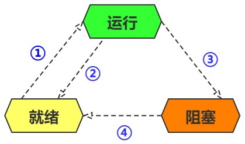

# 1. 操作系统概述（了解即可，非常见问题）

## 1.1  操作系统基本概念

> 操作系统（英语：Operating System，缩写：OS）是管理计算机硬件与软件资源的系统软件，同时也是计算机系统的内核与基石。操作系统需要处理如管理与配置内存、决定系统资源供需的优先次序、控制输入与输出设备、操作网络与管理文件系统等基本事务。操作系统也提供一个让用户与系统交互的操作界面。—— 维基百科

度娘、维基百科的定义已经非常清楚了，说白了，操作系统起到的作用就是，承上启下，对于用户一切从友好，易操作出发，同时把用户一系列的**高级操作**转化为**低级操作**

- 从另一个角度来看，操作系统又好像计算机中的核心管家，它掌管以及控制计算机上所有的软硬件资源
- 还有一个角度来看，操作系统的引入，可以为**计算机系统的扩展提供平台支撑**，也就是说，更新点新服务或者功能的时候，不会影响原有的服务或者功能

下面是分类更加细致的一种定义

- **科普观点**：操作系统是计算机系统的管理指挥机构和控制中心
- **功能观点**：操作系统是计算机资源的管理系统，负责对计算机的全部软、硬件资源进行分配、控制、调度和回收
- **用户观点**：操作系统是用户使用计算机的一个界面
- **管理员观点**：操作系统是计算机工作流程得以自动高效运行的组织者，系统软硬件资源合理协调的管理者
- **软件观点**：操作系统是由程序和数据集合组成的大型系统软件

## 1.2  操作系统的功能有哪些

- **处理机管理功能**：在多道程序或多用户的情况下，要组织多个作业同时运行，即需要完成处理机资源的分配、调度和回收等功能。
  - 处理机调度的单位可为进程或线程
  - 由于处理机调度策略不同，出现不同类型的操作系统，如批处理系统、分时系统、实时系统

- **存储管理功能**：对内部存储器进行分配，保护和扩充

  - **内存分配**：分配内存，以保证系统及各用户程序的存储区互不冲突

  - **存储保护**：保证一道程序在执行过程中不会有意或无意地破坏另一道程序，保证用户程序不会破坏系统程序

  - **内存扩充**：当用户作业所需要的内存量超过计算机系统所提供的内存容量时，把内部存储器和外部存储器结合起来管理，为用户提供一个容量比实际内存大得多的虚拟存储器

- **设备管理功能**：设备管理是通道、控制器和输入输出设备的分配和管理，以及实现设备独立性
  - **通道、控制器、输入输出设备的分配和管理**：设备管理的任务就是根据一定的分配策略，**把通道、控制器和输入输出设备**分配给**请求输入输出操作的程序**，并启动设备完成实际的输入输出操作。为了尽可能发挥设备和主机的并行工作能力，常需要采用虚拟技术和缓冲技术
  - **设备独立性**：输入输出设备种类很多，使用方法各不相同。设备管理应为用户提供一个良好的界面，而不必去涉及具体的设备特性，以使用户能方便、灵活地使用这些设备。

- **文件系统管理（信息管理）功能**：这里要做的就是，信息的共享、保密和保护

  - 如果系统允许多个用户协同工作，那么就应该允许用户共享信息文件。但这种共享应该是受控制的，应该有授权和保密机制

  - 保证系统安全可靠：有一定的保护机制以免文件被非授权用户调用和修改，即使在意外情况下，如系统失效、用户对文件使用不当，也能尽量保护信息免遭破坏

- **提供用户接口功能**：目的为提供一个友好的用户访问操作系统的接口。

  - 操作系统向上提供两种接口：
    - **程序一级的接口**：提供一组广义指令（或称系统调用、程序请求）供用户程序和其他系统程序调用。

    - **作业一级的接口**：提供一组控制操作命令（或称作业控制语言，或像Linux、UNIX中的shell命令语言）供用户去组织和控制自己作业的运行。

  通过这些命令和调用，向操作系统提出申请，由操作系统调用内部功能来完成相应的操作

## 1.3 系统调用

**概念**：提供了应用程序与操作系统之间的接口

**作用**：使用户级程序方便获得操作系统提供的服务，主要是与系统资源有关的服务都由操作系统提供

- 一般过程调用，其调用程序和被调用程序都运行在相同状态；而系统调用，调用程序在用户态，被调用程序运行在系统态。

**分类**：进程控制、文件管理、设备管理、存储管理、通信管理、线程管理

>  用户态(user mode) : 用户态运行的进程或可以直接读取用户程序的数据。
>
> 系统态(kernel mode):简单的理解为系统态运行的进程或程序几乎可以访问计算机的任何资源，不受限制。

# 2. 进程和线程

## 2.1 什么是进程？什么是线程？（概念层面）

【**进程**】是一段程序的执行过程，是系统运行程序的基本单位，也是系统进行资源分配和调用的独立单位。

- 即系统运行一个程序即是一个进程， 从创建，运行，到消亡的作用。
- **多进程**：在同一个时间段内可以执行多个任务，提高了 CPU 的使用率。

【**线程**】是一个比进程更小的执行单位，是进程的一个执行单元，一个进程执行的过程中可以产生多个线程。

- **多线程**：一个应用程序有多条执行路径，提高应用程序的使用率。

### 2.1.1 线程和进程的关系和区别？

**联系**：线程是进程划分成更小的运行单位，即一个进程可以有多个线程。从 JVM 角度来看，多个线程共享进程的堆和方法区（JDK 1.8后变为元空间），但是每个线程拥有自己私有的程序计数器、虚拟机栈、本地方法栈。

**区别**：各进程是独立的存在的，而同一进程中的线程很可能会互相影响。线程切换时，要比进程开销负担小很多（所以被称为轻量级进程），但是不利于资源的管理和保护，而进程则是相反的，开销虽然大，却利于管理保护。

说明：关于程序计数器、虚拟机栈、本地方法栈等内容，可以参考文章的 JVM 篇。[001-JVM知识问答总结.md](../../java/jvm/001-JVM知识问答总结.md)

## 2.2 进程有几种状态？

1. **创建状态：即创建一个新的进程**
   - 批处理环境中，选择一个新作业即将进去内存执行
   - 交互环境中，新用户登录到系统
   - 操作系统因提供一项服务而创建

2. **就绪态：一个进程已经具备了除了处理器之外的一切运行的条件，但是暂时还没有CPU调度，所以不能运行的状态（等待处理器分配时间片）**
- CPU 调度的时候，马上就可以运行
3. **运行态：进程占有了包括CPU在内的全部资源，并且在CPU上运行（单核 CPU 下任意时刻只有一个进程处于运行状态）**

4. **阻塞态：它叫法挺多，可以叫做等待态、挂起态、封锁态、冻结态、睡眠态，它指的是进程因为等待某件事情的发生而暂时不能运行的状态**

   - 也就是说，即使CPU空闲，但是这个进程也不能运行

5. **终止状态：一个进程因正常结束或者其他原因退出而结束**

   - 含一个终止指令或用于终止的OS显示服务调用
   - 分时系统中，用户的行为可指示终止（比如退出）

   - PC 机环境中，用户结束一应用程序
   - 出现某些错误的时候，例如，I/O失败，无效指令等
   - 父进程可请求它的某个子进程终止
   - 父进程终止，OS自动终止后代进程

  

### 2.2.1 描述一下三状态之间的转换

三状态一般是就绪运行和阻塞态。

我们按着图示的序号来分析一下

**① 就绪 --> 运行**

- 调度程序选择一个新的进程运行，也就是CPU调用了一个已经准备好的进程（就绪态），然后就进入了运行态

**② 运行 --> 就绪**

- 第一种原因是，运行中的进程用完了时间片
- 第二种原因是，优先级更高的进程处于就绪状态，所以当前运行进程被迫中断

**③ 运行 --> 阻塞**

- 当一个进程等待某一件事情发生的时候，例如：

  - 请求系统服务
  - 没有新的工作可以做
  - 等待某一进程提供输入（IPC）

  - 初始化 I/O 且必须等待结果

## 2.3 进程的通信方式

1. **匿名管道（无名管道）**：只适用于父子进程之间或父进程安排的各个子进程之间
2. **有名管道**：有名管道以磁盘文件的方式存在，可实现本机任意两个进程通信（克服了匿名管道的缺点）
3. **信号**：信号是一种比较复杂的通信方式，用于通知接收进程某个事件已经发生。
4. **信号量**：信号量是一个计数器，可以用来控制多个进程对共享资源的访问。它常作为一种锁机制，防止某进程正在访问共享资源时，其他进程也访问该资源。因此，主要作为进程间以及同一进程内不同线程之间的同步手段。
5. **消息队列**：消息队列是由消息的链表，存放在内核中并由消息队列标识符标识。消息队列克服了信号传递信息少、管道只能承载无格式字节流以及缓冲区大小受限等缺点。
6. **共享内存**：共享内存就是映射一段能被其他进程所访问的内存，这段共享内存由一个进程创建，但多个进程都可以访问。共享内存是最快的 IPC 方式，它是针对其他进程间通信方式运行效率低而专门设计的。它往往与其他通信机制，如信号量，配合使用，来实现进程间的同步和通信。
7. **套接字**： 套接口也是一种进程间通信机制，要用于在客户端和服务器之间通过网络进行通信，与其他通信机制不同的是，它可用于不同机器间的进程通信。

## 2.4 进程的调度算法

1. **先到先服务调度（FCFS）**：将用户作业和就绪进程按提交顺序或变为就绪状态的先后排成队列，并按照先后先服务的方式进行调度处理，这是一种最普遍和最简单的方法。
   - 在没有特殊理由要优先调度某类作业或进程时，从处理的角度来看，FCFS 方式是一种最适合的方式，因为无论是直接追加或是取出一个队列元素，在操作上都是非常简单的，直观上看该算法在一般意义上是公平的，也就是说每个作业或者进程都按照他们在队列中等待的时间长短来决定他们是否优先享受服务，不过对于那些执行时间较短的作业或进程来说，如果他们在某些执行时间很长的作业或进程到达之后再到达，则他们将等待的时间会很长，这种意义上也不是很公平。
2. **最短作业优先法（SJF）**：最短专业优先法就是选择那些估计需要执行时间最短的作业投入执行，为他们创建进程和分配资源。
   - 直观上来说，采用这种调度算法可以使得系统在同一时间内处理的作业个数最多，从而吞吐量也就大于其他调度方式。
   - 但是其致命缺点就是对于一个有不断作业进入批处理系统来说，这种方式可能会使得那些长作业永远得不到被调度的机会。
   - 有两种方式：① 非抢占式：一旦一个进程开始执行就需完成该次任务 ② 抢占式：如果新来的进程CPU区间段比当前进程的时间段小，则优先选择新进程。称为SRTF（Shorest Remaining Time First）
3. **时间片轮转调度法（RR）**：轮转法的基本思路是让每个进程在就绪队列中的等待时间与享受服务的时间成正比，也就是说将CPU的处理时间分成固定大小的时间片（10ms~100ms），如果一个进程在被调度选中之后用完了系统规定的时间片，但未完成要求的任务，则他将释放所占有的CPU，而排到就绪队列的末尾，等待下一次调度。 同时进程调度程序又去调度当前就绪队列中的第1个进程或作业
4. **线性优先级调度（SRR）**：为每个进程分配优先级，先执行优先级高的，如果优先级相同，则使用 FCFS 执行，可以根据内存要求，时间要求任何其他资源来确定优先级。
5. **多级反馈轮转调度（RRMF)**：轮转法中，加入到就绪队列的进程有三种情况：① 时间片用完、② I/O请求或进程互斥导致阻塞、③ 新创建进程进入就绪队列。对这三种进程区别对待，采用不同的时间片或优先权，有望能进一步改善系统服务质量和效率。

# 3. 存储管理

## 3.1 说说你知道的内存管理方式

首先可以大致分为两种方式：

- **连续分配管理机制**：给程序分配一个连续的内存空间，例如**块式管理**
- **非连续分配管理机制**：给程序分配离散的内存空间，例如**页式管理和段式管理，以及段页式管理**

### 3.3.1 块式管理
块式管理是一种很早之前的内存管理方式，它将内存分类一个个连续的内存块，每个块中只能包含一个进程，如果程序用不完一个块的情况，这样就导致极大的内存空间浪费，也会造成很多的碎片

> 碎片： 块中未被使用的内存空间

### 3.3.2 页式管理
页式管理将内存分为大小相等且固定的一页一页的离散空间，不再直接使用连续空间，而且页的大小比块要更小，提高了内存利用率，减少了碎片的产生

- 页式管理通过页表对应逻辑地址和物理地址

### 3.3.3 段式管理

页式管理虽然提高了内存利用率，但是每一页的内容依然混杂，因为其只是为了分页，没却实际意义

所以段式管理在页式管理的基础上：将内存划分成更小的段（划分力度更大），每一段由于针对具体的程序，故有了具体的意义，例如：主程序段、子程序段、数据段、栈段……

	- 段式管理通过段表对应逻辑地址和物理地址

### 3.3.4 段页式管理

段页式管理：结合了段式和页式管理的优点，先将内存分成若干段，然后将每一段再分成若干页。段与段之间是离散的，段的内部是一页页的，也是离散的

## 3.2 分页和分段机制有什么异同？

相同点：

- 目的相同：均为提高内存利用率，减少碎片的产生
- 离散存储：两者都是离散存储的，即使用非连续的空间，但是每个页和每个段之间的的内存是连续的

不同点：

- 页大小固定，而端不固定，与当前程序有关
- 分页仅仅是为了满足对内存管理的需求，页本身无实际意义，但是段式逻辑信息单位，可以体现为代码段等等。

## 3.3 虚拟地址，物理地址，CPU 寻址

### 3.3.1  虚拟地址（逻辑地址）和物理地址是什么？

我们编程中认识的地址，其实就是虚拟地址，这个值是操作系统提供给我们的，而物理地址，指的是真实在物理内存中的位置，例如在内存地址寄存器中的地址。

### 3.3.2 CPU 寻址是什么意思？

如果想要将虚拟地址转化为物理地址（不这样就没法访问真实物理内存），就需要通过 CPU 中的内存管理单元硬件进行一个转化的过程。

### 3.3.3 为什么要有虚拟地址？

**直接访问操作物理内存的问题：**

- 地址之间不隔离：恶意程序或者无意之间，都可能修改其他程序之间的内存数据，十分危险。
- 内存使用率低：如果在程序运行中时，一个新的程序进入，但是内存不够用，就需要将原先运行的部分程序暂时移出内存到硬盘中，多次装入装出，效率低下。
- 地址位置不确定：内存够的情况下，操作系统给程序随机分配地址。

**使用虚拟地址的优势**：

- 程序可以使用一系列相邻的虚拟地址来访问物理内存中不相邻的大内存缓冲区。
- 程序可以使用一系列虚拟地址来访问大于可用物理内存的内存缓冲区。数据或代码页会根据需要在物理内存与磁盘之间移动。
- 不同进程使用的虚拟地址彼此隔离。一个进程中的代码无法更改正在由另一进程或操作系统使用的物理内存。

## 3.4 虚拟存储器

### 3.4.1 虚拟存储器是什么

在程序装入时，可以将程序的一部分装入内存，而将其他部分留在外存，就可以启动程序执行。由于外存往往比内存大很多，所以我们运行的软件的内存大小实际上是可以比计算机系统实际的内存大小大的。

在程序执行过程中，当所访问的信息不在内存时，由操作系统将所需要的部分调入内存，然后继续执行程序。另一方面，操作系统将内存中暂时不使用的内容换到外存上，从而腾出空间存放将要调入内存的信息。这样，计算机好像为用户提供了一个比实际内存大的多的存储器，这就是虚拟存储器的概念。

### 3.4.2 虚拟存储器解决了什么问题

1. **内存不够用的问题**
   - 当一个进程运行的时候，虚拟存储器会在系统硬盘内，也就是外存中开一个空间将不常访问的放置于硬盘中，将经常使用的数据存储在内存中 有一种缓存类似的感觉，这也就是为什么有时候程序推荐4g以上内存运行，你2g的内存也可以使用它

2. **并发问题**

   - 将内存想象成一块菜田，将其割为100块 分别标号0到99，这块田是可以被任何人共享同时使用的，例如你在0~50的田中种了玉米 但是另一个用户，想在0~50中种土豆 但是你又同时想要种土豆和玉米

     如果都使用实际的这块地（内存）就会出现问题，所以出现了虚拟内存的概念，操作系统在虚拟内存和直接内存中提供一个翻译器，使开发者可以随意使用任何虚拟内存地址，当使用同样虚拟内存机制，两个软件同时在电脑运行时，翻译器会将同样的虚拟内存地址映射到不同的实际内存地址，从而使软件之间发生冲突

     也就是说，表面看起来都是用了 0-50 这块地，但实际上是用了相同的虚拟内存，实际位置还是不同的，所以不会冲突

## 3.5 页面置换算法

缺页中断发生后，如果内存中又没有空闲页面，所以就需要移除一些现有的页面，以腾出空间。究竟移出哪个页面，就是页面置换算法。

- **OPT 最佳页面置换算法** ：最佳(Optimal, OPT)置换算法所选择的被淘汰页面将是以后永不使用的，或者是在最长时间内不再被访问的页面,这样可以保证获得最低的缺页率。但由于人们目前无法预知进程在内存下的若千页面中哪个是未来最长时间内不再被访问的，因而该算法无法实现。一般作为衡量其他置换算法的方法。
- **先进先出页面置换算法 - FIFO（First In First Out）** : 总是淘汰最先进入内存的页面，即选择在内存中驻留时间最久的页面进行淘汰。
- **最近最久未使用页面置换算法 - LRU （Least Currently Used）** ：选择最近最长时间未访问过的页面予以淘汰，它认为过去一段时间内未访问过的页面，在最近的将来可能也不会被访问。该算法为每个页面设置一个访问字段，来记录页面自上次被访问以来所经历的时间，淘汰页面时选择现有页面中值最大的予以淘汰。
- **最少使用页面置换算法 - LFU （Least Frequently Used）**：选择用过次数最少的页面进行淘汰。