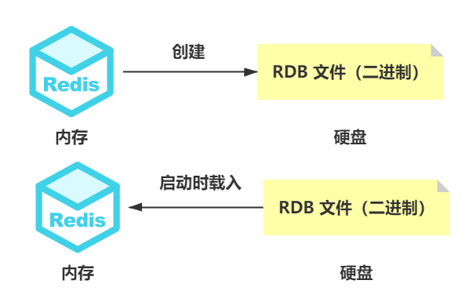
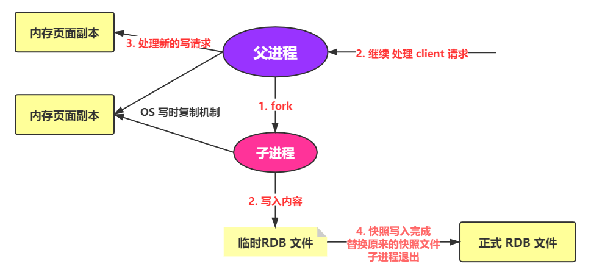
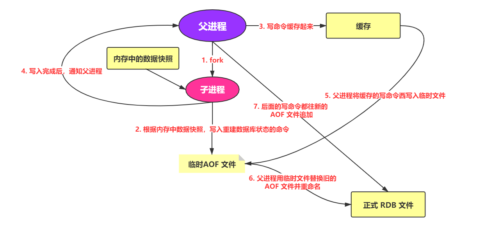
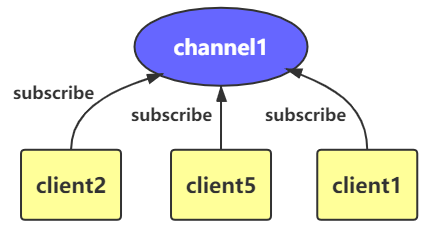
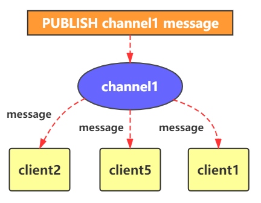
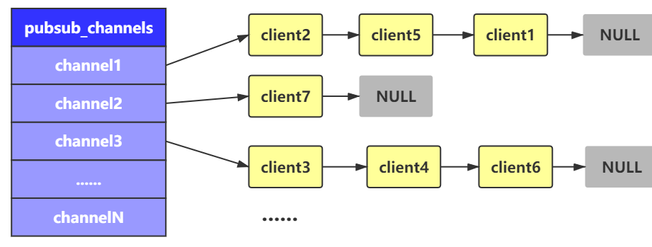

# 1. NoSQL 相关

## 1.1 什么是 NoSQL ?

> NoSQL，泛指非关系型的数据库。随着互联网web2.0网站的兴起，传统的关系数据库在处理web2.0网站，特别是超大规模和高并发的SNS类型的web2.0纯动态网站已经显得力不从心，出现了很多难以克服的问题，而非关系型的数据库则由于其本身的特点得到了非常迅速的发展。NoSQL数据库的产生就是为了解决大规模数据集合多重数据种类带来的挑战，尤其是大数据应用难题	——百度百科

NoSQL仅仅是一个概念，泛指非关系型的数据库，区别于关系数据库，它们不保证关系数据的ACID特性。它去掉了关系数据库的关系型特性。数据之间无关系，这样就非常容易扩展。无形之间也在架构的层面上带来了可扩展的能力。因为它的无关系性，数据库的结构简单，使得其在大数据量下，同样表现优秀。

## 1.2 为什么使用 NoSQL

- 部署成本低：部署操作简单，以开源软件为主
- 存储格式丰富：支持 key-value形式、文档、图片等众多形式，包括对象或者集合等格式
- 速度快：数据存储在缓存中，而不是硬盘中，而且例如Redis基于键值对，同时不需要经过SQL层解析，性能非常高

- 无耦合性，易扩展（因为数据之间没有关秀）
  - 在SQL中，一个正在使用的数据是不允许删除的，但NoSQL却可以操作

## 1.3 NoSQL可以替代SQL吗？

有人会说，NoSQL = Not SQL ，但是我更倾向这样理解 NoSQL = Not only SQL ，我们不能以一个绝对的结论来判定两项技术的好坏，每一项技术的产生都有其特定的原因，在我看来，**NoSQL更适合作为SQL数据库的补充**，由于海量数据的出现，性能的要求高了起来，而NoSQL这种产物，对于**结构简单**但是**数据量大**的数据处理起来要比传统的SQL快很多，但是同样的，其**逻辑运算就必须很简单**，否则它也是力不从心的

在我看来，可以简单的说，NoSQL就是以功能换取性能，但是需要**处理复杂的业务逻辑**还需要使用**关系型数据库**，所以说想要在模型中完全用NoSQL替代SQL是不现实的，两者更像是互补的关系

**SQL的好处：**

1. 支持在一个表以及多表之前进行复杂的查询操作
2. 支持对事物的处理，能保证数据的安全要求
3. 学习成本低，资料较多

市面上的NoSQL产品非常多，我们今天所要介绍的就是其中一款基于键值存储的数据库——Redis

## 1.4 NoSQL数据库的四大分类表格

| 分类              | Examples举例                                           | 典型应用场景                                                 | 数据模型                                        | 优点                                                         | 缺点                                                         |
| ----------------- | ------------------------------------------------------ | ------------------------------------------------------------ | ----------------------------------------------- | ------------------------------------------------------------ | ------------------------------------------------------------ |
| 键值（key-value） | Tokyo Cabinet/Tyrant, **Redis**, Voldemort, Oracle BDB | 内容缓存，主要用于处理大量数据的高访问负载，也用于一些日志系统等等。 | Key 指向 Value 的键值对，通常用hash table来实现 | 查找速度快                                                   | 数据无结构化，通常只被当作字符串或者二进制数据               |
| 列存储数据库      | Cassandra, **HBase**, Riak                             | 分布式的文件系统                                             | 以列簇式存储，将同一列数据存在一起              | 查找速度快，可扩展性强，更容易进行分布式扩展                 | 功能相对局限                                                 |
| 文档型数据库      | **CouchDB**, **MongoDb**                               | Web应用（与Key-Value类似，Value是结构化的，不同的是数据库能够了解Value的内容） | Key-Value对应的键值对，Value为结构化数据        | 数据结构要求不严格，表结构可变，不需要像关系型数据库一样需要预先定义表结构 | 查询性能不高，而且缺乏统一的查询语法。                       |
| 图形(Graph)数据库 | Neo4J, InfoGrid, Infinite Graph                        | 社交网络，推荐系统等。专注于构建关系图谱                     | 图结构                                          | 利用图结构相关算法。比如最短路径寻址，N度关系查找等          | 很多时候需要对整个图做计算才能得出需要的信息，而且这种结构不太好做分布式的集群方案。 |

# 2. Redis 相关

## 2.1 什么是 Redis ？

> Redis是一个使用ANSI C编写的开源、支持网络、基于内存、可选持久性的键值对存储数据库	——维基百科

可以简单的说，**Redis就是一款高性能的NoSQL数据库**，那么它的应用场景是什么呢？

- 用于用户内容缓存，可以处理大量数据的高访问负载，例如：数据查询，新闻，商品内容
- 缓存需要过期的一些信息：例如 Token
- 任务队列，例如：秒杀，12306
- 在线好友列表
- 应用、网站访问统计排行

## 2.2 Redis 和 Memcached 的异同

分布式缓存开始的那会，Memcached 还是经常被使用的，后面随着 Redis 的兴起，大部分都转 Redis 了

**相同**

- 都是基于内存的数据库，做缓存是其一个主要功能
- 均有过期策略
- 性能都很高

**区别**

- Memcached 只支持最简单的 key-value 数据类型，但是 Redis 可以支持例如 list、set、zset、hash 等更多丰富的数据结构
- Memcached 存储数据只在内存中，而 Redis 支持数据持久化，即将内存中的数据，存放到硬盘中。这也是其灾难恢复，以及内存用尽时的一种处理手段方式。
- Memcached 过期数据的删除使用了惰性删除，而 Redis 使用了 惰性删除 + 定期删除。
- Memcached 没有原生的集群模式，需要靠客户端来实现往集群中分片写入数据， Redis 原生支持 cluster 模式。
- Memcached 使用多线程的非阻塞 IO 复用网络模型，Redis 使用单线程的多路 IO复用模型（6.0 引入多线程）
- Redis 支持发布订阅、Lua 脚本等功能，而 Memcached 不支持
- Redis 支持更多的编程语言

我们下面几个点会主要先将这里提到几个点先介绍一下，例如数据类型，单线程模型等等

## 2.3 Redis 支持的数据结构

具体操作方法，可以参考我之前的文章

[【1w字+干货】第一篇，基础：让你的 Redis 不再只是安装吃灰到卸载（Linux环境）](https://juejin.cn/post/6921509748273577998)

- `string`：一种简单的 key-value 结构，是 Redis 自己构建出的一种简单动态字符串（simple dynamic string，SDS），它不光可以保存文本，还可以保存二进制数据，获取字符串长度时间复杂度为 O(1) ，而且它的 API 是安全的，不会有缓冲区溢出的问题。

- `list`：Redis 中的 list 链表，是其自己实现的一种双向链表，可以支持反向查找和遍历。

- `hash`：Redis 中的 hash 与 JDK 1.8 之前的 HashMap 也差不多，其特征就是易于存储对象。

- `set`：一种元素无序，且不重复的集合。其提供了判断一个成员是否在一个 set 集合内的结构，可以简单的实现交并补集的操作。

- `zset（sorted set）`：在 set 的基础上增加了一个 score 作为权重，元素可以按照 score 进行有序排列。

  - `Geospatia（地理位置`）：使用经纬度，作为地理坐标，然后存储到一个有序集合  zset/sortedset 中去保存，所以 zset 中的命令也是可以使用的。

  - `Hyperloglog（基数统计）`：HyperLogLog 是用来做基数（数据集中不重复的元素的个数）统计的算法，其底层使用string数据类型。
  - `BitMaps（位图）`：BitMaps 使用位存储，信息状态只有 0 和 1。

## 2.4 Redis 的单线程 | 多线程问题

### 2.4.1 介绍一下 Redis 单线程模型

Redis 基于 Reactor 模式开发了一套高效的时间处理模型——文件事件处理器（file event handler）。因为这个文件事件处理器是单线程的，所以 Redis 也被叫做单线程的模型。

基于**单线程**的条件下，这个文件事件处理器采用了 **IO多路复用机制** 同时监听多个socket（来自客户端的连接），根据 socket 上的事件来选择对应的事件处理器来处理这个事件。

文件事件处理器的结构包含4个部分：

1. 多个socket
2. IO多路复用程序
3. 文件事件分派器
4. 事件处理器（命令请求处理器,命令回复处理器,连接应答处理器等等）

> 如果被监听的 socket 准备好执行连接应答（accept）、读取（read）、写入（write）、关 闭（close）等事件/操作的时候，跟事件/操作对应的文件事件就会产生，这个时候文件事件处理器就会调用之前关联好的事件处理器来处理这个事件。
>
> 文件事件处理器是单线程模式运行的，但是通过IO多路复用机制监听多个 socket，可以实现高性能的网络通信模型。又可以跟内部其他单线程的模块进行对接，保证了Redis内部的线程模型的简单性。

> 多个 socket 可能并发的产生不同的操作，每个操作对应不同的文件事件，但是IO多路复用程序会监听多个socket，会将 socket 放入一个队列中排队，然后每次从队列中取出一个 socket 给事件分派器，事件分派器再把 socke t分派给对应的事件处理器去处理。
>
> 当一个 socket 的事件被处理完之后，IO多路复用程序才会将队列中的下一个 socket 取出交给事件分派器。文件事件分派器再根据 socket 当前产生的事件来选择对应的事件处理器来处理;

### 2.4.2 为什么 Redis 6.0 之前不使用多线程？

> 其实在 Redis 4.0 中已经引入了多线程这个概念，不过它只用在删除一些大键值对的数据时。

多线程虽然在例如并发方面表现很好，但是却会导致程序执行顺序等的不确定，还会带来一系列的读写问题，增加了系统复杂度，同时多线程带来的线程切换，加解锁，死锁等对性能的损耗也是很大的。

而单线程模式简单且易于维护，类似 Hash 中的一些线程不安全的操作也可以无锁进行。同时 Redis 的性能瓶颈不在 CPU ，主要在内存和网络。

### 2.4.3 为什么 Redis 6.0 之后引入了多线程？

首先要知道， Redis 的性能瓶颈不再 CPU ，主要在内存和网络。内存不够，可以考虑加内存或者做数据结构的优化等。而网络性能是最重要的一点，它占据了 Redis 执行中大部分的 CPU 时间，如果网络处理这部分能做成多线程处理，性能会有很大的提升。

所以，Redis 6.0 之后引入了多线程 也仅仅使用在减少网络 IO 读写这种耗时的操作上了，执行命令仍然是单线程，所以不需要考虑线程安全问题。

## 2.5 缓存过期机制了解吗？有什么用？如何判断？

Redis 中 string 类型可以直接使用 `setex` ，别的方法需要依靠 `expire` 来设置，`persist` 取消。

大部分场景下，我们使用 Redis 时缓存数据都会去设置一个过期时间，这个原因大致有两点

- **节省内存**：内存是有限的，如果缓存中的数据一直加入新的数据，很容易内存用尽
- **业务需求**：很多时候，我们一些 Token 或者一些邀请码一类的数据，都需要有一个时效性，所以设置一个缓存时间，符合我们的业务需求，也比自己在 Java 等中判断更优雅有效一些。

Redis 中维护着一个过期字典，就类似 hash 表一样，其中的 key 指向数据库中的某个 key，值是一个 long long 类型的数，保存了其毫秒精度的过期时间。

## 2.6 Redis 过期数据如何处理

常见策略就两种

- **惰性删除**：在 取出 key 的时候，对数据进行检查，对 CPU 友好，但是可能会导致很多 key 积累没有被删除

- **定期删除**：隔一段时间就自动进行一次过期 key 的清理，对内存友好，对 CPU 有一定负担，需要通过其限制删除操作的时长和频率来减少删除操作对 CPU 的影响。

Redis 采用的是 **惰性删除 + 定期删除**。

即使如此，还是可能会有很多 key 堆积，导致 Out Of Memory 

> 内存溢出（Out Of Memory，简称OOM）是指应用系统中存在无法回收的内存或使用的内存过多，最终使得程序运行要用到的内存大于能提供的最大内存。

Redis 内存淘汰机制可以帮助我们进一步解决这种问题

## 2.7 Redis 内存淘汰机制

1. `volatile-lru`：【从已设置过期时间的数据集中】挑选**最近最少使用**的数据淘汰 
2. `volatile-ttl`：【从已设置过期时间的数据集中】挑选**将要过期**的数据淘汰 
3. `volatile-random`：【从已设置过期时间的数据集中】**任意选择**数据淘汰
4. `volatile-lfu`：【从已设置过期时间的数据集中】挑选**使用频率最低**的数据淘汰 
5. `allkeys-lru`：【当内存不足以容纳写入新数据时】从数据集中挑选**最近最少使用**的数据淘汰
6. `allkeys-lfu`：【当内存不足以容纳写入新数据时】从数据集中挑选**使用频率最低**的数据淘汰
7. `allkeys-random`：【当内存不足以容纳写入新数据时】从数据集中**任意选择**数据淘汰
8. `no-enviction(驱逐)`：禁止驱逐数据这也是默认策略意思是当内存不足以容纳新入数据时，新写入操作就会报错，请求可以继续进行，线上任务也不能持续进行，采用 no-enviction 策略可以保证数据不被丢失 

## 2.8 Redis 事务的特点

### 2.8.1 常规事务的特点

1. **原子性**：表示事务是不可分割的最小操作单位，事务要么同时成功，要么同时失败。
2. **持久性**：当事务提交或回滚后，数据库会持久化的保存数据。
3. **隔离性**：多个事务之间。相互独立。
4. **一致性**：事务操作前后，数据总量不变

### 2.8.2 Redis 事务的特点

1. **Redis 中的事务是非原子性的**
2. **不支持事务回滚**
   - 多数事务失败是由语法错误或者数据结构类型错误导致的，而语法的错误是在命令入队前就进行检测，而类型错误是在执行时检测的，Redis为提升性能而采用这种简单的事务。

3. **事务没有隔离级别的概念**
   - 批量操作在发送 EXEC 命令前被放入队列缓存，并不会被实际执行，也就不存在事务内的查询要看到事务里的更新，事务外查询不能看到

## 2.9 Redis 持久化

### 2.9.1 什么是持久化？

前面已经讲过，Redis是一个内存数据库，也就是说，我们的数据全部存储在内存中，而我们常见的MySQL和Oracle等SQL数据库会将数据存储到硬盘中，凡事都是有利有弊，虽然内存数据库读写速度要比在硬盘中读写的数据库快的多，但是却出现了一个很麻烦的问题，也就是说，当 Redis 服务器重启或者宕机后，内存中的数据会全部丢失，为了解决这个问题，Redis提供了一种持久化的技术，也就是将内存中的数据存储到硬盘中去，日后方便我们使用这些文件恢复数据库中的数据

分为 RDB、AOF 两种方式

### 2.9.2 RDB 方式

#### 2.9.2.1 概念

在指定时间间隔后，将内存中的数据集快照写入数据库 ，在恢复时候，直接读取快照文件，进行数据的恢复 

简单理解：一定的时间内，检测key的变化情况，然后持久化数据





默认情况下， Redis 将数据库快照保存在名字为 dump.rdb 的二进制文件中。

文件名可以在配置文件中进行自定义，例如：dbfilename dump.rdb。

#### 2.9.2.2 工作原理

在进行 **`RDB`** 的时候，**`redis`** 的主线程是不会做 **`io`** 操作的，主线程会 **`fork`** 一个子线程来完成该操作（这也是保证了其极大性能的特点）

1. Redis 调用forks，同时拥有父进程和子进程。
2. 子进程将数据集写入到一个临时 RDB 文件中。
3. 当子进程完成对新 RDB 文件的写入时，Redis 用新 RDB 文件替换原来的 RDB 文件，并删除旧的 RDB 文件。

这种工作方式使得 Redis 可以从写时复制（copy-on-write）机制中获益（**因为是使用子进程进行写操作，而父进程依然可以接收来自客户端的请求。**）





#### 2.9.2.3 触发条件

1. **满足 save 条件会自动触发 rdb 原则**
   - 如：save 900 1 ：如果 900 s 内，如果至少有 1 个 key 被修改，则进行持久化操作
2. **执行save / bgsave / flushall命令，也会触发 rdb 原则**
   - save：立即对内存中的数据进行持久化，但是会阻塞，即不再接受其他任何操作，这是因为 save 命令为同步命令，会占用 Redis 主进程，若 Redis 数据非常多，阻塞时间会非常长
   - bgsave：异步请求，持久化时，可以持续响应客户端请求，阻塞发生在 fock 阶段，通常很快，但是消耗内存
   - flushall：此命令也会触发持久化 ；
3. **退出 Redis，也会自动产生 rdb 文件（默认生成位置就是 redis 的启动目录）**

#### 2.9.2.4 恢复条件

只要将 rdb 文件，放在 Redis 的启动目录，Redis 会自动在这个目录下检查 dump.rdb 文件，然后恢复其中的数据

查询配置文件中位置的命令

```shell
127.0.0.1:6379> config get dir
1) "dir"
2) "/usr/local/bin"
```

#### 2.9.2.5 优缺点

**优点：**

1. 适合大规模的数据恢复
2. 对数据的完整性要求不高

**缺点：**

1. 易丢失最后一次操作，因为其需要一定的时间间隔进行操作，如果 Redis 意外宕机了，这个最后一次修改的数据就没有了
2. fork 进程的时候，会占用一定的内存空间

### 2.9.3 AOF 方式

#### 2.9.3.1 概念

以日志的形式来记录每个写的操作，将Redis执行过的所有指令记录下来（读操作不记录），只许追加文件但不可以改写文件，redis启动之初会读取该文件重新构建数据，换言之，redis重启的话就根据日志文件的内容将写指令从前到后执行一次以完成数据的恢复工作。

如果你不深究其背后的操作，可以简单理解为：**每一个操作执行后，进行持久化操作**





**想要使用 AOF 方式，需要主动打开，因为默认使用的是 RDB**

在配置文件中，我们找到这两行，可以设置 aof 的启动，以及其持久化文件的名字

- `appendonly no` ：no 代表关闭 aof，改为 yes 代表开启

- `appendfilename "appendonly.aof" ` —— 持久化文件的名字 

**这里可以修改其持久化的一个方式**

- `appendfsync always` —— 每次修改都会 sync（消耗性能 ）

- `appendfsync everysec` —— 每秒执行一次 sync，可能会丢失这1s的数据 

- `appendfsync no` —— 不执行 sync，操作系统自己同步数据，速度最快 

**其默认是无限追加模式的，如果 aof 文件大于 64m，就 fork一个新的进程来将我们的文件进行重写**

```shell
no-appendfsync-on-rewrite no
aof-rewrite-percentage 100
auto-aof-rewrite-min-size 64mb
```

#### 2.9.3.2 aof 文件错位的解决方案

如果这个 aof 文件有错位，这时候redis是启动不起来的

Redis 给我们提供了一个工具 `redis-check-aof --fix`

```shell
# 命令示例
redis-check-aof --fix appendonly.aof
```

**2.9.3.3 优缺点**

**优点**

1. 文件的完整性会更加好，因为每一次修改都会同步
2. 若使用 appendfsync no 速度最快，效率最高

**缺点**

1. aof 文件大小远大于 rdb，修复速度因此比 rdb慢
2. aof 运行效率也要比 rdb 慢，所以我们redis默认的配置就是rdb持久化
3. 若使用每秒同步一次，可能会丢失一秒的数据

## 2.10 Redis 发布与订阅

### 2.10.1 概念

这部分，用的不是特别多，作为一个补充。 下面是我在 菜鸟教程（runoob）贴过来的定义，重制了一下图

**定义：Redis 发布订阅 (pub/sub) 是一种消息通信模式：发送者 (pub) 发送消息，订阅者 (sub) 接收消息。**

Redis 客户端可以订阅任意数量的频道。

下图展示了频道 channel1 ， 以及订阅这个频道的三个客户端 —— client2 、 client5 和 client1 之间的关系：





当有新消息通过 PUBLISH 命令发送给频道 channel1 时， 这个消息就会被发送给订阅它的三个客户端：





### 2.10.2 原理简介

说明：每个 Redis 服务器进程都维持着一个表示服务器状态的 redis.h/redisServer 结构，而结构的 pubsub_channels 属性是一个字典， **这个字典就用于保存订阅频道的信息**

- 其中，字典的**键为正在被订阅的频道**， 而字典的**值则是一个链表**， **链表中保存了所有订阅这个频道的客户端**

例子示意图：在下图展示的这个 pubsub_channels 示例中， client2 、 client5 和 client1 就订阅了 channel1（频道1） ，其他 channel （频道）同理





有了这个结构上的概念，订阅以及发布的动作就很好理解了：

- **订阅**：当客户端调用 SUBSCRIBE 命令执行订阅频道操作时，程序就会把一个个客户端（client）和要订阅的频道（channel）在 pubsub_channels 中关联起来
- **发布**： 程序首先根据 channel 定位到字典的键（例如找到 channel1）， 然后将信息发送给字典值链表中的所有客户端（例如 client2、client5、client1）。

## 2.11 主从复制

### 2.11.1 使用原因

首先，在一个项目中，使用一台 Redis 服务器肯定是有问题的：

- 一台服务器处理所有请求，压力过大，且容易出现故障，会导致整个相关服务出现问题
- 一台服务器的内存是有限的，不可能将所有内存用作 Redis 存储（推荐不应该超过 20g）

- 大部分场景下，大部分都是读的操作，写的操作会相对少一点，所以对读取的要求会大一些

而主从复制就可以将读写分离，下面来一起了解一下

### 2.11.2 概念

主从复制，是指将一台Redis服务器的数据，复制到其他的Redis服务器

- 前者称为主节点（Master/Leader），后者称为从节点（Slave/Follower）

- 数据的复制是单向的！只能由主节点复制到从节点（主节点以写为主、从节点以读为主）

简单理解一下就是：一台服务器作为主机器，其他服务器作为从机器，他们通过命令或配置进行了连接，这样从机就能获取到主机的数据了，从机可以帮主机分担很多读的请求等等

> 复制原理：Slave（从机） 启动成功连接到 Master（注解） 后会发送一个 sync（同步命令）
>
> Master 接到命令，启动后台的存盘进程，同时收集所有接收到的用于修改数据集命令，在后台进程执行，完毕之后，master将传送整个数据文件到slave，并完成一次完全同步。
>
> 但是只要是重新连接master，一次完全同步（全量复制）将被自动执行，从机中就能看到所有数据
>
> - 全量复制：而slave服务在接收到数据库文件数据后，将其存盘并加载到内存中。
> - 增量复制：Master 继续将新的所有收集到的修改命令依次传给slave，完成同步

### 2.11.3 作用

1. 数据冗余：主从复制实现了数据的热备份，是持久化之外的一种数据冗余的方式。
2. 故障恢复：当主节点故障时，从节点可以暂时替代主节点提供服务，是一种服务冗余的方式
3. 负载均衡：在主从复制的基础上，配合读写分离，由主节点进行写操作，从节点进行读操作，分担服务器的负载；尤其是在多读少写的场景下，通过多个从节点分担负载，提高并发量。
4. 高可用基石：主从复制还是哨兵和集群能够实施的基础。

### 2.12 哨兵模式

在前面的主从复制的概念中，我们知道，一旦主服务器宕机，就需要使用手动的方式，将一台从服务器切换为主服务器，这种方式很麻烦，还有一种方式就是哨兵模式，也是一种比较推荐的方式

定义：哨兵模式是一种特殊的模式，首先Redis提供了哨兵的命令，哨兵是一个独立的进程，作为进程，它会独立运行。其原理是**哨兵通过发送命令，等待Redis服务器响应，从而监控运行的多个Redis实例。**

其作用如下：

- 通过发送命令，让Redis服务器返回监控包括主服务器和从服务器的运行状态，。
- 当哨兵监测到 master 宕机，会自动将 slave 切换成 master，然后通过**发布订阅模式**通知其他的从服务器，修改配置文件，让它们切换主机。

## 2.12 缓存穿透

缓存穿透：大量缓存未命中的情况下，大量请求持久层数据库，持久层数据库承载很大的压力，出现问题。

- 说白了，就是最后都要去数据库查询东西，数据库哪里受得了。

一般有两种解决方式，缓存空对象和布隆过滤器，但在此之前，要做好前后台的数据格式等校验，防止一些不合理的数据也来查询。

### 2.12.1 缓存空对象

某个值多次请求若在缓存和数据库中都没找到，就在缓存中放一个空对象用于处理后续这个请求。

- 这种情况适合 key 请求不频繁的情况，如果 key 一直在变，这种方案就不是很有用了。如果非要用，可以尽可能减短时间。

### 2.12.2 布隆过滤器

对所有可能查询的参数以 Hash 的形式存储，以便快速确定是否存在这个值，在控制层先进行拦截校验，校验不通过直接打回，减轻了存储系统的压力。

- 因为其 Hash 的存储操作方式，会有可能出现不同字符串哈希出的位置相同，引发冲突，所以会有小概率的误判。

## 2.13 缓存击穿

定义：缓存击穿，是指一个key非常热点，在不停的扛着大并发，大并发集中对这一个点进行访问，当这个key在失效的瞬间，持续的大并发就穿破缓存，直接请求数据库，就像在一个屏障上凿开了一个洞

解决方案：

1. **设置热点数据永不过期**

   这样就不会出现热点数据过期的情况，但是当 Redis 内存空间满的时候也会清理部分数据，而且此种方案会占用空间，一旦热点数据多了起来，就会占用部分空间。

2. **加互斥锁（分布式锁）**

   在访问 key 之前，采用SETNX（set if not exists）来设置另一个短期key来锁住当前key的访问，访问结束再删除该短期 key 。保证同时刻只有一个线程访问。这样对锁的要求就十分高。

## 2.14 缓存雪崩

缓存在同一时刻全部失效，造成瞬时DB请求量大、压力骤增，引起雪崩。

- 能引起雪崩的有可能是，系统缓存出了问题，例如宕机了。也可能是大量的key设置了相同的过期时间。

解决方案：

**① redis高可用**

- 这个思想的含义是，既然redis有可能挂掉，那我多增设几台redis，这样一台挂掉之后其他的还可以继续工作，其实就是搭建的集群

**② 限流降级**

- 这个解决方案的思想是，在缓存失效后，通过加锁或者队列来控制读数据库写缓存的线程数量。比如对某个key只允许一个线程查询数据和写缓存，其他线程等待

**③ 数据预热**

- 数据加热的含义就是在正式部署之前，我先把可能的数据先预先访问一遍，这样部分可能大量访问的数据就会加载到缓存中。在即将发生大并发访问前手动触发加载缓存不同的key，设置不同的过期时间，让缓存失效的时间点尽量均匀


