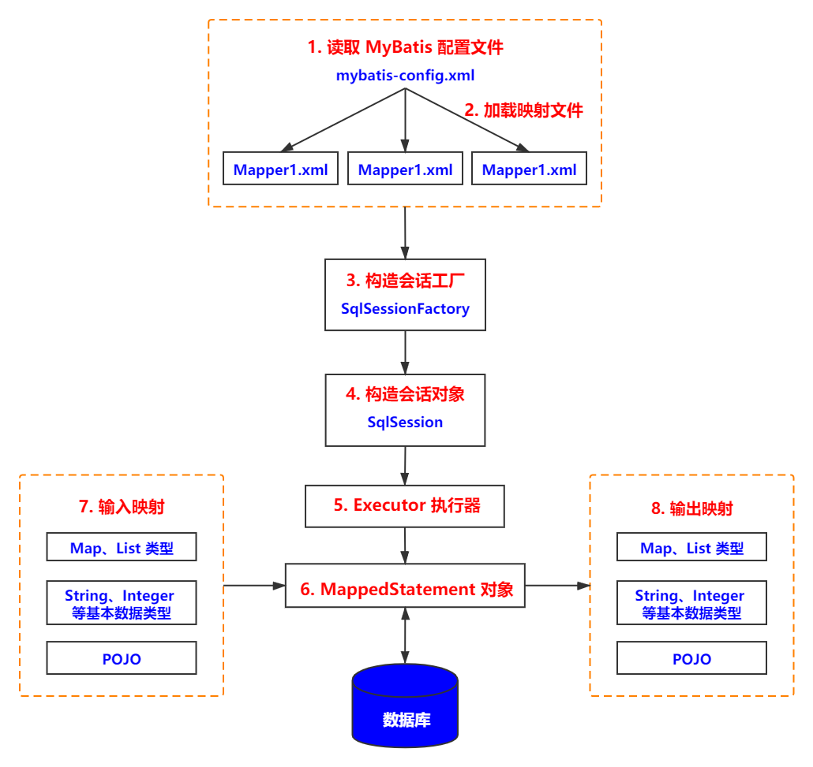
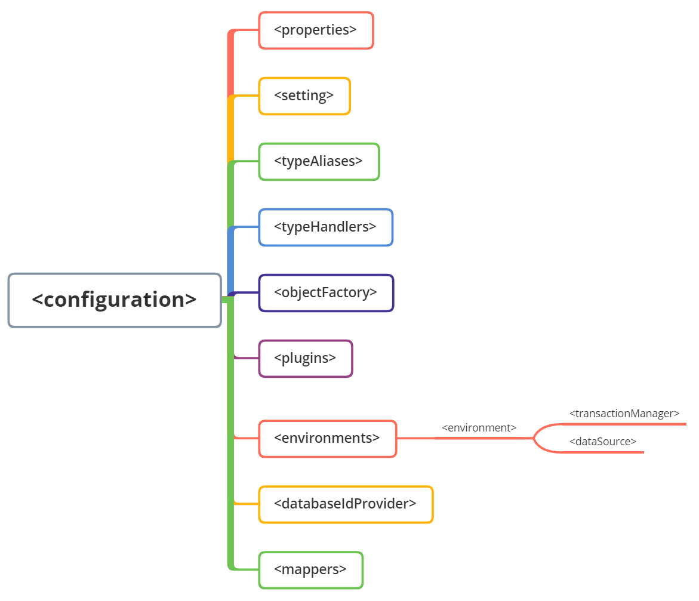
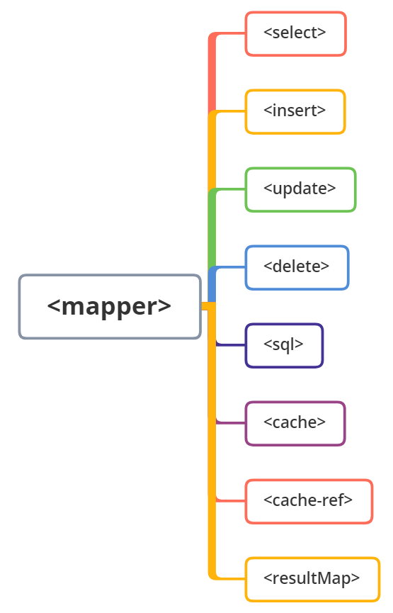

# 1. 初识 MyBatis 

## 1.1 ORM 是什么意思

ORM 是一种为了解决**面向对象**与**关系型数据库中数据类型**不匹配的技术，它通过描述 Java 对象与数据库表之间的映射关系，自动将 Java 应用程序中的对象持久化到关系型数据库的表中。

## 1.2 MyBatis 与 Hibernate 的区别

**Hibernate 是一个全表映射的框架。**开发者只要定义好持久化对象到数据库表的映射关系，就可以通过 Hibernate 提供的方法完成持久层操作。开发者并不需要熟练的掌握SQL语句的编写，Hibernate会根据制定的存储逻辑，自动的生成对应的SQL，并调用JDBC接口来执行，所以在一些场景下 Hibernate 从人力的角度上看，效率高很多。不过Hibernate 在多表关联时，对SQL查询的支持较差；更新数据时，需要发送所有字段；不支持存储过程；不能通过优化SQL来优化性能等。

- 其缺点大部分也正是因为其优点造成的，完全的映射和封装有时候也是把双刃剑。

**MyBatis 是一个半自动映射的框架。** MyBatis 需要自动编写 SQL，而 Hibernate 将其封装成了方法，但 MyBatis 可以配置动态SQL并优化SQL，可以通过配置决定SQL的映射规则，它还支持存储过程等。对于一些复杂的和需要优化性能的项目来说，显然使用MyBatis更加合适。

- 手动写 SQL 不一定是坏事，这也可以根据自己需求，构建出各种复杂的语句，同时可读性比封装成方法更好。

## 1.3 MyBatis 的工作流程





1. 读取 mybatis-config.xml 全局配置文件，其中配置了运行环境等信息，最关键的是数据库连接信息。
2. 加载 SQL 映射文件，即我们每一个接口对应的那个 XML ，例如 UserMapper.xml ，其中编写了方法的 SQL 语句。需要在 mybatis-config.xml 全局配置文件中对其配置方可使用。
3. 构建会话工厂，通过 MyBatis 的环境等配置信息，构建会话工厂 SqlSessionFactory。
4. 创建 SqlSession 对象，由会话工厂创建 SqlSession 对象，该对象包含了执行 SQL 的所有方法。
5. MyBatis 底层定义了一个 Executor 接口来操作数据库，它会根据 SqlSession 传递的参数动态的生成需要执行的 SQL 语句，同时负责查询缓存的维护。
6. 在 Executor 接口的执行方法中，包含一个 MappedStatement 类型的参数，该参数是对映射信息的封装，用于存储要映射的 SQL 语句的 id，参数等。Mapper.xml 文件中的一个 SQL 对应一个 MappedStatement 对象，SQL 的 id 即是 MappedStatement 的 id。
7. 输入参数映射：输入参数类型可以是 Map、List 等集合类型，也可以是基本数据类型和 POJO 类型。输入参数映射过程类似于 JDBC 对 preparedStatement 对象设置参数的过程。
8. 输出结果映射：输出结果类型可以是 Map、 List 等集合类型，也可以是基本数据类型和 POJO 类型。输出结果映射过程类似于 JDBC 对结果集的解析过程。

## 1.4 #{}和\${}的区别

此问题放在后面查询语句里面再提也行，不过一般 MyBatis 的一些书籍，默认第一个例子都会有查询，也都会提及到模糊查询的问题，所以把这个问题单独先解决一下。

`#{}` 表示 SQL 参数的占位符，MyBatis 会在参数执行前，使用将 sql 执行前将 `#{}` 内容替换为 `?` ，接着会使用PreparedStatement 按位置顺序设置 `?` 的值为大括号中的值。它可以接收简单类型、JavaBean、HashMap 等，如果接受简单类型时，`#{}` 中可以写 value 也可以写自定义的名字，如果接收的是 JavaBean ，它会通过 OGNL 读取属性值，例如 属性1.属性2....

`${}` 表示一个变量的占位符（也能叫拼接符），可以作用于标签属性值和 sql 内部，属于静态文本替换，比例如  `${user}` 会被静态替换为`com.mysql.jdbc.Driver`。又例如在 SQL中，  `select * from user where name = ${value}; ` ，会直接将 ` ${value}` 解析为值，例如张三。不过其可能会引起 SQL 注入问题，接收类型和前者一样，不过接受简单类型时，`${}` 中只能写成 value。

### 1.4.1 为什么 ${} 会有 SQL 注入问题，如何解决？

首先` #{} `和 `${}` 在预编译中的处理是不一样的。

`#{}` 会把参数部分用一个占位符 ? 代替，然后使用 PreparedStatement  赋值

```
SELECT * FROM `user` WHERE NAME = ?;
```

`${}` 则只是在动态解析阶段的一个简单的字符串替换，

```
SELECT * FROM `user` WHERE NAME = ‘张三’;
```

**如何解决：**

-  有 SQL 注入风险的写法

```sql
SELECT * FROM `user` WHERE NAME LIKE '%${name}%';
```

- 方法 1 ：在程序中校验并在参数中拼接%，直接用 `#{}`

```sql
SELECT * FROM `user` WHERE NAME LIKE #{name}
```

- 方法 2：使用 concat 拼接

```sql
SELECT * FROM `user` WHERE NAME LIKE CONCAT('%',#{name},'%');
```

## 1.5 Mybatis执行SQL的两种方式

 Mybatis执行SQL有两种方式：Sqlsession 与 Mapper 接口

通过工厂生产出 SqlSession 对象后

- Sqlsession的方式就是直接调用 Sqlsession 的方法，例如  selectOne、selectList 、insert 等等。
- Mapper 的方式就是通过 SqlSession 的 getMapper 方法来获取一个 Mapper 接口，就可以调用它的方法了。

> 因为 XML 文件或者接口注解定义的 SQL 都可以通过“类的全限定名+方法名”查找，所以 MyBatis 会启用对应的 SQL 进行运行，并返回结果。

一般推荐使用获取 Mapper 的方式，因为 Sqlsession 需要使用其指定的方法，再传入全类名 id 等进行匹配，可读性不如 Mapper 方法简洁，就像是加了一层调用的感觉，而直接调用 Mapper 中你所创建的方法如果参数传递有误，会直接在编译期就提示错误，而使用 Sqlsession 的方法，直到运行时才会知道。

下面是一个测试的例子（SqlSession 的方法也很简单，可以自己试试）：

```java
public class MybatisTest {
    private InputStream inputStream;
    private SqlSession sqlSession;
    private UserMapper userMapper;

    @Before
    public void init() throws IOException {
        // 读取配置文件
        inputStream = Resources.getResourceAsStream("sqlMapConfig.xml");
        // 创建 sqlSessionFactory 工厂
        SqlSessionFactory factory = new SqlSessionFactoryBuilder().build(inputStream);
        // 使用工厂生产 SqlSession 对象
        sqlSession = factory.openSession();
    }

    @After
    public void destroy() throws IOException {
        sqlSession.close();
        inputStream.close();
    }

	/**
     * Mapper 方法
     */
    @Test
    public void testFindAllByMapper(){
        // 使用 SqlSession 创建 Mapper 接口的代理对象
        userMapper = sqlSession.getMapper(UserMapper.class);
        List<User> userList = userMapper.findAll();
        for (User user : userList){
            System.out.println(user);
        }
    }

    /**
     * sqlSession 方法
     */
    @Test
    public void testFindAllBySqlSession(){
        // 直接调用 SqlSession 查询方法，传入 全类名 id
        List<User> userList = sqlSession.selectList("cn.ideal.mapper.UserMapper.findAll");
        for (User user : userList){
            System.out.println(user);
        }
    }
}
```

# 2. MyBatis 核心配置及标签

## 2.1 配置文件

`<configuration>` 是 MyBatis 主配置文件的根元素，其中又会通过很多元素标签对其进行细致的配置，注意配置的时候，标签顺序要按下图从上往下配置，否则 MyBatis 解析 XML 的时候就会报错。




### 2.1.1 peoperties

在 MyBatis 主配置文件中，`<peoperties>` 标签用于将内部的配置外在化，即引入一个可以动态变换的外部配置，例如引入一个 properties 配置文件，以 key-value 的形式配置数据，在 MyBatis 配置后即可动态引入，修改时只需要修改配置文件即可。

**创建 jdbc.properties 配置文件，内容如下：**

```properties
jdbc.driver=com.mysql.jdbc.Driver
jdbc.url=jdbc:mysql://localhost:3306/hello_mybatis
jdbc.username=root
jdbc.password=root
```

**主配置文件中引入 jdbc.properties 配置文件**

```xml

```

**数据库配置如下：**

```xml
<dataSource type="POOLED">
    <property name="driver" value="${jdbc.driver}" />
    <property name="url" value="${jdbc.url}" />
    <property name="username" value="${jdbc.username}" />
    <property name="password" value="${jdbc.password}" />
</dataSource>
```

在 MyBatis 3.4.2 版本后，还可以启动一个占位符默认值的配置，不过需要增加一个配置

```xml
<properties resource="jdbc.properties ">
	<property name="org.apache.ibatis.parsing.PropertyParser.enable-default-value" value="true" />      
</properties>                                  
```

去调用的时候，就可以设置一个默认值，当 jdbc.username 不存在的时候，就会使用默认的 root 这个值

```xml
 <property name="password" value="${jdbc.username:root}" />
```

### 2.1.2 settings

settings 标签虽然不是直接影响 MyBatis 运行的标签，但是其可以设置很多行为的开闭，举几个常见的例子：

```xml
<settings>
    <!-- 开启缓存 -->
	<setting name="cacheEnavled" value="true" />
    <!-- 开启懒加载 -->
    <setting name="lazyLoadingEnabled" value="true" />
    <!-- 允许 JDBC 支持自动生成主键 -->
    <setting name="useGeneratedKeys" value="true" />
</settings>
```

这部分具体去查对应的配置就可以了，不需要专门记忆，了解即可。

### 2.1.3 typeAliases

`<typeAliases>` 标签就是一个别名标签，他可以为一些很长的，例如类的全路径名称，java.lang.String 这样的内容起一个别的简短一些名字，方便调用。

如果不使用别名调用的时候是这样的

```xml
<select id="findByUsername" parameterType="java.lang.String" resultType="cn.ideal.pojo.User">
      SELECT * FROM user WHERE username = #{username}
</select>
```

如果在主配置文件中配置了别名

```xml
<typeAliases>
    <typeAlias alias="user" type="cn.ideal.pojo.User"/>
    <typeAlias alias="str" type="java.lang.String"/>
</typeAliases>
```

调用时就是这样的

```xml
<select id="findByUsername" parameterType="str" resultType="user">
      SELECT * FROM user WHERE username = #{username}
</select>
```

手动添加太累了，也可以选择批量加入，使用 package 标签就可以对包下所有的类进行批量别名，默认是类名首字母换成小写，例如 `cn.ideal.pojo.User` 别名就是 user

```xml
<typeAliases>
    <package name="cn.ideal.pojo"/>
</typeAliases>
```

### 2.1.4 typeHandler

不管是向数据库中写入数据，还是从 SQL 的查询结果集中获取数据，都是涉及到了Java类型和数据库类型之间的转换，MyBatis 中已经有很多默认的处理器了，例如 StringTypeHandler 就可以将 java.lang.String 类型与数据库的 CHAR 和 VARCHAR 类型来回转换，但是如果你想自己声明一个转换器（例如写一个日期时间的转换器），就可以使用 typeHandler 标签来将你写好的转换器注册进来。

如果自定义转换器不做介绍，这里只讲这个标签

首先是指定注册入一个转换器

```xml
<typeHandlers> 
    <typeHandler handler="cn.ideal.type.DateTypeHandler" />
</typeHandlers>
```

第二种是指定扫描包下的所有转换器，然后注册

```xml
<typeHandlers> 
    <package name="cn.ideal.type" />
</typeHandlers>
```

### 2.1.5 objectFactory

MyBatis 每次创建结果对象的新实例的时候，都会使用对象工厂来处理， MyBatis 中默认的 ObjectFactory 的作用是实例化目标类，通常使用默认的 ObjectFactory 即可。

objectFactory 标签的作用就是帮助我们自定义一个对象工厂，一般也很少用，了解即可

```xml
<objectFactory type="cn.ideal.factory.MyObjectFactory">
     <property name="name" value="MyObjectFactory"/>
</objectFactory>
```

### 2.1.6 plugins

MyBatis允许在已映射语句执行过程中的某一点进行拦截调用，这种拦截调用是通过插件来实现的。`<plugins>` 元素的作用就是配置用户所开发的插件。此部分了解即可，真正的编写需要对 MyBatis 内部运行原理熟悉。

### 2.1.7 environments

`<environments>` 标签配置的就是 MyBatis 的环境，其实也就是数据源的配置。

贴一段常规的写法

```xml
<!-- 配置环境，和spring整合后 environments配置将会被废除 -->
<environments default="development">
    <environment id="development">
        <!-- 使用JDBC事务管理 -->
        <transactionManager type="JDBC" />
        <!-- 数据库连接池 -->
        <dataSource type="POOLED">
            <property name="driver" value="com.mysql.jdbc.Driver" />
            <property name="url" value="jdbc:mysql://localhost:3306/ideal_mybatis" />
            <property name="username" value="root" />
            <property name="password" value="=root99" />
        </dataSource>
    </environment>
</environments>
```

其中又有两个标签非常重要，我们分别来介绍 

- transactionManager：使用 type 属性来指定使用哪个数据管理器，选项有 JDBC 和 MANAGED。

  - JDBC：直接使用 JDBC 的提交和回滚设置。
  - MANAGED：不提交和回滚一个连接，而是交给容器来管理事务的生命周期。

  - 注：使用 Spirng 后不需要配置此部分了，因为会使用 Spring 自带的事务管理器来处理事务。

- dataSource：type 属性有三个选项：UNPOLLED ，POOLED，JNDI。

  - UNPOLLED ：每次请求，都会打开和关闭连接。
  - POOLED：设置一个管理数据库连接的资源池，用来控制数据库的连接和关闭次数等等。
  - JNDI：配置连接外部数据源，例如服务器提供的数据源。

  - 说明：每个类型的数据源的属性这里没有写出来，很容易查到。例如上面的 driver、url 等等就是一部分。


### 2.1.8 mappers

mappers 一般用来指定 MyBatis 映射文件的位置，也就是我们真正写 SQL 的文件位置，有 4 种写法。

- 使用类路径引入

```xml
<mappers>
    <mapper resource="cn.ideal.mapper/UserMapper.xml"/>
</mappers>
```

- 使用本地文件路径引入

```xml
<mappers>
    <mapper url="file:///D:/cn/ideal/mapper/UserMapper.xml"/>
</mappers>
```

- 使用接口类引入

```xml
<mappers>
    <mapper class="cn.ideal.mapper.UserMapper"/>
</mappers>
```

- 使用包名引入

```xml
<mappers>
    <package name="cn.ideal.mapper"/>
</mappers>
```

## 2.2 映射文件

这部分就是在 SQL 映射文件中会用到的一些标签，包括增删改查的以及一些别的。



#### 2.2.1 select

select 标签就是用来执行查询语句的的标签

举个例子：

```xml
<select id="findByUsername" parameterType="java.lang.String" resultType="cn.ideal.pojo.User">
      SELECT * FROM user WHERE username = #{username}
</select>
```

| 属性          | 说明                                                         |
| ------------- | ------------------------------------------------------------ |
| id            | 表示命名空间中的唯一标识符，常与命名空间组合起来使用。组合后如果不唯一，MyBatis会抛出异常 |
| parameterType | 该属性表示传入 SQL 语句的参数类的全限定名或者别名。它是一个可选属性，因为 MyBatis 可以通过 TypeHandler 推断出具体传入语句的参数。其默认值是 unset （依赖于驱动） |
| resultType    | 从SQL语句中返回的类型的类的全限定名或者别名。如果是集合类型，那么返回的应该是集合可以包含的类型，而不是集合本身，例如返回 `List<User>` 返回值应该是 `User` 。返回时可以使用 resultType 或 resultMap 其中之一 |
| resultMap     | 表示外部 resultMap 的命名引用。返回时可以使用 resultType 或 resultMap 之一 |
| flushCache    | 表示调用 SQL 语句后，是否需要 MyBatis 清空之前查询的本地缓存和二级缓存，布尔类型，默认 false。 |
| useCache      | 用来控制二级缓存的开启和关闭。其值为布尔类型（true \| false） ，默认值为 true，表示将查询结果存入二级缓存中。 |
| timeout       | 用于设置超时参数，单位为秒。超时时将抛出异常。               |
| fetchSize     | 获取记录的总条数设定，其默认值是 unset （依赖于驱动）        |
| statementType | 用于设置 MyBatis 使用哪个 JDBC 的 Statement 工作，其值为 STATEMENT、PREPARED、CALLABLE 分别对应 JDBC 中的 Statement、PreparedStatement、 CallableStatement |
| resultSeType  | 表示结果集的类型，其值可设置为 FORWARD_ONLY、SCROLL_SENSITIVE 或 SCROLL_INSENSITIVE，其默认值是 unset （依赖于驱动） |

### 2.2.2 insert

insert 标签即执行插入语句的标签，执行完后，会返回一个表示插入记录数的整数。

```xml
<insert
      id="addUser"
      parameterType="cn.ideal.pojo.User"
      flushCache="true"
      statementType="PREPARED"
      keyProperty=""
      keyColumn=""
      useGeneratedKeys=""
      timeout="20">
    ...
</insert>
```

其中大部分属性和 select 是差不多的，其中有如下三个是比较特殊的。

| 属性            | 说明                                                         |
| --------------- | ------------------------------------------------------------ |
| keyProperty     | （insert 和 update 生效）作用为将插入或者更新操作的返回值赋值给 PO 类的某个属性，一般会这只主键属性，如果需要联合主键，可以在多个值之前用逗号隔开。 |
| keyColumen      | （insert 和 update 生效）用于设置第几列是主键，当主键列不是表中的第一列时需要设置。，如果需要联合主键，可以在多个值之前用逗号隔开。 |
| useGenerateKeys | （insert 和 update 生效）此属性会使 MyBatis 使用 JDBC 的 getGeneratedKeys() 方法来获取由数据库内部产生的主键，默认为 false |

```xml
<insert id="addUser" parameterType="cn.ideal.pojo.User" 
        keyProperty="id" useGenerateKeys="true">
    ......
</insert>
```

最后插入结果返回的值是成功的行数，如果拿插入的那个对象去 getId 就能拿到它插入后的主键 id。

如果数据库不支持主键自增（Oracle）也可以使用 MyBatis 自定义生成主键

```xml
<insert id="addUser" parameterType="cn.ideal.pojo.User">
	<selectKey keyProperty="id" resultType="Integer" order="BEFORE">
		select if(max(id) is null , 1 , max(id) +1) as newld from user
	</selectKey>
	insert into user( id, username, name, phone)
		values(#{id} , #{username} , #{name} , #{phone})
</insert>
```

- BEFORE 代表先执行 selectKey 再执行插入，AFTER 反之。

### 2.2.3 update 和 delete

基本与前面的属性一致，给个例子

```xml
<update id="updateUser" parameterType="cn.ideal.pojo.User">
       update user 
       set username=#{username},name=#{name},phone=#{phone}
       where id=#{id}
</update>

<delete id="deleteUser" parameterType="Integer">
        delete from user where id=#{id}
</delete>
```

### 2.2.4 sql

如果 SQL 中存在大量重复的代码，这样就过于臃肿了，例如每次都查询相同的字段，例如 id ，username，name，phone 等等。所以 sql 标签的作用就是类似定义一个变量的感觉，将通用的部分抽取出来，然后再去引用就可以了，而且以后修改也只需要修改一处。

将字段单独定义出来

```xml
<sql id="userColumns">id, username, name, phone</sql>
```

然后引用

```xml
<select id="findUserById" parameterType="Integer"
            resultType="cn.ideal.pojo.User">
    select <include refid="userColumns"/>
    from user 
    where id = #{id}
</select>
```

它可以用在例如拼接表名前缀这种场景，例如 user --> tb_user

### 2.2.5 resultMap

一条查询语句中，当你定义 resultType 为一个 JavaBean，例如 User，当查询到结果后，只要数据库字段和 JavaBean 属性值一致，就可以自动映射赋值。

在主配置文件中 settting 标签的 autoMappingBehavior 就可以设置自动映射的模式

```xml
<setting name="autoMappingBehavior" value="PARTIAL" />
```

- NONE：不启用自动映射
- PARTAL：只对非嵌套的 resultMap 进行自动映射
- FULL：所有 resultMap 进行自动映射

默认是 PARTAL，一般谨慎用 FULL ，有数据混乱的风险。

举个 resultMap 的应用场景：如果数据库中的一些，或者全部字段都是使用下划线命名的，例如：u_id，u_name，u_phone 。而 User 实体中都是驼峰命名，例如 uId，uName，uPhone。

```xml
<resultMap id="BaseResultMap" type="cn.idela.pojo.User">
    <!-- 用id属性来映射主键字段 -->
    <id column="u_id" jdbcType="VARCHAR" property="id" />
    <!-- 用result属性来映射非主键字段 -->
    <result column="u_name" jdbcType="VARCHAR" property="name" />
</resultMap>
```

查询的时候，只需要在属性中自定 resultMap 就行了，id 和 name 都会被你自定义的映射处理，而其余的还会使用默认的自动映射。

## 2.3 动态 SQL

在 MyBatis 的 SQL映射文件中，有时候需要根据一些查询条件，来选择不同的SQL语句，如果每一个场景都重写SQL，很显然效率没有很高，而 MyBatis 的动态SQL很好的解决了这种问题，根据条件动态的处理 SQL, 特别简单的说就是，写一次SQL，但是根据分支等的跳转，在多个场景下也可以使用，例如：

- 当查询条件由于参数不同而无法确定具体是什么，可以使用 `<where>` 标签包含
- 在 `<where>`  可以使用 `<if test="....">` 分条件进行处理，实现动态
- `<foreach>` 遍历标签放到后面代码中具体说

在此之外，动态SQL同解决了，在原生 JDBC 中需要拼接SQL语句时由于书写问题，而导致报错。

### 2.3.1 if 标签

只要 if 中的值为 true 就会拼接，where 后面讲

```xml
<select id="findUserByCondition" resultType="cn.ideal.domain.User" parameterType="cn.ideal.domain.User">
	select  * from user
    <where>
   		<if test="username != null">
        	and username = #{username}
        </if>
        <if test="gender != null">
            and gender = #{gender}
        </if>
    </where>
</select>
```

注意：在SQL中，“and” 用来拼接已有一个或多个查询条件的语句，当此语句为第一个查询条件的时候，会因为 `<where>` 的存在屏蔽第一个 “and”

### 2.3.2 choose、 when  、otherwise 标签

这几个标签类似 switch-case 的感觉，如果第一个 when 匹配上，就拼装第一个，第二个就第二个，如果都不匹配，就匹配 otherwise 中

```xml
select * from user where 1=1
<choose>
    <when test="username !=null and username !=''">
        and username like concat('%',#{username}, '%')
    </when>
    <when test="name !=null and name !=''">
        and name= #{name}
    </when>
    <otherwise>
        and phone is not null
    </otherwise>
</choose>
```

注：此处不加 where 1=1 就会导致拼接出的 sql 为 select * from user and ......

### 2.3.3 where 和 trim

```xml
select * from user
<where>
    <if test="username !=null and username !=''">
        and username like concat('%',#{username}, '%')
    </if>
    <if test="name !=null and name !=''">
        and name= #{name}
    </if>
</where>
```

where 会自动判断 SQL 语句，只有 where 内的条件成立时，才会在拼接 SQL 中加入 where 关键字，否则将不会添加；还会去除多余的“AND”或“OR”。

```xml
select * from user
<trim prefix="where" prefixOverrides="and">
    <if test="username !=null and username !=''">
        and username like concat('%',#{username}, '%')
    </if>
    <if test="name !=null and name !=''">
        and name= #{name}
    </if>
</trim>
```

trim 的作用是去除特殊的字符串，它的 prefix 属性代表语句的前缀，prefixOverrides 属性代表需要去除的哪些特殊字符串，功能和 where 基本是等效的。

### 2.3.4 set 标签

使用 set 和 if 元素对 username 和 jobs 进行更新判断，并动态组装SQL。这样就只需要传入想要更新的字段即可

```xml
<update id="updateUser"  parameterType="cn.ideal.pojo.User">
    update t_customer 
    <set>
        <if test="username !=null and username !=''">
            username=#{username},
        </if>
        <if test="name !=null and name !=''">
            name=#{name},
        </if>
    </set>
    where id=#{id}
</update>
```

### 2.3.5 forEach 标签

```xml
<select id="findUserInIds" resultType="cn.ideal.pojo.User" parameterType="cn.ideal.vo.QueryUserVo">
	select * from user
	<where>
        <if test="ids != null and ids.size() > 0">
        	<foreach collection="ids" open="and id in (" close=")" item="uid" separator=",">
            	#{uid}
            </foreach>
        </if>
    </where>
</select>
```

解释一下

- collection：指定输入对象中的集合属性。
  - 如果传入的是单参数且参数类型是一个数组或者List的时候，collection属性值分别为array和list（或collection）。
  - 如果传入的参数是多个的时候，就需要把它们封装成一个Map了，当然单参数也可以封装成Map集合，这时候collection属性值就为Map的键。
  - 如果传入的参数是POJO包装类的时候，collection属性值就为该包装类中需要进行遍历的数组或集合的属性名。
- open：为开始遍历时拼接的字符串。
- close：为结束便利时要拼接的字符串。
- item：为每次遍历生成的对象名。
- index：配置的是当前元素在集合的位置下标。
- separator：为遍历两个对象中间需要拼接的串。

本例中，我哦们使用了 `select * from user where id in (12,16,17)` 这种形式，如果想使用 or那种形式，只需要修改拼接格式就可以了

### 2.3.6 bind 标签

模糊查询中为了解决 sql 注入的问题

```sql
select * from user where username like '%${value}%'
```

我们有这样几个问题：

- 如果使用“${}”进行字符串拼接，则无法防止SQL注入问题；

- 如果改用concat函数进行拼接，则只针对MySQL数据库有效；

- 如果改用“||”进行字符串拼接，则只针对Oracle数据库有效。

这样，映射文件中的SQL就要根据不同的情况提供不同形式的实现，这显然是比较麻烦的，且不利于项目的移植。为了减少这种麻烦，就可以使用MyBatis的 bind 元素来解决这一问题。

```xml
<select id="findUserByUsername" parameterType="cn.ideal.pojo.User"
        resultType="com.itheima.po.Customer">
    <bind name="pattern_username" value="'%'+_parameter.getUsername()+'%'" />
    select * from user 
    where 
    username like #{pattern_username}
</select>
```

# 3. 多表查询

可以看看这篇，后期也会重制：[千字文带你入门-MyBatis多表查询](https://juejin.cn/post/6844903972214407176) 

**A：一对多**

- 用户和订单/理财产品
  - 一个用户可以买好几个批次的理财产品
- 部门和员工
  - 一个部门可以有很多员工

**B：多对一**

- 订单和用户
  - 多个订单属于同一个用户

**C：多对多**

- 学生选课和学生
  - 一个学生可以选择多门课，一门课可以被多个学生选择

**D：一对一**

- 身份证、护照等证件
  - 一个证件只能属于一个人

## 3.1 一对一

MyBatis 中 association 元素就是用来处理一对一关联关系的。

- property：指定映射到的实体类对象属性，与表字段一一对应
- column：指定表中对应的字段
- javaType：指定映射到实体对象属性的类型
- select：指定引入嵌套查询的子SQL语句，该属性用于关联映射中的嵌套查询
- fetchType：指定在关联查询时是否启用延迟加载。该属性有lazy和eager两个属性值，默认值为lazy（即默认关联映射延迟加载）

MyBatis加载关联关系对象主要有两种方式：嵌套查询和嵌套结果。

- 嵌套查询（不推荐）：通过执行另外一条SQL映射语句来返回预期的复杂类型。也就是查完第一张表的信息，然后再通过引入另一个简单的 SQL 来将两个SQL 结果组合到一起。两个 SQL 和 两个 JavaBean 是独立的。所以需要执行多次 SQL 语句，会很影响效率
-  嵌套结果（推荐）：使用嵌套结果映射来处理重复的联合结果的子集。执行一条复杂的 SQL ，直接构造出一个新的映射 resultMap，SQL  和 JavaBean 都是嵌套在一起的，例如 Account 账户类中有一个字段为 User 类型的 user。

**嵌套查询（不推荐）**

```xml
<association property="username" column="username" 
             javaType="cn.ideal.pojo.User" 
             select="cn.ideal.mapper.User.findUserById" />
```

**嵌套结果（推荐）**

```xml
<association property="username" javaType="cn.ideal.pojo.User" 
    <id property="id" column="id" />
    <result property="username" column="username" />
</association>
```

下面给出嵌套结果方法的一个稍微详细一点的 xml 配置（Account、User 没写全路径是因为做别名了）

```xml
<!-- 定义封装 Account和User 的resultMap -->
<resultMap id="userAccountMap" type="Account">
	<id property="id" column="aid"></id>
    <result property="uid" column="uid" />
    <result property="money" column="money" />
    <!-- 配置封装 User 的内容 -->
    <association property="user" column="uid" javaType="User">
   		<id property="id" column="id"></id>
        <result property="username" column="username" />
        <result property="telephone" column="telephone" />
        <result property="birthday" column="birthday" />
        <result property="gender" column="gender" />
        <result property="address" column="address" />
     </association>
</resultMap>

<!-- 根据查询所有用户 -->
 <select id="findAll" resultMap="userAccountMap">
	SELECT u.*,a.id AS aid,a.uid,a.money FROM account a,user u WHERE u.id = a.uid;
</select>
```

- 目的就是为了查询一个账户对应的一个用户信息。Account 实体中含有一个 User 类型的 user 字段

## 3.2 一对多

例如这样一个场景：查询所有用户信息，同时显示出该用户下的所有账户

这也就是个一对多的场景，一个用户对应多个账户。用的标签为 collection 和 association 差不多的用法，也是两种，ofType 属性与 javaType 属性对应，它用于指定实体对象中集合类属性所包含的元素类型。

**嵌套查询（不推荐）**

```xml
<collection property="accounts" column="id" ofType="cn.ideal.pojo.Account"
            select=" cn.ideal.mapper.UserMapper.selectUserAccount" />
```

**嵌套结果（推荐）**

```xml
<collection property="accounts" ofType="cn.ideal.pojo.Account">
    <id property="id" column="aid"></id>
    <result property="uid" column="uid"></result>
    <result property="money" column="money"></result>
</collection> 
```

**示例：**

```xml
<!-- 定义User的resultMap-->
<resultMap id="userAccountMap" type="User">
	<id property="id" column="id"></id>
    <result property="username" column="username"></result>
    <result property="telephone" column="telephone"></result>
	<result property="birthday" column="birthday"></result>
    <result property="gender" column="gender"></result>
    <result property="address" column="address"></result>
    <collection property="accounts" ofType="account">
        <id property="id" column="aid"></id>
        <result property="uid" column="uid"></result>
        <result property="money" column="money"></result>
    </collection>
</resultMap>

<!-- 根据查询所有用户 -->
<select id="findAll" resultMap="userAccountMap">
   SELECT * FROM user u LEFT OUTER JOIN account a on u.id = a.uid;
</select>
```

## 3.2 多对多

多对多常见的做法就是加一张中间表，用来记录，两张表之间的联系。要展开多对多是比较长的，这里只做一个小结。

下述例子为：查询所有用户信息，同时显示出该用户下的所有账户

```xml
<mapper namespace="cn.ideal.mapper.RoleMapper">
    <!-- 定义Role的resultMap-->
    <resultMap id="roleMap" type="Role">
        <id property="roleId" column="rid"></id>
        <result property="roleName" column="role_name"></result>
        <result property="roleDesc" column="role_desc"></result>
        <collection property="users" ofType="User">
            <id property="id" column="id"></id>
            <result property="username" column="username"></result>
            <result property="telephone" column="telephone"></result>
            <result property="birthday" column="birthday"></result>
            <result property="gender" column="gender"></result>
            <result property="address" column="address"></result>
        </collection>
    </resultMap>

    <!-- 根据查询所有用户 -->
    <select id="findAll" resultMap="roleMap">
       SELECT u.*,r.id AS rid,r.role_name,r.role_desc FROM role r
       LEFT OUTER JOIN user_role ur ON r.id = ur.rid
       LEFT OUTER JOIN user u ON u.id = ur.uid
    </select>
</mapper>
```

# 4. 延迟加载和缓存

[MyBatis 延迟加载（懒加载）一篇入门](https://juejin.cn/post/6844904062362583054#heading-2)

[MyBatis缓存技术入门](https://juejin.cn/post/6844904062815584269)

# 5. 问题补充

## 5.1 MyBatis 使用 Dao接口 + XML ，两者是如何对应起来的？

Dao 就是 Mapper 接口，namespace  中的值就是接口的全限定类名，而每一个方法，对应的就是每一个  MappedStatement，其中 id 值就是方法的名称。而这个 Mapper 我们是不做实现的，当调用 Mapper 中的方法的时候，就会通过 namespace  + id 为 key ，能够定位到一个唯一的 MappedStatement。每一个 select insert 标签都会被解析成一个 MappedStatement 对象。

方法调用原理就是：通过 JDK 动态代理，通过 proxy 对象拦截接口方法，转而执行 MappedStatement 对象

这也是其不能重载的原因，因为 namespace  + id  要定位到唯一内容。

## 5.2 MyBatis 的映射方式有哪些？如何封装成对象？

映射方式主要就是 resultMap 和 sql 列的别名两种，拿到映射关系后，通过反射创建对象，然后逐一对属性赋值。映射有问题，赋值也会赋不上去。

## 5.3 什么是延迟加载？可以用在哪里？原理有了解吗？

**概念**：例如，查询一批笔记本电脑的进货明细，而不直接展示每列明细对应电脑配置或者价格等的详细信息，等到用户需要取出某笔记本相关的详细信息的时候，再进行单表查询

再例如 ，银行中，某个用户拥有50个账户（打比方），再我们查询这个而用户的信息，这个用户下所有账户的详细信息很显然，在使用的时候再查询才是比较合理的。这就是延迟加载

**用处**：延迟加载可以用在 association 和 collection 配置的，的一对一和一对多的查询下，配置 lazyLoadingEnabled 的布尔值即可开启以及关闭。

**原理**：使用 CGLIB 创建代理对象，当调用方法的时候，就进行拦截，例如查询账户信息是可以直接返回到结果的，而作为账户信息中需要延迟加载的的用户信息，刚开始是不会去默认查的。当你调用 account.getUser() 这样的方法时，拦截器就会发现 getUser() 是 null，就会单独发送事先保存好的查询关联用户对象的 sql 语句，然后再进行赋值。后续也就有值了。

