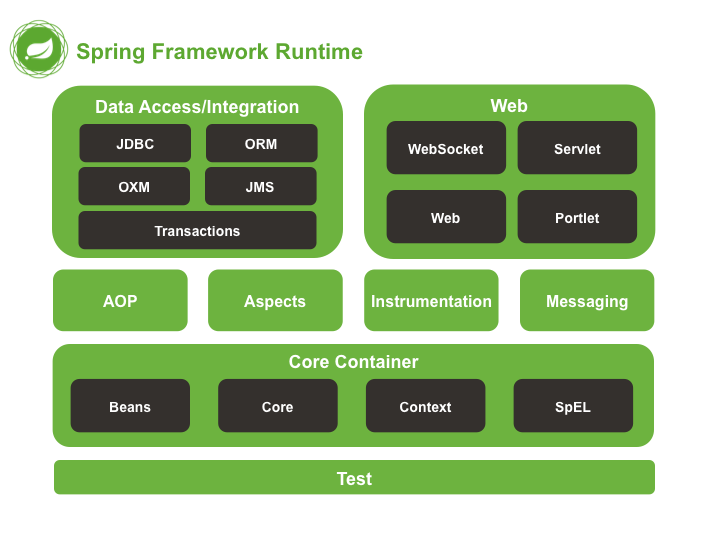
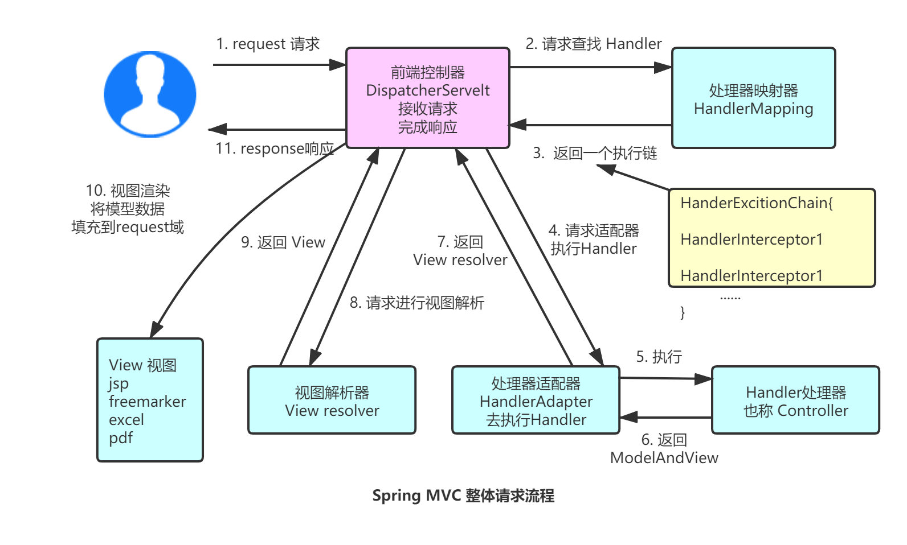

有需要可参考已经我写的几篇关于 Spring 文章

- [Spring框架 层层递进轻松入门 (IOC和DI)](https://juejin.im/post/5e47c5aee51d45271849d430)

- [Spring 通过单表 CURD 认识配置IOC的两兄弟（XML&注解）](https://juejin.im/post/5e537b2851882549431febe2)

- [Spring AOP 层层递进轻松入门 ！](https://juejin.im/post/5e621ff9f265da576d60b1de)

- [Spring MVC 层层递进轻松入门 ！](https://juejin.im/post/5e781ca3e51d452726153fa0)

- [SpringMVC参数绑定-入门用法总结](https://juejin.cn/post/6844904151550263303)

# 1. Spring Framework 相关

## 1.1 Spring 框架是什么？

Spring 这个家族中枝叶茂盛，例如 SpringBoot、SpringCloud 等等 ，我们一般单纯指的 Spring 就是 Spring Framework，它提供了核心容器，数据访问，Web，AOP，测试等模块，能够快速的帮助我们进行开发。

其好处如下：

- **降低耦合度**：Spring神奇的 IoC 容器，可以控制对象间的依赖关系，解决了硬编码问题，让你的程序变得 “动态且高效”

-  **AOP 编程支持**：Spring 提供了面向切面编程，可以非常方便的实现一些权限拦截或运行监控等的功能

-  **方便集成各种优秀框架**：Spring 不排斥各种优秀的开源框架，其内部提供了很多优秀框架（Struts、Hibernate、MyBatis、Hessian、Quartz）的直接支持

-  **方便程序测试**：Spring 支持 junit4 ，可以通过注解方便的测试程序

-  **声明式事务的支持**：Spring 帮助我们从普通的事物管理代码中解放出来，通过配置就可以完成对事物的管理

-  **降低 JavaEE API 的使用难度**：Spring 将 JavaEE 中一些比较难用的 API (JDBC、JavaMail、远程调用等) 进行了封

### 1.1.1 什么是框架？

不扯什么太专业的名词，咱们就讲点大白话，大家应该都听过 **“框架是一个半成品”** ，这句话没毛病，框架就是封装了很多很多的代码，然后你只需要直接调用它提供给你的 API 就能直接使用它的功能，省了咱们很多功夫。最近闲在家，给大家整个比较通俗的例子——鸡蛋灌饼的制作

- 全手工模式：准备300g面粉加少量盐.......切块，擀成饼状，包入油酥...... 
- 半成品模式：打开某宝，某东，某拼购买鸡蛋灌饼的现成面皮，直接开火煎，倒入鸡蛋，裹入食材就可以了

使用这个提供好的面饼，就可以省去我们很多功夫，只需要在面饼上进行加工就可以了，这和使用框架是一个道理，框架就是一个半成品，即节省了我们开发的成本，又可以让我们在这个框架的基础上进行自定义的加工。

框架的最初意愿当然都是为了简化开发，帮助开发者快速的完成项目需求，说的确切一点，就是框架中结合了很多的**设计模式**，可以让你 **“动态”** 的开发，将代码实现了通用性，一般自己写的简单的代码，都涉及太多的 “硬编码” 问题了 ，而如果自己去写这些设计模式又太复杂了。

## 1.2 Spring 框架有哪些模块（架构）？

注：图是 4.x 的，是我以前写文章保存的，现在 5.x Portlet 已经没有了，而且增加了 WebFlux 

Spring框架是一个分层的架构，根据不同的功能，分成了多个模块，而这些模块都是可以单独或者组合使用的



### 1.2.1 核心容器（CoreContainer）

提供 Spring框架的基本功能，分为图中四个模块，核心容器中重要的组件就是 BeanFactory ，本质就是实现了工厂模式，且它使用了 IoC（控制反转）模式，将程序的配置以及依赖性规范与实际程序的代码分开

- **Beans**：提供了 BeanFactory，Spring中将管理对象称作 Bean
- **Core**：提供 Spring 框架的基本组成部分，包括我们首先要学习的 IoC 和 DI
- **Context**：访问定义和配置任何对象的媒介，以前两者为基础，ApplicationContext 接口是这部分的重点
- **spEL (Spring Expression Language)**：一个比较强大的运行时查询和操作数据的表达式语言

### 1.2.2 数据访问/集成（Data Access/Integration）

- **JDBC**：提供了一个JDBC抽象层，减少了一些重复无聊的JDBC代码，提升了开发效率
- **ORM**：提供了对流行对象关系映射API的集成层 （JPA、JDO、Hibernate、 mybatis ）
- **OXM**：提供了一个支持对象/XML映射实现的抽象层（  JAXB、Castor、XMLBeans、JiBX 、XStrea ）
- **JMS**：Java消息服务， 包含用于生产和消费消息的功能
- **Transactions**：事务模块，用于支持实现特殊接口和所有的POJO的类的编程和声明式事物管理

### 1.2.3 Web 模块

- **Web**：提供了基本的 Web 的集成功能，例如多部分文件上传功能，以及初始化了一个使用了Servlet监听器和面向Web应用程序上下文的 IoC 容器，它还包含一个HTTP客户端和Spring远程支持的相关部分
- **Servelt**：包含 Spring 模型—视图—控制器 (MVC) ，用来实现Web应用
- **WebSocket**：Spring4.0以后新增的模块，它提供了WebSocket和SocketJS的实现
- **Portlet**：就好像是Servlet一般，它提供了Portlet环境下的MVC实现

### 1.2.4 其余模块

- **AOP**：提供了面向切面编程的能力，允许定义方法拦截器和切入点，按功能分离代码，降低耦合性，可以实现一些面向对象编程中不太好实现的功能
- **Aspects**：提供与 AspectJ 的继承，是一个功能强大且成熟的面向切面编程的框架
- **Instrumentation**：提供了类工具的支持和类加载器的实现，可以在特定的应用服务器中使用
- **Messaging**： 它提供了对消息传递体系结构和协议的支持
- **Test**：其支持使用 JUnit 或者 TestNG，可以实现单元测试，集合测试等测试流程

## 1.3 谈谈对于 IOC 的理解

IOC（Inverse Of Contro） 也就是控制反转，它是一种思想，也就是将在程序中创建对象的控制权，从自己手上交到 Spring 框架中，IOC 可以理解为一个工厂，创建对象的时候，只需要配置好文件或者注解就可以了，对象在背后如何被创建，完全无需操心。不仅效率高了，而且耦合度也大大的降低了。

### 1.3.1 为什么耦合度降低了？

例如在 Service层中的一个类里，通过 new 的方式实例化 Dao层的某个类，这种通过 new 对象的方式，使得不同类之间的依赖性大大增强，其中一个类的问题，就会直接导致出现全局的问题，如果我们将被调用的方法进行错误的修改，或者说删掉某一个类，执行的结果就是在**编译期**就出现了**错误**，而我们作为一个开发者，我们应该努力让程序在编译期不依赖，而运行时才可以有一些必要的依赖（依赖是不可能完全消除的）。

**1.3.1.1 具体怎么实现呢？**

在这里可以将 serivice 和 dao 均配置到配置文件中去（xml/properties)，通过一个类读取配置文件中的内容，并使用反射技术创建对象，然后**存起来**，完成这个操作的类就是我们的工厂，如果还想考虑多例到单例的改进，还可以通过创建一个 Map，来保证获取 Bean 时只需要从 Map 中取就可以了。

**1.3.1.2 为什么使用工厂模式替代了 new 的方式？**

打个比方，在你的程序中，如果一段时间后，你发现在你 new 的这个对象中存在着bug或者不合理的地方，或者说你甚至想换一个持久层的框架，这种情况下，没办法，只能修改源码了，然后重新编译，部署，但是如果你使用工厂模式，你只需要重新将想修改的类，单独写好，编译后放到文件中去，只需要修改一下配置文件就可以了。

### 1.3.2 什么是依赖注入

依赖注入即 DI，它其实就是控制反转的一种实现方式，对象不需要手动去创建或者去管理依赖关系了，会通过一种叫做依赖注入的方式，自动注入到需要的位置。

## 1.4 谈谈对 AOP 的理解

AOP 叫做面向切面编程，主要解决了非业务的代码提取问题，也就是把与业务无关，但是却是业务模块需要的一些内容，例如 事务、日志、权限 等信息，说白了，就像是在某个方法前后增加一些非业务代码。如果使用了 AOP 就会减少大量的重复代码，降低模块间的耦合度，利于维护和扩展。

### 1.4.1 详细说一下其实现思路

例如在一个简单模拟的转账出错的例子下，张三的钱被扣了，服务器服务出现了问题，李四没有收到任何的钱。这种情况肯定要考虑事务问题的，默认情况下，一些常见的数据源的事物都是隐式控制，自动提交的，但是其每一条都是独立事务，也就是各管各的，但我们肯定想要整个转账流程都是一个事务。所以可以考虑使用 ThreadLocal 写出关于连接和事务的工具类，每次使用时，在类中引入，根据需要选择、开启、执行、提交、回滚等操作。

但是每个业务都这么做，就会有很多重复代码，而且业务代码和事务代码杂糅在一起，也影响阅读。

如果可以通过动态代理的方式，将类进行事务的增强，在执行方法的前后，分别写入了开启事务，提交事务，回滚事务等事务管理方法，这时候，业务层就可以删除掉前面所写的关于业务的重复代码。

### 1.4.2  Spring AOP 和 AspectJ AOP 有什么区别？

- Spring AOP 属于运行时增强，并且基于代理实现， 上手简单些。

- AspectJ 是编译时增强。 AspectJ 基于字节码实现，复杂不过很强大。

## 1.5 Spring Bean 相关

### 1.5.1 @Component 和 @Bean 的区别

- @Component 与其子注解（@Controller、@Service、@Repository）作用于类，一般用来通过类路径扫描来自动侦测装配到 Spring 容器中。
- @Bean 一般作用于方法中，就像是告诉 Spring，当我想要用它的时候，你就按照这个格式装配到容器中。它一般用来引入第三方库中的类。

### 1.5.2 Bean 的作用域是什么？

- singleton：单例，也就是只有一个实例。
- prototype：多例，每次请求都会创建一个新的实例。
- request：多例，每一次 HTTP 请求都会产生一个新的实例，不过仅在当前 HTTP request 内有效。
- session：多例，每一次 HTTP 请求都会产生一个新的实例，不过仅在当前 HTTP session 内有效。
- global-session：全局 session作用域，基于 portlet 的 web 应用才有意义，但是 5.x 的 Spring 已经去掉 portlet 了

### 1.5.3  单例 Bean 线程安全问题

上面在 IOC中，我们有提到，多例可以优化为单例，可以减少多次创建对象带来的损耗，性能会低一些，而且可以优化查询速度。但是单例 Bean 就会存在线程安全问题。

> 线程安全的定义，就是多个线程去执行某一个类，这个类始终能表现出一种正常的行为。

例如：Spring 中 bean 默认是单例的，在其成员位置，如果定义一个有状态（即需要进行数据存储）的变量，在多线程状况下，就是不安全的，如下代码肯定是不安全的：

```java
public class AccountDaoImpl implements AccountDao {
	//定义一个类成员
    private int i = 1;
    
    public void addAccount() {
        System.out.println("添加用户成功！");
        System.out.println(i);
        i++;
    }
}
```

解决方法

- 有状态的变量尽量定义在方法中，不要定义在成员位置。
- 需要创建成员变量，使用 ThreadLocal  进行保存。

### 1.5.4 Spring 对 Bean 的生命周期管理

提到 Bean 的生命周期管理，就必须提一下，普通 Java 对象的实例化过程。首先就是将代码编译成 class 字节码文件，当被 new 或者反射创建的时候，就被加载到 JVM，初始化后供我们使用，其实他就像是通过 class 中的信息进而创建出的一种实例。但是 Spring 管理的 Bean ，使用了一种叫做 BeanDefinition 的实例来额外描述对象的信息，其中可以存储一些元数据，例如 @Scope @ Lazy 等等。也就是说 Bean = Class 类信息 + BeanDefinition对象信息

- Spring 启动时扫描 XML 或者 注解 或者 配置类，找到需要管理的 Bean 信息。
  - 将 Bean 信息封装成 BeanDefinition ，然后存入一个 BeanDefinitionMap 的值中，键是这个 bean 的 name。
  - 接着可以使用 BeanFactoryPostProcesso 对元数据信息进行一定的修改，不过一般不会去改。
- 利用反射创建出 Bean 的实例（未初始化属性的值）
- 将属性的值注入。
- 判断是否实现了 Aware 相关的接口，如果有，就会去执行对象的方法
  - 如果 Bean 实现了 BeanNameAware 接口，调用 setBeanName()方法，传入Bean的名字。
  - 如果 Bean 实现了 BeanClassLoaderAware 接口，调用  setBeanClassLoader() 方法，传入 ClassLoader 对象的实例。

- 接着就会执行到 BeanPostProcessor 对象，它有两个方法，一个 Before（postProcessBeforeInitialization）和 After （postProcessAfterInitialization）。在其中还有一些初始化的方法要执行。
  - 如果 Bean实现了 InitializingBean 接口，执行 afterPropertiesSet() 方法。
  - 如果 Bean 在配置文件中的定义包含  init-method 属性，执行指定的方法。
- 随着BeanPostProcessor 的  Atfer 方法结束，这个对象实际已经创建好了。

- 销毁的时候，去找有没有配置相关的 destory 方法就可以了。

### 1.5.5 Spring 如何解决循环依赖问题

如果有对象 A 和 对象 B，A 依赖 B，B 又依赖 A，形成了一种相互依赖的关系。

流程是这样的：先对 A 进行实例化，然后发现 A 依赖的 B 还没被实例化，然后就会先去实例化 B，发现 B 中依赖 A，此时 A 已经实例化过了，所以 B 可以完成创建。接着回到 A 中，B 已经实例化好了，所以 A 也能够完成实例化。

**简单原理（不涉及源码）**：循环依赖的解决主要依赖于三级缓存，三级缓存就是三个 Map 

- 一级缓存：singletonObjects，我们获取 Bean 的位置
- 二级缓存：earlySingletonObjects，没有进行属性注入 Bean 的存放位置
- 三级缓存：singletonFactories，值是一个对象工厂。

循环依赖是注入问题，所以在对象 A 实例化后，属性注入前会将 A 放置于三级缓存中，key 是 Bean 的 name，value 是 ObjectFactory。对 A 的属性开始注入的时候，发现了 A 依赖 B，然后去实例化 B，接着就会从从三级缓存中拿出 ObjectFactory ，然后拿到 A 这个 Bean。然后 A 就会被挪到 二级缓存中去，二级缓存中的 key 是 Bean 的 name，value 就是 Bean（Bean 还没被注入完，例如 A），直到 A 被完全初始化结束，才会被移动到 一级缓存中去。

**1.5.5.1 为什么要用三级缓存，两级可以吗？**

一种原因就是考虑代理问题，例如 A 是被 AOP 增强过的，B 获取到的时候，肯定想要的是增强过的，而第三层是个工厂，其中可以获得代理对象，而第二级缓存中存储的值是一个 Bean 对象，也就是说，如果没有第三层那个工程，就需要在存入第二级缓存前做 AOP 代理，不是很合适。

因此也能看出来，三级缓存中的工厂用来创建对象，还能解决 AOP 这种问题，而二级缓存就像是对于第三层的一个缓存池，获取对象就不需要每次都去第三层了，在第二层就能快速的拿到。

## 1.6 Spring 事务

### 1.6.1 Spring 事务的隔离级别

**TransactionDefinition 接口中定义了五个表示隔离级别的常量：**

我把前缀都省了，例如默认级别：TransactionDefinition.ISOLATION_DEFAULT

- **DEFAULT（默认）**:  使用后端数据库默认的隔离级别，Mysql 默认采用的 REPEATABLE_READ 隔离级别 Oracle 默认采用的 READ_COMMITTED隔离级别。
- **READ-UNCOMMITTED（读取未提交）**： 允许读取尚未提交的数据，**可能会导致脏读、幻读或不可重复读**。
- **READ-COMMITTED（读取已提交）**：允许读取并发事务已经提交的数据，**可以阻止脏读，但是幻读或不可重复读仍有可能发生**。
- **REPEATABLE-READ（可重复读）**：除非数据是被本身事务自己所修改，否则对同一字段的多次读取结果都是一致的，**可以阻止脏读和不可重复读，但幻读仍有可能发生**。
- **SERIALIZABLE（可串行化）**：所有的事务依次逐个执行，事务之间不会产生干扰，**该级别可以防止脏读、不可重复读以及幻读**。

### 1.6.2 事务传播行为

前缀同样省了：例如第一个 TransactionDefinition.PROPAGATION_REQUIRED

-    **REQUIRED**：支持当前事务，如果当前没有事务，就新建一个事务。这是最常见的选择。

-    **SUPPORTS**：支持当前事务，如果当前没有事务，就以非事务方式执行。

-    **MANDATORY**：支持当前事务，如果当前没有事务，就抛出异常。

-    **REQUIRES_NEW**：新建事务，如果当前存在事务，把当前事务挂起。

-    **NOT_SUPPORTED**：以非事务方式执行操作，如果当前存在事务，就把当前事务挂起。

-    **NEVER**：以非事务方式执行，如果当前存在事务，则抛出异常。

-    **NESTED**：如果当前存在事务，则在嵌套事务内执行。如果当前没有事务，则进行与REQUIRED类似的操作。

### 1.6.3 @Transactional

@Transactional 注解作用于类的时候，类所属的方法，也都会具有同样的事物属性，如果过写在方法上会将类级别的覆盖掉。加了此注解，一旦方法抛出异常，会进行回滚操作。

如果 @Transactional 中什么也不配，只有在出现 RuntimeException 运行时异常的时候才会回滚，而如果加上 rollbackFor 属性，例如：@Transactional(rollbackFor = Exception.class) 就会在发生非运行时异常时也进行回滚操作。

# 2. SpringMVC 相关

## 2.1 Spring MVC 的发展

如果有学过 JavaWeb 这门课程的同学，应该是有一些记忆的，其实就是 JSP 和 Servlet 那些，这其中其实有两个阶段性变化

- **Model1 时代** : Model1 时代中，JSP 独挑大梁，基本构成了整个项目的十之七八，只用少量的 JavaBean 来处理数据库连接、访问等操作。这个模式下 JSP 既是控制层又是表现层。
  - 这种模式的缺点很大：例如：控制逻辑和表现逻辑混在一起 ，结构紊乱。前后端代码杂糅在一起很难并行分离开发和测试。
- **Model2 时代** ： Model2 时代 Servlet 承担了重要责任，JSP 只单纯的作为视图来用了，成为了 Java Bean（Model)） + JSP（View）+ Servlet（Controller）的结构。  这里已经有了 MVC 的雏形，Serlvet 的介入，使得业务代码，和视图分开了，有了很大的进步。

后面为了增加开发效率，以及业务需求，出现了很多 JavaWeb 开发相关的 MVC 框架，例如 Struts2 ，不过因为其比较笨重，也慢慢被人放弃了，后面就出现了 SpringMVC，不仅更轻量，而且开发效率也很高，受到大家欢迎。尤其它与 Spring 的无缝集成，更是如虎添翼。

## 2.2 SpringMVC 流程




1. 客户端（浏览器）发送请求，**到前端控制器 DispatcherServlet**。
2. DispatcherServlet 根据请用户请求的 URL 路径，通过注解或者 XML 配置调用**处理器映射器 HandlerMapping**，解析请求对应的 **Handler**（常称为 Controller）。
3. 解析到对应的 **Handler** 后，开始由**处理器适配器 HandlerAdapter** 处理。
4. **HandlerAdapter** 会根据 **Handler** 来调用真正的处理器来处理请求，并处理相应的业务逻辑。
5. 处理器处理完业务后，会返回一个 **ModelAndView 对象**，Model 是返回的数据对象，**View** 还只是个逻辑上的视图。
6. **ViewResolver** 会通过 **ModelAndView** 对象中的 **View** 信息将逻辑视图名解析成物理视图名，即具体的页面地址，然后再生成 **View** 视图对象，最后对 **View** 进行渲染处理结果通过页面展示给用户
7. **DispaterServlet** 把返回的  **Model** 传给  **View** （视图渲染）。
8. 把 **View** 返回给请求者（浏览器）

