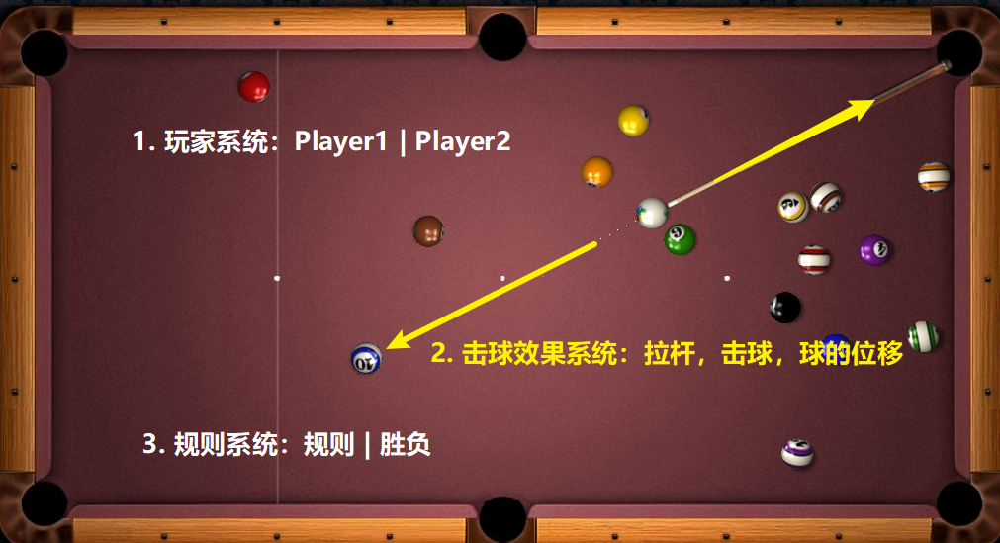

<!-- @import "[TOC]" {cmd="toc" depthFrom=1 depthTo=6 orderedList=false} -->

<!-- code_chunk_output -->

- [二 Java面向对象](#二-java面向对象)
  - [1. 类和对象](#1-类和对象)
    - [1.1 什么是面向过程？什么又是面向对象？](#11-什么是面向过程什么又是面向对象)
      - [1.1.1 能举个例子谈谈你对面向过程和面向对象的理解吗](#111-能举个例子谈谈你对面向过程和面向对象的理解吗)
      - [1.1.2 面向过程和面向对象的优缺点](#112-面向过程和面向对象的优缺点)
    - [1.2 说一说类、对象、成员变量和成员方法的关系和理解](#12-说一说类-对象-成员变量和成员方法的关系和理解)
    - [1.3 成员变量和局部变量有什么区别？](#13-成员变量和局部变量有什么区别)
      - [1.3.1 为什么局部变量存在于栈中而不是堆中](#131-为什么局部变量存在于栈中而不是堆中)
    - [1.4 访问权限修饰符 public、private、protected, 以及不写（默认）时的区别](#14-访问权限修饰符-public-private-protected-以及不写默认时的区别)
    - [1.5 类在初始化的时候做了些什么？](#15-类在初始化的时候做了些什么)
    - [1.6 static 关键字修饰的作用？](#16-static-关键字修饰的作用)
      - [1.6.1 什么是静态方法](#161-什么是静态方法)
      - [1.6.2 什么是静态变量](#162-什么是静态变量)
      - [1.6.3什么是 静态代码块](#163什么是-静态代码块)
  - [2. 面向对象三大特征](#2-面向对象三大特征)
    - [2.1 封装](#21-封装)
    - [2.2 继承](#22-继承)
    - [2.3 多态](#23-多态)
  - [3. 其他](#3-其他)
    - [3.3 抽象类和接口](#33-抽象类和接口)
      - [3.3.1 谈谈你对抽象类和接口的认识](#331-谈谈你对抽象类和接口的认识)
        - [运行结果：](#运行结果)
      - [3.3.2 抽象类和接口的区别（重要）](#332-抽象类和接口的区别重要)
    - [3.4 谈谈几种内部类和使用内部类的原因](#34-谈谈几种内部类和使用内部类的原因)
      - [3.4.1 几种内部类](#341-几种内部类)
      - [3.4.2 为什么使用内部类](#342-为什么使用内部类)

<!-- /code_chunk_output -->


# 二 Java面向对象

## 1. 类和对象

### 1.1 什么是面向过程？什么又是面向对象？

**面向过程——步骤化**

- 面向过程就是分析出实现需求所需要的步骤，通过函数（方法）一步一步实现这些步骤，接着依次调用即可

**面向对象——行为化**（概念相对抽象，可结合下面的例子理解）

- 面向对象是把整个需求按照特点、功能划分，将这些存在共性的部分封装成类（类实例化后才是对象），创建了对象不是为了完成某一个步骤，而是描述某个事物在解决问题的步骤中的行为

#### 1.1.1 能举个例子谈谈你对面向过程和面向对象的理解吗

例如我们设计一个桌球游戏（略过开球，只考虑中间过程）

**A：面向过程方式思考：**

把下述的步骤**通过函数一步一步实现**，这个需求就完成了。（只为演示概念，不细究逻辑问题）。

① palyer1 击球 —— ② 实现画面击球效果  —— ③ 判断是否进球及有效   —— ④ palyer2击球

⑤ 实现画面击球效果  —— ⑥ 判断是否进球及有效 —— ⑦ 返回步骤 1—— ⑧ 输出游戏结果

**B：面向对象方式思考：**

经过观察我们可以看到，其实在上面的流程中存在很多**共性**的地方，所以我们将这些共性部分全集中起来，做成一个**通用的结构**

1. **玩家系统**：包括 palyer1 和 palyer2

2. **击球效果系统**：负责展示给用户游戏时的画面

3. **规则系统**：判断是否犯规，输赢等

 <div align="center">
	
</div>

我们将繁琐的步骤，通过行为、功能，**模块化**，这就是面向对象，我们甚至可以利用该程序，分别快速实现8球和斯诺克的不同游戏（只需要修改规则、地图和球色即可，玩家系统，击球效果系统都是一致的）

#### 1.1.2 面向过程和面向对象的优缺点

 **A：面向过程**

**优点**：性能上它是优于面向对象的，因为类在调用的时候需要实例化，开销过大。

**缺点**：不易维护、复用、扩展

**用途**：单片机、嵌入式开发、Linux/Unix等对性能要求较高的地方

**B：面向对象**

**优点**：易维护、易复用、易扩展，由于面向对象有**封装**、**继承**、**多态性**的特性，可以设计出**低耦合**的系统，使系统更加灵活、更加易于维护

**缺点**：一般来说性能比面向过程低

> **低耦合**：简单的理解就是说，模块与模块之间尽可能的独立，两者之间的关系尽可能简单，尽量使其独立的完成成一些子功能，这避免了牵一发而动全身的问题。这一部分我们会在面向对象学习结束后进行系统的整理和总结。

> 总结：只通过教科书后的例题是无法体会到面向过程所存在的问题的，在一些小例程中，面向过程感觉反而会更加的简单，但是一旦面临较大的项目，我们需要编写N个功能相似的函数，函数越来越多，代码量越来越多，你就知道这是一场噩梦了。

说明：关于性能的问题，这里只是在笼统意义上来说，具体性能优劣，需要结合具体程序，环境等进行比对

### 1.2 说一说类、对象、成员变量和成员方法的关系和理解

**类**：一组相关的属性和行为的集合，是一个抽象的概念。

**对象**：该类事物的具体表现形式，具体存在的个体。

**成员变量**：事物的属性

**成员方法**：事物的行为

上面我们说了这几个概念，那么到底应该怎么理解呢？

类就是对一些具有**共性特征**，并且**行为相似**的个体的描述。

比如小李和老张都有姓名、年龄、身高、体重等一些**属性，**并且两人都能够进行聊天、运动等**相似的行为**。

由于这两个人具有这些共性的地方，所以我们把它抽象出来，定义为一个**类**——**人类**，而小李、老王正是这个类中的个体（对象），而每一个个体才是真正具体的存在，光提到人类，你只知道应该有哪些属性行为，但你不知道他具体的一些属性值，比如你知道他属于 “人类” 所以他应该拥有姓名，年龄等属性，但你并不知道他具体叫什么，年龄多大了。而小李和老王这两个具体的对象，却能够实实在在的知道老王今年30岁了、身高175等值。

**所以可以得出结果：类是对象的抽象，而对象是类的具体实例。类是抽象的，不占用内存，而真正根据类实例化出具体的对象，就需要占用内存空间了。**

### 1.3 成员变量和局部变量有什么区别？

**A：在类中的位置不同**

- 成员变量：类中方法外

- 局部变量：代码块，方法定义中或者方法声明上（方法参数）

**B：在内存中的位置不同**

- 成员变量：在堆中

- 局部变量：在栈中

**C：生命周期不同**

- 成员变量：随着对象的创建而存在，随着对象的消失而消失

- 局部变量：随着方法的调用而存在，随着方法的调用完毕而消失

**D：初始化值不同**

- 成员变量：有默认值（构造方法对它的值进行初始化）

- 局部变量：没有默认值，必须定义，赋值，然后才能使用

#### 1.3.1 为什么局部变量存在于栈中而不是堆中

有一个问题，在我们学习 Java 中内存分配的时候，有这样一句话，“堆内存用来存放 new 创建的对象和数组”。 换句话说对象存在于堆中，而成员变量又存在于类中，而且对象是类具体的个体，所以成员变量也存在于堆中，那么问题就来了，同理，是不是方法也和成员变量一样存在于对象中，而局部变量又定义在方法中，岂不就是说，局部变量也存在于堆中呢？这明显与我们上面的定义有区别

**解释**：一个类可以创建 n 个不同的对象，当我们 new 一个对象后，这个对象实体，已经在堆上分配了内存空间，由于**类的成员变量在不同的对象中各不相同**（例如，小李和老王的姓名不同），都需要自己各自的存储空间，所以类的成员变量会随着对象存储在堆中，而由于类的方法是所有对象通用的，所以创建对象时，方法还未出现，只有声明，方法里面的局部变量也并没有被创建，只有等到对象使用方法的时候才会被压入栈。

>  补充：类变量（静态变量）存在于方法区，引用类型的局部变量声明在栈，存储在堆

### 1.4 访问权限修饰符 public、private、protected, 以及不写（默认）时的区别

| 访问权限 | **类** | **包** | **子类** | 其他包 |
| -------- | ------ | ------ | -------- | ------ |
| public   | √      | √      | √        | √      |
| protect  | √      | √      | √        |        |
| default  | √      | √      |          |        |
| private  | √      |        |          |        |

- **public**：公共的，可以被项目中所有的类访问。
- **protected**：受保护的，可以被这个类本身访问；被同一个包中的类访问；被它的子类（同一个包以及不同包中的子类）访问。
- **default**：默认的，可以被这个类本身访问；被同一个包中的类访问。
- **private**：私有的，只能被这个类本身访问。

### 1.5 类在初始化的时候做了些什么？

```java
public class Student {
    private String name = "BWH_Steven";
    private Integer age = 22;
    
    // 是个无参构造，为了演示初始化顺序，特意加了两个赋值语句
    public Student (){ 
        name = "阿文";
        age = 30;
    }
}

public class Test {
    public static void main(String[] args) {
        Student stu = new Student(); 
    }
}
```

例如： `Student stu = new Student(); ` 其在内存中做了如下的事情：

首先加载 Student.class （编译成字节码文件）文件进内存，在栈内存为 stu 变量开辟一块空间，在堆内存为 Student 类实例化出的学生对象开辟空间，对学生对象的成员变量进行默认初始化（例如 name = null，age = 0 ），对学生对象的成员变量进行显示初始化（ 例如name = "BWH_Steven"，age = 22），接着就会通过构造方法对学生对象的成员变量赋值（执行构造函数内，我们特意加的赋值语句 name = "阿文"，age = 30）学生对象初始化完毕，把对象地址赋值给 stu 变量

### 1.6 static 关键字修饰的作用？

> static方法就是没有this的方法。在static方法内部不能调用非静态方法，反过来是可以的。而且可以在没有创建任何对象的前提下，仅仅通过类本身来调用static方法。这实际上正是static方法的主要用途。 ——　《Java编程思想》P86

可以知道，被 static 关键字修饰的方法或者变量不需要依赖于对象来进行访问，只要类被加载了，就可以通过类名去进行访问。也就是说，即使没有创建对象也可以进行调用（方法/变量）

static可以用来修饰类的成员方法、类的成员变量，另外可以编写static代码块来优化程序性能。

#### 1.6.1 什么是静态方法

static 修饰的方法一般叫做静态方法，静态方法不依赖于对象访问，因此没有 this 的概念（this 代表所在类的对象引用），正因如此静态方法能够访问的成员变量和成员方法也都必须是静态的

- 例如在静态方法 A 中 调用了非静态成员 B，如果通过 `类名.A` 访问静态方法 A，此时对象还不存在，非静态成员 B 自然也根本不存在，所以就会有问题。调用非静态方法 C 也是如此，你不清楚这个方法 C 中是否调用了费静态变量

#### 1.6.2 什么是静态变量

static 修饰的变量也称作静态变量，静态变量属于类，所以也称为类变量，存储于方法区中的静态区，随着类的加载而加载，消失而消失，可以通过类名调用，也可以通过对象调用。

#### 1.6.3什么是 静态代码块

静态代码块是在类中（方法中不行）使用static关键字和{} 声明的代码块

```java
static {
	... 内容
}
```

**执行：** 静态代码块在类被加载的时候就运行了，而且只运行一次，并且优先于各种代码块以及构造函数。

**作用：** 一般情况下，如果有些代码需要在项目启动的时候就执行，这时候 就需要静态代码块。比如一个项目启动需要加载的   很多配置文件等资源，我们就可以都放入静态代码块中。

**1.6.3.1 构造代码块（补充）**

**概念：**在java类中使用{}声明的代码块（和静态代码块的区别是少了static关键字）

**执行：** 构造代码块在创建对象时被调用，每次创建对象都会调用一次，但是优先于构造函数执行。

**作用：** 和构造函数的作用类似，都能对对象进行初始化，并且只创建一个对象，构造代码块都会执行一次。但是反过来，构造函数则不一定每个对象建立时都执行（多个构造函数情况下，建立对象时传入的参数不同则初始化使用对应的构造函数）。

因为每个构造方法执行前， 首先执行构造代码块，所以可以把多个构造方法中相同的代码可以放到这里，

## 2. 面向对象三大特征

### 2.1 封装

**封装的概念**

封装是指隐藏对象的属性和实现细节，仅对外提供公共访问方式

- 简单的来说就是我将不想给别人看的数据，以及别人无需知道的内部细节， “锁起来” ，我们只留下一些入口，使其与外部发生联系。

**我们如何给我们的数据 “上锁” 呢？**

- 我们使用，public、private、protected 等权限修饰符 在类的内部设定了边界，这些不同程度的 ”锁“ 决定了紧跟其后被定义的东西能够被谁使用。

**封装的好处**

隐藏实现细节，提供公共的访问方式，提高了代码的复用性，提高安全性

**好处1：隐藏实现细节，提供公共的访问方式**

**隐藏实现细节怎么理解呢？**

- 我们将一些功能封装到类中，而客户端的程序员，不需要知道类中的这个方法的逻辑原理，类程序员只需要给他一个对外的接口，客户端程序员只需要能够调用这个方法即可，

- 例如：夏天宿舍很热，我们（用户）只需要操作遥控器即可使用空调，并不需要了解空调内部是如何运行的

**提供公共的访问方式又怎么理解呢？**

我们先来看一段标准案例

```java
public class Student {
	//定义成私有成员变量（private）
    private String name;
    private int age;
	
    //无参构造
    public Student() {
        super();
    }

    //带参构造
    public Student(String name, int age) {
        super();
        this.name = name;
        this.age = age;
    }
	
    //成员变量的set和get方法（与外界联系的桥梁）
    public void setName(String name) {
        this.name = name;
    }

    public String getName() {
        return name;
    }

    public void setAge(int age) {
        this.age = age;
    }

    public int getAge() {
        return age;
    }
}
```

```java
public class StudentTest {
    public static void main(String[] args) {
        //创建学生类对象 s
        Student s = new Student()；
            
        //对象s调用类中的公共方法setName()和setAge()
        //set方法给成员变量赋值
        s.setName("BWH_Steven");
        s.setAge(20);
        
        //get方法获取成员变量
        System.out.println(s.getName() + s.getAge());
    }
}
```

我们可以看到在上面的案例中，成员变量都使用 private 修饰，而下面的 get 和 set 方法均使用了public修饰，其实被private修饰的属性就是我们想要**锁起来**的数据，而 set、get 方法就是我们打开这把锁的钥匙

被private所修饰的内容是，除**类型创建者和类型的内部方法之外的任何人都不能访问的元素**，所以我们这些数据就被我们通过private “锁” 了起来，而我们外界是可以通过创建对象来调用一个类中的公共方法的，所以被 public修饰的 set 和 get 方法外界所能访问的，而这两个方法又可以直接访问我们的私有成员变量，所以 set 和 get 方法就成为了私有成员与外界沟通的钥匙。

**好处2：提高了代码的复用性**

功能被封装成了类，通过基类与派生类之间的一些机制（组合和继承），来提高代码的复用性

**好处3：提高安全性（此处待修改）**

关于安全性的问题，实际上还是存在争议的，我们先看一种说法：

```java
public class Student {

    private String name;
    private int age;

    public Student() {
        super();
    }

    public Student(String name, int age) {
        super();
        this.name = name;
        this.age = age;
    }

    public void setName(String name) {
        this.name = name;
    }

    public String getName() {
        return name;
    }

    //在setAge()方法中加入了校验的内容
    //不合法数据是不允许传递给成员变量的
    public void setAge(int age) {
        if (age < 0 || age > 120) {
            System.out.println("Error");
        }else {
            this.age = age;
        }     
    }

    public int getAge() {
        return age;
    }
}

```

```java
public class StudentTest {
    public static void main(String[] args) {
        Student s = new Student();
        System.out.println(s.getName() + s.getAge());
        
        //错误的方式！！！
        s.name = "BWH_Steven";
        s.age = 20;
        System.out.println(s.getName() + s.getAge());
        
       	//正确的方式！！！
        s.setName("BWH_Steven");
        s.setAge(20);
    }
}

```

我们用private来修饰我们的成员变量不是没有任何依据的，如果我们的成员变量修饰符改为public，这句意味着外界可以使用对象直接访问，修改这个成员变量，这可能会造成一些重大的问题

例如：外界通过对象去给成员变量赋值，可以赋值一些非法的数据，这明显是不合理的。所以在赋值之前应该先对数据进行判断。StudenTest 是一个测试类，测试类一般只创建对象，调用方法，所以这个判断应该定义在Student类中。需要使用逻辑语句，而逻辑语句应该定义在方法中。所以在Student类中提供一个方法来对数据进行校验但是如果偏偏不调用方法来赋值，还是通过 `对象名.变量` 直接赋值，这样我们的方法内的逻辑就没有起作用所以我们必须强制要求使用我的方法，而不能直接调用成员变量这也正是我们使用 private 修饰成员变量的原因！

注：此处举例为 JavaBean 类，一般很少在 set get 中去添加一些逻辑，一般都是一种简单的赋值，而且诸多框架和不错的项目均使用了这种规范方法。 

### 2.2 继承 

继承就是在一个已有类的基础上派生出新类（例如动物类可以派生出狗类和猫类），子类继承父类的特征和行为，使得子类对象（实例）具有父类的实例域和方法，或子类从父类继承方法，使得子类具有父类相同的行为

提高了代码的复用性，提高了代码的维护性（通过少量的修改，满足不断变化的具体要求），让类与类产生了一个关系，是多态的前提。但是缺点也很显著：让类的耦合性增强，这样某个类的改变就会影响其他和该类相关的类。

特点：Java只支持单继承，不支持多继承(C++支持)，但是Java支持多层继承（继承体系）形象的说就是：儿子继承爸爸，爸爸继承爷爷，儿子可以通过爸爸继承爷爷。

> **注意：**
>
> A: 子类只能继承父类所有非私有成员（成员方法和成员变量）
>
> B：子类不能继承父类的构造方法，但是可以通过super关键字去访问方法
>
> C: 不要为了部分功能而继承（多层继承会使得子类继承多余的方法）

### 2.3 多态

多态是同一个行为具有多个不同表现形式或形态的能力，例如：黑白打印机和彩色打印机相同的打印行为却有着不同的打印效果，

- 对象类型和引用类型之间存在着继承（类）/ 实现（接口）的关系；

- 当使用多态方式调用方法时，首先检查父类中是否有该方法，如果没有，则编译错误；如果有，再去调用子类的同名方法。
- 如果子类重写了父类的方法，最终执行的是子类覆盖的方法，如果没有则执行的是父类的方法。


## 3. 其他

### 3.3 抽象类和接口

#### 3.3.1 谈谈你对抽象类和接口的认识

**抽象类**：我们创建一个动物类，并且在这个类中创建动物对象，但是当你提到动物类，你并不知道我说的是什么动物，只有看到了具体的动物，你才知道这是什么动物，所以说动物本身并不是一个具体的事物，而是一个抽象的事物。只有真正的猫，狗才是具体的动物，同理我们也可以推理不同的动物，他们的行为习惯应该是不一样的，所以我们不应该在动物类中给出具体体现，而是给出一个声明即可。

**接口**：常见的猫狗案例，猫和狗它们仅仅提供一些基本功能。但有一些不是动物本身就具备的，比如：猫钻火圈，狗跳高等功能是在后面的培养中训练出来的，这种额外的功能，java提供了接口表示。

**3.3.1.1 为什么抽象类必须重写所有抽象方法**

“猫”和“狗”都是“动物”这个类的实体，比如动物都有eat() 这个方法，但是狗是吃肉的，猫是吃鱼的。所以每个动物关于具体吃的方式是需要在子类中重写的，不然的话，狗和猫不就一样了吗？

```java
// Animal类

public abstract class Animal {

    public void sleep() {
        System.out.println("我趴着睡");
    }
    public abstract void eat(); 
}
```

```java
// Dog类
public class Dog extends Animal {

    public Dog() {
        super();
    }
    
    @Override
    public void eat() {
        System.out.println("我实现了父类方法，狗吃肉");
    }
}
```

```java
// Cat类
public class Cat extends Animal{
    public Cat() {
        super();
    }

    @Override
    public void eat() {
        System.out.println("我实现了父类方法，猫吃鱼");
    }
}
```

```java
// 测试类
public class AnimalTest {
    public static void main(String[] args) {
        Animal a1 = new Dog();
        a1.sleep();
        a1.eat();
        System.out.println("-------------------------");
        Animal a2 = new Cat();
        a2.sleep();
        a2.eat();
    }
}
```

##### 运行结果：

```
我趴着睡
我实现了父类方法，狗吃肉
-------------------------
我趴着睡
我实现了父类方法，猫吃鱼
```

通过上面的例子我们可以看到，Dog 和 Cat 两个子类继承 Animal，两者 sleep() 方法是一样的均继承于 Animal 类，而 eat() 方法由于特性不同则在 Animal 类中定义为抽象方法，分别在子类中实现。

#### 3.3.2 抽象类和接口的区别（重要）

我们从我们实际设计场景中来切入这个话题

先来举一个简单的例子：

狗都具有 eat() 、sleep() 方法，我们分别通过抽象类和接口定义这个抽象概念

```java
// 通过抽象类定义
public abstract class Dog {
	public abstract void eat();
	public abstract void sleep();  
}
```

```java
// 通过接口定义
public interface Dog {
    public abstract void eat();
    public abstract void sleep();
}
```

但是我们现在如果需要让狗拥有一项特殊的技能——钻火圈 DrillFireCircle()，如何增加这个行为呢？

思考：

1. 将钻火圈方法与前面两个方法一同写入抽象类中，但是这样的话，但凡继承这个抽象类狗都具有了钻火圈技能，明显不合适

2. 将钻火圈方法与前面两个方法一同写入接口中，当需要使用钻火圈功能的时候，就必须实现 接口中的eat() 、sleep() 方法（重写该接口中所有的方法）显然也不合适

     

那么该如何解决呢 ? 我们可以仔细想一想，eat和sleep都是狗本身所应该具有的一种行为，而钻火圈这种行为则是后天训练出来的，只能算是对狗类的一种附加或者延伸， 两者不应该在同一个范畴内，所以我们考虑将这个单独的行为，独立的设计一个接口，其中包含DrillFireCircle()方法， Dog设计为一个抽象类， 其中又包括eat() 、sleep() 方法。

一个SpecialDog即可继承Dog类并且实现DrillFireCircle()接口

下面给出代码:

```java
// 定义接口，含有钻火圈方法
public interface DrillFireCircle() {
    public abstract void drillFireCircle();
}

// 定义抽象类狗类
public abstract class Dog {
    public abstract void eat();
    public abstract void sleep();
}
 
// 继承抽象类且实现接口
class SpecialDog extends Dog implements drillFireCircle {
    public void eat() {
      // ....
    }
    public void sleep() {
      // ....
    }
    public void drillFireCircle() () {
      // ....
    }
}
```

**总结**：继承是一个 "是不是"的关系，而 接口 实现则是 "有没有"的关系。如果一个类继承了某个抽象类，则子类必定是抽象类的种类，而接口实现则是有没有、具备不具备的关系，比如狗是否能钻火圈，能则可以实现这个接口，不能就不实现这个接口。 


### 3.4 谈谈几种内部类和使用内部类的原因

#### 3.4.1 几种内部类

**概述**：把类定义在另一个类的内部，该类就被称为内部类。

**举例**：把类 Inner 定义在类 Outer 中，类 Inner 就被称为内部类。

```java
class Outer {
    class Inner {
    }
}
```

**访问规则**：内部类可以直接访问外部类的成员，包括私有。外部类要想访问内部类成员，必须创建对象

**内部类的分类**：A：成员内部类、B：局部内部类、C：静态内部类、D：匿名内部类

**3.4.1.1 成员内部类**

>成员内部类——就是位于外部类成员位置的类
>
>特点：可以使用外部类中所有的成员变量和成员方法（包括private的）

A：**格式**：

```java
class Outer {
    private int age = 20;
    // 成员位置
    class Inner {
        public void show() {
            System.out.println(age);
        }
    }
}

class Test {
    public static void main(String[] ages) {
        // 成员内部类是非静态的演示
        Outer.Inner oi = new Outer().new Inner();
        oi.show();
    }
}
```

B：**创建对象时：**

```java
// 成员内部类不是静态的：
外部类名.内部类名 对象名 = new 外部类名.new 内部类名();

// 成员内部类是静态的：
外部类名.内部类名 对象名 = new 外部类名.内部类名();	
```

C：**成员内部类常见修饰符：**

**a：private**

如果我们的内部类不想轻易被任何人访问，可以选择使用private修饰内部类，这样我们就无法通过创建对象的方法来访问，想要访问只需要在外部类中定义一个public修饰的方法，间接调用。这样做的好处就是，我们可以在这个public 方法中增加一些判断语句，起到数据安全的作用。

```java
class Outer {
    private class Inner {
        public void show() {
            System.out.println(“密码备份文件”);
        }
    }
    
    public void method() {
    	if(你是管理员){
    		Inner i = new Inner();
    		i.show();
    	}else {
    		System.out.println(“你没有权限访问”);
    	}
   	}
}
```

下面我们给出一个更加规范的写法

```java
class Outer {
    private class Inner {
        public void show() {
            System.out.println(“密码备份文件”);
        }
    }
    // 使用getXxx()获取成员内部类，可以增加校验语句（文中省略）
    public Inner getInner() {
		return new Inner();
   	}
    
    public static void main(String[] args) {
    	Outer outer = new Outer();
        Outer.Inner inner = outer.getInner();
        inner.show();
    }
}
```

**b：static**

这种被 static 所修饰的内部类，按位置分，属于成员内部类，但也可以称作静态内部类，也常叫做嵌套内部类。具体内容我们在下面详细讲解。

**D：成员内部类经典题(填空)**

请在三个println 后括号中填空使得输出25,20,18

```java
class Outer {
	public int age = 18;	
	class Inner {
		public int age = 20;	
		public viod showAge() {
			int age  = 25;
			System.out.println(age);//空1
			System.out.println(this.age);//空2
			System.out.println(Outer.this.age);//空3
		}
	}
} 
```

**3.4.1.2 局部内部类**

> 局部内部类 —— 就是定义在一个方法或者一个作用域里面的类
>
> 特点：主要是作用域发生了变化，只能在自身所在方法和属性中被使用

**A 格式：**

```java
class Outer {
    public void method(){
        class Inner {
        }
    }
}
```

**B：访问时：**

```java
// 在局部位置，可以创建内部类对象，通过对象调用和内部类方法
class Outer {
    private int age = 20;
    public void method() {
        final int age2 = 30;
        class Inner {
            public void show() {
           	    System.out.println(age);
                // 从内部类中访问方法内变量age2，需要将变量声明为最终类型。
                System.out.println(age2);
            }
        }
        
        Inner i = new Inner();
        i.show();
    }
}
```

**C: 为什么局部内部类访问局部变量必须加final修饰呢？**

因为局部变量是随着方法的调用而调用，使用完毕就消失，而堆内存的数据并不会立即消失。

所以，堆内存还是用该变量，而该变量已经没有了。为了让该值还存在，就加final修饰。

原因是，当我们使用final修饰变量后，堆内存直接存储的是值，而不是变量名。

（即上例 age2 的位置存储着常量30 而不是 age2 这个变量名）

**3.4.1.3 静态内部类**

> 我们所知道 static 是不能用来修饰类的，但是成员内部类可以看做外部类中的一个成员，所以可以用 static 修饰，这种用 static 修饰的内部类我们称作静态内部类，也称作嵌套内部类。
>
> 特点：不能使用外部类的非static成员变量和成员方法

**解释**：非静态内部类编译后会默认的保存一个指向外部类的引用，而静态类却没有。

**简单理解**：即使没有外部类对象，也可以创建静态内部类对象，而外部类的非static成员必须依赖于对象的调用，静态成员则可以直接使用类调用，不必依赖于外部类的对象，所以静态内部类只能访问静态的外部属性和方法。

```java
class Outter {
    int age = 10;
    static age2 = 20;
    public Outter() {        
    }
     
    static class Inner {
        public method() {
            System.out.println(age);//错误
            System.out.println(age2);//正确
        }
    }
}

public class Test {
    public static void main(String[] args)  {
        Outter.Inner inner = new Outter.Inner();
        inner.method();
    }
}
```

**3.4.1.4 匿名内部类**

> 一个没有名字的类，是内部类的简化写法

**A 格式：**

````java
new 类名或者接口名() {
    重写方法();
}
````

本质：其实是继承该类或者实现接口的子类匿名对象

这也就是下例中，可以直接使用 `new Inner() {}.show();` 的原因等于 `子类对象.show();`

```java
interface Inter {
	public abstract void show();
}

class Outer {
    public void method(){
        new Inner() {
            public void show() {
                System.out.println("HelloWorld");
            }
        }.show();
    }
}

class Test {
	public static void main(String[] args)  {
    	Outer o = new Outer();
        o.method();
    }
}    
```

如果匿名内部类中有多个方法又该如何调用呢？

```java
Inter i = new Inner() {  //多态，因为new Inner(){}代表的是接口的子类对象
	public void show() {
		System.out.println("HelloWorld");
	}
};
```

**B：匿名内部类在开发中的使用**

我们在开发的时候，会看到抽象类，或者接口作为参数。

而这个时候，实际需要的是一个子类对象。

如果该方法仅仅调用一次，我们就可以使用匿名内部类的格式简化。

#### 3.4.2 为什么使用内部类

**3.4.2.1 封装性**

作为一个类的编写者，我们很显然需要对这个类的使用访问者的访问权限做出一定的限制，我们需要将一些我们不愿意让别人看到的操作隐藏起来，

如果我们的内部类不想轻易被任何人访问，可以选择使用private修饰内部类，这样我们就无法通过创建对象的方法来访问，想要访问只需要在外部类中定义一个public修饰的方法，间接调用。

```java
public interface Demo {
    void show();
}
```

```java
class Outer {
    private class test implements Demo {
        public void show() {
            System.out.println("密码备份文件");
        }
    }
    
    public Demo getInner() {
        return new test();
    }
    
}
```

我们来看其测试

```java
    public static void main(String[] args) {
    	Outer outer = new Outer();
        Demo d = outer.getInner();
        i.show();
    }

//运行结果
密码备份文件
```

这样做的好处之一就是，我们可以在这个public方法中增加一些判断语句，起到数据安全的作用。

其次呢，我们的对外可见的只是 getInner() 这个方法，它返回了一个Demo接口的一个实例，而我们真正的内部类的名称就被隐藏起来了

**3.4.2.1 实现多继承**

我们之前的学习知道，java是不可以实现多继承的，一次只能继承一个类，我们学习接口的时候，有提到可以用接口来实现多继承的效果，即一个接口有多个实现，但是这里也是有一点弊端的，那就是，一旦实现一个接口就必须实现里面的所有方法，有时候就会出现一些累赘，但是使用内部类可以很好的解决这些问题

```java
public class Demo1 {
    public String name() {
        return "BWH_Steven";
    }
}
```

```java
public class Demo2 {
    public String email() {
        return "xxx.@163.com";
    }
}
```

```java
public class MyDemo {

    private class test1 extends Demo1 {
        public String name() {
            return super.name();
        }
    }

    private class test2 extends Demo2  {
        public String email() {
            return super.email();
        }
    }

    public String name() {
        return new test1().name();
    }

    public String email() {
        return new test2().email();
    }

    public static void main(String args[]) {
        MyDemo md = new MyDemo();
        System.out.println("我的姓名:" + md.name());
        System.out.println("我的邮箱:" + md.email());
    }
}
```

我们编写了两个待继承的类 Demo1 和 Demo2，在 MyDemo类中书写了两个内部类，test1 和test2 两者分别继承了Demo1 和 Demo2 类，这样 MyDemo 中就间接的实现了多继承

**3.4.2.3 用匿名内部类实现回调功能**

我们用通俗讲解就是说在Java中，通常就是编写一个接口，然后你来实现这个接口，然后把这个接口的一个对象作以参数的形式传到另一个程序方法中， 然后通过接口调用你的方法，匿名内部类就可以很好的展现了这一种回调功能

```java
public interface Demo {
    void demoMethod();
}
```

```java
public class MyDemo{
    public test(Demo demo){
    	System.out.println("test method");
    }
    
    public static void main(String[] args) {
        MyDemo md = new MyDemo();
        //这里我们使用匿名内部类的方式将接口对象作为参数传递到test方法中去了
        md.test(new Demo){
            public void demoMethod(){
                System.out.println("具体实现接口")
            }
        }
    }
}
```

**3.4.2.4 解决继承及实现接口出现同名方法的问题**

```java
public interface Demo {
    void test();
}
```

```java
public class MyDemo {

    public void test() {
        System.out.println("父类的test方法");
    }
    
}
```

```javA
public class DemoTest extends MyDemo implements Demo {
    public void test() {
    }
}
```

这样的话我就有点懵了，这样如何区分这个方法是接口的还是继承的，所以我们使用内部类解决这个问题

```java
public class DemoTest extends MyDemo {

    private class inner implements Demo {
        public void test() {
            System.out.println("接口的test方法");
        }
    }
    
    public Demo getIn() {
        return new inner();
    }
    
    
    public static void main(String[] args) {
        //调用接口而来的test()方法
        DemoTest dt = new DemoTest();
        Demo d = dt.getIn();
        d.test();
        
        //调用继承而来的test()方法
        dt.test();
    }
}

//运行结果
接口的test方法
父类的test方法
```


