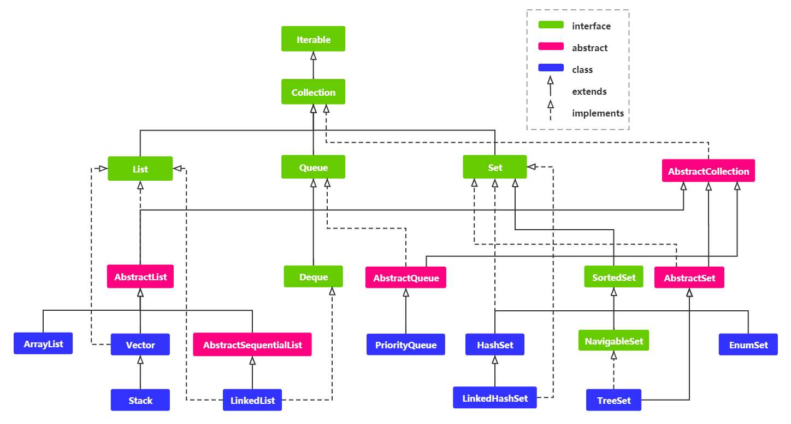
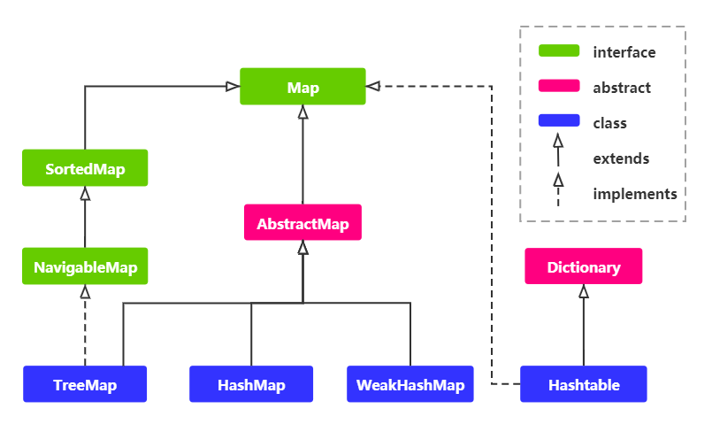

# 四 集合框架

## 1. Java 集合框架概述

### 1.1 什么是集合框架

> **如果一个程序只包含固定数量的且其生命周期都是已知的对象，那么这是一个非常简单的程序。**
>
> 通常，程序总是根据运行时才知道的某些条件去创建新对象。在此之前，不会知道你所需要对象的数量，甚至不知道确切的类型。为了解决这个普遍的编程问题，需要在任意时刻和任意位置创建任意数量的对象。所以，就不能依靠创建命名的引用来持有每一个对象，因为你不知道实际上会需要多少这样的引用 ——Thinking in Java
>

首先知道我们所学习的Java语言是一个完全**面向对象**的语言，而这种语言对事物的描述是通过对象体现的，为了方便**对多个对象进行操**作，我们就必须把这多个**对象进行存储**。

一个基本类型的变量显然是无法满足存储多个对象的，所以应该是一个**容器类型**的变量，通过前面的知识，我们知道数组和 StringBuffer、StringBuilder 均属于容器类型。但是呢? StringBuffer 的结果是一个字符串，不一定满足我们的要求，所以我们只能选择数组，这就是对象数组。

可是问题又来了，**对象数组**又不能适应变化的需求，因为数组的**长度是固定的**，而且他不能根据我们的操作（增删改查）选择最好的策略，这个时候，为了适应变化的需求，Java就提供了**集合类**供我们使用。

#### 1.1.1 数组和集合的区别?

首先数组的**长度固定**，而集合的**长度可变**，其次数组存储的是**同一种类型**的元素，而集合可以存储**不同类型**的元素，最后数组可以**存储基本数据类型**，也可以**存储引用数据类型**

> 虽然数组看起来有一丝不太灵活，但数组也确实是保存一组对象的有效方法，如果想要保存一组基本数据类型，我们也推荐使用这种方法，只是由于其长度固定，导致它在很多时候也受到一些限制。

**1.1.1.1 集合的弹性空间分配需要开销**

> 在Java中，数组是一种效率最高的存储和随机访问对象的引用序列的方式。数组就是一个简单的线性序列，这使得元素访问非常快速。但是为这种速度所付出的代价是数组对象的大小被固定，并且在其生命周期中不可改变。你可能会建议使用 ArrayList，它可以通过创建一个新实例，然后把旧实例中所有的引用到移到新实例中，从而实现更多空间的自动分配。尽管通常应该首选 ArrayList 而不是数组、但是这种弹性需要开销，因此，ArrayList 的效率比数组低很多。——Thinking in Java 第16章

### 1.2 集合框架体系结构

基本常见的集合框架就是下图所示，还有一些特殊的没写出来，例如 ConcurrentHashMap 等等


<div align="center">
	
</div>

简单看一下其体系结构

**Collection**

<div align="center">
	
</div>

**Map**

<div align="center">
	
</div>
### 1.3 请说明Java集合类框架的基本接口有哪些？

首先集合类操作的对象，我们称为元素，而集合类接口的每一种具体的实现类都可以选择以它自己的方式对元素进行保存和排序。有的集合类允许重复的键，有的则不允许。

Java集合类里面最基本的接口有：

- **Collection**：代表一组对象，每一个对象都是它的子元素。
- **List**：有顺序的 collection，并且可以包含重复元素（顺序）。
- **Set**：不保证有序，同时不包含重复元素的Collection（唯一）。
- **Map**：可以把 键(key) 映射到 值(value) 的对象，键不能重复（键值对）。

### 1.4 说一说 Java 常见集合的数据结构以及其特点

#### 1.4.1 List

- `ArrayList`：Object 数组（查询快，增删慢，线程不安全，效率高 ）
- `Vector`： Object数组（查询快，增删慢，线程安全，效率低 ）
- `LinkedList`： 双向链表，JDK1.6 之前是循环链表，JDK1.7 取消了循环（查询慢，增删快，线程不安全，效率高 ）

#### 1.4.2 Map

- `HashMap`： JDK1.8 之前 HashMap 由数组+链表组成的，数组是 HashMap 存储元素的主体，链表则是主要为了解决哈希冲突而存在的，即 “拉链法” 解决冲突。JDK1.8 以后在解决哈希冲突时有了较大的变化，当链表长度大于阈值（默认为8）时，将链表转化为红黑树，以减少搜索时间（哈希表对键进行散列，Map结构即映射表存放键值对）
- `LinkedHashMap`： LinkedHashMap 继承自 HashMap，所以它的底层仍然是基于拉链式散列结构即由数组和链表或红黑树组成。另外，LinkedHashMap 在上面结构的基础上，增加了一条双向链表，使得键值对的插入顺序以及访问顺序等逻辑可以得以实现。
- `Hashtable`： 数组 + 链表组成的，数组是 HashMap 的主体，链表则是主要为了解决哈希冲突而存在的
- `TreeMap`： 红黑树（平衡二叉排序树）

#### 1.4.3 Set

- `HashSet`: 基于 HashMap 实现的，底层采用 HashMap 来保存元素（不保证有序，唯一）
- `LinkedHashSet`： LinkedHashSet 继承与 HashSet，并且其内部是通过 LinkedHashMap 来实现的。有点类似于我们之前说的LinkedHashMap 其内部是基于 Hashmap 实现一样，不过还是有一点点区别的。
- `TreeSet`： 红黑树，自平衡的排序二叉树（可实现自然排序，例如 a-z）

### 1.5 Collection和Collections的区别

- Collection是集合的上级接口，继承它的有 Set 和 List 接口
- Collections是集合的工具类，提供了一系列的静态方法对集合的搜索、查找、同步等操作

### 1.6 请简单说明一下什么是迭代器？

Iterator 提供了遍历及操作集合元素的接口，而 Collection接口实现 Iterable 接口，也就是说，每个集合都通过实现Iterable 接口中 iterator() 方法返回 Iterator 接口的实例，然后对集合的元素进行迭代操作。

有一点需要注意的是：在迭代元素的时候不能通过集合的方法删除元素, 否则会抛出ConcurrentModificationException 异常. 但是可以通过 Iterator接口中的 remove() 方法进行删除，同理想要增加元素，就可以使用 ListIterator 的 add 方法 （ListIterator 拥有 add、set、remove 方法，Iterator 拥有 remove 方法）

### 1.7 请你说说Iterator和ListIterator的区别？

Iterator 可用来遍历 Set 和 List 集合，但是 ListIterator 只能用来遍历List。

- Iterator只能 `remove()` 元素，而ListIterator可以 `add()`、`set()`、`remove()`
- Iterator只能使用 `next()` 顺序的向后遍历，ListIterator则向前 `previous()`和向后 `next()` 遍历都可以
  - 还有一个额外的功能，ListIterator可以使用 `nextIndex()` 和` previousIndex()` 取得当前游标位置的前后index位置，Iterator没有此功能

可参考：[Java - Iterator和ListIterator](https://blog.csdn.net/weixin_40341116/article/details/84844903)

## 2. List 接口

### 2.1 阐述 ArrayList 分别与 Vector、LinkedList 的异同点

#### 2.1.1 ArrayList 与 Vector

ArrayList 是现在 List 的一种主要实现类，而 Vector 已经是过时的 Java 遗留容器

- 同：两者都是使用 Object 数组方式存储数据，均可以实现扩容且允许直接按序号查询（索引）元素，但是插入元素要涉及数组元素移动等内存操作，所以两者**查询数据快而插入数据慢**

- 异：Vector中的方法由于添加了 synchronized 修饰，因此 Vector 是线程安全的容器，但性能上较 ArrayList 差

#### 2.1.2 ArrayList 与 LinkedList

- **数据结构**：ArrayList 是 Object 数组，LinkedList 是双向链表（JDK1.6 之前是循环链表，JDK1.7 取消了循环）

  - **查询效率**：ArrayList 支持高效的随机元素访问，即通过下标快速获取元素对象。而 LinkedList 不支持，所以 ArrayList  的查询效率更高

  - **增删效率**：ArrayList 底层是数组存储，所以插入和删除元素的时间复杂度与元素插入的位置有关，因为会涉及到元素的移动问题，例如追加在末尾，则时间复杂度为 `O(1)` ，若在首部插入，则时间复杂度为 `O(n)`，中间任意位置插入，时间复杂度为，为 `O((n - 1) / 2)` ，平均时间复杂度还是 `O(n)` 而  LinkedList采用的是链表存储，所以增删不会涉及到元素的移动，只需要修改指针即可，时间复杂度可以简单看为  `O(1)`，但是要是在指定位置增删元素的话，需要先移动到指定位置再插入，以这个角度看时间复杂度为 `O(n)`

- **线程安全**：ArrayList 和 LinkedListed 都是非线程安全的，如果遇到多个线程操作同一个容器的场景，则可以通过工具类 Collections 中的 synchronizedList 方法将其转换成线程安全的容器后再使用（这是对装潢模式的应用，将已有对象传入另一个类的构造器中创建新的对象来增强实现）。
- **内存消耗**：LinkedListed 每一个元素都需要存放前驱和后继节点的地址，所以每一个元素都更加消耗空间，而 ArrayList  只要是在结尾会预留一定的容量空间，这是扩容所导致的不能充分填满数组的情况（除非使用方法瘦身）

### 2.2 ArrayLsit 扩容机制和并发修改异常（请跳转）

在 [001-ArrayList源码分析（含扩容机制等重点问题分析）](collection/001-ArrayList源码分析（含扩容机制等重点问题分析）.md) 文章中，我做过详细的分析，篇幅过长，可跳转阅读。

### 2.3 ArrayList集合加入指定大量数据，应该怎么提高效率

ArrayList的默认初始容量为10，要插入大量数据的时候需要不断扩容，而扩容是非常影响性能的，在已知数据量的情况下，可以直接在初始化的时候就设置ArrayList的容量，以提高效率。

## 3. Set 接口

### 3.1 Set 无序性是怎么理解的

无序性是指存储的数据在底层数组中并非按照数组索引的顺序添加 ，而是根据数据的哈希值决定的。

具体分析可参考我在知乎的回答：[Java遍历HashSet为什么输出是有序的？@BWH_Steven 的答案](https://www.zhihu.com/question/28414001/answer/740571085)

这个问题非常值得深入分析，对于 Set 和 Map 源码的理解很有帮助！！！

### 3.2 1.4.4. HashSet 如何检查重复

当你把对象加入 HashSet时，HashSet 会先计算对象的 hashcode值来判断对象加入的位置，同时也会与其他加入的对象的  hashcode 值作比较，如果没有相符的  hashcode ，HashSet 会假设对象没有重复出现。但是如果发现有相同 hashcode 值的对象，这时会调用 equals() 方法来检查  hashcode 相等的对象是否真的相同。如果两者相同，HashSet 就不会让加入操作成功。—— 《Head fist java》第二版

## 4. Map 接口

### 4.1 HashMap 与 HashTable 、HashSet、HashMap 等的区别

#### 4.1.1 HashMap 与 HashTable

- **数据结构**：HashMap JDK1.8 以后在解决哈希冲突时有了较大的变化，当链表长度大于阈值（默认为8）时，将链表转化为红黑树，以减少搜索时间，不过在转为红黑树前会判断，如果数组长度小于 64，还是会优先进行数组扩容（哈希表对键进行散列，Map结构即映射表存放键值对），而 HashTable 没有这种特殊的机构。

- **线程安全**：HashMap 是非线程安全的，而 HashTable 属于线程安全的（方法添加了 synchronized 修饰 ），因此，HashMap 效率也会略高，通常认为，HashTable 类似 Vector 是一个Java遗留类，基本不做使用。想保证线程安全，可以考虑使用 ConcurrentHashMap。
- **Null 的处理**：HashMap 的键和值都可以存储为 null 的类型，但是只能有一个 null 类型的键，但是 null 类型的值可以有多个。HashTable 的键和值都不允许有 null 类型出现，否则会抛出空指针异常。
- **扩容机制**：不指定初始值的时候，HashMap 初始值为 16，之后每次扩容，容量会成为原先的两倍，HashTable 初始值为 11，扩容会使得容量成为原先的 2n + 1。若指定了初始值，HashMap 会将其扩充为 2 的幂次方大小，而 HashTable 会直接使用你给的初始值。

#### 4.1.2 HashMap 与 HashSet

- HashMap 实现了 Map 接口，HashSet实现了 Set 接口。

- HashMap 储存键值对，HashSet仅仅存储对象。

- 使用 put() 方法将元素放入 map 中 使用 add() 方法将元素放入 set 中，但 add() 方法实际调用的还是 HashMap 中的 put() 方法。

- HashMap 中使用键对象来计算 hashcode 值 HashSet 使用成员对象来计算 hashcode 值，对于两个对象来说hashcode 可能相同，所以 equals() 方法用来判断对象的相等性，如果两个对象不同的话，那么返回 false。
- HashMap 比较快，因为是使用唯一的键来获取对象，HashSet 较 HashMap 来说比较慢。

#### 4.1.3 HashMap 与 TreeMap

- **顺序问题**：HashMap 中的元素是没有顺序的，TreeMap 中所有的元素都是有某一固定顺序的。

- **线程安全**：HashMap 和 TreeMap 都不是线程安全的

- **继承问题**：HashMap 继承 AbstractMap 类；覆盖了 hashcode() 和 equals() 方法，以确保两个相等的映射返回相同的哈希值。TreeMap 继承 SortedMap 类，保持键的有序顺序。

- **调优问题**：HashMap 基于哈希表实现的，使用HashMap要求添加的键类明确定义了 hashcode() 和 equals() （可以重写该方法）；为了优化HashMap的空间使用，可以调优初始容量和负载因子。而 TreeMap 基于红黑树实现，所以TreeMap 就没有调优选项，因为红黑树总是处于平衡的状态。

- **适用场景：**HashMap 适用于 Map 插入，删除，定位元素，TreeMap适用于按自然顺序或自定义顺序遍历键（key）。

### 4.2 HashMap 的长度为什么是 2 的幂次方

HashSet因为底层使用**哈希表（链表结合数组）**实现，存储时key通过一些运算后得出自己在数组中所处的位置。我们在hashCoe方法中返回到了一个等同于本身值的散列值，但是考虑到int类型数据的范围：-2147483648~2147483647 ，着很显然，这些散列值不能直接使用，因为内存是没有办法放得下，一个40亿长度的数组的。所以它使用了对数组长度进行**取模运算**，得余后再作为其数组下标，**indexFor( )** ——JDK7中，就这样出现了，在JDK8中 indexFor()就消失了，而全部使用下面的语句代替，原理是一样的。

```java
// JDK8中
(tab.length - 1) & hash；
```

```java
// JDK7中
bucketIndex = indexFor(hash, table.length);

static int indexFor(int h, int length) {
    return h & (length - 1);
}
```

可以看到其本质计算方法都是 `(length - 1) & hash` 提一句，为什么取模运算时我们用 & 而不用 % 呢，因为位运算直接对内存数据进行操作，不需要转成十进制，因此处理速度非常快，这样就导致位运算 & 效率要比取模运算 % 高很多。

最关键的内容来了，如果我们用更容易理解的取余（%），` length % hash == (length - 1) & hash` 这个公式想要成立的前提，就必须满足 **length 是 2 的 n 次方**

简单的说：HashMap 的长度为什么是 2 的幂次方的原因就是，我们为了使用更加高效的 & 运算而不是 % 运算，但又为了保证运算的结果，仍然是取余操作。

### 4.3 hash() 中的扰动函数如何解决Hash冲突 ※

[003-HashMap源码分析（含散列表和红黑树介绍）](collection/003-HashMap源码分析（含散列表和红黑树介绍）.md) 

其中【 3.1 hash() 中的扰动函数如何解决Hash冲突 ※ 】详细叙述了扰动函数的执行流程和作用，请跳转查阅。

### 4.4 简单谈谈 HashMap 中的底层原理

#### 4.4.1 JDK 1.8 之前

JDK1.8 之前 `HashMap` 底层是数组 + 链表，HashMap 会使用 hashCode 以及扰动函数处理 key ，然后获取一个hash 值，然后通过 (length- 1) & hash 判断当前元素应该存放的位置，如果这个位置存在元素的话，就判断该元素与要存入的元素的 hash 值以及 key 是否相同，如果相同的话，直接覆盖，不相同就通过拉链法解决冲突。

> 扰动函数在 4.3 中讲述的应该很清楚了
>
> 拉链法的解释，同样可以参考 [003-HashMap源码分析（含散列表和红黑树介绍）](collection/003-HashMap源码分析（含散列表和红黑树介绍）.md) 

#### 4.4.2 JDK 1.8

JDK 8 做了一些较大的调整，当数组中每个格子里的链表，长度大于阈值（默认为8）时，将链表转化为红黑树，就可以大大的减少搜索时间，不过在转为红黑树前会判断，如果数组长度小于 64，还是会优先进行数组扩容。

### 4.5 HashMap 中加载因子的理解

- 加载因子就是表示哈希表中元素填满的程度，当表中元素过多，超过加载因子的值时，哈希表会自动扩容，一般是一倍，这种行为可以称作rehashing（再哈希）。
- 加载因子的值设置的越大，添加的元素就会越多，确实空间利用率的到了很大的提升，但是毫无疑问，就面临着哈希冲突的可能性增大，反之，空间利用率造成了浪费，但哈希冲突也减少了，所以我们希望在空间利用率与哈希冲突之间找到一种我们所能接受的平衡，经过一些试验，定在了0.75f。

### 4.6 ConcurrentHashMap 和 Hashtable 的区别

HashTable 虽然也满足线程安全，但是类似 Vector， 是一个Java遗留类，基本不做使用。想保证线程安全，可以考虑使用 ConcurrentHashMap。

**数据结构**：JDK 1.7 中，ConcurrentHashMap  底层采用分段数组 + 链表实现，在 JDK 1.8 中，ConcurrentHashMap  中的数据结构与 HashMap 一致，都是数组 + 链表或红黑树。而 Hashtable 采用的是数组 + 链表的形式（数组为主体，链表用来解决哈希冲突）

**线程安全**：ConcurrentHashMap  在 JDK 1.7 的时候，有一个分段锁的概念，也就是对整个数组进行分割开来（这就是 Segment 的概念），每一把锁，只负责整个锁分段中的一部分，而如果多线程访问不同数据段的数据，锁的竞争也就不存在了，访问并法律也因此提高。而在 JDK 1.8 的时候，直接用 Node 数组 + 链表或红黑树实现，通过 synchronized（JDK 1.6 后优化了很多） 和 CAS 进行并发的控制。Hashtable  就是用一把锁 synchronized 来保证线程安全，效率不是很高，多线程下，很可能会陷入阻塞轮询状态。

- 注：虽然 JDK 1.8 的源码中还能看到 Segment  ，但是主要也只是为了兼容旧版本了


