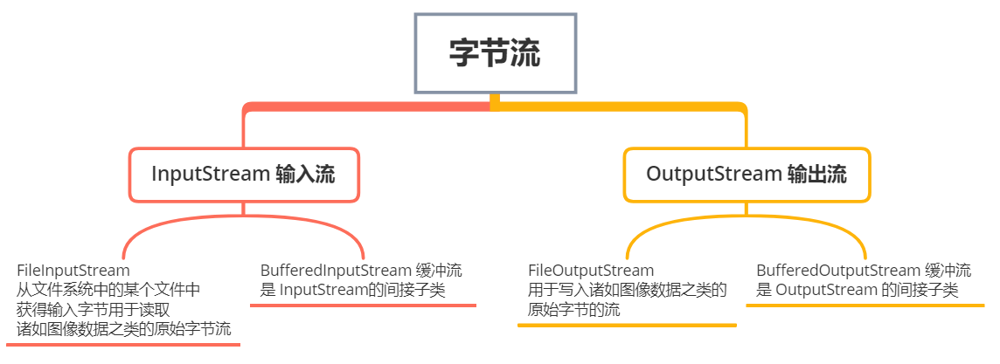
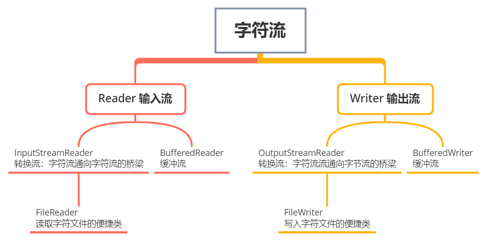
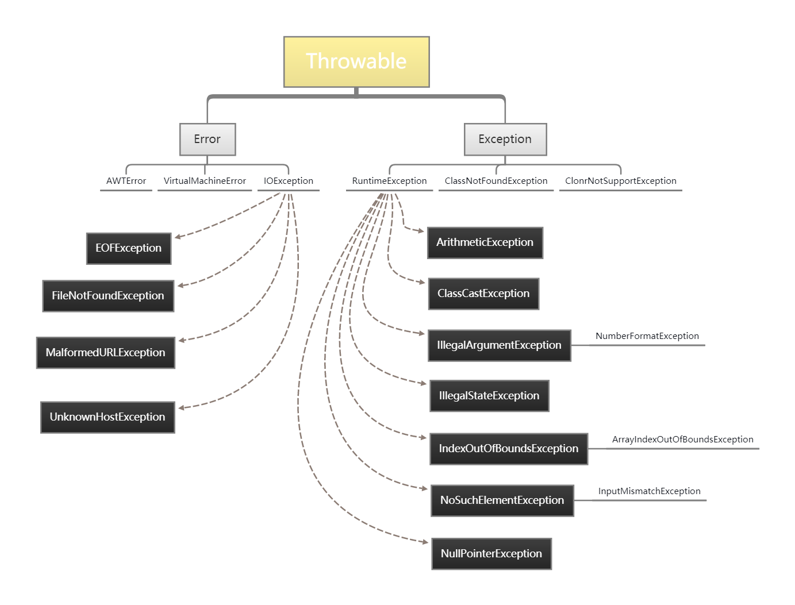

# 1. IO

## 1.1 Java 中有几种类型的流

- 按照流的流向分：输入流（inputStream）和输出流（outputStream）
- 按照操作单元划分：字节流和字符流
- 按照流的角色功能划分：节点流和处理流。
  - 节点流：可以从或向一个特定的地方（节点）读写数据。如 FileReader
  - 处理流：是对一个已存在的流的连接和封装，通过所封装的流的功能调用实现数据读写。如 BufferedReader。处理流的构造方法总是要带一个其他的流对象做参数。一个流对象经过其他流的多次包装，称为流的链接。








## 1.2 字节流如何转为字符流

字节输入流转字符输入流通过 InputStreamReader 实现，该类的构造函数可以传入 InputStream 对象。

字节输出流转字符输出流通过 OutputStreamWriter 实现，该类的构造函数可以传入 OutputStream 对象.

## 1.3 字节流和字符流的区别

字符流处理的单元为 2 个字节的 Unicode 字符，分别操作字符字符数组或字符串，而字节流处理单元为 1 个字节， 操作字节和字节数组。所以字符流是由Java虚拟机将字节转化为2个字节的 Unicode  字符为单位的字符而成的，所以它对多国语言支持性比较好！如果是音频文件、图片、歌曲，就用字节流好点，如果是关系到中文（文本）的，用字符流好点

所有文件的储存是都是字节（byte）的储存，在磁盘上保留的并不是文件的字符而是先把字符编码成字节，再储存这些字节到磁盘。在读取文件（特别是文本文件）时，也是一个字节一个字节地读取以形成字节序列。

字节流可用于任何类型的对象，包括二进制对象，而字符流只能处理字符或者字符串

字节流提供了处理任何类型的IO操作的功能，但它不能直接处理Unicode字符，而字符流就可以。

## 1.4 序列化和 IO 的关系

[[什么是Java序列化，如何实现java序列化](https://www.cnblogs.com/yangchunze/p/6728086.html)](https://www.cnblogs.com/yangchunze/p/6728086.html)

序列化就是一种用来处理对象流的机制，所谓对象流也就是将对象的内容进行流化。可以对流化后的对象进行读写操作，也可将流化后的对象传输于网络之间。序列化是为了解决在对对象流进行读写操作时所引发的问题。

序 列 化 的 实 现 ： 将 需 要 被 序 列 化 的 类 实 现 Serializable 接 口 ， 该 接 口 没 有 需 要 实 现 的 方 法 ，

implements Serializable 只是为了标注该对象是可被序列化的，然后使用一个输出流(如：FileOutputStream)来构造一个 ObjectOutputStream(对象流)对象，接着，使用 ObjectOutputStream 对象的 writeObject(Object obj)方法就可以将参数为 obj 的对象写出(即保存其状态)，要恢复的话则用输入流。

实体类

```java
public class Customer implements Serializable   {
    private String name;
    private int age;

    public Customer(String name, int age) {
        this.name = name;
        this.age = age;
    }

    @Override
    public String toString() {
        return "name=" + name + ", age=" + age;
    }
}
```

测试类

```java
public class Test {
    public static void main(String[] args) throws Exception {
        /*其中的  D:\\objectFile.obj 表示存放序列化对象的文件*/

        // 序列化对象
        ObjectOutputStream out = new ObjectOutputStream(new FileOutputStream("D:\\objectFile.obj"));
        Customer customer = new Customer("BWH_Steven", 22);
        out.writeObject("Hello!");    // 写入字面值常量
        out.writeObject(new Date());  // 写入匿名Date对象
        out.writeObject(customer);    // 写入customer对象
        out.close();


        // 反序列化对象
        ObjectInputStream in = new ObjectInputStream(new FileInputStream("D:\\objectFile.obj"));
        System.out.println("obj1 " + (String) in.readObject()); // 读取字面值常量
        System.out.println("obj2 " + (Date) in.readObject());   // 读取匿名Date对象
        Customer obj3 = (Customer) in.readObject();    			// 读取customer对象
        System.out.println("obj3 " + obj3);
        in.close();
    }

}
```

运行结果

```java
// 实体类实现 Serializable 接口
obj1 Hello!
obj2 Sat Feb 06 11:17:57 CST 2021
obj3 name=BWH_Steven, age=22 

// 实体类不实现 Serializable 接口
Exception in thread "main" java.io.NotSerializableException: cn.ideal.pojo.Customer
	at java.io.ObjectOutputStream.writeObject0(ObjectOutputStream.java:1184)
	at java.io.ObjectOutputStream.writeObject(ObjectOutputStream.java:348)
	at cn.ideal.Test.main(Test.java:27)   
```

## 1.5 BIO 和 NIO 的概念

[[关于BIO和NIO的理解](https://www.cnblogs.com/zedosu/p/6666984.html)](https://www.cnblogs.com/zedosu/p/6666984.html)

# 2. 异常

## 2.1 异常机制的过程

异常就是在程序发生异常时，强制终止程序运行，并且将异常信息返回，由开发者决定是否处理异常

简单说一下这个异常机制的过程：

当程序无法运行后，它会从当前环境中跳出，并且抛出异常，之后，它会先new一个异常对象，然后在异常位置终止程序，并且将异常对象的引用从当前环境中返回，这时候异常处理机制接管程序，并且开始寻找可以继续执行程序的恰当位置。

## 2.2 异常体系

1. **Error** —— **错误**：程序无法处理的严重错误，我们不作处理

   - 这种错误一般来说与操作者无关，并且开发者与应用程序没有能力去解决这一问题，通常情况下，JVM会做出终止线程的动作

2. **Exception** —— **异常**：异常可以分为运行时异常和编译期异常

   - **RuntimeException**：即**运行时异常**，我们必须修正代码

     - 这些异常通常是由于一些逻辑错误产生的这类异常在代码编写的时候不会被编译器所检测出来，是可以不需要被捕获，但是程序员也可以根据需要行捕获抛出，（不受检查异常）这类异常通常是可以被程序员避免的。

     - 常见的RUNtimeException有：NullpointException（空指针异常），ClassCastException（类型转	换异常），IndexOutOfBoundsException（数组越界异常）等。

   - **非RuntimeException**：**编译期异常**，必须处理，否则程序编译无法通过

     - 这类异常在编译时编译器会提示需要捕获，如果不进行捕获则编译错误。

     - 常见编译异常有：IOException（流传输异常），SQLException（数据库操作异常）等。




## 2.3  异常输出打印的常用方法

| 方法方法                      | 说明                                                         |
| :---------------------------- | ------------------------------------------------------------ |
| public String getMessage()    | 回关于发生的异常的详细信息。这个消息在Throwable 类的构造函数中初始化了 |
| public Throwable getCause()   | 返回一个Throwable 对象代表异常原因                           |
| public String toString()      | 使用getMessage()的结果返回类的串级名字                       |
| public void printStackTrace() | 打印toString()结果和栈层次到System.err，即错误输出流         |

示例：

```java
public class Demo {
    public static void main(String[] args) {
        int a = 520;
        int b = 0;
        int c;

        try {
            System.out.println("这是一个被除数为0的式子");
            c = a / b;
        } catch (ArithmeticException e) {
            System.out.println("除数不能为0");
        }
    }
}

//运行结果
这是一个被除数为0的式子
除数不能为0
```

我们用上面的例子给出异常方法的测试

```java
// System.out.println(e.getMessage()); 结果如下: 
/ by zero
```

```java
// System.out.println(e.getCause()); 结果如下:
null
```

```java
// System.out.println(e.toString()); 结果如下:
java.lang.ArithmeticException: / by zero
```

```java
// e.printStackTrace(); 结果如下:
java.lang.ArithmeticException: / by zero
	at cn.bwh_01_Throwable.Demo.main(Demo.java:10)
```

## 2.4 Throw 和 Throws 的区别

**Throw**：

- 作用在方法内，表示抛出具体异常，由方法体内的语句处理。

- 具体向外抛出的动作，所以它抛出的是一个异常实体类。若执行了Throw一定是抛出了某种异常。

**Throws**：

- 作用在方法的声明上，表示如果抛出异常，则由该方法的调用者来进行异常处理。

- 主要的声明这个方法会抛出会抛出某种类型的异常，让它的使用者知道捕获异常的类型。

- 出现异常是一种可能性，但不一定会发生异常。

## 2.5 try-with-resources 替代 try-catch-finally

> 面对必须要关闭的资源，我们总是应该优先使用 try-with-resources 而不是try-finally。随之产生的代码更简短，更清晰，产生的异常对我们也更有用。try-with-resources语句让我们更容易编写必须要关闭的资源的代码，若采用try-finally则几乎做不到这点。—— Effecitve Java

Java 从 JDK1.7 开始引入了 try-with-resources ，在其中定义的变量只要实现了 AutoCloseable 接口，这样在系统可以自动调用它们的close方法，从而替代了finally中关闭资源的功能。

使用  try-catch-finally 你可能会这样做

```java
try {
    // 假设这里是一组关于 文件 IO 操作的代码
} catch (IOException e) {
    e.printStackTrace();
} finally {
    if (s != null) {
        s.close();
    }
}
```

但现在你可以这样做

```java
try (BufferedInputStream bis = new BufferedInputStream(new FileInputStream(new File("test.txt")))) {
    // 假设这里是操作代码
} catch (IOException e) {
    e.printStackTrace();
}
```

如果有多个资源需要 close ，只需要在 try 中，通过分号间隔开即可

```java
try (BufferedInputStream bis = new BufferedInputStream(new FileInputStream(new File("test.txt")));
     BufferedOutputStream bos = new BufferedOutputStream(new FileOutputStream(new File("test.txt")))) {
    // 假设这里是操作代码
} catch (IOException e) {
    e.printStackTrace();
}
```

可参考 [JDK1.8中的try-with-resources声明](https://blog.csdn.net/weixin_40255793/article/details/80812961)
