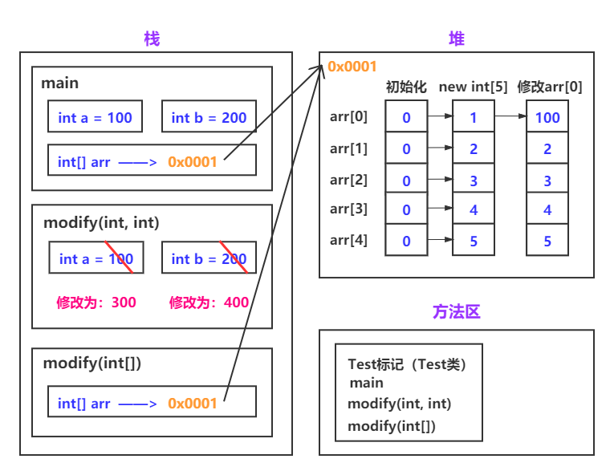

# 1. 概念常识

## 1.1 请你谈谈你对 JVM JDK JRE 的认识和理解

### 1.1.1 JVM（Java Virtual Machine）

JVM 又被称作 Java 虚拟机，用来运行 Java 字节码文件（`.class`），因为 JVM 对于特定系统（Windows，Linux，macOS）有不同的具体实现，即它屏蔽了具体的操作系统和平台等信息，因此同一字节码文件可以在各种平台中任意运行，且得到同样的结果。

#### 1.1.1.1 什么是字节码？

扩展名为 `.class` 的文件叫做字节码，是程序的一种低级表示，它不面向任何特定的处理器，只面向虚拟机（JVM），在经过虚拟机的处理后，可以使得程序能在多个平台上运行。

#### 1.1.1.2 采用字节码的好处是什么？

Java 语言通过字节码的方式，在一定程度上解决了传统解释型语言执行效率低的问题，同时又保留了解释型语言可移植的特点。所以 Java 程序运行时比较高效，而且，由于字节码并不专对一种特定的机器，因此，Java程序无须重新编译便可在多种不同的计算机上运行。

> **为什么一定程度上解决了传统解释型语言执行效率低的问题**（参考自思否-[**scherman**](https://segmentfault.com/u/scherman) ，仅供参考）
>
> 首先知道两点，① 因为 Java 字节码是伪机器码，所以会比解析型语言效率高 ②JVM不是解析型语言，是半编译半解析型语言
>
> 解析型语言没有编译过程，是直接解析源代码文本的，相当于在执行时进行了一次编译，而 Java 的字节码虽然无法和本地机器码完全一一对应，但可以简单映射到本地机器码，不需要做复杂的语法分析之类的编译处理，当然比纯解析语言快。

### 1.1.2 JRE（Java Runtime Environment）

JRE 是 Java 运行时环境，它包含了 JVM  和 Java 的一些基础类库，它用来运行已经编译好的 Java 程序（它就是用来运行的，不能创建新程序）

### 1.1.3 JDK（Java Development Kit）

JDK 是Java开发工具包，是程序员使用 Java 语言开发 Java 程序必备的工具包，它不仅包含 JRE ，同时还包含了编译器（javac）还包含了很多 java 调试，分析，文档相关的工具。使用 JDK 可以创建以及编译程序。

#### 1.1.3.1 只为Java运行环境 JRE，有必要安装 JDK 吗

单纯为了运行一个 Java 程序，JRE 是完全够用的，但话不能这么绝对

> 有时，即使您不打算在计算机上进行任何 Java 开发，仍然需要安装 JDK。例如，如果要使用 JSP 部署 Web 应用程序，那么从技术上讲，您只是在应用程序服务器中运行 Java 程序。那你为什么需要 JDK 呢？因为应用程序服务器会将 JSP 转换为 Java servlet，并且需要使用 JDK 来编译 servlet。（参考自Github-[**JavaGuide**](https://github.com/Snailclimb/JavaGuide) ，仅供参考）

所以，大部分情况安装 JDK 还是有必要的，需要根据具体情况来决定。

#### 1.1.3.2 你能谈一谈 Java 程序从代码到运行的一个过程吗？


过程：编写 -> 编译 -> 解释（这也是 Java编译与解释共存的原因）

首先通过IDE/编辑器编写源代码然后经过 JDK 中的编译器（javac）编译成 Java 字节码文件（.class文件），字节码通过虚拟机执行，虚拟机将每一条要执行的字节码送给解释器，解释器会将其翻译成特定机器上的机器码（及其可执行的二进制机器码）。

## 1.2 请你比较一下  Java 与JavaScript 、C++

### 1.2.1 Java 与 JavaScript

- **用处不同**：Java 被广泛用于互联网应用程序的开发。而 JavaScript 主要内嵌于 Web 页面中运行，用来读写 HTML，控制 cookies 等。
- **定位不同**：Java 是基于对象的，简单开发也需要设计并创建类。而 JavaScript 这种脚本语言是基于对象的和事件驱动的，它可以通过大量提供好的内部对象实现各种功能。
- **代码执行过程不同**：Java 源代码会经过编译编程字节码文件，然后 JVM 将字节码文件分发给解释器进行解释处理，因此属于编译与解释共存。而 JavaScript 是一种解释性语言，源代码不需要经过编译，浏览器即可解释执行（ JIT （即时编译）可以提高 JavaScript  的运行效率）。

- **数据类型不同**：Java 采用强类型检查，编译前必须声明，而 JavaScript  是弱类型，甚至变量使用前可以不声明，JavaScript  在运行时检查推断其数据类型。

### 1.2.2 Java 与 C++

- **指针**：Java 语言不显式地向用户提供指针来访问内存，添加了自动内存管理功能，可以避免在 C/C++ 中因操作失误而导致的野指针的问题，使程序更安全（只是不提供，并不是没有指针，虚拟机中内部还是使用了指针只是不向外提供而已）。
- **继承**：Java 的类是单继承的，而 C++ 却可以多重继承，但 Java 可以通过继承/实现多个接口。

- **内存管理**： Java 的 JVM 中有自己的 GC 机制（垃圾回收机制），不需要程序员手动释放没用的内存
- **运算符重载**：Java 不可以运算符重载，而 C++ 则可以。


# 2. 基础语法

说明：此部分包括：关键字，标识符，注释，常量，变量 ，运算符，分支，循环的相关内容。

数据类型、方法单独整理为 第 3 大点 和 第 4 大点 

## 2.1 标识符和关键字的区别

标识符和关键字的本质都是一个名字，例如类名，方法名，变量名... ，而关键字，是一种特殊的标识符，它被冠以一种特殊的含义，例如 public return try catch ... ，因为关键字有其特定的位置和用途，所以普通标识符不允许与关键字重名。

## 2.2 Java 常见的命名规则（非规范）

注：下面所述，均为命名的硬性规则，而非推荐的规范，具体可参考 《阿里巴巴 Java 开发手册》

基本：

- **包名**：全部小写用 `.` 隔开  eg： com.baidu.www （域名反写）
- **类名/接口**：首字母大写，多个单词组成则使用驼峰命名
- **方法或变量名**：首字母小写，多个单词组成则使用驼峰命名
- **常量名**：全部大写，用 `_` 隔开

标识符：

- **首字符**：字母（`A-Z、a-z`）、美元符（`$`）、下划线（`_`）

- **首字符之后**：字母（`A-Z、a-z`）、美元符（`$`）、下划线（`_`）或者数字的任何字符组合

## 2.3 注释的种类

注释有三种：① 单行注释（`//注释内容`）、② 多行注释（`/*注释内容*/`）、③ 文档注释（`/**注释内容*/`）

### 2.3.1 谈谈你对注释规范的看法

首先要说注释的作用：① 能准确的反映设计思想和代码逻辑 ② 能够描述业务含义 

一份好的注释，可以在较长一段时间后，帮助你快速回忆当时的思路，也可以帮助接收这份代码的新人，快速了解你的想法。

> 代码的注释不是越详细越好。实际上好的代码本身就是注释，我们要尽量规范和美化自己的代码来减少不必要的注释。若编程语言足够有表达力，就不需要注释，尽量通过代码来阐述。—— 《Clean Code》

## 2.4 字符常量和字符串常量的区别

- **形式不同**：字符常量是单引号引起的一个字符，而字符串常量是双引号引起的 0 个或若干个字符
- **含义不同**：字符常量相当于一个整型值( ASCII 值)，可以参加表达式运算，而字符串常量代表一个地址值（该字符串在内存中存放位置）
- **占内存大小不同**： 字符常量只占 2 个字节（ char 在 Java 中占两个字节），字符串常量占若干个字节

## 2.5 char 型变量能不能存储一个中文汉字？

char 型变量是用来存储 Unicode 编码的字符的，而 Unicode 编码字符集中包含了汉字，所以，char型变量中当然可以存储汉字啦。如果某个特殊的汉字没有被包含在unicode编码字符集中，那么，这个char型变量中就不能存储这个特殊汉字。

补充说明：unicode 编码占用两个字节，所以，char 类型的变量也是占用两个字节

## 2.6 final 关键字有什么作用

- final 修饰的类不能被继承，final 类中的成员变量可以根据需要设为 final，但要注意 final 类中的所有成员方法都会被隐式地指定为final方法。
- final 修饰的方法不能被重写
- final 修饰的变量叫做常量，如果是基本类型，则数值初始化后就不能改变了，如果是引用类型，则对其初始化后则不能再让其指向到另一个对象了。

## 2.7 前置或后置自增/自减运算符的区别

`++` 和 `--` 就是对变量进行自增1或者自减1的运算符，前置后置是有区别的：

规则：运算符前置则先加/减，运算符后置则后加/减

```java
int x = 4;
int y = (x++) + (++x) + (x * 10);
System.out.println(y);
```

首先 (x++) 中 x 后置 ++ 所以后加减，即x 运算时取 4 然后自增为 5

其次 (++x) 中 x 前置 ++ 所以先加减， x = 6

接着 x * 10  = 6 * 10  = 60

最后执行赋值语句，即：y = 4 + 6 + 60 = 70

## 2.8  & 和 && 的区别

`&` 运算符有两种用法：① 按位与  ② 逻辑与（这里只讨论）

`&&` 运算符是短路与运算

逻辑与跟短路与都要求运算符左右两端的布尔值都是 true 整个表达式的值才是 true

&& 具有短路作用，如果&&左边的表达式的值是false，右边的表达式会被直接短路掉，不会进行运算，因此效率更高

> 一般更推荐使用 &&，例如在验证用户登录时判定用户名不是null而且不是空字符串，应当写为：username != null &&!username.equals("")，二者的顺序不能交换，更不能用&运算符，因为第一个条件如果不成立，根本不能进行字符串的equals比较，否则会产生NullPointerException异常。
>
> 注意：逻辑或运算符（|）和短路或运算符（||）的差别也是如此。

补充：`&` 还可以当做位运算符，当 `& `两边操作数或表达式的结果不是布尔类型的时候，`&` 即按照位于运算符操作

## 2.9 交换两个整型数的值你有几种方法？

**方式1**：使用一个中间值传递（因其可读性高，所以开发中也常用这种方式）

**方式2**：用位异或实现

- `^` 位异或运算符的特点：一个数据对另一个数据位异或两次，该数本身不变

```java
a = a ^ b;
b = a ^ b; // 将 a 带入,即: b = a ^ b ^ b 
a = a ^ b; // a 还是 a ^ b , b 变成了 a 即: a = a ^ b ^ a = b
```

**方式3**：用变量相加的方法

```java
a = a + b;
b = a - b;
a = a - b； 
```

**方式4**：一句话的事

```java
b = (a + b) - (a = b);
```

此处方式 1 2 4 都好理解，顺便回顾一下原反补码，以及各种位运算

### 2.9.1 简单讲一下原码，补码，反码

在计算机内，有符号数有三种表示方法，源码、反码、和补码。而所有的数据运算都是采用补码进行的

- **原码**：二进制点表示法，最高位为符号位，“0”表示正，“1”表示负，其余位置表示数值大小，可直观反映出数据的大小。
  - 正数的原码最高位是 0 ，负数的原码最高位是 1 ，其他的是数值位
- **反码**：解决负数加法运算问题，将减法运算转换为加法运算，从而简化运算规则。
  - 正数的反码与原码相同，负数的反码与源码符号位相同，数值位取反 1 -> 0 、 0 -> 1
- **补码**：解决负数加法运算正负零问题，弥补了反码的不足。
  - 正数的补码与原码相同，负数的补码是在反码的基础上+1  

### 2.9.2 介绍一下几种位运算

位运算需要将数据转换成二进制，用 0 补齐位数

`&` 位与运算符：有 0 则 0 

`|` 位或运算符：有 1 则 1

`^` 位异或运算符：相同则 0，不同则1

`~` 按位取反运算符：0 变 1，1 变 0（拿到的是补码，要转换为原码）

`<<` 按位左移运算符：左边最高位丢弃，右边补齐

- 快速计算：把 `<<` 左边的数据 乘以 2 的移动次幂：例如 3 << 2 即：3 * 2 ^ 2 = 12 

`>>` 按位右移运算符：最高位为 0，左边补齐 0，最高位是 1，左边补齐 1

- 快速计算：把 `>>` 左边的数据 除以 2 的移动次幂：例如 -24 >> 2 即：-24  / 2 ^ 2 = -6

`>>>` 按位右移补零操作符：无论最高位是 0 还是 1 ，左边补齐 0

分别演示 `^` 和 `>>` 两个典型运算符

- 3 ^ 4

```java
// 3 的二进制: 11 补齐位数
00000000 00000000 00000000 00000011
// 4 的二进制: 100 补齐位数
00000000 00000000 00000000 00000100
// 位异或运算符: 相同则 0, 不同则1
00000000 00000000 00000000 00000011
00000000 00000000 00000000 00000100
-----------------------------------
00000000 00000000 00000000 00000111
// 得到的为补码，因为符号位为 0 即为正数，所以原反补码一致，所以结果（原码）就是二进制的111，即十进制的 7
```

- -24 >> 2

```java
// -24 的二进制: 11000 负数符号位为 1, 补齐位数
原码: 10000000 00000000 00000000 00011000
反码: 11111111 11111111 11111111 11100111
补码: 11111111 11111111 11111111 11101000
// 右移 2 位 最高位是 1，左边补齐 1
11111111 11111111 11111111 11101000
1111111111 11111111 11111111 111010(00)
// 拿到的结果为补码，按8位划分开
补码: 11111111 11111111 11111111 11111010
反码: 11111111 11111111 11111111 11111001
原码: 10000000 00000000 00000000 00000110
// 结果是二进制的 110, 即十进制的 -6
```

## 2.10 用最有效率的方法算出2乘以8等于多少

使用位运算来实现效率最高。位运算符是对操作数以二进制比特位为单位进行操作和运算，操作数和结果都是整型数。

对于位运算符 `<<` , 是将一个数左移 n 位，就相当于乘以了 2 的 n 次方，那么，一个数乘以 8 只要将其左移 3 位即可，位运算是 cpu 直接支持的，效率最高。

所以，2乘以8等于几的最效率的方法是 2 << 3 

## 2.11 break、continue、return 的区别？

break、continue 均属于跳出循环的关键字，return 属于跳出方法的关键字

- **break**：完全跳出一个循环体，执行该循环体下接着的语句
- **continue**：跳过本次循环，执行下一次循环
- **return**：结束方法的运行，有两种用法
  - `return;`：用于没有返回值的方法（可不写）
  - `retu`
  - `rn value`：用于返回一个特定的值


# 3. 基本数据类型

## 3.1 讲一讲 Java 中的几种基本数据类型

首先Java是一种强类型的语言，针对每一种数据都定义了明确的数据类型（就是将一些值的范围做了约束，从而为不同类型的值在内存中分配不同的内存空间）

| **Name**    | Size（字节\|位数） | Range                                             |
| ----------- | ------------------ | ------------------------------------------------- |
| **byte**    | 1byte \| 8bit      | -128~127 之间                                     |
| **short**   | 2bytes \| 16bit    | -32768~32767 之间，最大数据存储量是65536          |
| **int**     | 4bytes \| 32bit    | -2^31 ~ 2^31-1 之间                               |
| **long**    | 8bytes \| 64bit    | -2^63 ~ 2^63-1                                    |
| **float**   | 4bytes \| 32bit    | 3.4e-45~1.4e38，直接赋值时必须在数字后加上 f 或 F |
| **double**  | 8bytes \| 64bit    | 4.9e-324~1.8e308，赋值时可以加 d 或 D 也可以不加  |
| **boolean** |                    | 只有 true 和 false 两个取值                       |
| **char**    | 2bytes             | 存储Unicode码，用单引号赋值                       |

注意：对于 boolean，官方文档未明确定义，它依赖于 JVM 厂商的具体实现。逻辑上理解是占用 1 位，但是实际中会考虑计算机高效存储因素。

## 3.2 谈谈数据类型转换时的精度处理问题

一般来说，我们在运算的时候，要求参与运算的数值类型必须一致，针对类型不一致的时候，有两种将不同数据类型统一的方式，即：默认自动转换（从小到大的转换）和 强制转换。

- 默认自动转换：即从 byte，short,  char 三者都会被默认的转到更高的精度类型，精度等级顺序如下 （ ==> int ==> long ==> float ==> double ）

> 疑惑：为什么 float（4个字节）在 long（8个字节）后面
>
> **A: 它们底层的存储结构不同**
>
> **B:  float表示的数据范围比long范围要大**
>
> long：2^63-1
>
> float：3.4*10^38  >  2*10^38  > 2*8^38  > 2*2^3^38
>
> = 2*2^144  > 2^63 -1

默认类型转换示例：

```JAVA
// 例如低精度byte到高精度int 会根据默认转换，自动转换类型
// 可以正常执行
public static void main(String[] args) {
    byte a = 2；
    int b = 3;
    int c = a + b
    System.out.println(c);
}

// 高精度int到低精度byte 可能会损失精度
// 直接报错，不兼容的类型:从int转换到byte可能会有损失
public static void main(String[] args) {
    byte a = 3；
    int b = 4;
    byte c = a + b
    System.out.println(c);
}
```

- 强制类型转换

  - 格式：目标数据类型 变量 = （目标数据类型）（被转换的数据）

注意：不要随便的去用强制转化，因为它隐含了精度损失的问题，把容量大的类型转换为容量小的类型时必须使用强制类型转换。

```java
int i = 128;   
// 因为byte类型是8位，最大值为127，所以当int强制转换为byte类型的时候，值128就会导致溢出
byte b = (byte)i;
```

### 3.2.1 变量相加和常量相加类型转换时有什么区别

变量相加，会首先看类型问题，最终把结果赋值也会考虑类型问题

常量相加，首先做加法，然后看结果是否在赋值的数据类型范围内，如果不是，才报错

### 3.2.2 Java背后是如何强制转换 byte 类型溢出错误问题的

```java
public static void main(String[] args) {
    // byte 的范围是: -128到127，所以报错
    byte a = 130;
    // 使用强制类型转换
    byte b = (byte)130;
    System.out.println(b);
}
```

我们想要知道结果是什么，就应该知道是如何计算的，而我们又知道计算机中数据的运算都是补码进行的，得到补码，首先要计算出数据的二进制

```java
// 求出130的二进制 10000010
// 130 是一个整数 所以补齐4个字节 （一个字节8位）
0000000  00000000  00000000  10000010

// 做截取操作，截成byte类型（1个字节，8位）
10000010

// 上述结果是补码，求其原码
补码: 10000010
反码: 10000001
原码: 11111110
// 11111110 转换为十进制为 -126
```

## 3.3 Java 中基础类型对应的包装类型是什么，自动装箱与拆箱又是什么？

Java中有 8 种基本数据类型，分别为：byte、short、int、long、float、double、char、boolean。

对应的包装类分别为：Byte、Short、Integer、Long、Float、Double、Character、Boolean

将基本数据类型封装成对象的的好处在于可以在对象中定义更多的功能方法操作该数据，比如 String 和 int 类型的相互转换。同时简化了基本数据类型和相对应对象的转化步骤。

- **自动装箱**：将基本类型用它们对应的引用类型包装起来
- **自动拆箱**：将包装类型转换为基本数据类型

而在我们想要使用包装类的一些方法的时候，可以通过基本类型包装类的构造方法将值传入，但是 JDK5 后的新特性就为我们大大的简化了一些麻烦的步骤。

```java
// 定义一个 包装类型 Integer 接收一个基本类型 int 整数 1, 这就是一个自动装箱。
Integer a = 1;
// 如果没有自动装箱的话，需要使用构造函数
Integer a = new Integer(1)
// 继续用 int 类型 b 接收一个 上面的包装类型 Integer a, 这就是一个自动拆箱
int b = a;
// 如果没有自动拆箱的话，需要使用方法
int b = a.intValue()
```

## 3.4 几种包装类类型的常量池（缓冲区）问题

在 JDK 5 以后，几种包装类对象在内部实现中通过使用相同的对象引用实	现了缓存和重用。例如：Integer类型对于-128-127之间的数字是在缓冲区取的，所以对于在这个范围内的数值用双等号（`==`）比较是一致的，因为对应的内存地址是相同的。但对于不在这区间的数字是在堆中 new 出来的，所以地址空间不一样，也就不相等。

- Byte、Short、Integer、Long 缓存范围：[-128，127]

- Character 缓存范围：[0,127]

- Boolean 直接返回 True Or False

注：浮点数类型的包装类 Float 和 Double 并没有实现常量池技术

**Boolean 源码节选：**

```java
// 一开始就定义 TRUE FALSE 两个常量
public static final Boolean TRUE = new Boolean(true);
public static final Boolean FALSE = new Boolean(false);

// 很少使用此构造函数, 非必须时推荐使用静态工厂
public Boolean(boolean value) {
    this.value = value;
}

// valueOf 是一个更好的选择，它能产生更好的时间和空间性能
public static Boolean valueOf(boolean b) {
    return (b ? TRUE : FALSE);
}
```

**Character 源码节选：**

```java
// 此方法通常优先于构造函数, 原因也是产生更好的时间和空间性能
public static Character valueOf(char c) {
    if (c <= 127) { // must cache
        return CharacterCache.cache[(int)c];
    }
    return new Character(c);
}

// 具体的逻辑在此
private static class CharacterCache {
    private CharacterCache(){}

    static final Character cache[] = new Character[127 + 1];

    static {
        for (int i = 0; i < cache.length; i++)
            cache[i] = new Character((char)i);
    }
}
```

**Integer 源码节选：**

```java
// 该方法缓存的值总是在-128到127之间，并可能缓存该范围之外的其他值
public static Integer valueOf(int i) {
    if (i >= IntegerCache.low && i <= IntegerCache.high)
        return IntegerCache.cache[i + (-IntegerCache.low)];
    return new Integer(i);
}

// IntegerCache 具体逻辑可自行研究
```


# 4. 方法

## 4.1 Java 中方法参数传递为值传递还是引用传递

Java 中方法参数传递方式是**按值传递**。

- 如果参数是**基本类型**，传递的是基本类型的字面量**值的拷贝**。形式参数的改变对实际参数**没有影响**
- 如果参数是**引用类型**，传递的是该参量所引用的对象在堆中**地址值的拷贝**。形式参数的改变**直接影响**实际参数

下面我们对以上结论进行简单分析：

示例 1：

```java
public static void main(String[] args) {
    // 基本类型
    int a = 100;
    int b = 200;
    System.out.println("main 调用 modify 前: " + "a: " + a + ", b: " + b);
    modify(a, b);
    System.out.println("main 调用 modify 后: " + "a: " + a + ", b: " + b);
}

/**
* 参数为基本类型
* @param a
* @param b
*/
public static void modify(int a, int b) {
    System.out.println("modify 接收到参数: " + "a: " + a + ", b: " + b);
    a = 300;
    b = 400;
    System.out.println("modify 修改参数后: " + "a: " + a + ", b: " + b);
}
```

运行结果：

```
main 调用 modify 前: a: 100, b: 200
modify 接收到参数: a: 100, b: 200
modify 修改参数后: a: 300, b: 400
main 调用 modify 后: a: 100, b: 200
```

示例 2：

```java
public static void main(String[] args) {
    // 引用类型
    int[] arr = {1, 2, 3, 4, 5};
    System.out.println("main 调用 modify 前: " + "arr[0]: " + arr[0]);
    modify(arr);
    System.out.println("main 调用 modify 后: " + "arr[0]: " + arr[0]);
}

/**
* 参数为引用类型
* @param arr
*/
public static void modify(int[] arr) {
    System.out.println("modify 接收到参数(以arr[0]举例): " + "arr[0]: " + arr[0]);
    arr[0] = 100;
    System.out.println("modify 修改参数后(以arr[0]举例): " + "arr[0]: " + arr[0]);
}
```

运行结果：

```
main 调用 modify 前: arr[0]: 1
modify 接收到参数(以arr[0]举例): arr[0]: 1
modify 修改参数后(以arr[0]举例): arr[0]: 100
main 调用 modify 后: arr[0]: 100
```

上述代码的结果，即：以基本类型作为方法参数，方法内对形参的修改，不会影响到实际参数。以引用类型作为方法参数，方法内对形参的修改，会直接影响到实际参数。画一张图简单分析一下：




对于基本类型，a 和 b ，在 modify(int, int) 方法中进行修改不会影响原先的值，这是因为 modify 方法中的参数 a 和 b 是从原先的 a 和 b 复制过来的一个副本。无论如何修改 a 和 b 的值，都不会影响到原先的值。

对于引用类型，arr 数组初始化后，指向到了一个具体的地址中，而将其作为方法参数传递，modify  方法中的 arr 也就指向到了同一个地址去，所以方法内的修改，会直接反映在所对应的对象上。

## 4.2 说一说方法重载和重写的区别

**方法重载**：在一个类中，同名的方法如果有不同的参数列表（参数类型、个数甚至顺序不同）则叫做重载

- **规则**：在同一个类中，方法名必须相同，参数类型不同、个数不同、顺序不同，方法返回值和访问修饰符可以不同。
- **表现形式**：方法名，返回值，访问修饰符，相同的方法，根据不同的数据列表，做出不同的逻辑处理。

**方法重写**：是子类对父类的允许访问的方法的实现过程进行重新编写

- **规则**：

  - 方法名、参数列表、返回类型都相同的情况，对方法体进行修改或者重写。

  - 访问修饰符的限制一定要大于被重写方法的访问修饰符（public > protected > default > private)。
  - 重写方法一定不能抛出新的检查异常或者比被重写方法申明更加宽泛的检查型异常

- **表现形式**：重写就是当子类继承自父类的相同方法，输入一样的数据，你就要覆盖父类方法，使得方法能做出不同的响应

### 4.2.1 如何理解方法的重载和重写都是实现多态的方式

方法的重载和重写都是实现多态的方式，区别在于重载实现的是编译时的多态性，而重写实现的是运行时的多态

性。这里的多态可以理解为一个方法的**调用**，或者函数入口参数的不同，而造成的方法行为不同。

两种不同时期的多态：

- ① **编译时期多态**：其又被称为静态多态，编译时期的多态是靠重载实现的，根据参数个数，类型和顺序决定的（必须在同一个类中）
  - 在方法调用之前，编译器就已经确定了所要调用的方法，这称为“早绑定”或“静态绑定” ；
- ② **运行时的多态**：运行时期的多态是靠方法的重写实现的，在编译期间被视作相同方法，但是运行期间根据对象的不同调用不同的方法
  - 只有等到方法调用的那一刻， 解释运行器才会确定所要调用的具体方法，这称为“晚绑定”或“动态绑定” 。
  - 这也就是我们说的，编译看左边，运行看右边（会在面向对象篇设涉及）

### 4.2.1 为什么函数不能根据返回类型来区分重载？

Java 允许重载任何方法，而不只是构造器方法。因此要完整的指出方法名以及参数类型。这叫做方法的签名（signature）。例如 String 类有 4 个称为 indexOf 的公有方法。它们的签名是：

```java
indexOf(int)
indexOf(int, int)
indexOf(String)
indexOf(String, int)
```

返回值类型不是方法签名的一部分。也就是说，不能有两个名字相同、参数类型也相同却返回不同类型值的方法。

同时函数的返回值只是作为函数运行之后的一个“状态”，他是保持方法的调用者与被调用者进行通信的关键。并不能作为某个方法的“标识”。