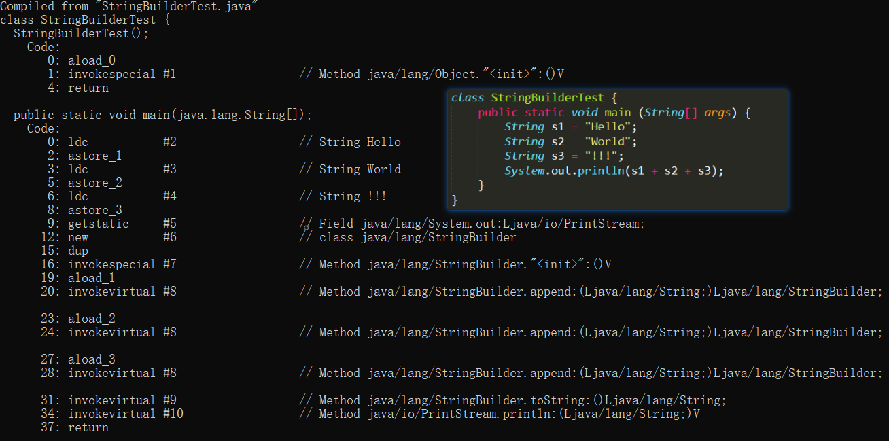
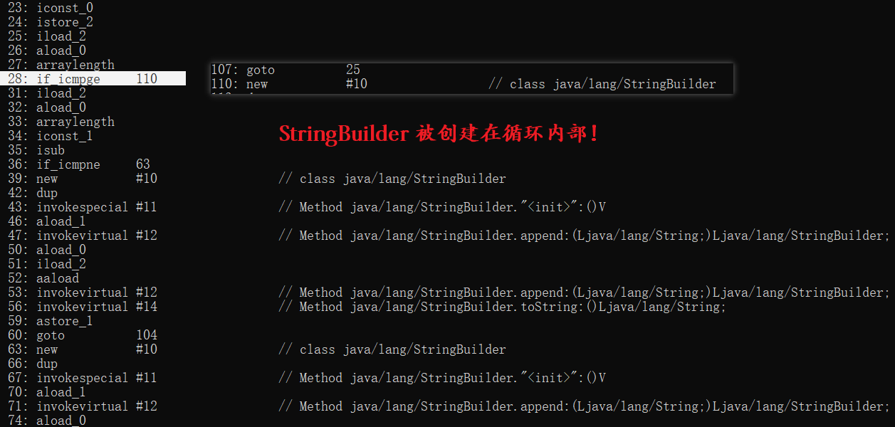

**说明**：本章主要涉及到了：Object类、Scanner类、String类、StringBuffer和StringBuilder、Arrays工具类、基本类型包装类、正则表达式、System类、Math、Random类、BigInteger和BigDecimal类、Date、DateFormat和Calendar类

**补充**：由于 Object 以及 String 类属于高频内容，所以总结题目以及小点知识之前，会对其做一个基本的归纳复习。

# 1. 基本归纳

在讲解这些常见类之前，我们不得不简单的提一下什么是API，先贴一组百度百科的解释：

> API（Application Programming Interface,应用程序编程接口）是一些预先定义的函数，目的是提供应用程序与开发人员基于某软件或硬件得以访问一组例程的能力，而又无需访问源码，或理解内部工作机制的细节。

简单的说：就是 Java 中有好多现成的类库，其中封装了许多函数，只提供函数名和参数，但隐藏了函数的具体实现，这些可见的部分作为与外界联系的桥梁，也就是我们所称的 API ，不过由于Java是开源的，所以这些隐藏的实现我们也是可以看到的。

## 1.1 Object 类

- Object 是类层次结构的**根类**，所有的类都隐式的（不用写extends）继承自Object类。
- Java 所有的对象都拥有Object默认方法
- Object 类的构造方法有一个，并且是**无参构造**

这就对应了前面学习中的一句话，子类构造方法默认访问父类的构造是无参构造

我们需要**了解的方法**又有哪些呢？

A：hashCode()   B：getClass()   C： finalize()    D：clone()   E：wait()    F：notify()   G：notifyAll() 

我们需要**掌握的方法**又有哪些呢？

A：toString()   B：equals()

**方法总结：**

```java
// 1. 返回此Object的运行时类，是一个 native方法，同时因为使用了final关键字修饰，故不允许子类重写。
public final native Class<?> getClass()

// 2. 用于返回对象的哈希码，是一个native方法，例如主要涉及在 HashMap 中。
public native int hashCode() 
    
// 3. 比较两个对象是否相同，默认比较的是地址值是否相同。而比较地址值是没有意义的，所以，一般子类也会重写该方法。
public boolean equals(Object obj)

// 4. 实现对象的克隆，包括成员变量的数据复制，分为深浅克隆两种。是一个native方法。
protected native Object clone() throws CloneNotSupportedException

// 5. 返回类的名字@该实例16进制的哈希码字符串。因此建议Object 所有的子类都重写此方法。    
public String toString() 

// 6. 唤醒一个在此对象监视器上等待的线程(监视器理解为锁)。若有多个线程在等待只会任意唤醒一个。是一个 native方法，且不能重写。
public final native void notify()

// 7. 同 notify()，区别是会唤醒在此对象监视器上等待的所有线程。
public final native void notifyAll()

// 8. 意为暂停线程的执行.是一个native方法。注意：释放了锁，而sleep方法不释放锁。timeout是等待时间。
public final native void wait(long timeout) throws InterruptedException
    
// 9. 多了一个nanos参数，代表额外时间（以毫微秒为单位，范围是 0-999999）。 所以时间最后要计算总和。
public final void wait(long timeout, int nanos) throws InterruptedException

// 10同前两个 wait() 只不过该方法一直等待
public final void wait() throws InterruptedException

// 11. 在对象将被垃圾回收器清除前调用，但不确定时间  
protected void finalize() throws Throwable { }
```

## 2.2 String 类

String 是一个很常用的类，简单归纳一下常见的方法

**构造方法**

```java
// 1. 空构造
public String()

// 2. 把字节数组转换成字符串
public String(byte[] bytes)

// 3. 把字节数组的一部分转换成字符串
public String(byte[] bytes,int offset,int length)

// 4. 把字符数组转换成字符串
public String(char[] value)

// 5. 把字符数组的一部分转换成字符串
public String(char[] value,int offset,int count)

// 6. 把字符串常量值转换成字符串    
public String(String original)

// 7. 下面的这一个虽然不是构造方法，但是结果也是一个字符串对象
String s = "hello";
```

简单总结：String类的构造方法可以将 **字节、字符数组、字符串常量**（全部或者部分）转换为字符串类型

**判断方法**

```java
// 1. 比较字符串的内容是否相同，区分大小写
boolean equals(Object obj)

// 2. 比较字符串的内容是否相同，不区分大小写
boolean equalsIgnoreCase(String str)

// 3. 判断大字符串中是否包含小字符串
boolean contains(String str)

// 4. 判断某个字符串是否以某个指定的字符串开头
boolean startsWith(String str)

// 5. 判断某个字符串是否以某个指定的字符串结尾
boolean endsWith(String str)

// 6. 判断字符串是否为空
boolean isEmpty()

注意：
String s = “”;    // 字符串内容为空
String s = null;  // 字符串对象为空
```

**获取方法**

```java
// 1. 获取字符串的长度
int length()

// 2. 获取指定索引的字符
char charAt(int index)

// 3. 返回指定字符在此字符串中第一次出现的索引
int indexOf(int ch)
// 为什么这里是int而不是char？
// 原因是：‘a’和‘97’其实都能代表‘a’ int方便

// 4. 返回指定字符串在此字符串中第一次出现的索引
int indexOf(String str)

// 5. 返回指定字符在此字符串中从指定位置后第一次出现的索引
int indexOf(int ch,int fromIndex)

// 6. 返回指定字符串在此字符串中从指定位置后第一次出现的索引
int indexOf(String str, int fromIndex)

// 7. 从指定位置开始截取字符串，默认到末尾
String substring(int start)

// 8. 从指定位置开始指定位置结束截取字符串
String substring(int start, int end)
```

**转换方法**

```java
// 1. 把字符串转换为字节数组
byte[] getBytes()

// 2. 把字符串转换成字符数组
char[] toCharArray()

// 3. 把字符数组转换成字符串
static String valueOf(char[] chs)

// 3. 把int类型的数据转换成字符串
static String valueOf(int i)
// 注意：String类的valueOf方法可以把任何类型的数据转换成字符串!
  
// 4. 把字符串转换成小写    
String toLowerCase()

// 5. 把字符串转换成大写
String toUpperCase()

// 7. 把字符串拼接
String concat(String str)
```

**其他方法**

```java
// 1. 替换功能 
String replace(char old,char new)
String replace(String old,String new)

// 2. 去除字符串两端空格
String trim()

// 3. 按字典比较功能
int compareTo(String str)
int compareToIgnoreCase(String str) 
```

# 2. 题目总结

## 2.1 == 和 equals 的区别？

`==` ：如果比较的对象是基本数据类型，则比较的是数值是否相等；如果比较的是引用数据类型，则比较的是对象

的地址值是否相等。

`equals()`：equals 方法不能用于基本数据类型的变量，如果没有对 equals 方法进行重写，则比较的是引用类型的变量所指向的对象的地址。一般会选择重写此方法，来比较两个对象的内容是否相等，相等则返回 true。

## 2.2 如何比较两个对象内容是否相同？（重写 equals）

例如一个 Student 类，new 两个对象出来，单纯的想比较内容是否相同如何做呢。

```java
public class Student {
    private String name;
    public int age;
    // get set ... 
}
```

通过 equals() 比较两个对象是否相同，默认情况下，比较的是地址值是否相同。而比较地址值是没有意义的，所以，一般子类也会重写该方法。在诸多子类，如String、Integer、Date 等均重写了 equals() 方法

改进思路：我们可以将比较地址值转变为比较成员变量

- 因为 name 为 String 类型，而 String 类型为引用类型，所以不能够用 == 比较，应该用 equal()
- String 中默认重写过的 equal() 方法是用来比较字符串内容是否相同
- 我们要使用的是学生类的成员变量，所以父类 Object不能调用子类Student的特有功能，所以使用向下转型


```java
//重写v1.0
public boolean equals(Object o) {
    Student s = (Student) o;
    if (this.name.equals(s.name) && this.age == s.age) {
        return true;
    } else {
        return false;
    }
}
```

```java
//重写v2.0 (可作为最终版)
public boolean equals(Object o) {
    if (this.name == o) {
        return true;
    }
    //测试它左边的对象是否是它右边的类的实例，返回 boolean 的数据类型。
    if (!(o instanceof Student)) {
        return false;
    }
    Student s = (Student) o;
    return this.name.equals(s.name) && this.age == s.age;
}
```

```java
// IDEA自动生成版
@Override
public boolean equals(Object o) {
    if (this == o) return true;
    if (o == null || getClass() != o.getClass()) return false;
    Student student = (Student) o;
    return age == student.age &&
        Objects.equals(name, student.name);
}
```


## 2.3 hashCode() 和 equals()

### 2.3.1 什么是 hashCode() 和 equals()

`hashCode()` 方法是 Object 类中的一个本地方法（用 c 语言或 c++ 实现的），会返回该对象的哈希码，也称为散列码；其本质是返回一个 int 整数。哈希码的作用是确定该对象在哈希表中的索引位置。可以通过散列码，在散列表中根据“键”快速的检索出对应的“值”。从而快速找到需要的对象，然后进行判断是不是同一个对象。

```java
public native int hashCode();
```

`equals()` 方法是Object 类中的一个方法，如果没有对 equals 方法进行重写，则比较的是引用类型的变量所指向的对象的地址。一般会选择重写此方法，来比较两个对象的内容是否相等，相等则返回 true。

总结：单考虑目的两者是差不多的，都是用来对比两个对象是否相等一致。

### 2.3.2 equals() 已经实现功能了，还需要 hashCode() 做什么？

重写 equals() 里面的内容一般比较全面周详，但是效率就比较低，例如：如果集合中现在已经有2000个元素，那么第2001个元素加入集合时，它就要调用 2000次 equals方法。

而使用 hashCode() ，其使用的哈希算法也称为散列算法，是将数据依特定算法直接指定到一个地址上，所以 hashCode() 这种形成 hash 码的方式比较是比较高效的。

### 2.3.3 为什么不全部使用高效率的 hashCode()，还要用 equals()?

 hashCode() 方法不是一个 100% 可靠的方法，个别情况下，不同的对象生成的 hashcode 也可能会相同。

### 2.3.4 hashCode() 和 equals() 是如何一起判断保证高效又可靠的？

如果大量内容都是用 equals() 去比对，效率显然是比较低的，所以每次比对之前都去使用 hashCode() 去对比，如果返回的 hashCode 不同，代表两个对象肯定不相同，就可以直接返回结果了。如果 hashCode 相同，又为了保证其绝对可靠，所以使用 equals() 再次进行比对，同样是相同，就保证了这两个对象绝对相同。

### 2.3.5 为什么重写 equals 时必须重写 hashCode 方法？

如果重写了 equals() 而未重写 hashcode() 方法，可能就会出现两个字面数据相同的对象（例如下面 stu1 和 stu2） equals 相同（因为 equals 都是根据对象的特征进行重写的），但 hashcode 不相同的情况。

```java
public class Student {
    private String name;
    public int age;
    // get set ... 
    // 重写 equals() 不重写 hashcode()
}
--------------------------------------------
Student stu1 = new Student("BWH_Steven",22);
Student stu2 = new Student("BWH_Steven",22);
--------------------------------------------
stu1.equals(stu2); // true
stu1.hashCode();  // 和 stu2.hashCode(); 结果不一致
stu2.hashCode();
```

如果把对象保存到 HashTable、HashMap、HashSet 等中（不允许重复），这种情况下，去查找的时候，由于都是先使用 hashCode() 去对比，如果返回的 hashCode 不同，则会认为对象不同。可以存储，从内容上看，明显就重复了。

> 所以一般的地方不需要重写 hashcode() ，只有当类需要放在 HashTable、HashMap、HashSet 等hash 结构的集合时才会去重写。

> **补充：阿里巴巴 Java 开发手册关于 hashCode 和 equals 的处理遵循规则：**
>
> - 只要重写 equals，就必须重写 hashCode。
> - 因为 Set 存储的是不重复的对象，依据 hashCode 和 equals 进行判断，所以 Set 存储的对象必须重写这两个方法。
> - 如果自定义对象做为 Map 的键，那么必须重写 hashCode 和 equals。
> - String 重写了 hashCode 和 equals 方法，所以我们可以非常愉快地使用 String 对象作为 key 来使用。

## 2.4 深拷贝和浅拷贝的区别？

**浅拷贝（浅克隆）**：基本数据类型为值传递，对象类型为引用传递（两者同生共死）

**深拷贝（深克隆）**：对于对象或者数值，所有元素或者属性均完全复制，与原对象脱离（真正意义上的复制, 两者独立无关）

举例：

```java
public class Book {
    private String name; // 姓名
    private int price; // 价格
    private Partner partner; // 合作伙伴
    // 省略构造函数、get set、toString 等
}
```

```java
public class Partner{
    private String name;
    
// 省略构造函数、get set、toString 等
}
```

浅拷贝用到拷贝，首先就对 Book 类进行处理

- 首先实现 Cloneable 接口
- 接着重写 clone 方法

```java
public class Book implements Cloneable{
    private String name; // 姓名
    private int price; // 价格
    private Partner partner; // 合作伙伴

    @Override
    protected Object clone() throws CloneNotSupportedException {
        return super.clone();
    }
    
    // 省略构造函数、get set、toString 等
}

```

再来测试一下

```java
public class Test {
    public static void main(String[] args) throws CloneNotSupportedException {
        // 初始化一个合作伙伴类型
        Partner partner = new Partner("张三");
        // 带参赋值
        Book bookA = new Book("理想二旬不止", 66, partner);
        // B 克隆 A
        Book bookB = (Book) bookA.clone();

        System.out.println("A: " + bookA.toString());
        System.out.println("A: " + bookA.hashCode());
        System.out.println("B: " + bookB.toString());
        System.out.println("B: " + bookB.hashCode());
    }
}
```

执行结果

A: Book{name='理想二旬不止', price=66, partner=Partner{name=张三}}
A: 460141958
B: Book{name='理想二旬不止', price=66, partner=Partner{name=张三}}
B: 1163157884

结果非常明显，书籍信息是一致的，但是内存地址是不一样的，也就是说确实克隆成功了，打印其 hashCode 发现两者并不相同，说明不止指向同一个，也是满足我们要求的

到这里并没有结束，你会发现还是有问题，当你刊印的过程中修改一些值的内容的时候，你看看效果

```java
public class Test {
    public static void main(String[] args) throws CloneNotSupportedException {
        // 初始化一个合作伙伴类型
        Partner partner = new Partner("张三");
        // 带参赋值
        Book bookA = new Book("理想二旬不止", 66, partner);
        // B 克隆 A
        Book bookB = (Book) bookA.clone();
        // 修改数据
        bookB.getPartner().setName("李四");
        bookB.setPrice(44);

        System.out.println("A: " + bookA.toString());
        System.out.println("A: " + bookA.hashCode());
        System.out.println("B: " + bookB.toString());
        System.out.println("B: " + bookB.hashCode());
    }
}
```

执行结果

A: Book{name='理想二旬不止', price=66, partner=Partner{name=李四}}
A: 460141958
B: Book{name='理想二旬不止', price=66, partner=Partner{name=李四}}
B: 1163157884

？？？这不对啊，B 明明是克隆 A 的，为什么我在克隆后，修改了 B 中两个值，但是 A 也变化了啊

这就是典型的浅克隆，在 Book 类，当字段是引用类型，例如 Partner 这个合作伙伴类，就是我们自定义的类，这种情况不复制引用的对象，因此，原始对象和复制后的这个Partner对象是引用同一个对象的。而作为基本类型的的值就没事。

如何解决上面的问题呢，我们需要重写主类的 clone 的内容（改为深拷贝），同时在引用类型中也实现浅拷贝

A：被引用类型实现浅克隆

```java
public class Partner implements Cloneable {
    private String name;

    @Override
    protected Object clone() throws CloneNotSupportedException {
        return super.clone();
    }
    // 省略构造函数、get set、toString 等
}
```

B：修改引用类 cloen 方法

```java
public class Book implements Cloneable{
    private String name; // 姓名
    private int price; // 价格
    private Partner partner; // 合作伙伴

    @Override
    protected Object clone() throws CloneNotSupportedException {
		Object clone = super.clone();
        Book book = (Book) clone;
        book.partner =(Partner) this.partner.clone();
        return clone;
    }
	// 省略构造函数、get set、toString 等
}
```

C：测试一下

```java
public class Test {
    public static void main(String[] args) throws CloneNotSupportedException {
        // 初始化一个合作伙伴类型
        Partner partner = new Partner("张三");
        // 带参赋值
        Book bookA = new Book("理想二旬不止", 66, partner);
        // B 克隆 A
        Book bookB = (Book) bookA.clone();
        // 修改数据
        partner.setName("李四");

        System.out.println("A: " + bookA.toString());
        System.out.println("A: " + bookA.hashCode());
        System.out.println("B: " + bookB.toString());
        System.out.println("B: " + bookB.hashCode());
    }
}
```

执行效果

A: Book{name='理想二旬不止', price=66, partner=Partner{name=李四}}
A: 460141958
B: Book{name='理想二旬不止', price=66, partner=Partner{name=张三}}
B: 1163157884

可以看到，B 克隆 A 后，修改 A 中 合作伙伴 的值，没有受到影响，这也就是我们通常意义上想要实现的效果了。

## 2.5 为什么重写 toString() 方法？

主要目的还是为了简化输出

1. 在类中重写toString()后，输出类对象就变得有了意义（输出s 和 s.toString()是一样的 ，不写也会默认调用），变成了我们实实在在的信息 ，例如 Student{name='admin', age=20}，而不是上面的 cn.ideal.pojo.Student@1b6d3586

2. 如果我们想要多次输出 类中的成员信息，就需要多次书写 ge t方法（每用一次就得写）

> toString() 方法，返回该对象的字符串表示。
>
> `Object` 类的 `toString` 方法返回一个字符串，该字符串由类名（对象是该类的一个实例）at 标记符 `@` 和此对象哈希码的无符号十六进制表示组成。换句话说，该方法返回一个字符串，它的值等于：
>
> 代码：`getClass().getName()+ '@' + Integer.toHexString(hashCode())`
>
> 通常我们希望， `toString` 方法会返回一个“以文本方式表示” 此对象的字符串。结果应是一个简明但易于读懂的信息表达式。因此建议所有子类都重写此方法。

## 2.6 字符串使用 += 赋值后，原始的String对象中的内容会改变吗？

答案：不会

```java
/*
 *  字符串特点：一旦被赋值，就不能改变
 */
public class StringDemo {
    public static void main(String[] args) {
        String s = "Hello";
        s += "World";
        System.out.println("s:" + s);
    }
}

//运行结果：
s:HelloWorld
```

**解释：**不能改变是指字符串对象本身不能改变，而不是指对象的引用不能改变，上述过程中，字符串本身的内容是没有任何变化的，而是分别创建了三块内存空间，(Hello) (World) (HelloWorld)  Hello + World 拼接成 HelloWorld 这时，s 不指向原来那个 “Hello” 对象了，而指向了另一个String对象，内容为 “HelloWorld ” ，原来那个对象还存在内存中，只是 s 这个引用变量不再指向它了。

**总结**：开发中，尽量少使用 + 进行字符串的拼接，尤其是循环内，我们更加推荐使用StringBuild、StringBuffer。

## 2.7 字符串构造函数赋值和直接赋值的区别？

通过 new 构造函数创建字符串对象。String s = new String("Hello");  系统会先创建一个匿名对象 "Hello" 存入堆内存，而后 new 关键字会在堆内存中又开辟一块新的空间，然后把"Hello"存进去，并且把地址返回给栈内存中的 s, 刚才的匿名对象 "Hello" 就变成了一个垃圾对象，因为它没有被任何栈中的变量指向，会被GC自动回收。

直接赋值。如String str = "Hello"; 首先会去字符串常量池中找有没有一个"Hello"对象，如果没有，则新建一个，并且入池，所以此种赋值有一个好处，下次如果还有 String 对象也用直接赋值方式定义为“Hello”， 则不需要开辟新的堆空间，而仍然指向这个池中的"Hello"。

```java
//两者的区别
String s = new String("Hello");
String s = "Hello";
```

**总结**：前者new一个对象，“hello”隐式创建一个对象，后者只有“Hello”创建一个对象，在开发中，尽量使用 String s = "Hello" 的方式，效率比另一种高。

## 2.8 String、StringBuffer、StringBuilder的区别

> 前面我们用字符串做拼接，比较耗时并且也耗内存（每次都会构造一个新的string对象），而这种拼接操作又是比较常见的，为了解决这个问题，Java就提供了两个字符串缓冲区类。StringBuffer和StringBuilder供我们使用。

**简单比较**：

String：长度大小不可变

StringBuffer：长度可变、线程安全、速度较慢 

StringBuilder：长度可变、线程不安全、速度最快

**解释：**

1. 在执行速度方面的比较：StringBuilder > StringBuffer 

2. StringBuffer与StringBuilder，他们是字符串变量，是可改变的对象，每当我们用它们对字符串做操作时，实际上是在一个对象上操作的，不像String一样创建一些对象进行操作，所以速度就快了。

3. StringBuilder：线程非安全的

   StringBuffer：线程是安全的（synchronized关键字进行修饰）

当我们在字符串缓冲区被多个线程使用时，JVM 不能保证 StringBuilder 的操作是安全的，虽然他的速度最快，但是可以保证 StringBuffer 是可以正确操作的。当然大多数情况下就是我们是在单线程下进行的操作，所以大多数情况下是建议用StringBuilder而不用StringBuffer的，就是速度的原因。

**对于三者使用的总结：**

1. 如果要操作少量的数据用 String
2. 单线程操作字符串缓冲区 下操作大量数据  StringBuilder
3. 多线程操作字符串缓冲区 下操作大量数据  StringBuffer

## 2.9 字符串 “+” 和 StringBuilder 选择用哪个？

首先java并不支持运算符重载（String类中的 “+” 和 “+=” 是 Java 中仅有的两个重载过的运算符），所以我们可以通过 “+” 符号 将多个字符串进行拼接

将图中代码（使用了 “+” 符号）利用 `javap -c filename` 反编译 

我们可以看到代码被编译器自动优化成使用StringBuilder方式拼接，运行效率得到了保证



下面一个案例  **数组拼接成指定格式的字符串**  代码中使用了循环语句

 ```java
// 在循环中通过String拼接字符串
public class StringBuilderDemo {
    public static void main(String[] args) {
        String[] arr = {"Hello", "World", "!!!"};
        String s1 = arrayToString(arr);
        System.out.println(s1);
    }

    public static String arrayToString(String[] arr) {
        String s = "";

        s += "[";
        for (int x = 0; x < arr.length; x++) {
            if (x == arr.length - 1) {
                s += arr[x];
            } else {
                s += arr[x];
                s += ", ";
            }
        }
        s += "]";
        return s;
    }
}
//运行结果
[Hello, World, !!!]
 ```

使用String方式进行拼接，我们反编译可以看到，StringBuilder被创建在循环的内部，这意味着每循环一次就会创建一次StringBuilder对象，这可是一个糟糕的事情。





```java
// 在循环中使用StringBuilder拼接字符串
public class StringBuilderDemo2 {
    public static void main(String[] args) {
        String[] arr = {"Hello", "World", "!!!"};
        String s1 = arrayToString(arr);
        System.out.println(s1);
    }

    public static String arrayToString(String[] arr) {
        StringBuilder s = new StringBuilder();
        s.append("[");
        for (int x = 0; x < arr.length; x++) {
            if (x == arr.length - 1) {
                s.append(arr[x]);
            } else {
                s.append(arr[x]);
                s.append(", ");
            }
        }
        s.append("]");
        return s.toString();
    }
}
//运行结果
[Hello, World, !!!]
```

使用StringBuilder方式进行拼接，自行去看一下汇编代码中，不仅循环部分的代码更为简洁，而且它只生成了一个StringBuilder对象。显式的创建StringBuilder对象还允许你预先为其指定大小。可以避免多次重新分配缓冲。

**总结：**

如果字符串操作比较简单，就可以使用 “+” 运算符操作，编译器会为你合理的构造出最终的字符串结果

如果使用循环语句 最好自己手动创建一个StringBuilder对象，用它来构最终结果