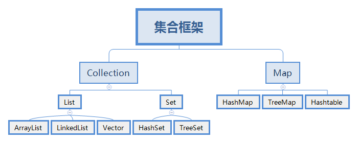

---
面试专题-JavaSE-集合-001-ArrayList源码分析
---


- [一 ArrayList 源码分析（含扩容机制分析）](#一-arraylist-源码分析含扩容机制分析)
  - [1. ArrayList 概述](#1-arraylist-概述)
    - [1.1  List 是什么？](#11-list-是什么)
    - [1.2  ArrayList 是什么？](#12-arraylist-是什么)
    - [1.3 顺序表的优缺点](#13-顺序表的优缺点)
    - [1.4 时间复杂度证明](#14-时间复杂度证明)
  - [2. 核心源码分析](#2-核心源码分析)
    - [2.1 类声明](#21-类声明)
    - [2.2 类成员](#22-类成员)
    - [2.4 构造方法](#24-构造方法)
    - [2.5 最小化实例容量方法](#25-最小化实例容量方法)
    - [2.5 扩容方法](#25-扩容方法)
    - [2.6 常规方法](#26-常规方法)
  - [3. 重点内容分析](#3-重点内容分析)
    - [3.1 扩容机制再分析](#31-扩容机制再分析)
      - [3.1.1 ArrayList 是如何被初始化的](#311-arraylist-是如何被初始化的)
      - [3.1.2 扩容机制流程分析（无参构造为例）](#312-扩容机制流程分析无参构造为例)
        - [3.1.2.1 add()](#3121-add)
        - [3.1.2.2 ensureCapacityInternal()](#3122-ensurecapacityinternal)
        - [3.1.2.3 calculateCapacity()](#3123-calculatecapacity)
        - [3.1.2.4 ensureExplicitCapacity](#3124-ensureexplicitcapacity)
        - [3.1.2.5 grow()](#3125-grow)
        - [3.1.2.6 hugeCapacity()](#3126-hugecapacity)
    - [3.2 System.arraycopy() 和 Arrays.copyOf() 复制方法](#32-systemarraycopy-和-arrayscopyof-复制方法)
      - [3.2.1 System.arraycopy()](#321-systemarraycopy)
      - [3.2.2  Arrays.copyOf()](#322-arrayscopyof)
    - [3.3 removeAll() 和 retainAll() 中的 batchRemove() 方法](#33-removeall-和-retainall-中的-batchremove-方法)
    - [3.4 并发修改异常问题探索](#34-并发修改异常问题探索)
      - [3.4.1 原因解释：](#341-原因解释)
      - [3.4.2 解决方案：](#342-解决方案)
        - [3.4.2.1 方式1：迭代器迭代元素，迭代器修改元素](#3421-方式1迭代器迭代元素迭代器修改元素)
        - [3.4.2.1 方式2：集合遍历元素，集合修改元素（普通for）](#3421-方式2集合遍历元素集合修改元素普通for)
      - [3.4.3 iterator.remove() 的弊端](#343-iteratorremove-的弊端)


# 一 ArrayList 源码分析（含扩容机制分析）

## 1. ArrayList 概述

### 1.1  List 是什么？

 <div align="center">
	
</div>


List 在 Collection中充当着一个什么样的身份呢？——有序的 collection(也称为序列) 


实现这个接口的用户以对列表中每个元素的插入位置进行精确地控制。用户可以根据元素的整数索引（在列表中的位置）访问元素，并搜索列表中的元素。与 set 不同，列表通常允许重复的元素。

### 1.2  ArrayList 是什么？

`ArrayList` 的底层就是一个数组，依赖其扩容机制（后面会提到）它能够实现容量的动态增长，所以 ArrayList 就是数据结构中顺序表的一种具体实现。

其特点为：查询快，增删慢，线程不安全，效率高。

### 1.3 顺序表的优缺点

**优点：**

1. 逻辑与物理顺序一致，顺序表能够按照下标直接**快速的存取元素**
2. 无须为了表示表中元素之间的逻辑关系而增加额外的存储空间

**缺点：**

1. 线性表长度需要初始定义，常常难以确定存储空间的容量，所以只能以降低效率的代价使用扩容机制

2. 插入和**删除操作需要移动大量的元素，效率较低**

### 1.4 时间复杂度证明

**读取**：

还记的这个公式吗？

$$Loc(a_i) = Loc(a_1) + (i -1)*L$$

通过这个公式我们可以在任何时候计算出线性表中任意位置的地址，并且对于计算机所使用的时间都是相同的，即一个常数，这也就意味着，它的时间复杂度为 O(1)

**插入和删除**：

我们以插入为例子

- 首先最好的情况是这样的，元素在末尾的位置插入，这样无论该元素进行什么操作，均不会对其他元素产生什么影响，所以它的时间复杂度为 O(1) 

- 那么最坏的情况又是这样的，元素正好插入到第一个位置上，这就意味着后面的所有元素全部需要移动一个位置，所以时间复杂度为 O(n)

- 平均的情况呢，由于在每一个位置插入的概率都是相同的，而插入越靠前移动的元素越多，所以平均情况就与中间那个值的一定次数相等，为 (n - 1) / 2 ，平均时间复杂度还是 O(n)

**总结**：

读取数据的时候，它的时间复杂度为 O(1)，插入和删除数据的时候，它的时间复杂度为 O(n)，所以线性表中的顺序表更加适合处理一些元素个数比较稳定，查询读取多的问题


## 2. 核心源码分析

### 2.1 类声明

先来看一下类的声明，有一个继承（抽象类）和四个接口关系

```java
public class ArrayList<E> extends AbstractList<E>
        implements List<E>, RandomAccess, Cloneable, java.io.Serializable
{ 
    // 源码具体内容... 
}
```

- `RandomAccess` 是一个标志接口（Marker）只要 List 集合实现这个接口，就能支持快速随机访问（通过元素序号快速获取元素对象 —— `get(int index)`）

- `Cloneable` ：实现它就可以进行克隆（`clone()`）

- `java.io.Serializable` ：实现它意味着支持序列化，满足了序列化传输的条件

### 2.2 类成员

下面接着看一些成员属性

```java
// 序列化自动生成的一个码，用来在正反序列化中验证版本一致性。
private static final long serialVersionUID = 8683452581122892189L;

/**
 * 默认初始容量大小为10
 */
private static final int DEFAULT_CAPACITY = 10;

/**
 * 指定 ArrayList 容量为0（空实例）时，返回此空数组
 */
private static final Object[] EMPTY_ELEMENTDATA = {};

/**
 * 与 EMPTY_ELEMENTDATA 的区别是，它是默认返回的，而前者是用户指定容量为 0 才返回
 */
private static final Object[] DEFAULTCAPACITY_EMPTY_ELEMENTDATA = {};

/**
 * 具体存放元素的数组
 * 保存添加到 ArrayList 中的元素数据（第一次添加元素时，会扩容到 DEFAULT_CAPACITY = 10 ） 
 */
transient Object[] elementData; // non-private to simplify nested class access

/**
 * ArrayList 实际所含元素个数（大小）
 */
private int size;
```

### 2.4 构造方法

```java
/**
 * 带参构造函数，参数为用户指定的初始容量
 */
public ArrayList(int initialCapacity) {
    if (initialCapacity > 0) {
        // 参数大于0，创建 initialCapacity 大小的数组
        this.elementData = new Object[initialCapacity];
    } else if (initialCapacity == 0) {
        // 参数为0，创建空数组（成员中有定义）
        this.elementData = EMPTY_ELEMENTDATA;
    } else {
        // 其他情况，直接抛异常
        throw new IllegalArgumentException("Illegal Capacity: "+
                                           initialCapacity);
    }
}

/**
 * 默认无参构造函数，初始值为 0
 * 也说明 DEFAULT_CAPACITY = 10 这个容量
 * 不是在构造函数初始化的时候设定的（而是在添加第一个元素的时候）
 */
public ArrayList() {
    this.elementData = DEFAULTCAPACITY_EMPTY_ELEMENTDATA;
}

/**
 * 构造一个包含指定 collection 的元素的列表
 * 这些元素是按照该 collection 的迭代器返回它们的顺序排列的。
 */
public ArrayList(Collection<? extends E> c) {
    // 将给定的集合转成数组
    elementData = c.toArray();
    // 如果数组长度不为 0
    if ((size = elementData.length) != 0) {
        // elementData 如果不是 Object 类型的数据，返回的就不是 Object 类型的数组
        if (elementData.getClass() != Object[].class)
            // 将不是 Object 类型的 elementData 数组，赋值给一个新的 Object 类型的数组
            elementData = Arrays.copyOf(elementData, size, Object[].class);
    } else {
        // 数组长度为 0 ，用空数组代替
        this.elementData = EMPTY_ELEMENTDATA;
    }
}
```

### 2.5 最小化实例容量方法

```java
/**
 * 最小化实例容量方法，可以根据实际元素个数，将数组容量优化，防止浪费
 */
public void trimToSize() {
    modCount++;
    // 数组容量大于实际元素个数（例如10个元素，却有15个容量）
    if (size < elementData.length) {
        // 根据元素实际个数，重新最小化实例容量
        elementData = (size == 0)
            ? EMPTY_ELEMENTDATA
            : Arrays.copyOf(elementData, size);
    }
}
```

### 2.5 扩容方法

这里只是按照顺序介绍，后面还会专门针对扩容进行一个分析

```java
/**
 * 增加ArrayList实例的容量，如果有必要，确保它至少可以保存由最小容量参数指定的元素数量。
 */
public void ensureCapacity(int minCapacity) {
    //如果元素数组不为默认的空，则 minExpand 的值为0，反之值为10
    int minExpand = (elementData != DEFAULTCAPACITY_EMPTY_ELEMENTDATA)
        // any size if not default element table
        ? 0
        // larger than default for default empty table. It's already
        // supposed to be at default size.
        : DEFAULT_CAPACITY;
    // 如果最小容量大于已有的最大容量
    if (minCapacity > minExpand) {
        ensureExplicitCapacity(minCapacity);
    }
}

/**
 * 计算最小扩容量（被调用）
 */
private static int calculateCapacity(Object[] elementData, int minCapacity) {
     // 如果元素数组为默认的空
    if (elementData == DEFAULTCAPACITY_EMPTY_ELEMENTDATA) {
        // 获取“默认的容量”和“传入参数 minCapacity ”两者之间的最大值
        return Math.max(DEFAULT_CAPACITY, minCapacity);
    }
    return minCapacity;
}

/**
 * 得到最小扩容量
 */
private void ensureCapacityInternal(int minCapacity) {
    ensureExplicitCapacity(calculateCapacity(elementData, minCapacity));
}


/**
 * 判断是否需要扩容
 */
private void ensureExplicitCapacity(int minCapacity) {
    modCount++;
    // overflow-conscious code
    // 如果最小容量比数组的长度还大
    if (minCapacity - elementData.length > 0)
        // 就调用grow方法进行扩容
        grow(minCapacity);
}

/**
 * 要分配的最大数组大小
 */
private static final int MAX_ARRAY_SIZE = Integer.MAX_VALUE - 8;

/**
 * ArrayList 扩容的核心方法
 */
private void grow(int minCapacity) {
    // 将当前元素数组长度定义为 oldCapacity 旧容量
    int oldCapacity = elementData.length;
    // 新容量更新为旧容量的1.5倍
    // oldCapacity >> 1 为按位右移一位，相当于 oldCapacity 除以2的1次幂
    int newCapacity = oldCapacity + (oldCapacity >> 1);
    // 然后检查新容量是否大于最小需要容量，若还小，就把最小需要容量当作数组的新容量
    if (newCapacity - minCapacity < 0)
        newCapacity = minCapacity;
    // 再检查新容量是否超出了ArrayList 所定义的最大容量
    if (newCapacity - MAX_ARRAY_SIZE > 0)
        // 若超出，则调用hugeCapacity()
        newCapacity = hugeCapacity(minCapacity);
    elementData = Arrays.copyOf(elementData, newCapacity);
}
	
/**
 * 比较minCapacity和 MAX_ARRAY_SIZE
 */
private static int hugeCapacity(int minCapacity) {
    if (minCapacity < 0) // overflow
        throw new OutOfMemoryError();
    return (minCapacity > MAX_ARRAY_SIZE) ?
        Integer.MAX_VALUE :
    MAX_ARRAY_SIZE;
}
```

### 2.6 常规方法

```java
/**
 * 返回元素数量
 */
public int size() {
    return size;
}

/**
 * 此列表元素数量为 0 则返回 true
 */
public boolean isEmpty() {
    return size == 0;
}

/**
 * 此列表含有指定元素，则返回true
 */
public boolean contains(Object o) {
    return indexOf(o) >= 0;
}

/**
 * 返回此列表中元素首次出现位置的索引
 * 若不包含此元素，则返回 -1
 */
public int indexOf(Object o) {
    if (o == null) {
        for (int i = 0; i < size; i++)
            if (elementData[i]==null)
                return i;
    } else {
        // 本质就是循环 equals 比对
        for (int i = 0; i < size; i++)
            if (o.equals(elementData[i]))
                return i;
    }
    return -1;
}

/**
 * 返回此列表中指定元素的最后一次出现的索引
 * 如果此列表不包含元素，则返回 -1
 */
public int lastIndexOf(Object o) {
    if (o == null) {
        for (int i = size-1; i >= 0; i--)
            if (elementData[i]==null)
                return i;
    } else {
        // 逆向循环 equals 比对
        for (int i = size-1; i >= 0; i--)
            if (o.equals(elementData[i]))
                return i;
    }
    return -1;
}


/**
 * 返回 ArrayList 实例的浅拷贝
 */
public Object clone() {
    try {
        ArrayList<?> v = (ArrayList<?>) super.clone();
        // 实现数组的复制，参数为被复制者的参数
        v.elementData = Arrays.copyOf(elementData, size);
        v.modCount = 0;
        return v;
    } catch (CloneNotSupportedException e) {
        // this shouldn't happen, since we are Cloneable
        throw new InternalError(e);
    }
}

/**
 * 返回一个包含此列表中所有元素的数组（理解为将集合转为数组即可）
 */
public Object[] toArray() {
    return Arrays.copyOf(elementData, size);
}

/**
 * 将list转化为你所需要类型的数组，然后返回
 */
@SuppressWarnings("unchecked")
public <T> T[] toArray(T[] a) {
    if (a.length < size)
        // Make a new array of a's runtime type, but my contents:
        return (T[]) Arrays.copyOf(elementData, size, a.getClass());
    // 复制用法，下面专题会讲解此内容
    System.arraycopy(elementData, 0, a, 0, size);
    if (a.length > size)
        a[size] = null;
    return a;
}

// Positional Access Operations

@SuppressWarnings("unchecked")
E elementData(int index) {
    return (E) elementData[index];
}

/**
 * 返回此列表中指定位置的元素。
 */
public E get(int index) {
    // index 范围检查
    rangeCheck(index);
    return elementData(index);
}

/**
 * 用指定的元素替换此列表中指定位置的元素。
 */
public E set(int index, E element) {
    // index 范围检查
    rangeCheck(index);
	// 根据 index 找到想替换的旧元素
    E oldValue = elementData(index);
    // 替换元素
    elementData[index] = element;
    return oldValue;
}

/**
 * 将指定的元素追加到此列表的末尾。
 */
public boolean add(E e) {
    // 确认 list 容量，尝试容量加 1，看看有无必要扩容
    ensureCapacityInternal(size + 1);  // Increments modCount!!
    // 赋值
    elementData[size++] = e;
    return true;
}

/**
 * 在此列表中的指定位置插入指定的元素
 * 再将从index开始之后的所有成员后移一个位置；将element插入index位置；最后size加1。
 */
public void add(int index, E element) {
    // 调用 rangeCheckForAdd 对 index 进行范围检查
    rangeCheckForAdd(index);
	// 保证容量足够
    ensureCapacityInternal(size + 1);  // Increments modCount!!
    // 自己复制自己，然后达到 index 之后全部元素向后挪一位的效果
    System.arraycopy(elementData, index, elementData, index + 1,
                     size - index);
    // 然后将 index 赋值为指定的元素
    elementData[index] = element;
    size++;
}

/**
 * 移除该列表中指定位置的元素。 将任何后续元素移动到左侧（从其索引中减去一个元素）。
 */
public E remove(int index) {
    // 调用 rangeCheckForAdd 对 index 进行范围检查
    rangeCheck(index);
    modCount++;
    // 找到待移除的值
    E oldValue = elementData(index);
	// 计算出需要移动元素的数量
    int numMoved = size - index - 1;
    if (numMoved > 0)
        // 同样复制自己，使得被移除元素右侧的元素整体向左移动
        System.arraycopy(elementData, index+1, elementData, index,
                         numMoved);
    elementData[--size] = null; // clear to let GC do its work
    return oldValue;
}

/**
 * 从集合中移除第一次出现的指定元素
 */
public boolean remove(Object o) {
    if (o == null) {
        for (int index = 0; index < size; index++)
            if (elementData[index] == null) {
                fastRemove(index);
                return true;
            }
    } else {
        // 也很简单，就是一个循环 equals 判断，然后移除
        for (int index = 0; index < size; index++)
            if (o.equals(elementData[index])) {
                fastRemove(index);
                return true;
            }
    }
    return false;
}

/*
 * 跳过范围检查的删除方式，与remove(Object o)相同
 */
private void fastRemove(int index) {
    modCount++;
    int numMoved = size - index - 1;
    if (numMoved > 0)
        System.arraycopy(elementData, index+1, elementData, index,
                         numMoved);
    elementData[--size] = null; // clear to let GC do its work
}

/**
 * 从列表中删除所有元素。
 */
public void clear() {
	modCount++;
    // clear to let GC do its work
    for (int i = 0; i < size; i++)
        // 元素全部设为 null
        elementData[i] = null;
    // 长度设为 0
    size = 0;
}

/**
 * 按指定集合的Iterator返回的顺序
 * 将指定集合中的所有元素追加到此列表的末尾。
 */
public boolean addAll(Collection<? extends E> c) {
    // 转为数组
    Object[] a = c.toArray();
    // 拿到待添加指定数组的长度
    int numNew = a.length;
    // 确认 list 容量，尝试容量加上 numNew，看看有无必要扩容
    ensureCapacityInternal(size + numNew);  // Increments modCount
    // 利用 arraycopy 指定数组a的元素追加到当前数组 elementData 后
    System.arraycopy(a, 0, elementData, size, numNew);
    size += numNew;
    return numNew != 0;
}

/**
 * 按指定集合的Iterator返回的顺序
 * 将指定集合中的所有元素添加到此列表中，从指定位置开始
 * 
 */
public boolean addAll(int index, Collection<? extends E> c) { 
    rangeCheckForAdd(index);
    Object[] a = c.toArray();
    int numNew = a.length;
    ensureCapacityInternal(size + numNew);  // Increments modCount
	// 计算需要移动的元素
    int numMoved = size - index;
    if (numMoved > 0)
        // 实现元素指定位置的插入，本质还是 arraycopy 自身
        System.arraycopy(elementData, index, elementData, index + numNew,
                         numMoved);

    System.arraycopy(a, 0, elementData, index, numNew);
    size += numNew;
    return numNew != 0;
}

/**
 * 删除指定索引范围内的元素（fromIndex - toIndex）
 * 将任何后续元素移动到左侧（减少其索引）。
 */
protected void removeRange(int fromIndex, int toIndex) {
    modCount++;
    int numMoved = size - toIndex;
    System.arraycopy(elementData, toIndex, elementData, fromIndex,
                     numMoved);

    // clear to let GC do its work
    int newSize = size - (toIndex-fromIndex);
    for (int i = newSize; i < size; i++) {
        elementData[i] = null;
    }
    size = newSize;
}

/**
 * 检查给定的索引是否在范围内。
 */
private void rangeCheck(int index) {
    // 下标越界就直接抛异常
    if (index >= size)
        throw new IndexOutOfBoundsException(outOfBoundsMsg(index));
}

/**
 * 另一个版本，针对add 和 addAll使用
 */
private void rangeCheckForAdd(int index) {
    if (index > size || index < 0)
        throw new IndexOutOfBoundsException(outOfBoundsMsg(index));
}

/**
 * 与上面套娃使用
 */
private String outOfBoundsMsg(int index) {
    return "Index: "+index+", Size: "+size;
}

/**
 * 从此列表中删除指定集合中包含的所有元素。
 */
public boolean removeAll(Collection<?> c) {
    Objects.requireNonNull(c);
    return batchRemove(c, false);
}

/**
 * 仅保留此列表中包含在指定集合中的元素。即删掉没有的部分
 */
public boolean retainAll(Collection<?> c) {
    Objects.requireNonNull(c);
    return batchRemove(c, true);
}

/**
 * 删除的具体逻辑，下面会有专题讲解
 */
private boolean batchRemove(Collection<?> c, boolean complement) {
    final Object[] elementData = this.elementData;
    int r = 0, w = 0;
    boolean modified = false;
    try {
        for (; r < size; r++)
            // 通过循环判断数组中有没有指定数组中的每一个值，complement 是参数传递的
            if (c.contains(elementData[r]) == complement)
                // 就将原数组的r位置的数据覆盖掉w位置的数据
                // r位置的数据不变，并其w自增，r自增
                // 否则，r自增，w不自增
                // 本质：把需要移除的数据都替换掉，不需要移除的数据前移
                elementData[w++] = elementData[r];
    } finally {
        // Preserve behavioral compatibility with AbstractCollection,
        // even if c.contains() throws.
        if (r != size) {
            System.arraycopy(elementData, r,
                             elementData, w,
                             size - r);
            w += size - r;
        }
        if (w != size) {
            // clear to let GC do its work
            for (int i = w; i < size; i++)
                elementData[i] = null;
            modCount += size - w;
            size = w;
            modified = true;
        }
    }
    return modified;
}

// writeObject readObject 序列化相关的省略
   
/**
 * 列表迭代器：List集合特有的迭代器
 */
public ListIterator<E> listIterator(int index) {
    if (index < 0 || index > size)
        throw new IndexOutOfBoundsException("Index: "+index);
    return new ListItr(index);
}


public ListIterator<E> listIterator() {
    return new ListItr(0);
}

// foreach 遍历等同于 iterator
public Iterator<E> iterator() {
    return new Itr();
}


private class Itr implements Iterator<E> {
    // 下一个要访问的元素下标
    int cursor; 
    // 上一个要访问的元素下标
    int lastRet = -1; 
    // 代表对 ArrayList 修改次数的期望值，初始值为 modCount
    int expectedModCount = modCount;

    Itr() {}

    // 下标如果
    public boolean hasNext() {
        return cursor != size;
    }

    /**
     * 刚开始cursor = 0，lastRet = -1
     * 整个过程结束 cursor 和 lastRet 都会自增 1
     */
    @SuppressWarnings("unchecked")
    public E next() {
        // 跳转本质是判断 modCount 是否等于 expectedModCount
        checkForComodification();
        int i = cursor;
       // 判断 cursor 是否超过集合大小和数组长度
        if (i >= size)
            throw new NoSuchElementException();
        Object[] elementData = ArrayList.this.elementData;
        if (i >= elementData.length)
            throw new ConcurrentModificationException();
        cursor = i + 1;
        // 将 cursor 赋值给 lastRet，然后把此下标处的元素返回
        return (E) elementData[lastRet = i];
    }

    public void remove() {
        // 先判断 lastRet 的值是否小于 0
        if (lastRet < 0)
            throw new IllegalStateException();
        // 跳转本质是判断 modCount 是否等于 expectedModCount
        checkForComodification();

        try {
            // 直接调用 ArrayList 的 remove 方法删除下标为 lastRet 的元素
            ArrayList.this.remove(lastRet);
            cursor = lastRet;
            lastRet = -1;
            expectedModCount = modCount;
        } catch (IndexOutOfBoundsException ex) {
            throw new ConcurrentModificationException();
        }
    }
    
    // forEachRemaining 略

    final void checkForComodification() {
        if (modCount != expectedModCount)
            throw new ConcurrentModificationException();
    }
}


```

## 3. 重点内容分析

### 3.1 扩容机制再分析

#### 3.1.1 ArrayList 是如何被初始化的

ArrayList 提供了 1 个无参构造和 2 个带参构造来初始化 ArrayList ，我们在创建 ArrayList  时，经常使用无参构造的方式，其本质就是初始化了一个空数组，直到向数组内真的添加元素的时候才会真的去分配容量。例如：向数组中添加第一个元素，数组容量扩充为 10 

> 补充：JDK7 无参构造 初始化 ArrayList 对象时，直接创建了长度是 10 的 Object[] 数组elementData 

#### 3.1.2 扩容机制流程分析（无参构造为例）

##### 3.1.2.1 add()

一般来说，都是通过 add 方法触发扩容机制，我们拿最简单的尾部追加的 add() 方法举例

```java
/**
 * 将指定的元素追加到此列表的末尾。
 */
public boolean add(E e) {
    // 确认 list 容量，尝试容量加 1，看看有无必要扩容
    ensureCapacityInternal(size + 1);  // Increments modCount!!
    // 赋值
    elementData[size++] = e;
    return true;
}
```

核心要点就这一句 `ensureCapacityInternal(size + 1);` 

##### 3.1.2.2 ensureCapacityInternal()

追踪进去

```java
/**
 * 得到最小扩容量
 */
private void ensureCapacityInternal(int minCapacity) {
    ensureExplicitCapacity(calculateCapacity(elementData, minCapacity));
}
```

方法内调用了 `ensureExplicitCapacity()` 方法，参数是 `calculateCapacity(elementData, minCapacity)`

先来分析一下这个参数的结果是什么，聚焦到 `calculateCapacity()` 方法中去

##### 3.1.2.3 calculateCapacity()

```java
/**
 * 计算最小扩容量（被调用）
 */
private static int calculateCapacity(Object[] elementData, int minCapacity) {
     // 如果元素数组为默认的空
    if (elementData == DEFAULTCAPACITY_EMPTY_ELEMENTDATA) {
        // 获取“默认的容量”和“传入参数 minCapacity ”两者之间的最大值
        return Math.max(DEFAULT_CAPACITY, minCapacity);
    }
    return minCapacity;
}
```

也很简单，就是为了计算出一个最小扩容量，当元素为初次初始化时，数组还没进过扩容，是一个空数组，所以会走 if 这个判断，而且当时传入的 size + 1 也就是 minCapacity 的值为 0 + 1 = 1 ，经过一个取大值的操作，与默认的 DEFAULT_CAPACITY 进行比对，自然返回的就是 10。

如果数组已经不是为空了，就直接返回一个 minCapacity （size + 1）就可以了

##### 3.1.2.4 ensureExplicitCapacity

ensureCapacityInternal 方法内调用了 `ensureExplicitCapacity(参数已经计算出来了)` 方法

继续去看它

```java
/**
 * 判断是否需要扩容
 */
private void ensureExplicitCapacity(int minCapacity) {
    modCount++;
    // overflow-conscious code
    // 如果最小容量比数组的长度还大
    if (minCapacity - elementData.length > 0)
        // 就调用grow方法进行扩容
        grow(minCapacity);
}
```

此方法的核心就是 if 判断这个数组需不需要扩容，可以分为三种情况

- add 第 1 个元素时：此时数组还只是一个被初始化过的空数组，minCapacity 经过 `calculateCapacity` 计算会返回 DEFAULT_CAPACITY 的默认值 10，而 elementData.length 也自然是 0，所以 minCapacity - elementData.length > 0 是成立的，直接进入 `grow(minCapacity);` 开始扩容。

- add 第 2 到 10 个元素的时候（以 2 举例）：此时 minCapacity  = size + 1 = 1 + 1 = 2 ，而 elementData.length 已经在添加第 1 个元素后等于 10 了。所以 minCapacity - elementData.length > 0 就不成立了，所以不会进入  `grow(minCapacity);` ，也不会扩容
  - 添加第 3 ... 10 个元素的时候，都是一样的。
- add 第 11 个元素的时候，minCapacity  变成了 11，比 10 还要大，所以又一次进去扩容了

##### 3.1.2.5 grow()

这里是真正去执行扩容逻辑的代码

```java
/**
 * 要分配的最大数组大小
 */
private static final int MAX_ARRAY_SIZE = Integer.MAX_VALUE - 8;

/**
 * ArrayList 扩容的核心方法
 */
private void grow(int minCapacity) {
    // 将当前元素数组长度定义为 oldCapacity 旧容量
    int oldCapacity = elementData.length;
    // 新容量更新为旧容量的1.5倍
    // oldCapacity >> 1 为按位右移一位，相当于 oldCapacity 除以2的1次幂
    int newCapacity = oldCapacity + (oldCapacity >> 1);
    // 然后检查新容量是否大于最小需要容量，若还小，就把最小需要容量当作数组的新容量
    if (newCapacity - minCapacity < 0)
        newCapacity = minCapacity;
    // 再检查新容量是否超出了ArrayList 所定义的最大容量
    if (newCapacity - MAX_ARRAY_SIZE > 0)
        // 若超出，则调用hugeCapacity()
        newCapacity = hugeCapacity(minCapacity);
    elementData = Arrays.copyOf(elementData, newCapacity);
}
```

扩容的核心就是这句：`int`

` newCapacity = oldCapacity + (oldCapacity >> 1);`

本质就是扩容 1.5 倍，而且其中使用了移位运算，这里从计算的角度上来看，相当于 oldCapacity 除以 2 的 1 次幂（偶数除以 2 刚好除尽，奇数丢掉小数部分）。使用按位右移，效率会高很多

> `>>` 按位右移运算符：最高位为 0，左边补齐 0，最高位是 1，左边补齐 1
>
> - 快速计算：把 `>>` 左边的数据 除以 2 的移动次幂：例如 -24 >> 2 即：-24  / 2 ^ 2 = -6
>
> —— 此项目 【001-Java基础知识】 章节中有具体介绍

扩容后，需要对这个新容量的范围进行一个判断，不能小于最小需要容量，也不能大于定义的最大容量，分情况细细看一下（以 1 和 11 举例，是因为这两种都是刚好需要扩容的）

- add 第 1 个元素的时候，数组还为空，所以无论是 oldCapacity 还是 newCapacity 都是 0，经过第一次判断后，newCapacity = minCapacity 执行了，此时 newCapacity  为 10，第二个判断不会进入，它不可能大于数组的最大容量。

- add 第 11 个元素的时候，oldCapacity  为 10，newCapacity = 10 + 10/2 = 15，大于 minCapacity  =  11，第一个判断不会进入，同时它肯定也没有大于数组最大 size，不会进入 。数组容量此时就扩为 15，add 方法中会返回一个 true，size 也增加成 11。

- 后面都是同样的道理 ...

##### 3.1.2.6 hugeCapacity()

这个方法就是在 newCapacity 大于 MAX_ARRAY_SIZE 的时候，开始判断 minCapacity 和 MAX_ARRAY_SIZE 谁大，然后赋予不同的值。

```java
/**
 * 比较minCapacity和 MAX_ARRAY_SIZE
 */
private static int hugeCapacity(int minCapacity) {
    if (minCapacity < 0) // overflow
        throw new OutOfMemoryError();
    return (minCapacity > MAX_ARRAY_SIZE) ?
        Integer.MAX_VALUE :
    MAX_ARRAY_SIZE;
}
```

### 3.2 System.arraycopy() 和 Arrays.copyOf() 复制方法

在前面的方法中，大量的用到了这两个方法，基本但凡涉及到元素移动的都会用到。

#### 3.2.1 System.arraycopy()

拿 add 方法中的举例

```java
/**
 * 在此列表中的指定位置插入指定的元素
 * 再将从index开始之后的所有成员后移一个位置；将element插入index位置；最后size加1。
 */
public void add(int index, E element) {
    // 调用 rangeCheckForAdd 对 index 进行范围检查
    rangeCheckForAdd(index);
	// 保证容量足够
    ensureCapacityInternal(size + 1);  // Increments modCount!!
    // 自己复制自己，然后达到 index 之后全部元素向后挪一位的效果
    System.arraycopy(elementData, index, elementData, index + 1,
                     size - index);
    // 然后将 index 赋值为指定的元素
    elementData[index] = element;
    size++;
}
```

arraycopy 是 System类 中的一个方法

```java
/**
 * 数组复制
 * 	src - 源数组。
 * 	srcPos - 源数组中的起始位置。
 * 	dest - 目标数组。 
 * 	destPos - 目的地数据中的起始位置。 
 * 	length - 要复制的数组元素的数量。
 */
public static void arraycopy(Object src, int srcPos, Object dest, int destPos, int length)
```

举例：

```java
public static void main(String[] args) {
    int[] arr = new int[10];
    arr[0] = 11;
    arr[1] = 22;
    arr[2] = 33;
    arr[3] = 44;
    arr[4] = 55;

    System.out.println("前：" + Arrays.toString(arr));
    // 指定下标后向后挪动一位
    System.arraycopy(arr, 1, arr, 2, 4);
    // 指定下标处替换元素
    arr[1] = 666;
    System.out.println("后：" + Arrays.toString(arr));
}

```

运行结果：

前：[11, 22, 33, 44, 55, 0, 0, 0, 0, 0]
后：[11, 666, 22, 33, 44, 55, 0, 0, 0, 0]

这样就实现了 add 中的一个指定下标插入操作（不考虑扩容）

#### 3.2.2  Arrays.copyOf()

所以，可以简单的认为，这个方法的目的只要是为了给原数组扩容。

```java
public static void main(String[] args) {

    int[] arr1 = {1, 2, 3, 4, 5};
    int[] arr2 = Arrays.copyOf(arr1, 5);
    int[] arr3 = Arrays.copyOf(arr1, 10);

    System.out.println(Arrays.toString(arr1));
    System.out.println(Arrays.toString(arr2));
    System.out.println(Arrays.toString(arr3));
}
```

运行结果：

[1, 2, 3, 4, 5]
[1, 2, 3, 4, 5]
[1, 2, 3, 4, 5, 0, 0, 0, 0, 0]

### 3.3 removeAll() 和 retainAll() 中的 batchRemove() 方法

在 removeAll() 和 retainAll() 方法中，都调用了  batchRemove()方法，区别只是传参不同，就能实现两种不同的正反删除效果

```java
/**
 * 从此列表中删除指定集合中包含的所有元素。
 */
public boolean removeAll(Collection<?> c) {
    Objects.requireNonNull(c);
    return batchRemove(c, false);
}

/**
 * 仅保留此列表中包含在指定集合中的元素。即删掉没有的部分
 */
public boolean retainAll(Collection<?> c) {
    Objects.requireNonNull(c);
    return batchRemove(c, true);
}
```

来重点看一下这个方法的源码

```java
/**
 * 删除的具体逻辑，下面会有专题讲解
 */
private boolean batchRemove(Collection<?> c, boolean complement) {
    final Object[] elementData = this.elementData;
    int r = 0, w = 0;
    boolean modified = false;
    try {
        for (; r < size; r++)
            if (c.contains(elementData[r]) == complement)
                elementData[w++] = elementData[r];
    } finally {
        if (r != size) {
            System.arraycopy(elementData, r,
                             elementData, w,
                             size - r);
            w += size - r;
        }
        if (w != size) {
            for (int i = w; i < size; i++)
                elementData[i] = null;
            modCount += size - w;
            size = w;
            modified = true;
        }
    }
    return modified;
}
```

解释一下刚开始的那些字段

- size ：原数组长度

- elementData： 原数组

- modCount ： 从父类继承过来的变量，作用是记录着集合的修改次数。

来看第一个关键代码

```java
for (; r < size; r++)
	if (c.contains(elementData[r]) == complement)
		elementData[w++] = elementData[r];
```

我们以 removeAll() 为例，意图从此列表中删除指定集合中包含的所有元素。即，有的就删，没有的就不删。

所以 complement 经过参数传递过来自然是 false，所以参数指定数组中不含有原数组指定位置下标的数据的时候，就将 elementData[r] 位置的数据覆盖掉 elementData[w++] 位置的数据，r 根据循环++自增，w 根据变量 w++ 自增，若 if 表达式不成立则，r 自增，w 不自增。

举例：原数组：[1, 2, 3, 4, 5, 6, 7, 8, 9] ，指定参数数组： [a, b, c, 3, 5, 8, f]（[例子参考自](https://blog.csdn.net/weixin_40841731/article/details/85263889)）重新排版

| 循环次数 | r    | w    | 布尔值 | 赋值语句                      | 替换后的数组值              | 说明                |
| -------- | ---- | ---- | ------ | ----------------------------- | --------------------------- | ------------------- |
| 1        | 0    | 0    | true   | elementData[0]=elementData[0] | [1, 2, 3, 4, 5, 6, 7, 8, 9] | 1 替换 1，r++ ，w++ |
| 2        | 1    | 1    | true   | elementData[1]=elementData[1] | [1, 2, 3, 4, 5, 6, 7, 8, 9] | 2 替换 2，r++ ，w++ |
| 3        | 2    | 2    | false  |                               | [1, 2, 3, 4, 5, 6, 7, 8, 9] |                     |
| 4        | 3    | 2    | true   | elementData[2]=elementData[3] | [1, 2, 4, 4, 5, 6, 7, 8, 9] | 4 替换 3，r++ ，w++ |
| 5        | 4    | 3    | false  |                               | [1, 2, 4, 4, 5, 6, 7, 8, 9] |                     |
| 6        | 5    | 3    | true   | elementData[3]=elementData[5] | [1, 2, 4, 6, 5, 6, 7, 8, 9] | 6 替换 4，r++ ，w++ |
| 7        | 6    | 4    | true   | elementData[4]=elementData[6] | [1, 2, 4, 6, 7, 6, 7, 8, 9] | 7 替换 5，r++ ，w++ |
| 8        | 7    | 5    | false  |                               | [1, 2, 4, 6, 7, 6, 7, 8, 9] |                     |
| 9        | 8    | 5    | true   | elementData[5]=elementData[8] | [1, 2, 4, 6, 7, 9, 7, 8, 9] | 9 替换 6，r++ ，w++ |
|          | 9    | 6    |        |                               |                             |                     |

自己走一遍上面的逻辑，就能深刻的感受得到

**这步的作用：**把需要移除的数据都替换掉，不需要移除的数据前移。（这步的处理尤为重要！）

接下来进入 finally 中，这一段是最终肯定会执行的

```java
if (r != size) {
    System.arraycopy(elementData, r,elementData, w,size - r);
    w += size - r;
}
if (w != size) {
    for (int i = w; i < size; i++)
        elementData[i] = null;
    modCount += size - w;
    size = w;
    modified = true;
}
```

首先判断 r 是否等于 size，如果上面的循环正常执行结束，r 和 size 应该是相同的，所以肯定不会走上面，第一个 if 判断的目的就是为了解决某种异常情况下（异常，并发修改）导致的 for 循环未结束，此时 r != size 所以通过 arraycopy 将添加的元素追加到w索引后面。

而第二个 if ，主要是为了把 w 之后没处理过的给删掉，这样就可以达到目的了。

例如上面表格的例子，最后 w = 6，也就是 [1, 2, 4, 6, 7, 9, 7, 8, 9] 中从下标为 6 的元素 7 开始删除，将 7，8，9 赋值为 null 后面会被 GC 清理掉。最后得到的结果 [1, 2, 4, 6, 7, 9] 就是清除过的了 。


### 3.4 并发修改异常问题探索

```java
public static void main(String[] args) {
    // 创建集合对象
    List list = new ArrayList();

    // 存储元素
    list.add("I");
    list.add("love");
    list.add("you");

    Iterator it = list.iterator();
    while (it.hasNext()) {
        String s = (String) it.next();
        if ("love".equals(s)) {
            list.add("❤");
        }
        System.out.println(s);
    }
}

//运行结果(节选)
Exception in thread "main" java.util.ConcurrentModificationException
```

使用增强for或者迭代器遍历集合的时候，如果对集合进行 list的 remove 和 add 操作，会出现 ConcurrentModificationException 并发修改异常的问题。

#### 3.4.1 原因解释：

当我们对集合进行遍历的时候，我们会获取当前集合的迭代对象

```java
//List为例，获取集合的迭代对象
Iterator it = list.iterator();
```

这个迭代对象中，封装了迭代器的方法与集合本身的一些方法，当我们在迭代中使用集合本身的add / remove方法的时候，就产生了ConcurrentModificationException异常，通俗的说就是，在判断 equals 成功后，执行了 list 的 add / remove 方法， 操作集合中元素或者删除增加了，但是迭代器不清楚，所以就报错，如果迭代器中含有这一种方法（假设），我们是用迭代器添加元素就不会有问题了。

**详细解释**：

- 开始时，cursor 指向下标为 0 的元素，lastRet 指向下标为 -1 的元素，每次调用 next 方法，cursor 和 lastRet 会分别自增 1。

- 当突然 ArrayList 的 remove 方法被调用（不是 Itr 的 remove），会导致被删除元素后面的所有元素都会往前移动一位，且 modCount 这个修改次数会增加，继续循环，去执行 next 方法，而 next 方法中首先判断的就是 modCount 和 expectedModCount 是否相等，很明显由于 ArrayList  的操作，导致 modCount  变化，两者现在已经不等了，所以出现异常

```java
final void checkForComodification() {
    if (modCount != expectedModCount)
        throw new ConcurrentModificationException();
}
```

针对这个问题，我们给出两个解决方案

#### 3.4.2 解决方案：

##### 3.4.2.1 方式1：迭代器迭代元素，迭代器修改元素

我们假想如果Iterator迭代器中有添加或者删除等功能就好了，但很遗憾并没有，但是它的子接口 ListIterator 却拥有 add 这个功能（ListIterator 拥有 add、set、remove 方法，Iterator 拥有 remove 方法，这里只演示 add 方法，remove 方法就用原来的 Iterator .remove()  ）

ListIterator 的 add()和 Iterator  的 remove() 可以使用的原因都是因为，方法进行了添加删除操作后，都会执行 expectedModCount = modCount 这样的赋值操作，相当于告诉迭代器我进行了修改操作。

```java
public static void main(String[] args) {
    // 创建集合对象
    List list = new ArrayList();
    
    // 存储元素
    list.add("I");
    list.add("love");
    list.add("you");

    ListIterator lit = list.listIterator();
    while (lit.hasNext()) {
        String s = (String) lit.next();
        if ("love".equals(s)) {
            // add 、remove 都是可以的
            lit.add("❤");
        }
        System.out.print(s + " ");
    }
    
    System.out.println();

    for (Object l : list){
    	System.out.print(l + " ");
    }
}

//运行结果
I love you
I love ❤ you 
```

##### 3.4.2.1 方式2：集合遍历元素，集合修改元素（普通for）

```java
import java.util.ArrayList;
import java.util.List;
import java.util.ListIterator;

public class Demo2 {
    public static void main(String[] args) {
        //创建集合对象
        List list = new ArrayList();

        //存储元素
        list.add("I");
        list.add("love");
        list.add("you");

        for (int x = 0; x < list.size(); x++){
            String s = (String)list.get(x);
            if ("love".equals(s)){
                list.add("❤");
            }
            System.out.print(s + " ");
        }
    }
}

//运行结果
I love you ❤ 
```

两者均可以解决并发修改异常的问题，但是通过运行结果也可以看出，方法一添加后，在本次遍历中不会输出添加的结果，而方法二却可以。

补充：增强for循环实现将集合进行遍历，也产生了并发修改异常，这是因为增强for在底层也是调用的集合本身的 remove

#### 3.4.3 iterator.remove() 的弊端

- Iterator 只有 remove() 方法，add 方法在 ListIterator  中有
-  remove 之前必须先调用 next，remove 开始就对 lastRet 做了不能小于 0 的校验，而l astRet 初始化值为 -1
- next 后只能调用一次 remove，因为 remove 会将 lastRet 重新初始化为 -1