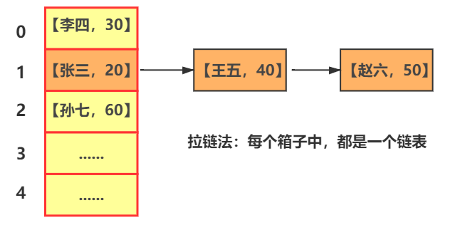
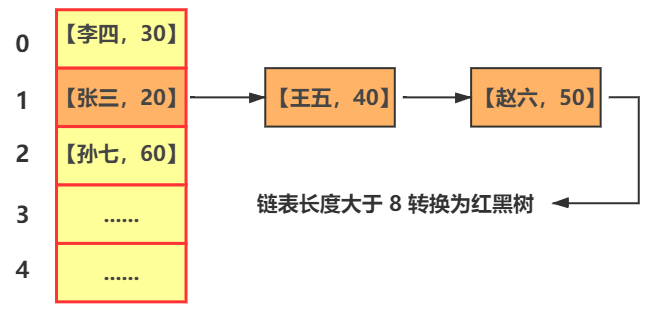
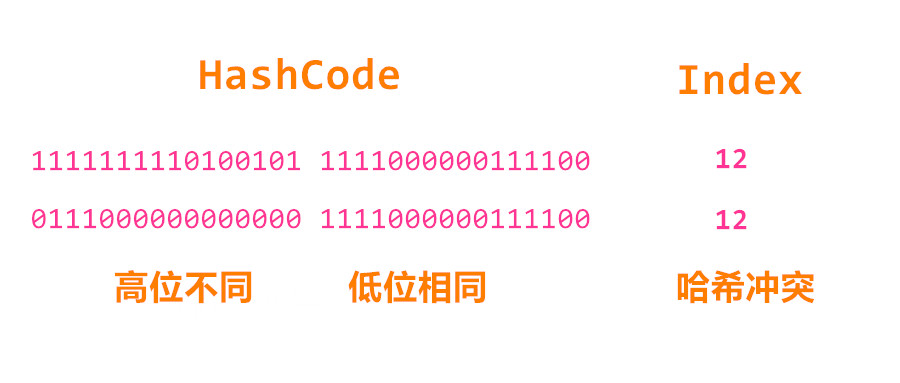
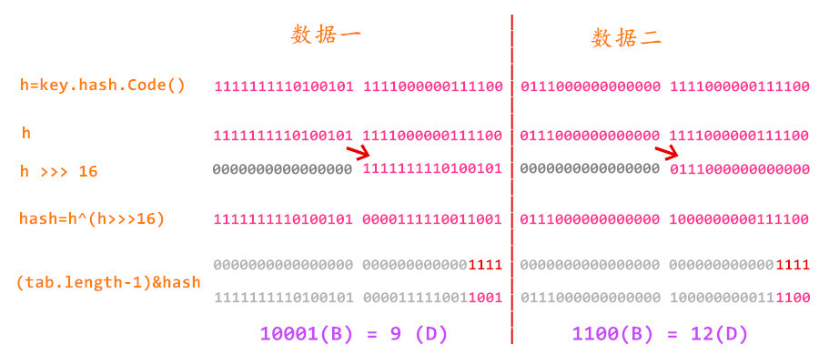

<!-- @import "[TOC]" {cmd="toc" depthFrom=1 depthTo=6 orderedList=false} -->

<!-- code_chunk_output -->

- [三 HashMap 源码分析](#三-hashmap-源码分析)
  - [1. 前置知识](#1-前置知识)
    - [1.1 什么是 Map](#11-什么是-map)
      - [1.1.1 概述](#111-概述)
      - [1.1.2 Map集合和Collection集合的区别](#112-map集合和collection集合的区别)
    - [1.2 什么是散列表](#12-什么是散列表)
      - [1.2.1 分析一下为什么要用散列表](#121-分析一下为什么要用散列表)
      - [1.2.2 散列表工作原理](#122-散列表工作原理)
      - [1.2.3 如何解决 Hash 冲突](#123-如何解决-hash-冲突)
        - [1.2.3.1 JDK 1.7](#1231-jdk-17)
        - [1.2.3.1 JDK 1.8](#1231-jdk-18)
    - [1.3 什么是红黑树](#13-什么是红黑树)
  - [2. 源码分析](#2-源码分析)
    - [2.1 类成员](#21-类成员)
    - [2.2 两个节点](#22-两个节点)
      - [2.2.1 Node 节点](#221-node-节点)
      - [2.2.2 TreeNode 节点](#222-treenode-节点)
    - [2.3 构造方法](#23-构造方法)
    - [2.4 添加方法](#24-添加方法)
      - [2.4.1 put()](#241-put)
      - [2.4.2 putVal()](#242-putval)
    - [2.5 获取方法](#25-获取方法)
      - [2.5.1 get()](#251-get)
      - [2.5.2 getNode](#252-getnode)
    - [2.6 移除方法](#26-移除方法)
      - [2.6.1 remove()](#261-remove)
    - [2.7 扩容方法](#27-扩容方法)
      - [2.7.1 resize()](#271-resize)
  - [3. 重点分析](#3-重点分析)
    - [3.1 hash() 中的扰动函数如何解决Hash冲突 ※](#31-hash-中的扰动函数如何解决hash冲突)

<!-- /code_chunk_output -->

# 三 HashMap 源码分析

## 1. 前置知识

### 1.1 什么是 Map

<div align="center">
	
</div>


> 在实际需求中，我们常常会遇到这样的问题，在诸多的数据中，通过其编号来寻找某一些信息，从而进行查看或者修改，例如通过学号查询学生信息。今天我们所介绍的Map集合就可以很好的帮助我们实现这种需求

#### 1.1.1 概述

Map是一种存储元素对的集合（元素对分别称作 键 和 值 也称键值对）它将键映射到值的对象。一个映射不能包含重复的键，并且每个键最 多只能映射到一个值。

> 怎么理解呢？ 
>
> 键 (key)：就是你存的值的编号	值 (value)：就是你要存放的数据
>
> 你可以近似的将键理解为下标，值依据键而存储，每个键都有其对应值。这两者是1、1对应的
>
> 但在之前下标是整数，但是Map中键可以使任意类型的对象。

#### 1.1.2 Map集合和Collection集合的区别

- Map集合存储元素是成对出现的，Map集合的键是唯一的，值是可重复的
- Collection集合存储元素是单独出现的，Collection的子类Set是唯一的，List是可重复的。
- Map集合的数据结构值针对键有效，跟值无关，Collection集合的数据结构是针对元素有效

### 1.2 什么是散列表

散列表也叫hash表 ，是根据关键码值而进行直接进行访问的数据结构。也就是说，它通过把关键码值映射到表中一个位置来访问记录，以加快查找的速度。这个映射也叫散列函数，存放记录的数组叫散列表。

> 一个通俗的例子是，为了查找电话簿中某人的号码，可以创建一个按照人名首字母顺序排列的表（即建立人名到首字母的一个函数关系），在首字母为W的表中查找“王”姓的电话号码，显然比直接查找就要快得多。这里使用人名作为关键字，“取首字母”是这个例子中散列函数的函数法则，存放首字母的表对应散列表。关键字和函数法则理论上可以任意确定。—— 维基百科

#### 1.2.1 分析一下为什么要用散列表

哈希表其实就是数组的一种扩展，因为其本质上用的就是数组可以**按照下标随机访问数据**的特点，我们来一步一步看一下

首先创建一个数组，我们将数组的每一个存储空间看做一个一个箱子或者一个一个桶，存储一些 key-value 的数据如，【张三，20】【李四，30】【王五，40】【赵六，50】【孙七，60】，依次放置于数组中。

如果按照普通顺序表的查询方式，就需要从开始依次比对查询，但是数据量越多，顺序表查找耗费的时间就越长。在大量数据的情况下，很显然不上算。

还有很多种数据结构，它们并不关心元素的顺序，能够快速的查找元素数据，其中一种就是：散列表

下面看看散列表如何做到这么高效处理的

#### 1.2.2 散列表工作原理

这次依旧使用 5 个箱子（桶）空间的数组来存储数据，我们开始存第一个数据【张三，20】，散列表会使用哈希函数（Hash算法）计算出 “张三” 的键，也就是字符串 “张三” 的哈希值，例如返回一个  5372 ，将其做取余处理，除数为数组的长度，即：5372 mod 5 = 2，因此将其放在下标（index）为 2 的位置，例如 第二个数据的哈希值为 6386，继续操作 6386 mod 5 = 1，即将其放在下标（index）为 1 的位置，以此类推.....

但是有一种情况就会出现了，例如我们存储第三个数据【王五，40】的时候，经过哈希函数计算，得出的结果为 5277，5277 mod 5 = 2 ，但是 2 这个位置已经有【张三，20】这个数据存在了，这种存储位置重复了的情况便叫作冲突

#### 1.2.3 如何解决 Hash 冲突

##### 1.2.3.1 JDK 1.7

在 JDK 1.8 之前，HashMap 的底层是数组和链表。因此当出现哈希冲突后，使用**拉链法**解决冲突。

拉链法，就是将数组的每一个格子（箱子），都看作一个链表，例如下标为 1 的格子，就是一个链表，已经存储了 【张三，20】，若仍有数据哈希值 mod 后等于 1 ，则直接在 1 中的这个链表中追加上这些数据就可以了。

<div align="center">
	
</div>


##### 1.2.3.1 JDK 1.8

JDK 8 做了一些较大的调整，当数组中每个格子里的链表，长度大于阈值（默认为8）时，将链表转化为红黑树，就可以大大的减少搜索时间。

而且，如果散列表快满的情况下下，还会有机制进行再散列，下面会在源码中深入分析。

<div align="center">
	
</div>


### 1.3 什么是红黑树

红黑树是一种复杂的树形结构，这里不做过于详细的解释，讲一下其基本的结构，有一个基本的概念。对于理解，还可以参考掘金上的一篇文章（[掘金-漫画：什么是红黑树？@程序员小灰](https://juejin.im/post/5a27c6946fb9a04509096248#comment)）非常不错！

红黑树就是为了防止二叉树一些极端的情况，例如变成一条线状，或者左右不均衡，从二叉查找树，2-3树 等演变出来的一种树形结构。最主要的目的就是为了保持平衡。保证树的左右分支叶子等基本平衡。

具体的数据结果演变是比较复杂的，这一篇还是主要讲解 HashMap ，有需要以后会专篇讲解一些常见的数据结构的 Java 版本

## 2. 源码分析

### 2.1 类成员

```jaVa
// 序列化自动生成的一个码，用来在正反序列化中验证版本一致性。
private static final long serialVersionUID = 362498820763181265L;   

// 默认的初始容量 1 * 2^4 = 16
static final int DEFAULT_INITIAL_CAPACITY = 1 << 4;

// 最大容量 1 * 2^30
static final int MAXIMUM_CAPACITY = 1 << 30;

// 默认的加载因子 0.75
static final float DEFAULT_LOAD_FACTOR = 0.75f;

// 桶的树化阈值，当桶(bucket)上的结点数大于这个值时会转成红黑树，
// 也就是上面提到的长度大于阈值（默认为8）时，将链表转化为红黑树
static final int TREEIFY_THRESHOLD = 8;

// 桶的链表还原阈值，当桶(bucket)上的结点数小于这个值时树转链表
// 一个道理
static final int UNTREEIFY_THRESHOLD = 6;

// 最小树形化容量阈值，当哈希表中的容量 > 该值时，才允许树形化链表 
// 否则，若桶内元素太多时，则直接扩容，而不是树形化
// 为了避免进行扩容和树形化选择的冲突，这个值不能小于 4 * TREEIFY_THRESHOLD
static final int MIN_TREEIFY_CAPACITY = 64;

// 存储元素的数组，总是2的幂次倍
transient Node<k,v>[] table; 

// 存放具体元素的集
transient Set<map.entry<k,v>> entrySet;

// 存放元素的个数（不是数组的长度）
transient int size;

// 扩容和修改的计数变量
transient int modCount;   

// 临界值 当实际大小(容量*填充因子)超过临界值时，会进行扩容
int threshold;

// 加载因子
final float loadFactor;
```

其中有几个需要强调的内容

**threshold 临界值**

- 数组扩容的一个临界值，即当数组实际大小（容量 * 填充因子，即：threshold = capacity * loadFactor）超过临界值时，会进行扩容。

**loadFactor加载因子**

- 加载因子就是表示哈希表中元素填满的程度，当表中元素过多，超过加载因子的值时，哈希表会自动扩容，一般是一倍，这种行为可以称作rehashing（再哈希）。
- 加载因子的值设置的越大，添加的元素就会越多，确实空间利用率的到了很大的提升，但是毫无疑问，就面临着哈希冲突的可能性增大，反之，空间利用率造成了浪费，但哈希冲突也减少了，所以我们希望在空间利用率与哈希冲突之间找到一种我们所能接受的平衡，经过一些试验，定在了0.75f。

### 2.2 两个节点

因为一定条件下会转换成红黑树这种数据结果，所以除了普通的 Node 节点，还有 树节点（TreeNode 节点）

#### 2.2.1 Node 节点

```java
static class Node<K,V> implements Map.Entry<K,V> {
    // 哈希码，用来查找位置以及比对元素是否相同
    final int hash;
    // 键
    final K key;
    // 值
    V value;
    // 指向下一个结点
    Node<K,V> next;

    Node(int hash, K key, V value, Node<K,V> next) {
        this.hash = hash;
        this.key = key;
        this.value = value;
        this.next = next;
    }

    public final K getKey()        { return key; }
    public final V getValue()      { return value; }
    public final String toString() { return key + "=" + value; }
	
    // 重写了 hashCode， ^ 是位异或运算符
    public final int hashCode() {
        return Objects.hashCode(key) ^ Objects.hashCode(value);
    }

    public final V setValue(V newValue) {
        V oldValue = value;
        value = newValue;
        return oldValue;
    }

    // 重写 equals() 方法
    public final boolean equals(Object o) {
        if (o == this)
            return true;
        if (o instanceof Map.Entry) {
            Map.Entry<?,?> e = (Map.Entry<?,?>)o;
            if (Objects.equals(key, e.getKey()) &&
                Objects.equals(value, e.getValue()))
                return true;
        }
        return false;
    }
}
```

#### 2.2.2 TreeNode 节点

```java
static final class TreeNode<K,V> extends LinkedHashMap.Entry<K,V> {
    // 父节点
    TreeNode<K,V> parent;
    // 左节点
    TreeNode<K,V> left;
    // 右节点
    TreeNode<K,V> right;
    TreeNode<K,V> prev;
    // 判断颜色，默认红色
    boolean red;
    TreeNode(int hash, K key, V val, Node<K,V> next) {
        super(hash, key, val, next);
    }
    // 返回根节点
    final TreeNode<K,V> root() {
        for (TreeNode<K,V> r = this, p;;) {
            if ((p = r.parent) == null)
                return r;
            r = p;
        }
```

### 2.3 构造方法

```java
// 指定了具体容量大小和加载因子的构造函数
public HashMap(int initialCapacity, float loadFactor) {
    if (initialCapacity < 0)
        throw new IllegalArgumentException("Illegal initial capacity: " +
                                           initialCapacity);
    if (initialCapacity > MAXIMUM_CAPACITY)
        initialCapacity = MAXIMUM_CAPACITY;
    if (loadFactor <= 0 || Float.isNaN(loadFactor))
        throw new IllegalArgumentException("Illegal load factor: " +
                                           loadFactor);
    this.loadFactor = loadFactor;
    this.threshold = tableSizeFor(initialCapacity);
}

// 指定了具体容量大小的构造函数
public HashMap(int initialCapacity) {
    this(initialCapacity, DEFAULT_LOAD_FACTOR);
}

// 默认无参构造函数
public HashMap() {
    this.loadFactor = DEFAULT_LOAD_FACTOR; 
}

// 指定了 map 的构造函数
public HashMap(Map<? extends K, ? extends V> m) {
    this.loadFactor = DEFAULT_LOAD_FACTOR;
    putMapEntries(m, false);
}
```

**tableSizeFor**

```java
/**
 * 返回一个大于输入参数，且最接近的，2的整数次幂的数
 * 只是一个初始化内容，创建哈希表时，会再重新赋值
 */
static final int tableSizeFor(int cap) {
    int n = cap - 1;
    n |= n >>> 1;
    n |= n >>> 2;
    n |= n >>> 4;
    n |= n >>> 8;
    n |= n >>> 16;
    return (n < 0) ? 1 : (n >= MAXIMUM_CAPACITY) ? MAXIMUM_CAPACITY : n + 1;
}
```

**putMapEntries**

```java
final void putMapEntries(Map<? extends K, ? extends V> m, boolean evict) {
    // 拿到给定 Map 的长度
    int s = m.size();
    if (s > 0) {
        // 判断当前实际存储数据的这个 table 是否已经初始化
        if (table == null) { // pre-size
            // 没初始化，就将 s 处理后设为m的实际元素个数
            float ft = ((float)s / loadFactor) + 1.0F;
            // 防止小于最小容量（阈值）
            int t = ((ft < (float)MAXIMUM_CAPACITY) ?
                    (int)ft : MAXIMUM_CAPACITY);
            // 若大于临界值，则初始化阈值
            if (t > threshold)
                threshold = tableSizeFor(t);
        }
        // table 已初始化，并且给定 Map m 元素个数大于阈值，进行扩容处理
        else if (s > threshold)
            resize();
        // 将给定集合 m 中的所有元素添加至HashMap中
        for (Map.Entry<? extends K, ? extends V> e : m.entrySet()) {
            K key = e.getKey();
            V value = e.getValue();
            // putVal 方法会在介绍添加相关方法时介绍
            putVal(hash(key), key, value, false, evict);
        }
    }
}
```

### 2.4 添加方法

#### 2.4.1 put()

对于 HashMap ，其提供给外界的公共添加方法只有  put(K key, V value) 一个，其他 put 方法都是供 put(K key, V value) 内部调用的

```java
public V put(K key, V value) {
    return putVal(hash(key), key, value, false, true);
}
```

关于 putVal 的每个参数和细节下面接着说，看一下第一个参数 hash(key) 首先提一下，在 HashMap 中是如何计算 hash 值的，跳转到 3.1 可看，也可以看完最后去看也可以。

[3.1 hash() 中的扰动函数如何解决Hash冲突 ※](###3.1 hash() 中的扰动函数如何解决Hash冲突 ※)

#### 2.4.2 putVal()

```java
final V putVal(int hash, K key, V value, boolean onlyIfAbsent,
               boolean evict) {
    Node<K,V>[] tab; Node<K,V> p; int n, i;
    // table未初始化（为null）或者长度为0，调用 resize 进行扩容
    if ((tab = table) == null || (n = tab.length) == 0)
        n = (tab = resize()).length;
    // 若桶为空，即无发生碰撞
    // (n - 1) & hash 用来确定元素存放在哪个位置，即哪个桶中
    if ((p = tab[i = (n - 1) & hash]) == null)
        // 新生成结点放入桶中(数组中)
        tab[i] = newNode(hash, key, value, null);
    // 若桶中已经存在元素
    else {
        Node<K,V> e; K k;
        // 若节点 key 存在，就和要插入的key比较
        if (p.hash == hash &&
            ((k = p.key) == key || (key != null && key.equals(k))))
            // 如果key相同就直接覆盖 value
            e = p;
        // hash值不相等，即key不相等，转为红黑树结点
        else if (p instanceof TreeNode)
            // 插入到树中
            e = ((TreeNode<K,V>)p).putTreeVal(this, tab, hash, key, value);
        // 若是为链表结点
        else {
            // 遍历找到尾节点插入
            for (int binCount = 0; ; ++binCount) {
                // 到达链表的尾部
                if ((e = p.next) == null) {
                    // 在尾部插入新结点
                    p.next = newNode(hash, key, value, null);
                    // 结点数量达到阈值，转化为红黑树
                    if (binCount >= TREEIFY_THRESHOLD - 1) // -1 for 1st
                        treeifyBin(tab, hash);
                    // 跳出循环
                    break;
                }
                // 遍历的过程中，遇到相同 key 则覆盖 value
                if (e.hash == hash &&
                    ((k = e.key) == key || (key != null && key.equals(k))))
                    // 相等，跳出循环
                    break;
                // 用于遍历桶中的链表，与前面的e = p.next组合，可以遍历链表
                p = e;
            }
        }
        // 在桶中找到key值、hash值与插入元素相等的结点
        if (e != null) { 
            // 记录e的value
            V oldValue = e.value;
            // onlyIfAbsent 为 false 或者旧值为 null
            if (!onlyIfAbsent || oldValue == null)
                // 用新值替换旧值
                e.value = value;
            // 访问后回调
            afterNodeAccess(e);
            // 返回旧值
            return oldValue;
        }
    }
    // 结构性修改
    ++modCount;
    // 超过最大容量，扩容
    if (++size > threshold)
        resize();
    // 插入后回调
    afterNodeInsertion(evict);
    return null;
} 
```

**总结一下大致流程：**

- 先定位到具体的数组位置，例如叫做 A
- 若  A 处没有元素
  - 就直接插入
- 若  A 处 有元素就和待插入的 key 比较
  - 若 key 相同就直接覆盖
  - 若  key 不相同，就判断 p 是否是一个树节点
    - 如果是就调用putTreeVal 方法将元素添加进入
    - 如果不是就遍历链表插入（尾插法）

### 2.5 获取方法

#### 2.5.1 get()

同样 get 方法中也用到了 hash 方法计算 key 的哈希值，同样跳转到 3.1 可看，也可以看完最后去看也可以。

[3.1 hash() 中的扰动函数如何解决Hash冲突 ※](###3.1 hash() 中的扰动函数如何解决Hash冲突 ※)

```java
public V get(Object key) {
    Node<K,V> e;
    return (e = getNode(hash(key), key)) == null ? null : e.value;
}
```

#### 2.5.2 getNode

```java
final Node<K,V> getNode(int hash, Object key) {
    Node<K,V>[] tab; Node<K,V> first, e; int n; K k;
    // 保证计算出来的哈希值，确定是在哈希表上的
    if ((tab = table) != null && (n = tab.length) > 0 &&
        (first = tab[(n - 1) & hash]) != null) {
        // 要是直接在桶的首个位置上，直接就可以返回（这个桶中只有一个元素，或者在首个）
        if (first.hash == hash && // always check first node
            ((k = first.key) == key || (key != null && key.equals(k))))
            return first;
        // 桶中不止一个节点
        if ((e = first.next) != null) {
            // 在树中 get
            if (first instanceof TreeNode)
                return ((TreeNode<K,V>)first).getTreeNode(hash, key);
            // 在链表中get
            do {
                if (e.hash == hash &&
                    ((k = e.key) == key || (key != null && key.equals(k))))
                    return e;
            } while ((e = e.next) != null);
        }
    }
    return null;
}
```

### 2.6 移除方法

#### 2.6.1 remove()

同样 get 方法中也用到了 hash 方法计算 key 的哈希值，同样跳转到 3.1 可看，也可以看完最后去看也可以。

[3.1 hash() 中的扰动函数如何解决Hash冲突 ※](###3.1 hash() 中的扰动函数如何解决Hash冲突 ※)

```java
public V remove(Object key) {
    Node<K,V> e;
    return (e = removeNode(hash(key), key, null, false, true)) == null ?
        null : e.value;
}
```

2.6.2 removeNode()

```java
final Node<K,V> removeNode(int hash, Object key, Object value,
                           boolean matchValue, boolean movable) {
    Node<K,V>[] tab; Node<K,V> p; int n, index;
    // 桶不为空，映射的哈希值也存在
    if ((tab = table) != null && (n = tab.length) > 0 &&
        (p = tab[index = (n - 1) & hash]) != null) {
        Node<K,V> node = null, e; K k; V v;
        // 如果在桶的首位就找到对应元素，记录下来
        if (p.hash == hash &&
            ((k = p.key) == key || (key != null && key.equals(k))))
            node = p;
        // 若不在首位，就去红黑树或者链表中查询了
        else if ((e = p.next) != null) {
            if (p instanceof TreeNode)
                node = ((TreeNode<K,V>)p).getTreeNode(hash, key);
            else {
                do {
                    if (e.hash == hash &&
                        ((k = e.key) == key ||
                         (key != null && key.equals(k)))) {
                        node = e;
                        break;
                    }
                    p = e;
                } while ((e = e.next) != null);
            }
        }
        // 找到了要删除的节点和值，就分三种情况去删除，链表，红黑树，桶的首位
        if (node != null && (!matchValue || (v = node.value) == value ||
                             (value != null && value.equals(v)))) {
            if (node instanceof TreeNode)
                ((TreeNode<K,V>)node).removeTreeNode(this, tab, movable);
            else if (node == p)
                tab[index] = node.next;
            else
                p.next = node.next;
            ++modCount;
            --size;
            afterNodeRemoval(node);
            return node;
        }
    }
    return null;
}
```

### 2.7 扩容方法

#### 2.7.1 resize()

resize 在程序中是非常耗时的。要尽量避免用它。

- 其过程中会重新分配 hash ，然后遍历hash表中所有的元素

```java
final Node<K,V>[] resize() {
    Node<K,V>[] oldTab = table;
    int oldCap = (oldTab == null) ? 0 : oldTab.length;
    int oldThr = threshold;
    int newCap, newThr = 0;
    if (oldCap > 0) {
        // 超过最大值，不再扩容，没办法了
        if (oldCap >= MAXIMUM_CAPACITY) {
            threshold = Integer.MAX_VALUE;
            return oldTab;
        }
        // 没超过最大值，就扩充为原来的2倍
        else if ((newCap = oldCap << 1) < MAXIMUM_CAPACITY && oldCap >= DEFAULT_INITIAL_CAPACITY)
            newThr = oldThr << 1; // double threshold
    }
    else if (oldThr > 0) // initial capacity was placed in threshold
        // 初始化时，threshold 暂时保存 initialCapacity 参数的值
        newCap = oldThr;
    else { 
        // signifies using defaults
        newCap = DEFAULT_INITIAL_CAPACITY;
        newThr = (int)(DEFAULT_LOAD_FACTOR * DEFAULT_INITIAL_CAPACITY);
    }
    // 计算新的resize上限
    if (newThr == 0) {
        float ft = (float)newCap * loadFactor;
        newThr = (newCap < MAXIMUM_CAPACITY && ft < (float)MAXIMUM_CAPACITY ? (int)ft : Integer.MAX_VALUE);
    }
    threshold = newThr;
    @SuppressWarnings({"rawtypes","unchecked"})
        Node<K,V>[] newTab = (Node<K,V>[])new Node[newCap];
    table = newTab;
    if (oldTab != null) {
        // 将旧的键值对移动到新的哈希桶数组中
        for (int j = 0; j < oldCap; ++j) {
            Node<K,V> e;
            if ((e = oldTab[j]) != null) {
                oldTab[j] = null;
                // / 无链条，也就是没有下一个，只有自己
                if (e.next == null)
                    newTab[e.hash & (newCap - 1)] = e;
                else if (e instanceof TreeNode)
                    // 拆红黑树，先拆成两个子链表，再分别按需转成红黑树
                    ((TreeNode<K,V>)e).split(this, newTab, j, oldCap);
                else { 
                    // 拆链表，拆成两个子链表并保持原有顺序
                    Node<K,V> loHead = null, loTail = null;
                    Node<K,V> hiHead = null, hiTail = null;
                    Node<K,V> next;
                    do {
                        next = e.next;
                        // 原索引
                        if ((e.hash & oldCap) == 0) {
                            if (loTail == null)
                                loHead = e;
                            else
                                loTail.next = e;
                            loTail = e;
                        }
                        // 原索引 + oldCap
                        else {
                            if (hiTail == null)
                                hiHead = e;
                            else
                                hiTail.next = e;
                            hiTail = e;
                        }
                    } while ((e = next) != null);
                    // 原索引放到新的哈希桶中
                    if (loTail != null) {
                        loTail.next = null;
                        newTab[j] = loHead;
                    }
                    // 原索引 +oldCap 放到新的哈希桶中
                    if (hiTail != null) {
                        hiTail.next = null;
                        newTab[j + oldCap] = hiHead;
                    }
                }
            }
        }
    }
    return newTab;
}
```


## 3. 重点分析

### 3.1 hash() 中的扰动函数如何解决Hash冲突 ※

看HashMap的put方法源码：

```java
  //HashMap 源码节选-JDK8
  public V put(K key, V value) {
      return putVal(hash(key), key, value, false, true);
  }
```

而我们的值在返回前需要经过HashMap中的hash方法

接着定位到hash方法的源码：

```java
static final int hash(Object key) {
    int h;
    return (key == null) ? 0 : (h = key.hashCode()) ^ (h >>> 16);
}
```

hash方法的返回结果中是一句三目运算符，键 (key) 为null即返回 0,存在则返回后一句的内容

```java
(h = key.hashCode()) ^ (h >>> 16)
```

JDK8中 HashMap——hash 方法中的这段代码叫做 “**扰动函数**”

我们来分析一下：

hashCode 是 Object 类中的一个方法，在子类中一般都会重写，而根据我们之前自己给出的程序，暂以 Integer 类型为例，我们来看一下 Integer 中 hashCode 方法的源码：

```java
  /**
   * Returns a hash code for this {@code Integer}.
   *
   * @return  a hash code value for this object, equal to the
   *          primitive {@code int} value represented by this
   *          {@code Integer} object.
   */
  @Override
  public int hashCode() {
      return Integer.hashCode(value);
  }
  
  /**
   * Returns a hash code for a {@code int} value; compatible with
   * {@code Integer.hashCode()}.
   *
   * @param value the value to hash
   * @since 1.8
   *
   * @return a hash code value for a {@code int} value.
   */
  public static int hashCode(int value) {
      return value;
  }
```

Integer 中 hashCode 方法的返回值就是这个数本身

> 注：整数的值因为与整数本身一样唯一，所以它是一个足够好的散列

所以，下面的 A、B 两个式子就是等价的

```java
  //注：key为 hash(Object key)参数
 
  A：(h = key.hashCode()) ^ (h >>> 16)
  
  B：key ^ (key >>> 16)
```

分析到这一步，我们的式子只剩下位运算了，先不急着算什么，我们先理清思路

HashSet因为底层使用**哈希表（链表结合数组）**实现，存储时key通过一些运算后得出自己在数组中所处的位置。

我们在hashCoe方法中返回到了一个等同于本身值的散列值，但是考虑到int类型数据的范围：-2147483648~2147483647 ，着很显然，这些散列值不能直接使用，因为内存是没有办法放得下，一个40亿长度的数组的。所以它使用了对数组长度进行**取模运算**，得余后再作为其数组下标，**indexFor( )** ——JDK7中，就这样出现了，在JDK8中 indexFor()就消失了，而全部使用下面的语句代替，原理是一样的。

```java
  //JDK8中
  (tab.length - 1) & hash；
```

```java
  //JDK7中
  bucketIndex = indexFor(hash, table.length);
  
  static int indexFor(int h, int length) {
      return h & (length - 1);
  }
```

> 提一句，为什么取模运算时我们用 & 而不用 % 呢，因为位运算直接对内存数据进行操作，不需要转成十进制，因此处理速度非常快，这样就导致位运算 & 效率要比取模运算 % 高很多。

看到这里我们就知道了，存储时key需要通过**hash方法**和**indexFor( )**运算，来确定自己的对应下标

(取模运算，应以JDK8为准，但为了称呼方便，还是按照JDK7的叫法来说，下面的例子均为此，特此提前声明)

但是先直接看与运算(&)，好像又出现了一些问题，我们举个例子：

HashMap中初始长度为16，length - 1 = 15；其二进制表示为 00000000 00000000 00000000 00001111

而与运算计算方式为：遇0则0，我们随便举一个key值

```java
          1111 1111 1010 0101 1111 0000 0011 1100
  &       0000 0000 0000 0000 0000 0000 0000 1111
  ----------------------------------------------------
          0000 0000 0000 0000 0000 0000 0000 1100
```

我们将这32位从中分开，左边16位称作高位，右边16位称作低位，可以看到经过&运算后 结果就是高位全部归0，剩下了低位的最后四位。但是问题就来了，我们按照当前初始长度为默认的16，HashCode值为下图两个，可以看到，在不经过扰动计算时，只进行与(&)运算后 Index值均为 12 这也就导致了哈希冲突

<div align="center">
	
</div>

>  哈希冲突的简单理解：计划把一个对象插入到散列表(哈希表)中，但是发现这个位置已经被别的对象所占据了

例子中，两个不同的HashCode值却经过运算后，得到了相同的值，也就代表，他们都需要被放在下标为2的位置

一般来说，如果数据分布比较广泛，而且存储数据的数组长度比较大，那么哈希冲突就会比较少，否则很高。

但是，如果像上例中只取最后几位的时候，这可不是什么好事，即使我的数据分布很散乱，但是哈希冲突仍然会很严重。

别忘了，我们的扰动函数还在前面搁着呢，这个时候它就要发挥强大的作用了,还是使用上面两个发生了哈希冲突的数据，这一次我们加入扰动函数再进行与(&)运算

<div align="center">
	
</div>

> 补充 ：>>> 按位右移补零操作符，左操作数的值按右操作数指定的为主右移，移动得到的空位以零填充
> ​ ^ 位异或运算，相同则 0，不同则 1

可以看到，本发生了哈希冲突的两组数据，经过扰动函数处理后，数值变得不再一样了，也就避免了冲突

其实在**扰动函数**中，将**数据右位移16位**，哈希码的**高位和低位混合**了起来，这也正解决了前面所讲 高位归0，计算只依赖低位最后几位的情况, 这使得高位的一些特征也**对低位产生了影响**，使得**低位的随机性加强**，能更好的**避免冲突**
