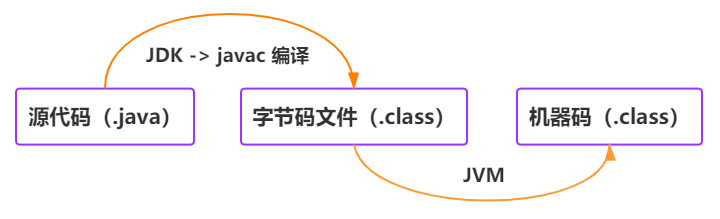
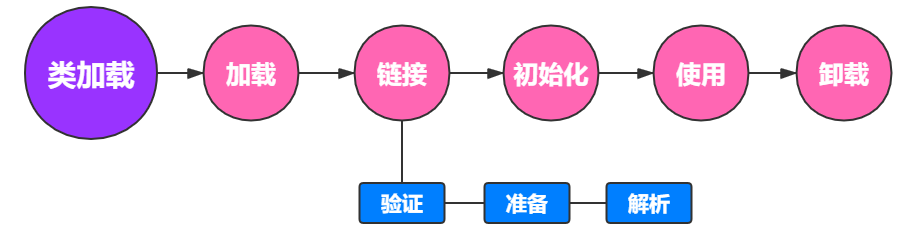
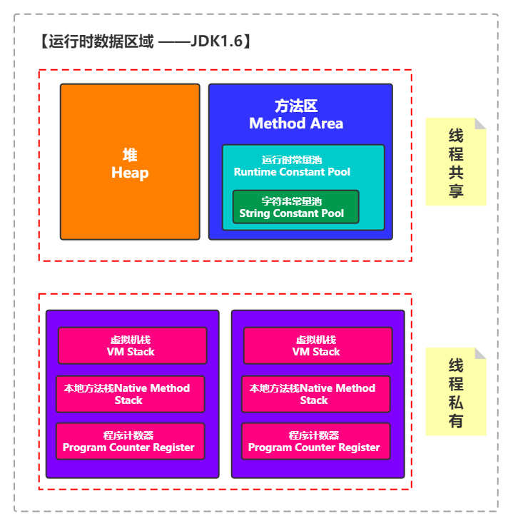
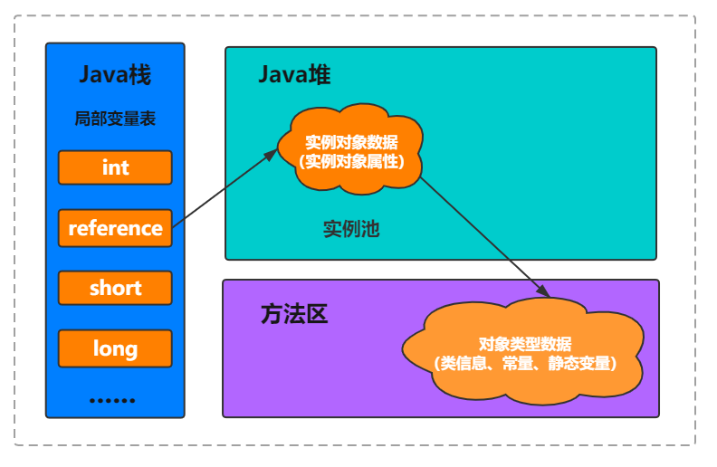
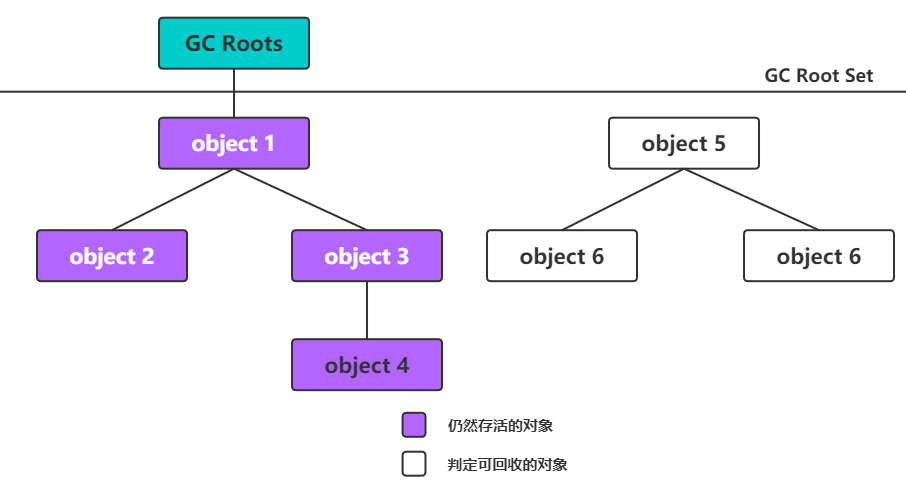
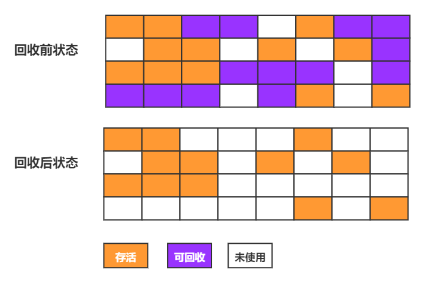
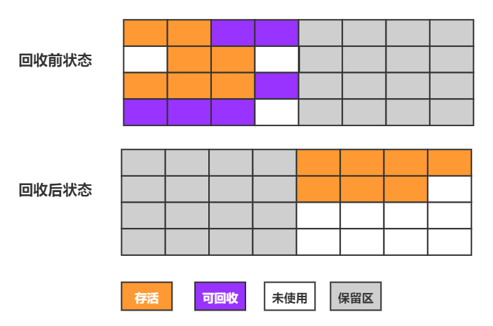

# 一 JVM 知识问答总结

## 1. JVM 基础

### 1.1 请你谈谈你对 JVM 的认识和理解

> 注：此部分在 /docs/java/javase-basis/001-Java基础知识.md 已经提到过。

JVM 又被称作 Java 虚拟机，用来运行 Java 字节码文件（`.class`），因为 JVM 对于特定系统（Windows，Linux，macOS）有不同的具体实现，即它屏蔽了具体的操作系统和平台等信息，因此同一字节码文件可以在各种平台中任意运行，且得到同样的结果。

#### 1.1.1 什么是字节码？

扩展名为 `.class` 的文件叫做字节码，是程序的一种低级表示，它不面向任何特定的处理器，只面向虚拟机（JVM），在经过虚拟机的处理后，可以使得程序能在多个平台上运行。

#### 1.1.2 采用字节码的好处是什么？

Java 语言通过字节码的方式，在一定程度上解决了传统解释型语言执行效率低的问题，同时又保留了解释型语言可移植的特点。所以 Java 程序运行时比较高效，而且，由于字节码并不专对一种特定的机器，因此，Java程序无须重新编译便可在多种不同的计算机上运行。

> **为什么一定程度上解决了传统解释型语言执行效率低的问题**（参考自思否-[**scherman**](https://segmentfault.com/u/scherman) ，仅供参考）
>
> 首先知道两点，① 因为 Java 字节码是伪机器码，所以会比解析型语言效率高 ② JVM不是解析型语言，是半编译半解析型语言
>
> 解析型语言没有编译过程，是直接解析源代码文本的，相当于在执行时进行了一次编译，而 Java 的字节码虽然无法和本地机器码完全一一对应，但可以简单映射到本地机器码，不需要做复杂的语法分析之类的编译处理，当然比纯解析语言快。

#### 1.1.3 你能谈一谈 Java 程序从代码到运行的一个过程吗？

<div align="center">
	
</div>


过程：编写 -> 编译 -> 解释（这也是 Java编译与解释共存的原因）

首先通过IDE/编辑器编写源代码然后经过 JDK 中的编译器（javac）编译成 Java 字节码文件（.class文件），字节码通过虚拟机执行，虚拟机将每一条要执行的字节码送给解释器，解释器会将其翻译成特定机器上的机器码（及其可执行的二进制机器码）。

### 1.2 你对类加载器有了解吗？

**定义：类加载器会根据指定class文件的全限定名称，将其加载到JVM内存，转为Class对象。**

#### 1.2.1 类加载器的执行流程

<div align="center">
	
</div>

**1.2.1.1 加载**

1. 通过一个类的全限定名来获取定义此类的二进制字节流。
2. 将这个二进制字节流所代表的静态存储结构导入为方法区的运行时数据结构。
3. 在java堆中生成一个java.lang.Class对象，来代表的这个类，作为方法区这些数据的入口。

**1.2.1.2 链接**

1. 验证：保证二进制的字节流所包含的信息符号虚拟机的要求，并且不会危害到虚拟机自身的安全。
2. 准备：为 static 静态变量（类变量）分配内存，并为其设置初始值。
   - 注：这些内存都将在方法区内分配内存，实例变量在堆内存中，而且实例变量是在对象初始化时才赋值
3. 解析：解析阶段就是虚拟机将常量池中的符号引用转化为直接引用的过程。
   - 例如 import xxx.xxx.xxx 属于符号引用，而通过指针或者对象地址引用就是直接引用

**1.2.1.3 初始化**

1. 初始化会对变量进行赋值，即对最初的零值，进行显式初始化，例如 `static int num = 0` 变成了 `static int num = 3` ，这些工作都会在类构造器 `<clinit>()` 方法中执行。而且虚拟机保证了会先去执行父类  `<clinit>()` 方法 。
   - 如果在静态代码块中修改了静态变量的值，会对前面的显示初始化的值进行覆盖

**1.2.1.4 卸载**

GC 垃圾回收内存中的无用对象

#### 1.2.2 类加载器有哪几种，加载顺序是什么样的？

JVM 中本身提供的类加载器（ClassLoader）主要有三种 ，除了 BootstrapClassLoader 是 C++ 实现以外，其他的类加载器均为 Java实现，而且都继承了 java.lang.ClassLoader

1.  BootStrapClassLoader（启动类加载器）：C++ 实现，JDK目录/lib 下面的 jar 和类，以及被 `-Xbootclasspath` 参数指定的路径中的所有类，都归其负责加载。
2.  ExtensionClassLoader: 加载扩展的jar包：负责加载 JRE目录/lib 下面的 jar 和类，以及被 `java.ext.dirs` 系统变量所指定的路径下的 jar 包。
3.  AppClassLoader：负责加载用户当前应用下 classpath 下面的 jar 包和类

注：顺序为最底层向上

#### 1.2.3 双亲委派机制有了解吗？

**1.2.3.1 概念**

双亲委派模型会要求除了顶层的启动类加载器外，其余的类加载器都应有自己的父类加载器，不过这里的父子关系一般不是通过继承来实现的，通常是使用组合关系来复用父加载器的代码

双亲委派模型的工作过程是：如果一个类加载器收到了类加载的请求，他首先不会自己去尝试加载这个类，而是把这个请求委派给父类加载器去完成，每一个层次的类加载都是如此，因此所有的加载请求都最终应该传送到最顶层的启动类加载器中，只有当父加载器反馈自己无法完成这个加载请求（也就是它的范围搜索中，也没有找到所需要的类），子加载器才会尝试自己去完成加载。

**1.2.3.2 优点**

- 加载位于rt.jar包中的类（例如 java.lang.Object）时不管是哪个加载器加载，最终都会委托最顶端的启动类加载器 BootStrapClassLoader 进行加载，这样保证它在各个类加载器环境下都是同一个结果。

- 避免了自定义代码影响 JDK 的代码，如果我们自己也创建了一个 java.lang.Object 然后放在程序的 classpath 中，就会导致系统中出现不同的 Object 类，Java 类型体系中最基础的行为也就无法保证。

```java
public class Object(){
    public static void main(){
    	......
    }
}
```

**1.2.3.3 如果不想使用双亲委派模型怎么办**

自定义类加载器，然后重写 loadClass() 方法

### 1.3 讲一讲 Java 内存区域（运行时数据区）

#### 1.3.1 总体概述

Java 程序在被虚拟机执行的时候，内存区域被划分为多个区域，而且尤其在 JDK 1.6 和 JDK 1.8 的版本下，有一些明显的变化，不过主题结构还是差不多的。

整体主要分为两个部分：

- 线程共享部分：
  - 程序计数器
  - 虚拟机栈
  - 本地方法栈
- 线程私有部分
  - 堆
  - 方法区（JDK 1.8 变为了元空间，元空间是位于直接内存中的）

注：我们配图以 JDK 1.6 为例，至于发生的变化我们在下面有说明

<div align="center">
	
</div>

#### 1.3.2 程序计数器

**概念**：程序计数器是一块较小的内存空间，可以看作是当前线程所执行的字节码的行号指示器。

- **作用 1 （流程控制）**：字节码解释器工作时就是通过改变这个计数器的值来选取下一条需要执行的字节码指令，分支、循环、跳转、异常处理、线程恢复等功能都需要依赖这个计数器来完成。

- **作用 2（线程恢复）**：为了线程切换后能恢复到正确的执行位置，每条线程都需要有一个独立的程序计数器，各线程之间计数器互不影响，独立存储，我们称这类内存区域为“线程私有”的内存。
- 线程切换的原因是：Java 虚拟机的多线程是通过线程轮流切换，分配处理器时间片实现的，所以在任意时刻，一个处理器都（多核处理器来说是一个内核）只能执行一条指令。

**1.3.2.1 为什么程序计数器是线程私有的？**

答：主要为了线程切换恢复后，能回到自己原先的位置。

#### 1.3.3 Java 虚拟机栈

Java 虚拟机栈描述的是 Java 方法执行的内存模型，每次方法调用时，都会创建一个栈帧，每个栈帧中都拥有：局部变量表、操作数栈、动态链接、方法出口信息。

大部分情况下，很多人会将 Java 内存笼统的划分为堆和栈（虽然这样划分有些粗糙，但是这也能说明这两者是程序员们最关注的位置），这个栈，其实就是 Java 虚拟机栈，或者说是其中的局部变量表部分。

- 局部变量表主要存放了编译期可知的各种数据类型（boolean、byte、char、short、int、float、long、double）、对象引用（reference 类型，它不同于对象本身，可能是一个指向对象起始地址的引用指针，也可能是指向一个代表对象的句柄或其他与此对象相关的位置）和 returnAddress 类型（指向一条字节码指令的地址）

**1.3.3.1 Java 虚拟机栈会出现哪两种错误？**

- `StackOverFlowError`：  如果 Java 虚拟机栈容量不能动态扩展，而此时线程请求栈的深度超过当前 Java 虚拟机栈的最大深度的时候，就抛出 StackOverFlowError 错误。

- `OutOfMemoryError`： 如果 Java 虚拟机栈容量可以动态扩展，当栈扩展的时候，无法申请到足够的内存（Java 虚拟机堆中没有空闲内存，垃圾回收器也没办法提供更多内存）

  
  
#### 1.3.4 本地方法栈

和虚拟机栈所发挥的作用非常相似，其区别是： 虚拟机栈为虚拟机执行 Java 方法 （也就是字节码）服务，而本地方法栈则为虚拟机使用到的 Native 方法服务。

- 因为本地方法栈中的方法，使用方式，数据结构，Java虚拟机规范，未做强制要求，具体的虚拟机可以自由的自己实现，例如：HotSpot 虚拟机中和 Java 虚拟机栈合二为一。

与虚拟机栈相同，在栈深度溢出，以及栈扩展失败的时候，也会出现 `StackOverFlowError` 和 `OutOfMemoryError` 两种错误。

**1.3.4.1 虚拟机栈和本地方法栈为什么是私有的？**

答：主要为了保证线程中的局部变量不被别的线程访问到

#### 1.3.5 堆

Java 虚拟机所管理的内存中最大的一块，Java 堆是所有线程共享的一块内存区域，在虚拟机启动时创建。此内存区域的唯一目的就是存放对象实例，几乎所有的对象实例以及数组都在这里分配内存。

- 但是，随着即时编译技术的进步，尤其是逃逸分析技术日渐强大，栈上分配、标量替换优化技术将导致了一些微妙的变化，所以，所有的对象都在堆上分配也渐渐变得不那么“绝对”了。
  - JDK 1.7 已经默认开启逃逸分析，如果某些方法中的对象引用没有被返回或者未被外面使用（即未逃逸出去），那么对象可以直接在栈上分配内存。

补充：Java 堆是垃圾收集器管理的主要区域，因此也被称作 GC 堆（Garbage Collected Heap）

#### 1.3.6 方法区

方法区与 Java 堆一样，是各个线程共享的内存区域，它用于存储已被虚拟机加载的类信息、常量、静态变量、即时编译器编译后的代码等数据。虽然 Java 虚拟机规范把方法区描述为堆的一个逻辑部分，但是它却有一个别名叫做 Non-Heap（非堆），目的应该是与 Java 堆区分开来。

注意：JDK1.7 开始，到 JDK 8 版本之后方法区（HotSpot 的永久代）被彻底移除了，变成了元空间，元空间使用的是直接内存。

**1.3.6.1 永久代是什么**

在JD K1.8之前，许多Java程序员都习惯在 hotspot 虚拟机上开发，部署程序，很多人更愿意把方法去称呼为永久代，或者将两者混为一谈，本质上这两者不是等价的，因为仅仅是当时 hotspot 虚拟机设计团队选择把收集器的分代设计扩展至方法区，或者说使用永久代来实现方法区而已，这样使得 hotspot 的垃圾收集器能够像管理 Java 堆一样管理这部分内存，省去专门为方法去编写内存管理代码的工作，但是对于其他虚拟机实现是不存在永久代的概念的。

**1.3.6.2 永久代为什么被替换成了元空间？**

- 永久代大小上限为固定的，无法调整修改。而元空间使用直接内存，与本机的可用内存有关，大大减少了溢出的几率
- JRockit 想要移植到 HotSpot 虚拟机的时候，因为两者对方法区的实现存在差异面临很多困难，所以 JDK 1.6 的时候 HotSpot 开发团队就有了放弃永久代，逐渐改变为本地内存的计划，到 JDK 1.7已经把原本放在永久代的字符串常量池，静态变量等移出，而到了JDK 1.8 完全放弃了永久代。

#### 1.3.7 运行时常量池

运行时常量池是方法区的一部分。Class 文件中除了有类的版本、字段、方法、接口等描述信息外，还有常量池表（用于存放编译期生成的各种字面量和符号引用，这部分内容将在类加载后存放到方法区的运行时常量池中）

**1.3.7.1 方法区的运行时常量池在 JDK 1.6 到 JDK 1.8 的版本中有什么变化？**

- 根据上面的 Java 内存区域图可知，JDK 1.6 方法区（HotSpot 的永久代）中的运行时常量池中包括了字符串常量池，
- JDK 1.7 版本下，字符串常量池从方法区中被移到了堆中（注：只有这一个移动了）
- JDK 1.8 版本下，HotSpot 的永久代变为了元空间，字符串常量池还在堆中，运行时常量也还在方法区中，只不过方法区变成了元空间

#### 1.3.7 直接内存

直接内存并不是虚拟机运行时数据区的一部分，也不是虚拟机规范中定义的内存区域，但是这部分内存也被频繁地使用。而且也可能导致 OutOfMemoryError 错误出现。

### 1.4 Java 对象创建访问到死亡

#### 1.4.1 Java 对象的创建（JVM方向）

**1.4.1.1 类加载检查** 

- **概念**：JVM（此处指 HotSpot）遇到 new 指令时，先检查指令参数是否能在常量池中定位到一个类的符号引用。
  - A：如果能定位到，就检查这个符号引用代表的类是否已被加载、解析和初始化过。
  - B：如果不能定位到，或没有检查到，就先执行相应的类加载过程。

**1.4.1.2 为对象分配内存**

**概念**：加载检查和加载后，就是分配内存，对象所需内存的大小在类加载完成后便完全确定（对象的大小 JVM 可以通过Java对象的类元数据获取）为对象分配内存相当于把一块确定大小的内存从Java堆里划分出来。

- **① 分配方式**
  - **A： 指针碰撞**：中间有一个区分边界的指针，两边分别是用过的内存区域，和没用过的内存区域，分配内存的时候，就向着空闲的那边移动指针。
    - 适用于：Java 堆是规整的情况下。
    - 应用：Serial 收集器、ParNew 收集器
  - **B： 空闲列表**：维护一个列表，其中记录哪些内存可用，分配时会找到一块足够大的内存来划分给对象实例，然后更新列表。
    - 适用于：堆内存不是很规整的情况下。
    - 应用：CMS 收集器

注：Java 堆是否规整，取决于 GC 收集器的算法是什么，如 “标记-清除” 就是不规整的，“标记-整理（压缩）” 、 “复制算法”  是规整的。这几种算法我们后面都会分别讲解。

- **② 线程安全问题**

  - 并发情况下，上述两种分配方式都不是线程安全的，JVM 虚拟机提供了两种解决方案

  - **A：同步处理：CAS + 失败重试**

    - CAS的全称是 Compare-and-Swap，也就是比较并交换。它包含了三个参数：V：内存值  、A：当前值（旧值）、B：要修改成的新值

      CAS 在执行时，只有 V 和 A 的值相等的情况下，才会将 V 的值设置为 B，如果 V 和 A 不同，这说明可能其他线程已经做了更新操作，那么当前线程值就什么也不做，最后 CAS 返回的是 V 的值。

      在多线程的的情况下，多个线程使用 CAS 操作同一个变量的时候，只有一个会成功，其他失败的线程，就会继续重试。

      正是这种机制，使得 CAS 在没有锁的情况下，也能实现安全，同时这种机制在很多情况下，也会显得比较高效。

  - **B：本地线程分配缓冲区：TLAB**

    - 为每一个线程在 Java  堆的 Eden 区分配一小块内存，哪个线程需要分配内存，就从哪个线程的 TLAB 上分配  ，只有 TLAB 的内存不够用，或者用完的情况下，再采用 CAS 机制

**1.4.1.3 对象初始化零值**

内存分配结束后，执行初始化零值操作，即保证对象不显式初始化零值的情况下，程序也能访问到零值

**1.4.1.4 设置对象头**

初始化零值后，显式赋值前，需要先对对象头进行一些必要的设置，即设置对象头信息，类元数据的引用，对象的哈希码，对象的 GC 分代年龄等。

**1.4.1.5 执行对象 init 方法**

此处用来对对象进行显式初始化，即根据程序者的意愿进行初始化，会覆盖掉前面的零值

#### 1.4.2 对象的访问定位方式哪两种方式？

首先举个例子： `Student student = new Student();`

假设我们创建了这样一个学生类，Student student 就代表作为一个本地引用，被存储在了 JVM 虚拟机栈的局部变量表中，此处代表一个 reference 类型的数据，而 new Student 作为实例数据存储在了堆中。还保存了对象类型数据（类信息，常量，静态变量）

而我们在使用对象的时候，就是通过栈上的这个 reference 类型的数据来操作对象，它有两种方式访问这个具体对象

1. **句柄**：在堆中划分出一块内存作为句柄池，reference 中存储的就是对象的句柄地址，而句柄中存储着对象实例数据和数据类型的地址。这种方式比较稳定，因为对象移动的时候，只改变句柄中的实例数据的指针，reference 是不需要修改的。
2. **直接指针**：即 reference 中存储的就是对象的地址。这种方式的优势就是快速，因为少了一次指针定位的开销

句柄方式配图：

<div align="center">
	
</div>

直接指针方式配图：

<div align="center">
	
</div>

#### 1.4.3 如何判断对象死亡

堆中几乎放着所有的对象实例，对堆垃圾回收前的第一步就是要判断哪些对象已经死亡（即不能再被任何途径使用的对象）。

- **引用计数法**：给对象中添加一个引用计数器，每当有一个地方引用它，计数器就加1；当引用失效，计数器就减1；任何时候计数器为0的对象就是不可能再被使用的。
  - 引用计数法原理简单，判定效率也很高，在很多场景下是一个不错的算法，但是在主流的 Java 领域中，因为其需要配合大量额外处理才能保证正确地工作。
    - 例如它很难解决两个对象之间循环引用的问题：对象 objA 和 objB 均含有 instance 字段，赋值令 objA.instance  = objB， objB.instance = objA，除此之外，这两个对象已经再无引用，实际上这两个已经不可能被再访问了，因为双方互相因哟红着对方，它们的引用计数不为零，引用技术算法也就无法回收它们。
- **可达性分析算法**：这个算法的基本思想就是通过一系列的称为 “GC Roots” 的对象作为起点，从这些节点开始向下搜索，节点所走过的路径称为引用链，当一个对象到 GC Roots 没有任何引用链相连的话，则证明此对象是不可能再被使用的

<div align="center">
	
</div>

**1.4.3.1 四种引用类型的程度**

> 无论是引用计数算法，还是可达性分析算法，判定对象的存活都与引用有关，但是 JDK 1.2 之间的版本，将对象的引用状态分为 “被引用” 和 “未被引用” 实际上有些狭隘，描述一些食之无味，弃之可惜的对象就有一些无能为力，所以1.2 之后边进行了更细致的划分。

JDK1.2之前，引用的概念就是，引用类型存储的是一块内存的起始地址，代表这是这块内存的一个引用。

JDK1.2以后，细分为强引用、软引用、弱引用、虚引用四种（逐渐变弱）

- **强引用**：垃圾回收器不会回收它，当内存不足的时候，JVM 宁愿抛出 OutOfMemoryError 错误，也不愿意回收它。
- **软引用**：只有在内存空间不足的情况下，才会考虑回收软引用。
- **弱引用**：弱引用比软引用声明周期更短，在垃圾回收器线程扫描它管辖的内存区域的过程中，只要发现了弱引用对象，就会回收它，但是因为垃圾回收器线程的优先级很低，所以，一般也不会很快发现并回收。
- **虚引用**：级别最低的引用类型，它任何时候都可能被垃圾回收器回收

### 1.5 讲讲几种垃圾收集算法

#### 1.5.1 标记清除算法

标记清除算法首先标记出所有不需要回收的对象，在标记完成后统一回收掉所有没有被标记的对象，也可以反过来。

它的主要缺点有两个：

- 第1个是执行效率不稳定，如果Java最终含有大量对象，而且其中大部分都是需要回收的，这是需要进行大量标记和清除动作，导致标记和清除两个过程的执行效率随着对象数量增长而降低。
- 第2个是内存空间的碎片化问题，标记清除后会产生大量不存连续的内存碎片空间，碎片太多会导致以后程序运行时需要分配较大对象时无法找到足够的连续内存，而不得不提前触发一次垃圾收集工作。

它属于基础算法，后续的大部分算法，都是在其基础上改进的。

<div align="center">
	
</div>

#### 1.5.2 标记复制算法

标记复制算法将可用内存按容量划分为大小相等的两块，每次只使用其中的一块，当这一块的内存用完了就将还存活着的对象复制到另一块上面，然后再把已经使用过的内存空间再次清理掉。

缺点：如果内存中多数对象都是存活的，这种算法将会产生大量的内存间复制的开销。****

优点：

- 但是对于多数对象都是可回收的情况，算法需要复制的就是占有少数的存活对象
- 每次都是针对整个半区进行内存回收，分配内存时，也不用考虑有空间碎片的复杂情况，只要移动堆顶指针按顺序分配即可

<div align="center">
	
</div>

#### 1.5.3 标记整理算法（标记压缩算法）

> 标记复制算法在对象存活率较高的时候就要进行较多的复制，操作效率将会降低，更关键的是如果不想浪费50%的空间，就需要有额外的空间进行分配担保以应对呗，使用内存所有对象都百分百存活的极端情况，所以在老年代一般是不采用这种算法的。

标记整理算法与标记清除算法一致，但后续步骤不是直接对可回收对象进行清理，而是让所有存货的对象都向内存空间一端移动，然后直接清理掉边界以外的内存

但移动存活对象也是有缺点的：尤其是在老年代这种每次回收都有大量对象存活的区域，移动存活对象并更新所有引用这些对象的地方，将会是一种极为负重的操作，而且这种对象移动操作必须全程暂停用户应用进程才能进行，这种停顿被称为 stop the world。

### 1.6 什么是分代收集算法

分代收集理论，首先它建立在两个假说之上：

1. **弱分代假说**：绝大多数对象都是朝生夕灭的
2. **强分带假说**：熬过越多次垃圾收集过程的对象就越难以消亡

所以多款常用垃圾收集器的一致设计原则即为：收集器应该将 Java 堆划分出不同的区域，然后将回收对象依据其年龄（即熬过垃圾收集过程次数）分配到不同的区域之中存储。

很明显的，如果一个区域中大部分的对象都是朝生夕灭，难以熬过垃圾收集过程，那么把它们集中放在一起，每次回收就只需要考虑如何保留少量存活的对象，而不是去标记那些大量要被回收的对象，这样就能以一种比较低的代价回收大量空间，如果剩下的都是难以消亡的对象，就把它们集中到一块，虚拟机便可以使用较低的频率来回收这个区域。

所以，分代收集算法的思想就是根据对象存活周期的不同，将内存分为几块，例如分为新生代（Eden 空间、From Survivor 0、To Survivor 1 ）和老年代，然后再各个年代选择合适的垃圾收集算法

- 新生代 ( Young ) 与老年代 ( Old ) 的比例的值为 1:2
- Edem : From Survivor 0 : To Survivor 1 = 8 : 1 : 1

新生代中每次都会有大量对象死去，所以选择清除复制算法，要比标记清除更高效，只需要复制移动少量存活下来的对象即可。

老年代中对象存活的几率比较高，所以要选择标记清除或者标记整理算法。

#### 1.6.1 为什么新生代要分为Eden区和Survivor区?

注：此处参考引用博文：[为什么新生代内存需要有两个Survivor区](https://blog.csdn.net/antony9118/article/details/51425581) 注明出处，请尊重原创

> 补充：
>
> - Minor GC / Young GC ：新生代收集
> - Major GC / Old GC ：老年代收集
> - Full GC 整堆收集

如果没有Survivor，Eden区每进行一次Minor GC，存活的对象就会被送到老年代。老年代很快被填满，触发Major GC（因为Major GC一般伴随着Minor GC，也可以看做触发了Full GC）。老年代的内存空间远大于新生代，进行一次Full GC消耗的时间比Minor GC长得多。你也许会问，执行时间长有什么坏处？频发的Full GC消耗的时间是非常可观的，这一点会影响大型程序的执行和响应速度，更不要说某些连接会因为超时发生连接错误了。

- Survivor的存在意义，就是减少被送到老年代的对象，进而减少Full GC的发生，Survivor的预筛选保证，只有经历16次Minor GC还能在新生代中存活的对象，才会被送到老年代。

#### 1.6.2 为什么要设置两个Survivor区?（有争议，待修改）

引用博文的作者观点：设置两个Survivor区最大的好处就是解决了碎片化，刚刚新建的对象在Eden中，经历一次Minor GC，Eden中的存活对象就会被移动到第一块survivor space S0，Eden被清空；等Eden区再满了，就再触发一次Minor GC，Eden和S0中的存活对象又会被复制送入第二块survivor space S1（这个过程非常重要，因为这种复制算法保证了S1中来自S0和Eden两部分的存活对象占用连续的内存空间，避免了碎片化的发生）。S0和Eden被清空，然后下一轮S0与S1交换角色，如此循环往复。如果对象的复制次数达到16次，该对象就会被送到老年代中。

个人观点，更本质是考虑了效率问题，如果是因为产生了碎片的问题，我完全可以使用标记整理方法解决，我更倾向于理解为整理空间带来的性能消耗是远大于使用两块 survivor 区进行复制移动的消耗的。

注：如果这一块不清楚，可以参考一下引用文章的图片。

 #### 1.6.3 哪些对象会直接进入老年代

1. 大对象直接进入老年代

   - 在分配空间时它容易导致内存，明明还有不少空间时就提前触发垃圾收集，以获取足够的连续空间才能好安置他们，而当复制对象时大对象就意味着高额的内存复制开销，这样做的目的就是避免在 Eden区 以及两个 survivor 区之间来回复制产生大量的内存复制操作

2. 长期存活的对象进入老年代

   - HotSpot 虚拟机采用了分代收集的思想来管理内存，那么内存回收时就必须能识别哪些对象应放在新生代，哪些对象应放在老年代中。为了做到这一点，虚拟机给每个对象一个对象年龄（Age）计数器，存储在对象头中。

     如果对象在 Eden 出生并经过第一次 Minor GC 后仍然能够存活，并且能被 Survivor 容纳的话，将被移动到 Survivor 空间中，并将对象年龄设为 1.对象在 Survivor 中每熬过一次 MinorGC,年龄就增加 1 岁，当它的年龄增加到一定程度（默认为 15 岁），就会被晋升到老年代中。对象晋升到老年代的年龄阈值，可以通过参数 `-XX:MaxTenuringThreshold` 来设置。

#### 1.6.3 动态对象年龄判定

为了能更好的适应不同程序的内存状况，HotSpot 虚拟机并不是永远要求对象年龄必须达到 -XX:MaxTenuringThreshold，才能晋升老年代，如果在 Survivor 空间中相同年龄所有对象大小的总和大于 Survivor 空间的一半，年龄大于或等于该年龄的对象就可以直接进入老年代。

### 1.7 介绍一下常见的垃圾回收器

#### 1.7.1 Serial 收集器

Serial 收集器是最基本、历史最悠久的垃圾收集器了。在 JDK 1.3.1 之前是 HotSpot 虚拟机新生代收集器的唯一选择，大家看名字就知道这个收集器是一个单线程收集器了。它的 “单线程” 的意义不仅仅意味着它只会使用一条垃圾收集线程去完成垃圾收集工作，更重要的是它在进行垃圾收集工作的时候必须暂停其他所有的工作线程（ "Stop The World" ），直到它收集结束。

- 新生代采用复制算法，老年代采用标记-整理算法。

> 对于 "Stop The World" 带给用户的恶劣体验早期 HotSpot  虚拟机的设计者们表示完全理解，但也表示委屈：你妈妈在给你打扫房间的时候，肯定会让你老老实实的在椅子上或者房间外等待，如果她一边打扫你一边乱扔纸屑，这房间还能打扫完吗？这其实是一个合情合理的矛盾，虽然垃圾收集这项工作听起来和打扫房间属于一个工种，但实际上肯定要比打扫房间复杂很多。
>
> 虽然从现在看来，这个收集器已经老而无用，弃之可惜，但是它仍然是 HotSpot  虚拟机在客户端模式下默认的新生代收集器，因为其有着优秀的地方，就是简单而又高效，内存消耗也是最小的。

#### 1.7.2 ParNew 收集器

ParNew 收集器其实就是 Serial 收集器的多线程版本，除了使用多线程进行垃圾收集外，其余行为（控制参数、收集算法、Stop The World、对象分配规则、回收策略等）和 Serial 收集器完全一样。

它除了支持多线程并行收集之外，与 Serial 收集器相比没有太多的创新之处，但却是不少运行在Server 服务端模式下的 HotSpot  虚拟机的选择。

- 新生代采用复制算法，老年代采用标记-整理算法。

#### 1.7.3 Parallel Scavenge 收集器

Parallel Scavenge 收集器也是基于**标记-复制算法**的多线程收集器，看起来和 ParNew 收集器很相似。

Parallel Scavenge 的目标是达到一个可控制的吞吐量（处理器用于运行这个程序的时间和处理器总消耗的时间之比），即高效利用 CPU，同时它也提供了很多参数供用户找到最合适的停顿时间或最大吞吐量。

#### 1.7.4  Serial Old 收集器
Serial 收集器的老年代版本，它同样是一个单线程收集器。其主要意义还是提供客户端模式下的 HotSpot 虚拟机使用。

- 如果实在服务端的模式下，也可能有两种用途：
  - 一种用途是在 JDK1.5 以及以前的版本中与 Parallel Scavenge 收集器搭配使用，
  - 一种用途是作为 CMS 收集器的后备方案。

#### 1.7.5 Parallel Old 收集器
Parallel Scavenge 收集器的老年代版本。也是一个基于 “标记-整理”算法的多线程收集器。在注重吞吐量以及 CPU 资源的场合，都可以优先考虑 Parallel Scavenge 收集器和 Parallel Old 收集器。

#### 1.7.6 CMS 收集器

CMS（Concurrent Mark Sweep） 收集器是一种以获得最短回收停顿时间为目标的收集器，能给用户带来比较好的交互体验。基于标记清除算法。

- **初始标记：** 初始标记仅仅是标记一下 GC Roots 能 直接关联到的对象，速度很快
- **并发标记：**并发标记就是从 GC Roots 的直接关联对象，开始遍历整个对象图的过程，这个过程耗时较长，但不需要停顿，用户线程可以与垃圾收集线程一起并发执行
- **重新标记：** 重新标记阶段就是为了修正并发标记期间，因为用户程序继续运行而导致标记产生变动的那一部分对象的标记记录，这个阶段的停顿时间一般会比初始标记阶段的时间稍长，远远比并发标记阶段时间短。
- **并发清除：** 最后是并发清除阶段，清理删除掉标记阶段判断的已经死亡的对象，由于不需要移动存活对象，所以这个阶段也是可以与用户线程并发的。

#### 1.7.7 G1 收集器

G1 (Garbage-First) 是一款面向服务器的垃圾收集器，主要针对配备多颗处理器及大容量内存的机器. 以极高概率满足 GC 停顿时间要求的同时，还具备高吞吐量性能特征。同时不会产生碎片。

- **初始标记**：仅仅是标记一下 GC Roots 能直接关联到的对象，并且修改 TAMS 指针的值，让下一阶段用户线程并发运行时能正确的在可用的 Region中分配新对象，这个阶段需要停顿线程，但耗时很短，而且是借用进行Minor GC 的时候同步完成的，所以 G1 收集器在这个阶段其实没有额外的停顿。

- **并发标记**：从GC Root 开始，对堆中对象进行可达性分析，递归扫描整个堆里的对象图找出要回收对象，这阶段耗时较长，但可以与用户程序并发执行，当对象扫描完成后，还要重新处理 SATB 记录下的，在并发时有引用变动的对象。
- **最终标记**：对用户现场做另一个短暂的暂停，用于处理并发阶段结束后仍遗留下来最后那少量的 SATB 记录。
- **筛选回收**：负责更新 Region 的统计数据，对各个 Region 的回收价值和成本进行排序，根据用户所期望的停顿时间来制定回收计划，可以自由选择任意多个 Region 构成回收集，然后决定回收的那一部分 Region 的存货对象复制到空的 Region 中，在清理到整个就 Region 的全部空间，这里面涉及操作存活对象的移动是必须暂停用户线程，由多条收集线程并行完成的

优点和特点：

- G1 能在充分利用 CPU 的情况下，缩短 Stop-The-World 的时间，GC 时为并发状态，不会暂停 Java 程序运行。
- 保留了分代概念，但是它其实可以独立管理整个 GC 堆。
- G1 从整理上看是基于标记整理算法实现的，从局部上看是基于标记复制算法的。
- G1 除了追求停顿以外，还建立了可以预测的停顿时间模型，能让使用者明确指定在一个长度为 M 毫秒的时间片段内。