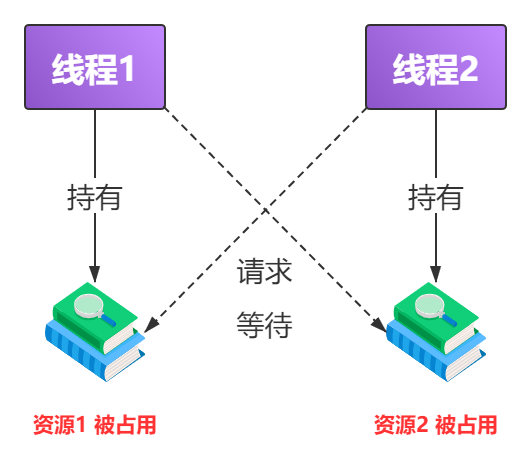
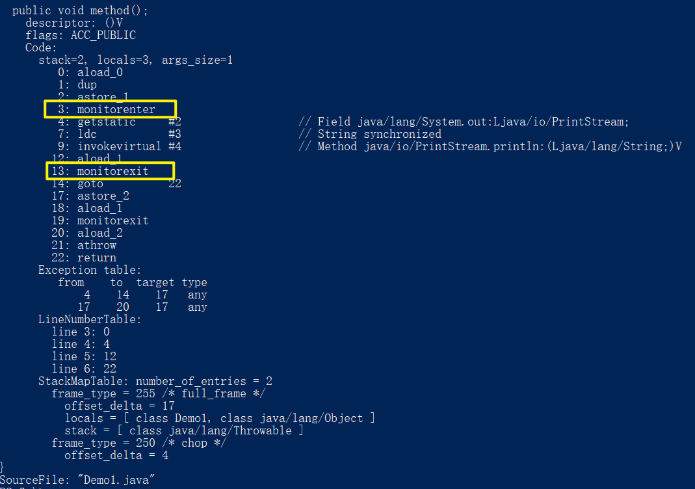
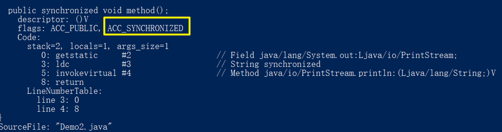
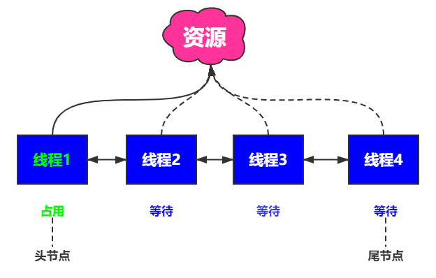
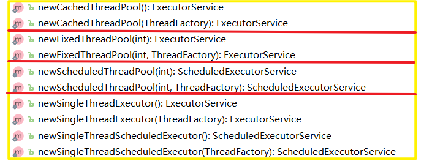

<!-- @import "[TOC]" {cmd="toc" depthFrom=1 depthTo=6 orderedList=false} -->

<!-- code_chunk_output -->

- [一 多线程及并发知识问答总结](#一-多线程及并发知识问答总结)
  - [1. 基础](#1-基础)
    - [1.1 什么是进程？什么是线程？（概念层面）](#11-什么是进程什么是线程概念层面)
      - [1.1.1 线程和进程的关系和区别？](#111-线程和进程的关系和区别)
    - [1.2 什么是串行，并发，并行？](#12-什么是串行并发并行)
    - [1.3 使用多线程/并发编程的原因？](#13-使用多线程并发编程的原因)
    - [1.4 多线程/并发编程带来的问题](#14-多线程并发编程带来的问题)
      - [1.4.1 什么是死锁？](#141-什么是死锁)
      - [1.4.2 什么是线程安全？](#142-什么是线程安全)
    - [1.5 线程的状态有哪几种？](#15-线程的状态有哪几种)
      - [1.5.1 调用 start() 方法时会执行 run() 方法，为什么不直接调用 run() 方法？](#151-调用-start-方法时会执行-run-方法为什么不直接调用-run-方法)
      - [1.5.2 sleep() 方法和 wait() 方法的区别和共同点](#152-sleep-方法和-wait-方法的区别和共同点)
    - [1.6 什么是上下文切换？](#16-什么是上下文切换)
    - [1.7 五种实现多线程的方式](#17-五种实现多线程的方式)
      - [1.7.1 继承 Thread 类](#171-继承-thread-类)
      - [1.7.2 实现 Runnable接口](#172-实现-runnable接口)
      - [1.7.3 实现 Callable 接口](#173-实现-callable-接口)
      - [1.7.4 使用 Executors 创建线程池](#174-使用-executors-创建线程池)
      - [1.7.5 使用 ThreadPoolExecutor 创建线程池（推荐）](#175-使用-threadpoolexecutor-创建线程池推荐)
    - [1.8 Java 使用的是哪种线程调度模型](#18-java-使用的是哪种线程调度模型)
    - [1.9 等待唤醒机制（生产者消费者问题）](#19-等待唤醒机制生产者消费者问题)
  - [2. 进阶](#2-进阶)
    - [2.1 CAS 相关](#21-cas-相关)
      - [2.1.1 什么是 CAS](#211-什么是-cas)
      - [2.1.2 CAS 带来的 ABA 问题](#212-cas-带来的-aba-问题)
      - [2.1.3 JDK 1.8 为什么推荐使用 LongAdder 对象](#213-jdk-18-为什么推荐使用-longadder-对象)
    - [2.2 synchronized 相关 ※](#22-synchronized-相关)
      - [2.2.1 什么是 synchronized ？](#221-什么是-synchronized)
      - [2.2.2 synchronized 锁能加在哪些位置上？](#222-synchronized-锁能加在哪些位置上)
      - [2.2.4 synchronized 锁是重量级锁吗？](#224-synchronized-锁是重量级锁吗)
      - [2.2.4 synchronized 锁的原理](#224-synchronized-锁的原理)
      - [2.2.5   synchronized 和 ReentrantLock  的联系与区别](#225-synchronized-和-reentrantlock-的联系与区别)
    - [2.3 volatile](#23-volatile)
      - [2.3.1 volatile 能解决什么问题](#231-volatile-能解决什么问题)
      - [2.3.2 synchronized 和 volatile  的区别](#232-synchronized-和-volatile-的区别)
    - [2.4 AQS 相关](#24-aqs-相关)
      - [2.4.1 什么是 AQS](#241-什么是-aqs)
      - [2.4.2 请你讲讲AQS的原理](#242-请你讲讲aqs的原理)
      - [2.4.3 同步器的自定义以及常见实现](#243-同步器的自定义以及常见实现)
      - [2.4.4 CountDownLatch  的使用场景](#244-countdownlatch-的使用场景)
      - [2.4.5 组件补充介绍](#245-组件补充介绍)
    - [2.5 ThreadLocal 相关](#25-threadlocal-相关)
      - [2.5.1 你在什么场景用过 ThreadLocal  吗](#251-你在什么场景用过-threadlocal-吗)
      - [2.5.2 ThreadLocal 简单原理](#252-threadlocal-简单原理)
      - [2.5.3 ThreadLocal  内存泄露问题](#253-threadlocal-内存泄露问题)
    - [2.7 线程池相关](#27-线程池相关)
      - [2.7.1 什么是线程池？为什么要用它？](#271-什么是线程池为什么要用它)
      - [2.7.2 实现 Runnable 接口和 Callable 接口有什么不同](#272-实现-runnable-接口和-callable-接口有什么不同)
      - [2.7.3 execute() 和 submit() 的区别](#273-execute-和-submit-的区别)
      - [2.7.4 创建线程池的方式](#274-创建线程池的方式)

<!-- /code_chunk_output -->


# 一 多线程及并发知识问答总结

## 1. 基础

### 1.1 什么是进程？什么是线程？（概念层面）

【**进程**】是一段程序的执行过程，是系统运行程序的基本单位，也是系统进行资源分配和调用的独立单位。

- 即系统运行一个程序即是一个进程， 从创建，运行，到消亡的作用。
- **多进程**：在同一个时间段内可以执行多个任务，提高了 CPU 的使用率。

【**线程**】是一个比进程更小的执行单位，是进程的一个执行单元，一个进程执行的过程中可以产生多个线程。

- **多线程**：一个应用程序有多条执行路径，提高应用程序的使用率。

#### 1.1.1 线程和进程的关系和区别？

**联系**：线程是进程划分成更小的运行单位，即一个进程可以有多个线程。从 JVM 角度来看，多个线程共享进程的堆和方法区（JDK 1.8后变为元空间），但是每个线程拥有自己私有的程序计数器、虚拟机栈、本地方法栈。

**区别**：各进程是独立的存在的，而同一进程中的线程很可能会互相影响。线程切换时，要比进程开销负担小很多（所以被称为轻量级进程），但是不利于资源的管理和保护，而进程则是相反的，开销虽然大，却利于管理保护。

说明：关于程序计数器、虚拟机栈、本地方法栈等内容，会在 JVM 篇详细讲解。

### 1.2 什么是串行，并发，并行？

**串行**：多个任务依次执行

- 例子：汽车油不够了，我给车加满油，就去接你。

**并发**：同一时间段内，多个程序同时都在执行。

- 例子：你给姐姐发微信，让她帮你去驿站拿个快递，然后又打电话给你妈，也让她帮你去拿快递。

**并行**：同一时间点，多个程序同时都在执行。

- 例子：这是你的黄焖鸡饭，这是我的饺子拼盘，咱两一起吃饭吧。

理解推荐知乎此文 [并发与并行的区别是什么？](https://www.zhihu.com/question/33515481)

### 1.3 使用多线程/并发编程的原因？

**一句话解释：为了提高资源利用率，提高程序运行效率及速度**

注：下述内容引用自 [GitHub@JavaGuide ](https://github.com/Snailclimb/JavaGuide) ，Guide哥这个答案我感觉真的很精练了，尊重原创，注意出处喔~

先从总体上来说：

- **从计算机底层来说：** 线程可以比作是轻量级的进程，是程序执行的最小单位,线程间的切换和调度的成本远远小于进程。另外，多核 CPU 时代意味着多个线程可以同时运行，这减少了线程上下文切换的开销。
- **从当代互联网发展趋势来说：** 现在的系统动不动就要求百万级甚至千万级的并发量，而多线程并发编程正是开发高并发系统的基础，利用好多线程机制可以大大提高系统整体的并发能力以及性能。

再深入到计算机底层来探讨：

- **单核时代：** 在单核时代多线程主要是为了提高 CPU 和 IO 设备的综合利用率。举个例子：当只有一个线程的时候会导致 CPU 计算时，IO 设备空闲；进行 IO 操作时，CPU 空闲。我们可以简单地说这两者的利用率目前都是 50%左右。但是当有两个线程的时候就不一样了，当一个线程执行 CPU 计算时，另外一个线程可以进行 IO 操作，这样两个的利用率就可以在理想情况下达到 100%了。
- **多核时代:** 多核时代多线程主要是为了提高 CPU 利用率。举个例子：假如我们要计算一个复杂的任务，我们只用一个线程的话，CPU 只会一个 CPU 核心被利用到，而创建多个线程就可以让多个 CPU 核心被利用到，这样就提高了 CPU 的利用率。

### 1.4 多线程/并发编程带来的问题

**一句话解释：可能会带来死锁，线程不安全，内存泄露等问题**

- 并发会导致资源共享和竞争，从而改变程序的执行速度，同时也会失去原有的时序关系

- 如果并发程序不按照特定的规则和方法进行资源共享和竞争，则其执行结果将不可避免**失去封闭性和可再现性**

  - 失去封闭性：资源被共享了，可能会受到其他程序控制逻辑的影响，例如一个程序写到存储器中的数据可能被另一个程序修改
  - 失去可再现性：受到其他的因素干扰，初始条件一致，结果可能不一致

#### 1.4.1 什么是死锁？

<div align="center">
	
</div>

死锁是指两个或两个以上的进程在执行过程中，由于竞争资源或者由于彼此通讯而造成的一种阻塞状态。由于线程被无限期的阻塞，所以程序不可能被正常终止。

- 如：线程 1 持有资源 1 ，线程 2 持有资源 2，但是两个线程都想要请求对方的资源，但是双方又互不释放已有的资源，若无外力介入的情况下，就会陷入互相等待的死锁状态。

模拟死锁状态代码：

```java
public class DeadLockDemo {
    /**
     * 资源 1
     */
    private static Object resource1 = new Object();
    /**
     * /资源 2
     */
    private static Object resource2 = new Object();

    public static void main(String[] args) {
        new Thread(() -> {
            // 【线程1】获取到【资源1】的监视器锁
            synchronized (resource1) {
                System.out.println(Thread.currentThread() + "获取到资源 1");
                try {
                    // 休眠1s让线程2获取到资源2
                    Thread.sleep(1000);
                } catch (InterruptedException e) {
                    e.printStackTrace();
                }
                System.out.println(Thread.currentThread() + "等待获取资源 2");
                synchronized (resource2) {
                    System.out.println(Thread.currentThread() + "获取到资源 2");
                }
            }
        }, "线程1").start();

        new Thread(() -> {
            // 【线程2】获取到【资源2】的监视器锁
            synchronized (resource2){
                System.out.println(Thread.currentThread() + "获取到资源 2");
                try {
                    // 休眠1s让线程1开始试着获取资源2
                    Thread.sleep(1000);
                } catch (InterruptedException e) {
                    e.printStackTrace();
                }
                System.out.println(Thread.currentThread() + "等待获取资源 1");
                synchronized (resource1){
                    System.out.println(Thread.currentThread() + "获取到资源 1");
                }
            }
        },"线程2").start();
    }
}
```

运行结果：

```java
Thread[线程1,5,main]获取到资源 1
Thread[线程2,5,main]获取到资源 2
Thread[线程1,5,main]等待获取资源 2
Thread[线程2,5,main]等待获取资源 1
// ... 进入死锁状态
```

上述代码中，因为【资源1】和【资源2】分别被【线程1】和【线程2】持有，双方都想要对方的资源，因此陷入互相等待的状态，即发生了死锁现象。

如果想要解决这种状态，一种方法，就是破坏他们之间的**循环等待条件（下一个问题会讲）**

代码如下：

```java
public class DeadLockDemo {
    /**
     * 资源 1
     */
    private static Object resource1 = new Object();
    /**
     * /资源 2
     */
    private static Object resource2 = new Object();

    public static void main(String[] args) {
        new Thread(() -> {
            // 【线程1】获取到【资源1】的监视器锁
            synchronized (resource1) {
                System.out.println(Thread.currentThread() + "获取到资源 1");
                try {
                    Thread.sleep(1000);
                } catch (InterruptedException e) {
                    e.printStackTrace();
                }
                System.out.println(Thread.currentThread() + "等待获取资源 2");
                synchronized (resource2) {
                    System.out.println(Thread.currentThread() + "获取到资源 2");
                }
            }
        }, "线程1").start();

        new Thread(() -> {
            // 【线程2】获取到【资源1】的监视器锁
            synchronized (resource1){
                System.out.println(Thread.currentThread() + "获取到资源 1");
                try {
                    Thread.sleep(1000);
                } catch (InterruptedException e) {
                    e.printStackTrace();
                }
                System.out.println(Thread.currentThread() + "等待获取资源 2");
                synchronized (resource2){
                    System.out.println(Thread.currentThread() + "获取到资源 2");
                }
            }
        },"线程2").start();
    }
}
```

运行结果：

```java
Thread[线程1,5,main]获取到资源 1
Thread[线程1,5,main]等待获取资源 2
Thread[线程1,5,main]获取到资源 2
Thread[线程2,5,main]获取到资源 1
Thread[线程2,5,main]等待获取资源 2
Thread[线程2,5,main]获取到资源 2
```

当【线程1】持有【资源1】后，【线程2】也去请求持有【线程1】，此时【资源1】被占据了，所它只能等待，接着【线程1】去请求持有【线程2】，也可以获取到，然后【线程1】释放了对于【资源1】和【资源2】的持有状态，【线程2】就可以去执行了。

**1.4.1.1 产生死锁的必备条件**

- **互斥条件**：一个资源任意时刻只能被一个线程占用。
- **请求与保持条件**：一个进程请求别的资源时，陷入阻塞状态，但对自身持有的资源保持不放。
- **不剥夺条件**：线程已经获得的资源只有自己使用完毕后释放，不能被其他线程强行剥夺。
- **循环等待条件**：多个进程之间形成一种循环等待的资源关系。
  - 例如上述代码中的关系

#### 1.4.2 什么是线程安全？

线程安全的定义，就是多个线程去执行某一个类，这个类始终能表现出一种正常的行为。

例如：Spring 中 bean 默认是单例的，在其成员位置，如果定义一个有状态（即需要进行数据存储）的变量，在多线程状况下，就是不安全的，如下代码肯定是不安全的：

```java
public class AccountDaoImpl implements AccountDao {
	//定义一个类成员
    private int i = 1;
    
    public void addAccount() {
        System.out.println("添加用户成功！");
        System.out.println(i);
        i++;
    }
}
```

**1.4.2.2 如何思考或解决线程安全问题呢？**

大部分线程安全问题，很少会自己显式的去处理，因为大部分都有框架在背后操作，比如 SpringMVC、Druid 等等

比较简单的判断方式就是看看有没有多个线程同时访问同一个共享的变量。

可以考虑的方向如下：

- 保证原子性：atomic 包下的类
- 可见性：volatile 关键字
- 线程的控制：CountDownLatch/Semaphore
- 集合：java.util.concurrent 包下的类
- synchronized 后还可考虑 lock 包


### 1.5 线程的状态有哪几种？

- **新建状态（NEW）**：线程被构建出来，进入新建状态，调用 start() 方法可进入就绪态（READY）。

- **运行状态（RUNNABLE）**：运行状态，操作系统隐藏了 JVM 中的就绪态（READY） 和 运行中状态。（RUNNING） ，因此这里笼统的称两者为，运行状态（RUNNABLE）
  - **就绪态（READY）**：新建状态（NEW）调用 start 方法进入。
  - **运行中状态（RUNNING）**：就绪态获取 CPU 的时间片后进入。
- **阻塞状态（BLOCKED）**：线程同步调用方法时，在没有获取到锁的情况下进入阻塞状态。
- **等待状态（WAITING）**：线程执行 wait() 方法后，进入等待状态，进入此状态后，表示当前线程需要等待其他线程做出一些特定动作（通知或者中断）才可以回到运行状态。
- **超时等待状态（TIME_WAITING）**：与等待状态基本一致，不过可在指定的时间自行返回运行状态。可通过 sleep(long millis) 或 wait(long millis) 进入此状态
- **终止状态（TERMINATED）**：表示当前线程已经执行完毕了。

#### 1.5.1 调用 start() 方法时会执行 run() 方法，为什么不直接调用 run() 方法？

start() 方法用来启动新创建的线程，使得线程从新建态进入就绪态，等待分配到时间片后就可以开始运行了。并且 start() 内部调用了 run() 方法。如果直接调用 run() 方法，它只会被当做一个普通方法，在原来的线程中去调用，没有新的线程被启动。

#### 1.5.2 sleep() 方法和 wait() 方法的区别和共同点

- 两者都可以暂停线程的执行。
- sleep() 方法没有释放锁，而 wait() 方法释放了锁。
- sleep() 方法一般用来暂停执行某个线程，wait() 方法一般用于线程间的通讯
- sleep() 方法与 wait(long timeout) 类似，在方法执行完后，线程会自动苏醒。而 wait() 方法执行完后，需要别的线程调用同一个对象上的 notify() 或 notifyAll() 方法

### 1.6 什么是上下文切换？

在单核处理器的时代，操作系统就已经可以进行多线程任务的处理了（多核 CPU 中，一个 CPU 的核心也只能被一个线程使用），处理器给每个线程分配时间片，线程就可以在自己的时间片没有耗尽的前提下运行（因为时间片时间只有几十毫秒左右，很短，所以看起来像同时进行）。在此之后，就会被剥夺处理器的使用权而被暂停运行，也就是切出的概念，反之下一个线程被选中占用处理器开始或者继续运行就是切入。而在切出和切入的过程中，当前任务会在切换到另一个任务之前保存自己的状态，以便下次可以再次切回这个任务的状态。这个任务从保存到恢复的过程就是一次上下文切换。

### 1.7 五种实现多线程的方式

#### 1.7.1 继承 Thread 类

- 自定义 MyThread 类，继承 Thread 类

- 重写 run()方法

```java
public class MyThread extends Thread {
    @Override
    public void run() {
        for (int i = 0; i < 10; i++) {
            System.out.println(getName() + ": " + i);
        }
    }
}
```

创建两个线程，设置名字后启动

```java
public class ThreadTest {
    public static void main(String[] args) {
        // 创建两个线程
        MyThread thread1 = new MyThread();
        MyThread thread2 = new MyThread();
        // 设置线程名字
        thread1.setName("线程-1");
        thread2.setName("线程-2");
        // 开启线程
        thread1.start();
        thread2.start();
    }
}
```

#### 1.7.2 实现 Runnable接口

- 自定义类 MyuRunnable 实现 Runnable 接口
- 重写 run() 方法

```java
public class MyRunnable implements Runnable {
    @Override
    public void run() {
        for (int i = 0; i < 10; i++) {
            System.out.println(Thread.currentThread().getName() + ": " + i);
        }
    }
}
```

- 创建 MyRunable 类的对象
- 创建Thread类的对象，并把 myRunnable 对象作为构造参数传递

```java
public class RunnableTest {
    public static void main(String[] args) {
        // 创建 MyRunnable 类的对象
        MyRunnable myRunnable = new MyRunnable();
        // 创建 Thread 类的对象，并把 myRunnable 对象作为构造参数传递
        Thread thread1 = new Thread(myRunnable, "线程-1");
        Thread thread2 = new Thread(myRunnable, "线程-2");
        // 开启线程
        thread1.start();
        thread2.start();
    }
}
```

**实现接口方式的好处**

- 可以避免由于Java单继承带来的局限性

- 适合多个相同程序的代码去处理同一个资源的情况，把线程同程序的代码，数据有效分离，较好的体现了面向对象的设计思想

**如何理解------可以避免由于Java单继承带来的局限性**

- 比如说，某个类已经有父类了，而这个类想实现多线程，但是这个时候它已经不能直接继承 Thread 类了 (接口可以多实现 implements，但是继承 extends 只能单继承) ，它的父类也不想继承 Thread 因为不需要实现多线程

#### 1.7.3 实现 Callable 接口

注：Callable 相比较实现Runnable 接口的实现，方法可以有返回值，并且抛出异常。

```java
public class MyCallable implements Callable<Integer> {
    @Override
    public Integer call() throws Exception {
        int result = 0;
        for (int i = 0; i < 10; i++) {
            System.out.println(Thread.currentThread().getName() + ": " + i);
            result += i;
        }
        return result;
    }
}
```

测试可以取出返回值

```java
public class CallableTest {
    public static void main(String[] args) {
        // 使用 FutureTask 接收运算结果
        FutureTask<Integer> futureTask1 = new FutureTask<>(new MyCallable());
        FutureTask<Integer> futureTask2 = new FutureTask<>(new MyCallable());
        // 启动线程
        new Thread(futureTask1).start();
        new Thread(futureTask2).start();
        try {
            // 取出运算结果
            Integer integer1 = futureTask1.get();
            Integer integer2 = futureTask2.get();
            // 打印结果
            System.out.println(integer1);
            System.out.println(integer2);
        } catch (InterruptedException e) {
            e.printStackTrace();
        } catch (ExecutionException e) {
            e.printStackTrace();
        }
    }
}
```

#### 1.7.4 使用 Executors 创建线程池

注：线程池是一个重点问题，所以其中强调的一些方法和内容，都会在后面单独设置问题描述。这里只做最基本的实现

```java
public class MyRunnable implements Runnable {
    @Override
    public void run() {
        for (int i = 0; i < 10; i++) {
            System.out.println(Thread.currentThread().getName() + ": " + i);
        }
    }
}
```

使用 execute 提交 不需要返回值的任务，下面会强调这个问题


```java
public class ExecutorsTest {
    public static void main(String[] args) {
        // 通过 Executors 创建线程池
        ExecutorService executorService = Executors.newFixedThreadPool(8);
        MyRunnable myRunnable = new MyRunnable();
        // 启动 5 个线程
        for (int i = 0; i < 5; i++){
            executorService.execute(myRunnable);
        }
        executorService.shutdown();
    }
}
```

#### 1.7.5 使用 ThreadPoolExecutor 创建线程池（推荐）

```java
public class MyCallable implements Callable<Integer> {
    @Override
    public Integer call() throws Exception {
        int result = 0;
        for (int i = 0; i < 10; i++) {
            System.out.println(Thread.currentThread().getName() + ": " + i);
            result += i;
        }
        return result;
    }
}
```

使用 submit 提交需要返回值的任务

```java
public class ThreadPoolExecutorTest {
    public static void main(String[] args) {
        // 使用 ThreadPoolExecutor 创建线程池
        ThreadPoolExecutor threadPoolExecutor = new ThreadPoolExecutor(8,
                16, 100, TimeUnit.MINUTES, new LinkedBlockingDeque<Runnable>(10));
        try {
            // 提交任务
            Future<?> future = threadPoolExecutor.submit(new MyCallable());
            // 拿到返回值
            System.out.println(future.get());
        } catch (InterruptedException e) {
            e.printStackTrace();
        } catch (ExecutionException e) {
            e.printStackTrace();
        }
    }
}
```

### 1.8 Java 使用的是哪种线程调度模型

**答：Java使用的是抢占式调度模型**

> 假如我们的计算机只有一个 CPU，那么 CPU 在某一个时刻只能执行一条指令，线程只有得到 CPU时间片，也就是使用权，才可以执行指令。那么Java是如何对线程进行调用的呢？
>
> 线程有两种调度模型：
>
> **分时调度模型** ：所有线程轮流使用 CPU 的使用权，平均分配每个线程占用 CPU 的时间片
>
> **抢占式调度模型** ：优先让优先级高的线程使用 CPU，如果线程的优先级相同，那么会随机选择一个，优先级高的线程获取的 CPU 时间片相对多一些。 

相关方法：

```java
//返回线程对象的优先级
public final int getPriority()
//更改线程的优先级
public final void setPriority(int newPriority)
```

- 线程默认优先级是5。

- 线程优先级的范围是：1-10。

- 线程优先级高仅仅表示线程获取的 CPU时间片的几率高，但是要在次数比较多，或者多次运行的时候才能看到比较好的效果。

### 1.9 等待唤醒机制（生产者消费者问题）

在多线程的入门案例中，应该常常会使用电影院多个窗口卖票等案例，来演示多线程问题，但它其实还是有一定局限的，即我们所假定的票数是一定的，但是实际生活中，往往是一种供需共存的状态，例如去买早点，当消费者买走一些后，而作为生产者的店家就会补充一些商品，为了研究这一种场景，我们所要学习的就是Java的等待唤醒机制

> **生产者消费者问题**（英语：Producer-consumer problem），也称**有限缓冲问题**（英语：Bounded-buffer problem），是一个多进程同步问题的经典案例。该问题描述了共享固定大小缓冲区的两个进程——即所谓的“生产者”和“消费者”——在实际运行时会发生的问题。生产者的主要作用是生成一定量的数据放到缓冲区中，然后重复此过程。与此同时，消费者也在缓冲区消耗这些数据。该问题的关键就是要保证生产者不会在缓冲区满时加入数据，消费者也不会在缓冲区中空时消耗数据。 

我们用通俗一点的话来解释一下这个问题

**Java使用的是抢占式调度模型**

- A：如果消费者先抢到了CPU的执行权，它就会去消费数据，但是现在的数据是默认值，如果没有意义，应该等数据有意义再消费。就好比买家进了店铺早点却还没有做出来，买家就只能等做出来了再消费
- B：如果生产者先抢到CPU的执行权，它就回去生产数据，但是，当它产生完数据后，还继续拥有执行权，它还能继续产生数据，这是不合理的，你应该等待消费者将数据消费掉，再进行生产。 这又好比，店铺不能无止境的做早点，卖一些，再做，避免亏本

**梳理思路**：

- A：生产者 —— 先看是否有数据，有就等待，没有就生产，生产完之后通知（唤醒）消费者来消费数据
- B：消费者 —— 先看是否有数据，有就消费，没有就等待，通知（唤醒）生产者生产数据

  - **唤醒——让线程池中的线程具备执行资格**

Object类提供了三个方法：

```java
//等待
wait()
//唤醒单个线程
notify()
//唤醒所有线程
notifyAll()
```

**注意**：这三个方法都必须在同步代码块中执行 (例如synchronized块)，同时在使用时必须标明所属锁，这样才可以得出这些方法操作的到底是哪个锁上的线程

下面我们写一段简单的代码来演示一下：

Student：学生类——消费的数据

```java
public class Student {
    private String name;
    private int age;
    private boolean flag; // 默认情况是没有数据(false)，如果是true，说明有数据
    // 请自行补充 无参构造 get set toString 方法
}
```

Producer：生产者类——当没有数据后，生产数据

```java
public class Producer implements Runnable {
    private Student student;
    private int n = 0;

    public Producer(Student student) {
        this.student = student;
    }

    @Override
    public void run() {
        while (true) {
            synchronized (student) {
                // 判断有没有数据
                // 如果有数据，就wait
                if (student.isFlag()) {
                    try {
                        // t1等待，释放锁
                        student.wait();
                    } catch (InterruptedException e) {
                        e.printStackTrace();
                    }
                }
                // 这里只是根据奇偶，使得每一次生成的数据不一样，只生成一种也可
                if (n % 2 == 0) {
                    student.setName("张三");
                    student.setAge(22);
                } else {
                    student.setName("BWH");
                    student.setAge(25);
                }
                System.out.println(Thread.currentThread().getName() + " 生产了数据：" +student);
                n++;
                // 现在数据就已经存在了，修改标记
                student.setFlag(true);

                // 唤醒线程
                // 唤醒t2,唤醒并不表示你立马可以执行，必须还得抢CPU的执行权
                student.notify();
            }
        }
    }
}
```

Consumer：消费者类——当存在数据时，消费数据

```java
public class Consumer implements Runnable {
    private Student student;

    public Consumer(Student student) {
        this.student = student;
    }

    @Override
    public void run() {
        while (true) {
            synchronized (student) {
                // 如果没有数据，就等待
                if (!student.isFlag()) {
                    try {
                        student.wait();
                    } catch (InterruptedException e) {
                        e.printStackTrace();
                    }
                }
                System.out.println(Thread.currentThread().getName() + " 消费了数据：" + student);
                // 修改标记
                student.setFlag(false);
                // 醒线程t1
                student.notify();
            }
        }
    }
}
```

测试一下：

```java
public class StudentTest {
    public static void main(String[] args) {
        Student student = new Student();
		
        Producer producer = new Producer(student);
        Consumer consumer = new Consumer(student);

        Thread thread1 = new Thread(producer);
        Thread thread2 = new Thread(consumer);

        thread1.start();
        thread2.start();

    }
}
```

运行结果：

```java
Thread-0 生产了数据：Student{name='张三', age=22, flag=false}
Thread-1 消费了数据：Student{name='张三', age=22, flag=true}
Thread-0 生产了数据：Student{name='BWH', age=25, flag=false}
Thread-1 消费了数据：Student{name='BWH', age=25, flag=true}
......
```

注：这里只是给出了最简单的一种方式，即生产一个数据，就去通知消费者去消费，消费结束后，消费者会通知生产者去生产数据。而且代码其实还可以优化，比如将锁和通知的操作放到 Student 中去做，两个 run() 方法中就会有很大的简化。

## 2. 进阶

### 2.1 CAS 相关

#### 2.1.1 什么是 CAS 

**2.1.1.1 无锁的思想（悲观和乐观策略）** 

说道 CAS 就不得不提一下无锁的思想，因为我们最常见的并发控制手段，其实就是加锁，锁就可以实现当前只有一个锁可以访问临界区的资源，线程自然也安全。这其实就是一种悲观策略，即它总是认为每次对临界区的访问都会发生冲突，所以只要有线程在访问资源，其他线程都会被阻塞等待。

那乐观锁呢，就是它认为线程对资源访问是不会有冲突的，所有线程都不需要等待，如果有冲突，就会用 CAS 技术鉴别冲突，如果冲突继续发生，就重试直到没有冲突。

**2.1.1.2 CAS 的概念和理解 **

CAS的全称是 Compare-and-Swap，也就是比较并交换。

它包含了三个参数：V ，A， B

- V：内存值
- A：当前值（旧值）
- B：要修改成的新值

CAS 在执行时，只有 V 和 A 的值相等的情况下，才会将 V 的值设置为 B，如果 V 和 A 不同，这说明可能其他线程已经做了更新操作，那么当前线程值就什么也不做，最后 CAS 返回的是 V 的值。

在多线程的的情况下，多个线程使用 CAS 操作同一个变量的时候，只有一个会成功，其他失败的线程，就会继续重试。

正是这种机制，使得 CAS 在没有锁的情况下，也能实现安全，同时这种机制在很多情况下，也会显得比较高效。

Java中提供了一系列应用CAS操作的类，这些类位于 java.util.concurrent.atomic 包下，其中例如 AtomicInteger，该类可以看做是实现了 CA S操作的 Integer，累加操作的时候，就可以使用它就好了。

#### 2.1.2 CAS 带来的 ABA 问题

ABA 问题，其实很好理解，比如【线程1】读取当前数的值为 66，但是 【线程2】将当前数的值修改为 666，接着 【线程3】又将当前数的值修改回 66。对于 【线程1】而言，它只看到 当前值 66 和 内存值 66 是一致的，根据其机制，就会允许修改。因为它眼中，其实这个值就没有修改过，但是实际其已经被 【线程2】和 【线程3】修改过了，这也就是 ABA 问题。

解决方案：使用 AtomicStampedReference ，简单的说，它就为我们提供了一个版本机制，比对就不单纯看内存值，还要考虑版本号。

关于 Atomic 我们会在后面提到这个问题。

#### 2.1.3 JDK 1.8 为什么推荐使用 LongAdder 对象

> 13、【参考】volatile 解决多线程内存不可见问题。对于一写多读，是可以解决变量同步问题，但是如果多写，同样无法解决线程安全问题。如果是 count++操作，使用如下类实现: AtomicInteger count = new AtomicInteger(); count.addAndGet(1); 如果是 JDK8，推 荐使用 LongAdder 对象，比 AtomicLong 性能更好(减少乐观锁的重试次数)。

《阿里巴巴开发手册》第 1 章 1.6 并发控制 第13点中提到：如果是 JDK8，推 荐使用 LongAdder 对象，比 AtomicLong 性能更好(减少乐观锁的重试次数)。

AtomicLong 做累加操作的时候，就是多个线程在操作同一个资源，只有一个线程可以成功，失败的线程就会自旋重试，这个自旋就会成为性能的一个问题。

LongAdder 将资源进行了一个分散，将其分散到数组后，之后每个线程只需要对自己所属数组的变量值进行操作，失败次数就会降低。

### 2.2 synchronized 相关 ※

#### 2.2.1 什么是 synchronized ？

synchronized 是一种互斥锁，它可以保证一次只能有一个线程进入被锁住的方法/代码块等。它解决了多个线程之间访问资源的同步性问题。

#### 2.2.2 synchronized 锁能加在哪些位置上？

**① 修饰实例方法**：锁的是对象实例

```java
synchronized void method() {
	......
}
```

**② 修饰静态方法**：锁的是当前类的 Class 实例，会作用于此类的所有对象实例

```java
synchronized void staic method() {
	......
}
```

**③ 修饰代码块**：可锁对也可锁类，取决于参数是什么

```java
synchronized(this) {
	......
}
```

此处可联想到单例模式中的双重校验锁的原理以及 volatile 的问题

#### 2.2.4 synchronized 锁是重量级锁吗？

在 Java 早期版本，synchronized 属于重量级锁，效率也是低下的。这是因为，它加锁是依赖操作系统的 mutex 相关指令实现的，而且Java 的线程是要映射到操作系统的原生线程上面的，即申请锁资源都必须经过内核，执行系统调用。所以操作系统在线程切换的时候，都需要经过用户到 --> 内核态的过程，而这个过程是比较的时间开销是比较大的。

在 JDK 1.6 的版本后，官方对 synchronized 进行了一些优化，引入了偏向锁和轻量级锁等，在 JVM 层面就实现了加锁的逻辑，不去依赖操作系统，所有就没有用户态和系统态切换的消耗。

**2.2.4.1 可以介绍一下 JDK 1.6 之后 synchronized 的优化吗？**

JDK 1.6 以后引入偏向锁、轻量级锁、自旋锁、锁消除、锁粗化等技术减少了锁的开销

所以锁的状态记录一共有4种：无锁、偏向锁、轻量级锁、重量级锁。随着竞争越来越激烈，锁也会逐级升级，要注意：锁只能升级，不能降级。

**锁升级的过程（包含了偏向锁、轻量级锁、重量级锁的概念）：**

- 很多情况下，锁不仅不存在多线程竞争，而且一般都是同一个线程得到，如果每次都进行 CAS 操作，性能消耗就会比较严重，为了优化这种情况，引入了偏向锁，即：当一个线程访问对象并获取到锁的时候，会在对象头的 Mark Word 里存储线程 ID ，以后只需要每次判断线程ID 和 对象头的 Mark Word 中存储的线程ID 是否一致，一致则直接获取锁，就不需要 CAS 操作了。
- 如果偏向锁中的线程 ID 判断不一致，则会通过 CAS 试着修改当前线程 ID，如果成功了，仍然可以获取到锁，但是如果失败了，说明有竞争环境，此时升级为轻量级锁。在轻量级锁下，当前的线程会在栈帧下创建锁记录 Lock Record， Lock Record 会把 Mark Word 的信息拷贝到刚才创建的锁记录中， 将锁记录 Owner 指针指向到加锁的对象。当执行到同步代码时，CAS 试图将 Mark Word 指向到线程栈帧的  Lock Record ，如果 CAS 修改成功了，就获取到了轻量级锁。
- 如果修改失败了，就会自旋，当自旋超过了一定次数，就会升级为重量级锁。重量级锁会使得当前除了拥有锁的线程以外的线程全部阻塞

> 补充：对象在内存中的布局分为三块区域: 对象头 + 示例数据 + 对齐填充
>
> 对象头中包含两部分: Mark Word + 类型指针（数组对象, 还有一部分存储数组的长度）
>
> - Mark Word用于存储对象自身的运行时数据，如HashCode， GC分代年龄，锁状态标志， 线程持有的锁, 偏向线程ID等等。
>
> - 类型指针指向对象的类元数据, 虚拟机通过这个指针确定该对象是哪个类的实例.

**自旋锁**：是指当一个线程在获取锁的时候，如果锁已经被其它线程获取，那么该线程将循环等待，然后不断的判断锁是否能够被成功获取，直到获取到锁才会退出循环。

**锁粗化**：通常情况下，为了保证多线程间的有效并发，会要求每个线程持有锁的时间尽可能短，但是大某些情况下，一个程序对同一个锁不间断、高频地请求、同步与释放，会消耗掉一定的系统资源，因为锁的讲求、同步与释放本身会带来性能损耗，这样高频的锁请求就反而不利于系统性能的优化了，虽然单次同步操作的时间可能很短。**锁粗化就是告诉我们任何事情都有个度，有些情况下我们反而希望把很多次锁的请求合并成一个请求，以降低短时间内大量锁请求、同步、释放带来的性能损耗。**

**锁消除**：锁消除是Java虚拟机在JIT编译期间，通过对运行上下文的扫描，去除不可能存在共享资源竞争的锁，通过锁消除，可以节省毫无意义的请求锁时间

部分引用参考：[Java6及以上版本对synchronized的优化](https://www.cnblogs.com/wuqinglong/p/9945618.html) 、[偏向锁、轻量级锁及重量级锁](https://zhuanlan.zhihu.com/p/112610206) 、[synchronized](https://mp.weixin.qq.com/s/wwGvEt_3x9oHORwuXDqX5g) 、[Java锁消除和锁粗化](https://blog.csdn.net/qq_26222859/article/details/80546917)

#### 2.2.4 synchronized 锁的原理

JVM基于进入和退出Monitor对象来实现方法同步和代码块同步, 但是两者的实现细节是不一样的。

首先是 synchronized 加在同步语句块上

```java
public class Demo1 {
	public void method() {
		synchronized (this) {
			System.out.println("synchronized");
		}
	}
}
```

执行反编译 `javap -c -s -v -l Demo1.class` ，查看相关字节码文件

<div align="center">
	
</div>
可以看到，代码块同步通过使用 `monitorenter ` 和 `monitorexit` 指令实现的，`monitorenter ` 为同步代码块的开始位置，`monitorexit`  为结束位置。当执行到 `monitorenter ` 指令的时候，线程就会去试图获取锁，也就是对象监视器 `monitor` 的持有权。

- 获取锁的时候，如果锁的计数器为 0 则表示可以被获取，获取后再将锁计数器设为 1
- 释放锁的时候，再将锁的计数器设为 0，表明锁被释放。

```java
public class Demo2 {
	public synchronized void method() {
        System.out.println("synchronized");
    }
}
```

执行反编译 `javap -c -s -v -l Demo2.class` ，查看相关字节码文件

<div align="center">
	
</div>
同步方法中，没有了 `monitorenter ` 和 `monitorexit`，  而使用了 `ACC_SYNCHRONIZED` 进行标识，代表此方法是一个同步方法

#### 2.2.5   synchronized 和 ReentrantLock  的联系与区别

**2.2.5.1 相同点**

- 两者都是加锁方式同步，而且都是阻塞式同步（即一个线程获取到了对象锁，进入同步块，其他想要访问此同步块的线程都在外被阻塞等待）

- 两者都是**可重入锁**，也就是说获得到锁后，当前线程还可以再次获得该锁，不可可重入锁，会导致死锁

**2.2.5.2 不同点**

- **功能区别**：synchronized 属于 Java 关键字，是原生语法级别的互斥，依赖于 JVM，例如在 JDK 1.6 之后做的优化，都是在虚拟机层面被优化的。而 ReentrantLock   是 JDK 1.5  版本之后出现的 API 层面（JDK 层面）的互斥锁（需要 lock() 和 unlock() 方法配合 try/finally 语句块来完成）你可以直接看到其源码
- **灵活度，细粒度区别**：synchronized  由编译器保证加锁和释放，而 ReentrantLock    由自己来管理加锁，以及释放锁，灵活，但也存在人为失误的风险。 ReentrantLock  更加灵活，细粒度更高一些。
- **ReentrantLock 增加的几个功能**：
  - **等待可中断**：持有锁的线程长期不释放的时候，正在等待的线程可以选择放弃，转去执行其他任务，可以通过 lock.lockInterruptibly() 来实现这个机制
  - **可构造公平锁**：synchronized 是非公平锁，而 ReentrantLock  默认是非公平锁，但是可以在构建的时候选择创建非公平锁（参数为 true）公平的意思就是指：先到先得。
  - synchronized 控制等待和唤醒需要结合加锁对象的 wait() 、 notify() 和 notifyAll()；ReentrantLock 控制等待和唤醒需要结合 Condition 的 await() 和 signal()、signalAll() 方法

**2.2.5.3 什么时候用 ReentrantLock  **

一般会在一些需要 synchronized  所没有的特性的时候用，但是一般情况用 synchronized 

### 2.3 volatile 

#### 2.3.1 volatile 能解决什么问题

**2.3.1.1 防止指令重排**

首先，指令重排问题我们在单例模式中就遇到过，我直接把我当时文章中的一部分摘过来。

**双重锁定代码：**

当线程 A 和 B 同时访问getLazy1()，执行到到 `if (lazy1 == null)` 这句的时候，同时判断出 lazy1 == null，也就同时进入了 if 代码块中，后面因为加了锁，只有一个能先执行实例化的操作，例如 A 先进入，但是 后面的 B 进入后同样也可以创建新的实例，就达不到单例的目的了，不信可以自己试一下

解决的方式就是再进行第二次的判断

```java
// 获取本类实例的唯一全局访问点
public static Lazy1 getLazy1(){
    // 如果实例不存在则new一个新的实例，否则返回现有的实例
    if (lazy1 == null) {
        // 加锁
        synchronized(Lazy1.class){
            // 第二次判断是否为null
            if (lazy1 == null){
                lazy1 = new Lazy1();
            }
        }
    }
    return lazy1;
}
复制代码
```

**指令重排问题：**

这种在适当位置加锁的方式，尽可能的降低了加锁对于性能的影响，也能达到预期效果

但是这段代码，在一定条件下还是会有问题，那就是指令重排问题

> 指令重排序是JVM为了优化指令，提高程序运行效率，在不影响单线程程序执行结果的前提下，尽可能地提高并行度。

什么意思呢？

首先要知道 `lazy1 = new Lazy1();` 这一步并不是一个原子性操作，也就是说这个操作会分成很多步

- ① 分配对象的内存空间
- ② 执行构造函数，初始化对象
- ③ 指向对象到刚分配的内存空间

但是 JVM 为了效率对这个步骤进行了重排序，例如这样：

- ① 分配对象的内存空间
- **③ 指向对象到刚分配的内存空间，对象还没被初始化**
- ②  执行构造函数，初始化对象

按照 ① ③ ② 的顺序，当 A 线程执行到 ② 后，B线程判断 lazy1 != null ，但是此时的 lazy1 还没有被初始化，所以会出问题，并且这个过程中 B 根本执行到锁那里，配个表格说明一下：

| Time | ThreadA                                           | ThreadB                                             |
| ---- | ------------------------------------------------- | --------------------------------------------------- |
| t1   | A：① 分配对象的内存空间                           |                                                     |
| t2   | A：③ 指向对象到刚分配的内存空间，对象还没被初始化 |                                                     |
| t3   |                                                   | B：判断 lazy1 是否为 null                           |
| t4   |                                                   | B：判断到 lazy1 != null，返回了一个没被初始化的对象 |
| t5   | A：② 初始化对象                                   |                                                     |

解决的方法很简单——在定义时增加 volatile 关键字，避免指令重排

**2.3.1.2 保证变量可见性**

这一个问题就必须提到 JMM，也就是 Java 内存模型了。在 JDK 1.2 之前，Java 的内存模型都是从主存中读取变量的。而现在版本的 Java 内存模型下，线程可以把变量保存在本地内存中，例如寄存器，而不是直接在主存中进行读写，这样会导致可能一个线程访问修改主存数据，而另一个线程使用本地内存中的数据，数据就不一致了。

而添加变量的声明为 volatile ，就是代表告诉 JVM 这个变量使共享写不稳定的，每次都要去主存中去读取。

#### 2.3.2 synchronized 和 volatile  的区别

- volatile 解决的是变量在多个线程之间的可见性，而 synchronized 解决的是多个线程之间访问资源的同步性
- volatile 是线程同步的轻量级实现，所性能要更好一些
- volatile 只能用于变量，而 synchronized 可以修饰方法和代码块
- volatile 关键字能保证数据的可见性，但不能保证数据的原子性。synchronized 关键字两者都能保证。

引用：[GitHub@JavaGuide ](https://github.com/Snailclimb/JavaGuide) 

### 2.4 AQS 相关

#### 2.4.1 什么是 AQS

AQS ，全称为 AbstractQueuedSynchronizer，位于 java.util.concurrent.locks 包。它是一个用来构建锁和同步器的框架，例如 `ReentrantLock` 、`Semaphore` 、`CountDownLatch` 等等就是基于 AQS 的。

#### 2.4.2 请你讲讲AQS的原理

AQS 的本质就是提供了一套模板，其内部即维护了一个先进先出的 CLH 队列（双向链表）以及一个 state 状态变量，AQS 就是将每条请求共享资源的线程封装成一个队列中的节点，该节点标识着它当前的状态，例如共享状态还是独享状态，以及前驱后驱节点的信息。

当资源被请求的时候，若资源空闲，则将当前请求资源的线程设置为有效线程，将共享资源设置为锁定状态，如果被请求的资源被占用，那么就需要一套阻塞等待以及被被醒时锁分配的机制，这也就是 CLH 队列的意义。

<div align="center">
	
</div>

**2.4.2.1 什么是共享状态和独享状态？**

AQS 对于两种资源的共享方式：

- 独占方式：只有一个线程可以可以拿到锁，例如 `ReentrantLock` ，可以细分为公平以及非公平两种锁
  - 公平锁：在竞争的环境下，先到临界区的线程比后到的先拿到锁。在此处就是按照队列中的顺序排队获取锁
  - 非公平锁：谁先抢到就是谁的，后到临界区的线程也可能先拿到锁。
  - 公平锁和非公平锁的区别就是：是否会尝试获取锁，如果尝试获取锁，那肯定是非公平的，如果直接进入队列，排队等待那就是公平的
- 共享方式：多个线程可以同时执行，如：` CountDownLatch`、`Semaphore` 等

#### 2.4.3 同步器的自定义以及常见实现

首先我们要知道构建一个自定义同步器的一般步骤是什么

- 继承 AbstractQueuedSynchronizer 类，且重写指定的方法（就是对于资源获取和释放的过程）
- 将 AQS 组合在自定义组建的实现中，通过调用其模板方法（因为同步器的设计是基于方法模式的），其实也就是调用了你重写的方法

PS：因为不同的同步器争用共享资源的方式不同，所以自定义同步器只需要实现关于资源获取与释放的方法就可以了，关于具体线程等待，队列维护等等内容，AQS 已经在背后实现好了。

需要重写的方式介绍：

独占方式：

```java
// 尝试获取资源，成功返回true，失败返回false。
tryAcquire(int)
// 尝试释放资源，成功返回true，失败返回false。
tryRelease(int)
```

共享方式：

```java
// 尝试获取资源，正数即成功，且有剩余资源。负数即失败。0代表成功，但没有剩余资源。
tryAcquireShared(int)
// 尝试释放资源，成功返回true，失败返回false。
tryReleaseShared(int)
```

额外：

```java
// 该线程是否正在独占资源。只有用到condition才需要去实现它。
isHeldExclusively() 
```

**2.4.3.1 请说说 ReentrantLock 加锁以及释放锁的过程 **

ReentrantLock 首先 state 初始化值是 0，也就是代表没有锁定，当【线程1】执行 lock() 的时候，就通过 tryAcquire(int)  独占该资源，然后将 state + 1，因为被独占了，所以后面的线程同样去请求的时候都是市滨海的。知道 【线程1】执行 unlock()  ，state = 0 的时候。

- 不过由于可重入的概念，所以【线程1】持有资源的时候是可以重复获取此锁的 state 也会累加，要保证获取多少次，就释放多少次，保证 state 可以回到 0。

**2.4.3.2 请说说 `CountDownLatch`  加锁以及释放锁的过程 **

CountDownLatch 会把任务分成很多个子线程去做，它 state 初始化就不是 0了，而是一个 n 值，也就是子线程的数量，每个子线程执行完后会执行一个 countDown()，然后 state - 1，等所有子线程都执行结束了，state 也就是 0了，然后执行 unpark() 主调用线程，然后主调用线程就会从 await() 返回，执行别的动作。

#### 2.4.4 CountDownLatch  的使用场景

CountDownLatch  就是保证所有线程没有执行结束之前，所有线程都阻塞在一个地方。

例如我们要处理某个任务，这几个任务也没什么必要的顺序，我们在这几个任务全部处理结束后，还要统一做一些事情，所以，我们就可以使用 CountDownLatch  ，每一个线程处理结束，就会把 count - 1 ，全部结束后，从 await() 返回，才会往后继续执行别的业务逻辑。

注：代码中使用 ThreadPoolExecutor 构造方法创建线程池，这种方式是比较推荐的，后面线程池相关问题，也会细说。

```java
import com.google.common.util.concurrent.ThreadFactoryBuilder;
import java.util.concurrent.*;

public class Test {
    
    private static final int CORE_POOL_SIZE = 8;
    private static final int MAX_POOL_SIZE = 16;
    private static final int BLOCKING_QUEUE_SIZE = 10;
    private static final long KEEP_ALIVE_TIME = 10L;

    private static final ThreadFactory guavaThreadFactory =
            new ThreadFactoryBuilder().setNameFormat("thread-pool-%d").build();

    private static final ExecutorService exec = new ThreadPoolExecutor(CORE_POOL_SIZE,
            MAX_POOL_SIZE, KEEP_ALIVE_TIME, TimeUnit.SECONDS,
            new LinkedBlockingQueue<Runnable>(BLOCKING_QUEUE_SIZE), guavaThreadFactory);

    /**
     * 处理任务的数量
     */
    private static final int threadCount = 5;

    public static void main(String[] args) throws InterruptedException {

        final CountDownLatch countDownLatch = new CountDownLatch(threadCount);
        for (int i = 0; i < threadCount; i++) {
            final int currentNum = i;
            exec.execute(() -> {
                try {
                    System.out.println(Thread.currentThread().getName() + " 正在处理任务：" + currentNum);
                } catch (Exception e) {
                    e.printStackTrace();
                } finally {
                    // 表示一个任务已经完成
                    countDownLatch.countDown();
                }
            });
        }
        countDownLatch.await();
        exec.shutdown();
        System.out.println("任务全部处理完毕了！");
    }
}
```

运行结果：

```java
thread-pool-0 正在处理任务：0
thread-pool-1 正在处理任务：1
thread-pool-2 正在处理任务：2
thread-pool-3 正在处理任务：3
thread-pool-4 正在处理任务：4
任务全部处理完毕了！
```

#### 2.4.5 组件补充介绍

- 倒计时器（CountDownLatch ）：用来协调多个线程之间的同步问题，即如上面的代码所示，一般用来控制线程的等待
- 循环栅栏（CyclicBarrier）：与 CountDownLatch 类似，都可以实现线程之间的等待，不过它的功能更加强大。它的字面思想为：让多个线程达到屏障的时候就被阻塞，只有最后一个线程也到达屏障的时候，屏障才会开启，才能继续向后做。可以看出来和上面的 CountDownLatch  的感觉是非常相似的

- 信号量（Semaphore）允许多个线程同时访问某个资源，可以与 synchronized 和 ReentrantLock 作对比，它们两个都只一次允许一个线程访问某个资源

### 2.5 ThreadLocal 相关

一般情况，我们创建的变量可以被任何一个线程访问修改，但是 ThreadLocal 使得每个线程都可以拥有自己私有的局部变量，这样每个线程就可以访问自己私有的这个值。实现了线程数据的隔离。

#### 2.5.1 你在什么场景用过 ThreadLocal  吗

**例子1**：

首先我们讲一个比较巧妙的例子。例如在 Shiro + JWT 的权限框架中，我们创建自定义的 Filter，来拦截所有的 HTTP 请求，它一个是把 Token 字符串取出，另一个就是检查 Token 的有效性，然后根据你设计的令牌刷新机制，做出具体处理。当有新的 Token 被创建出来的时候，都会被存储在 Redis 以及自定义的 ThreadLocalToken 类中。

为什么这么做呢，这是因为，我们的目的就是将新令牌传递到响应中去，返回给前端。虽然 我们自定义的 Filter 中提供了 doFilterInternal() 方法（因为继承了 AuthenticatingFilter），它可以帮助我们把令牌放到响应中去，但是其操作是有点麻烦的，需要通过 IO 流读取响应数据，然后把数据解析为 JSON，然后再放入新令牌。

但是如果我们定义一个 AOP 切面类，我们就可以通过环绕通知的方式，拦截到所有 自定义返回对象 ServerResponse ，然后再添加新令牌。这是比较简单的，但是自定义的 Filter 和 AOP切面 之间没有调用关系，我们需要想办法将新令牌传入。

这里就可以使用 ThreadLocal  ，因为在同一个线程中，ThreadLocal  里面的数据读写是专属私有的。而 自定义的 Filter 和 AOP 切面类，都是同一个线程执行的，中途不会更换线程，所以可以放心的把令牌放在 ThreadLocal   中，AOP 切面类取出令牌，然后添加到 ServerResponse  即可。

**例子2**：

对时间进行格式化时， SimpleDateFormat 不是线程安全的，就可以用 ThreadLocal   装载 SimpleDateFormat 对象，这样每个线程就有自己专属的 SimpleDateFormat  了

#### 2.5.2 ThreadLocal 简单原理

Thread 类

```java
/* ThreadLocal values pertaining to this thread. This map is maintained
 * by the ThreadLocal class. */
ThreadLocal.ThreadLocalMap threadLocals = null;

/*
 * InheritableThreadLocal values pertaining to this thread. This map is
 * maintained by the InheritableThreadLocal class.
 */
ThreadLocal.ThreadLocalMap inheritableThreadLocals = null;
```

可以看到，关于 ThreadLocal 变量的值 threadLocals，被存储在一个ThreadLocal 中一个 ThreadLocalMap 类型的容器中。进入 ThreadLocal  查看发现 ThreadLocalMap  就是一个特殊定制化的 HashMap，通过 ThreadLocal 的 get set 获取值的本质，就是调用了 ThreadLocalMap 的 get set 方法。

```java
public T get() {
    Thread t = Thread.currentThread();
    ThreadLocalMap map = getMap(t);
    if (map != null) {
        ThreadLocalMap.Entry e = map.getEntry(this);
        if (e != null) {
            @SuppressWarnings("unchecked")
            T result = (T)e.value;
            return result;
        }
    }
    return setInitialValue();
}
----------------------------------------------------

ThreadLocalMap getMap(Thread t) {
    return t.threadLocals;
}

-----------------------------------------------------
// ThreadLocalMap 的 getEntry
private Entry getEntry(ThreadLocal<?> key) {
    int i = key.threadLocalHashCode & (table.length - 1);
    Entry e = table[i];
    if (e != null && e.get() == key)
        return e;
    else
        return getEntryAfterMiss(key, i, e);
}
```

由上述可得：ThreadLocal  存储的私有变量，最终存储在了 ThreadLocalMap  中，ThreadLocalMap  可以存储 ThreadLocal 为 key，Object 对象为 value 的键值对。

#### 2.5.3 ThreadLocal  内存泄露问题

ThreadLocalMap  中的 key 为 ThreadLocal  是弱引用，而 value 是强引用。若 ThreadLocal  没有被外界强引用，就会导致在垃圾回收的时候，被回收掉。但是强引用是不会被清理的。这就导致了 key 为 null 的 Entry 出现。一直这样下去，就会出现内存泄露问题。

> 内存泄漏（Memory Leak）是指程序中已动态分配的堆内存由于某种原因程序未释放或无法释放，造成系统内存的浪费，导致程序运行速度减慢甚至系统崩溃等严重后果。—— 百度百科

但是 ThreadLocalMap  中已经考虑了这一点，在调用 get set remove 方法的时候，会清理 key 为null 的记录。所以使用 ThreadLocal 结束后推荐手动调用 remove  方法。

**2.5.3.1 四种引用类型的程度**

JDK1.2之前，引用的概念就是，引用类型存储的是一块内存的起始地址，代表这是这块内存的一个引用。

JDK1.2以后，细分为强引用、软引用、弱引用、虚引用四种（逐渐变弱）

- **强引用**：垃圾回收器不会回收它，当内存不足的时候，JVM 宁愿抛出 OutOfMemoryError 错误，也不愿意回收它。
- **软引用**：只有在内存空间不足的情况下，才会考虑回收软引用。
- **弱引用**：弱引用比软引用声明周期更短，在垃圾回收器线程扫描它管辖的内存区域的过程中，只要发现了弱引用对象，就会回收它，但是因为垃圾回收器线程的优先级很低，所以，一般也不会很快发现并回收。
- **虚引用**：级别最低的引用类型，它任何时候都可能被垃圾回收器回收

### 2.7 线程池相关

#### 2.7.1 什么是线程池？为什么要用它？

JVM 在 HotSpot 这种实现下，Java 线程是会一对一映射到内核线程上的，也就是说 Java 中线程的创建和回收，因为需要内核操作，所以需要依赖于真实的操作系统帮忙。这个开销是很大的，有可能这些消耗比执行任务的时间和资源花费还多

这种问题，其实不只是在线程中出现，例如数据库连接池等等都是这样的，所以池化的思想早就在多处被应用。

线程池是提供了一种线程管理及复用的平台，除此之外，它还存储了一些基本的统计信息。好处如下：

- **降低资源消耗**：通过复用线程，降低每次线程创建和销毁造成的消耗。
- **提高响应速度**：任务不需要再等待线程创建的过程了，所以速度会大大提高。
- **提高线程的可管理性**。线程是稀缺资源，如果无限制的创建，不仅会消耗系统资源，还会降低系统的稳定性，使用线程池可以进行统一的分配，调优和监控。

#### 2.7.2 实现 Runnable 接口和 Callable 接口有什么不同

- Runnable 自 JDK 1.0 后就存在，而 Callable 在 JDK 1.5 的版本后才引入。
- 两者最主要的区别就是：Runnable 接口不会返回结果和异常信息，但是 Callable 接口可以返回结果和异常信息

根据两者 run 的定义和注释就可以看出来了：

```java
@FunctionalInterface
public interface Runnable {
    /**
     * When an object implementing interface <code>Runnable</code> is used
     * to create a thread, starting the thread causes the object's
     * <code>run</code> method to be called in that separately executing
     * thread.
     * <p>
     * The general contract of the method <code>run</code> is that it may
     * take any action whatsoever.
     *
     * @see     java.lang.Thread#run()
     */
    public abstract void run();
}
```

```java
@FunctionalInterface
public interface Callable<V> {
    /**
     * Computes a result, or throws an exception if unable to do so.
     *
     * @return computed result
     * @throws Exception if unable to compute a result
     */
    V call() throws Exception;
}
```

#### 2.7.3 execute() 和 submit() 的区别

- execute() 方法用于提交不需要返回值的任务，同样也没有办法判断任务是否被线程池执行成功了没有。
- submit() 方法用于提交需要返回值的对象，而且它会返回一个 Future 对象，用来判断任务是否执行成功
  - 可通过 get() 方法获取结果：会阻塞直到任务结束。
  - 也可通过 get(long timeout, timeUnit unit) 方法则阻塞指定时间后，立即返回，有的任务可能也没有执行结束。

可以跳转到 [1.7 五种实现多线程的方式](# 1.7 五种实现多线程的方式) 中线程池的两种启动多线程的方式，就有着这两个方法的一个演示。

#### 2.7.4 创建线程池的方式

《阿里巴巴 Java 开发手册》第 1 章 编程规范， 第 6 节 并发处理， 第 4 条 给出了强制声明，不允许使用 Executors ，要使用 ThreadPoolExecutor 的方式

> 【强制】线程池不允许使用 Executors 去创建，而是通过 ThreadPoolExecutor 的方式，这样的处理方式让写的同学更加明确线程池的运行规则，规避资源耗尽的风险
>
> 说明：Executors 返回线程池对象的弊端如下：
>
> - **FixedThreadPool 和 SingleThreadExecutor** ： 允许请求的队列长度为 Integer.MAX_VALUE ，可能堆积大量的请求，从而导致 OOM。
> - **CachedThreadPool 和 ScheduledThreadPool** ： 允许创建的线程数量为 Integer.MAX_VALUE ，可能会创建大量线程，从而导致 OOM。

**2.7.4.1 使用 ThreadPoolExecutor 创建线程池**

注：[2.4.4 CountDownLatch  的使用场景](# 2.4.4 CountDownLatch  的使用场景) 、[1.7 五种实现多线程的方式](# 1.7 五种实现多线程的方式) 有两个简单的示例

首先是构造函数：

<div align="center">
	
</div>

我们直接拿最长，最全的讲解就可以了：

```java
public ThreadPoolExecutor(int corePoolSize,
                              int maximumPoolSize,
                              long keepAliveTime,
                              TimeUnit unit,
                              BlockingQueue<Runnable> workQueue,
                              ThreadFactory threadFactory,
                              RejectedExecutionHandler handler){
    .......
}
```

- `corePoolSize`：核心线程数
  
- 核心线程会一直存活，即使没有任务需要执行，当线程数小于核心线程数时，即使有线程空闲，线程池也会优先创建新线程处理。
  
- `maximumPoolSize`：最大线程数
  - 当线程数 >= corePoolSize，且任务队列已满时，线程池会创建新线程来处理任务
  - 当线程数 = maxPoolSize，且任务队列已满时，线程池会跟根据拒绝策略进行相应的处理

- `keepAliveTime`：线程空闲时间(s)

  - 当线程池中的线程数量大于 corePoolSize 的时候，如果这时没有新的任务提交，核心线程外的线程不会立即销毁，而是会等待，直到等待的时间超过了 keepAliveTime才会被回收销毁

- `unit` ： keepAliveTime 的单位

- `workQueue` ： 当核心线程数达到最大时，新任务会放在队列中排队等待执行 ，队列存放的数据大小跟分配的内存有关

- `threadFactory` ：创建项目的时候会用到，例如谷歌的 ThreadFactoryBuilder

- `handler`：rejectedExecutionHandler，任务拒绝处理器

  - 当线程数已经达到最大数量 maximumPoolSize，同时 workQueue 队列也已满，会拒绝新任务

  - 当线程池被调用shutdown()后，会等待线程池里的任务执行完毕，再shutdown。如果在调用shutdown()和线程池真正shutdown之间提交任务，会拒绝新任务

  - 处理策略有如下几种：

    - `AbortPolicy`：拒绝新任务，抛出异常 RejectedExecutionException 异常。

      `CallerRunsPolicy`：只要线程池没有关闭，该策略会在调用者线程中，运行当前任务，这样可以保证任务不会真的被丢弃，但是会导致性能会受到比较明显的下降。

      `DiscardPolicy`：直接忽视丢弃，不去处理

      `DiscardOldestPolicy`：从队列中踢出最先进入队列的任务

**2.7.4.2 使用 Executors 创建线程池**

<div align="center">
	
</div>
Executors 是 Executor 的一个工具类，也是用来创建线程池的一种方式，不过一般更推荐使用 ThreadPoolExecutor 方式

首先可以看到 Executors 提供给我们的线程池类型有这么几种

- **newCachedThreadPool：** 创建一个具有弹性的线程池（可根据实际情况调整线程数量）。

  - 特点：弹性管理方式，有空闲线程，则优先复用空闲的线程，若没有，则创建新线程处理任务，结束后返回线程池复用。

  - 缺点：线程无线增长，有内存溢出风险。

- **newFixedThreadPool** ： 创建一个固定线程数量的线程池。

  - 特点：固定大小的线程池，有新的任务提交时，线程池中如果有空闲线程，则执行。若没有，这个新任务就会被暂存在一个任务队列中，待有线程空闲时，便处理在任务队列中的任务。
  - 缺点：不支持自定义拒绝策略，固定线程数量带来的局限，有时候并不是一件好事。

- **newScheduledThreadPool** ：创建一个固定线程数量的线程池，但可以定期执行任务。

  - 缺点：任务是单线程执行，失败会影响到其他任务。

- **newSingleThreadExecutor：** 创建只有一个线程的线程池。

  - 特点：单线程线程池，若多余任务被提交到该线程池，任务会先被保存在一个任务队列中，直到线程空闲，按先入先出的顺序执行队列中的任务。
  - 缺点：不支持并发，一般用的不会太多

  Executors 其实背后也是用的 ThreadPoolExecutor 不过做了很多的限制。

  ### 2.8 Atomic 原子类相关

  #### 2.8.1 Atomic 原子类是什么？

  Atomic 的中文为原子，即不可分割的一种最小单位。而原子类，就是指具有原子或原子操作特征的类。

  #### 2.8.2 JUC 包中的原子类有哪几种

  **基本类型**

  - **AtomicInteger**：整形原子类
  - **AtomicLong**：长整型原子类
  - **AtomicBoolean**：布尔型原子类

  **数组类型**

  - **AtomicIntegerArray**：整形数组原子类
  - **AtomicLongArray**：长整形数组原子类
  - **AtomicReferenceArray**：引用类型数组原子类

  **引用类型**

  - **AtomicReference**：引用类型原子类
  - **AtomicStampedReference**：原子更新带有版本号的引用类型。
    - 可以解决 ABA 问题，跳转 ：[2.1.2 CAS 带来的 ABA 问题](# 2.1.2 CAS 带来的 ABA 问题)
  - **AtomicMarkableReference** ：带有标记位的引用类型

  - **AtomicIntegerFieldUpdater**：整形字段的更新器
  - **AtomicLongFieldUpdater**：长整形字段的更新器
  - AtomicReferenceFieldUpdater：引用类型字段的更新器

   

  

  

  

  

